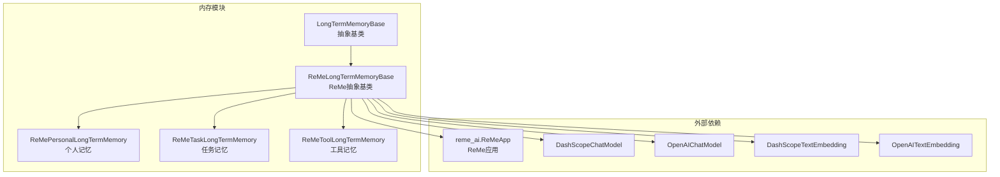
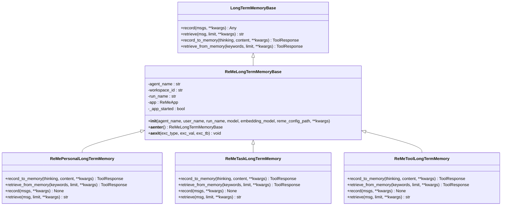
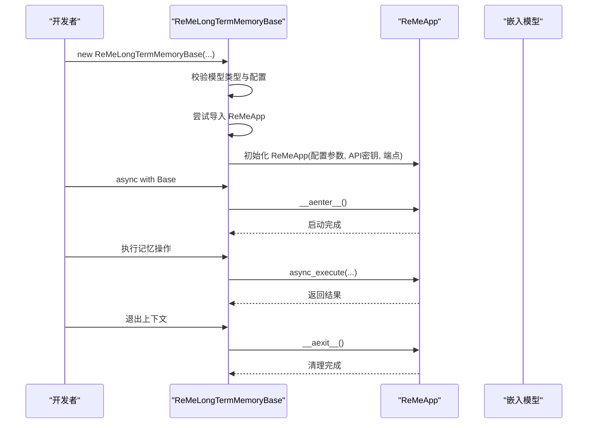
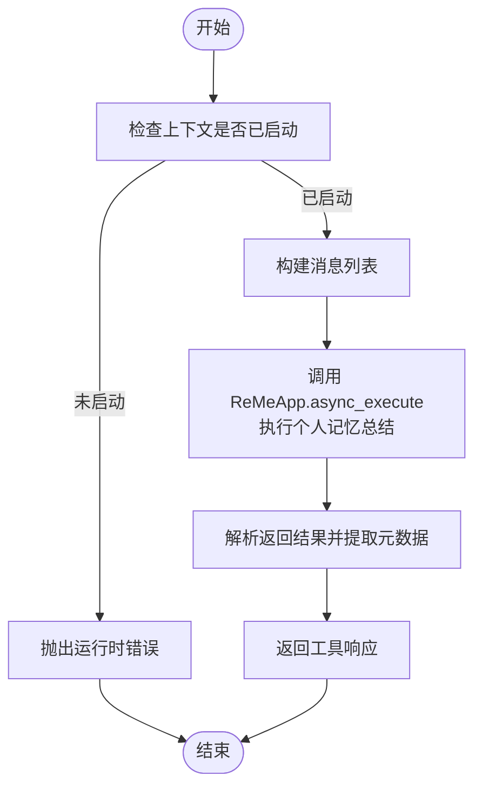
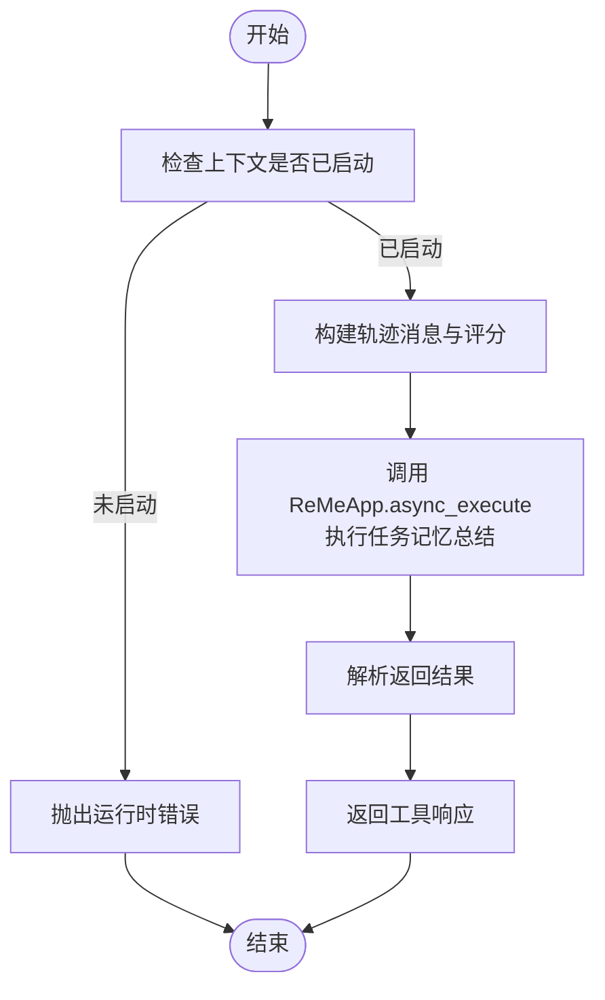
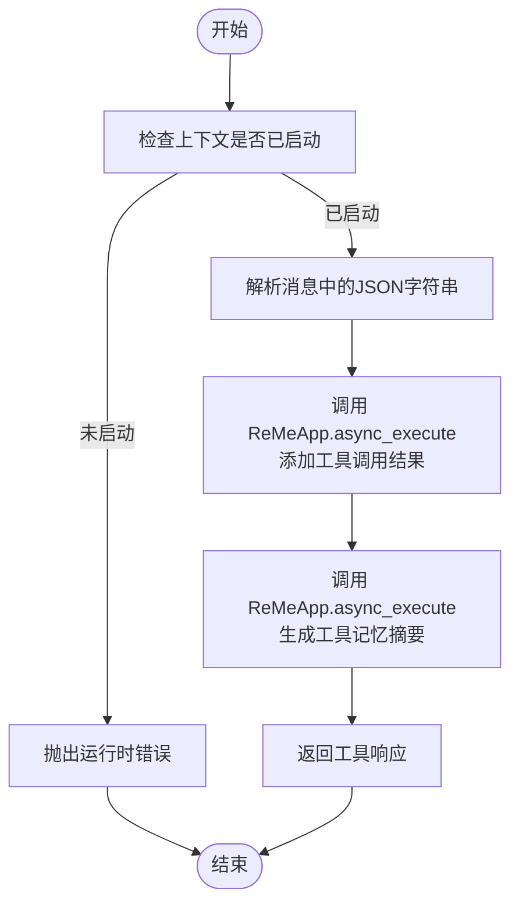
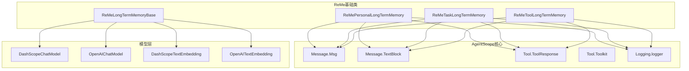

# ReMe基础类设计

<cite>
**本文档引用的文件**
- [reme_long_term_memory_base.py](file://src/agentscope/memory/_long_term_memory/_reme/_reme_long_term_memory_base.py)
- [reme_personal_long_term_memory.py](file://src/agentscope/memory/_long_term_memory/_reme/_reme_personal_long_term_memory.py)
- [reme_task_long_term_memory.py](file://src/agentscope/memory/_long_term_memory/_reme/_reme_task_long_term_memory.py)
- [reme_tool_long_term_memory.py](file://src/agentscope/memory/_long_term_memory/_reme/_reme_tool_long_term_memory.py)
- [long_term_memory_base.py](file://src/agentscope/memory/_long_term_memory/_long_term_memory_base.py)
- [__init__.py（reme）](file://src/agentscope/memory/_long_term_memory/_reme/__init__.py)
- [__init__.py（memory）](file://src/agentscope/memory/__init__.py)
- [personal_memory_example.py](file://examples/functionality/long_term_memory/reme/personal_memory_example.py)
- [task_memory_example.py](file://examples/functionality/long_term_memory/reme/task_memory_example.py)
- [tool_memory_example.py](file://examples/functionality/long_term_memory/reme/tool_memory_example.py)
</cite>

## 目录
1. [简介](#简介)
2. [项目结构](#项目结构)
3. [核心组件](#核心组件)
4. [架构概览](#架构概览)
5. [详细组件分析](#详细组件分析)
6. [依赖关系分析](#依赖关系分析)
7. [性能考虑](#性能考虑)
8. [故障排除指南](#故障排除指南)
9. [结论](#结论)
10. [附录](#附录)

## 简介
本文件面向ReMe长时记忆基础类的设计与实现，深入解析ReMeLongTermMemoryBase抽象基类的架构设计、接口规范与实现细节。ReMe是基于AgentScope的可插拔长时记忆系统，通过ReMeLongTermMemoryBase抽象基类统一管理ReMe库的集成方式，提供异步上下文管理、模型配置注入、错误处理与回退机制等能力。该基础类支持三种具体记忆类型：个人记忆（Personal）、任务记忆（Task）与工具记忆（Tool），每种类型针对不同场景提供专门的记忆记录与检索策略。

ReMe基础类的关键特性包括：
- 与ReMe库的无缝集成，自动提取模型API密钥与端点
- 支持DashScope与OpenAI两大模型提供商
- 异步上下文管理（async with），确保资源正确初始化与清理
- 可选依赖处理：当未安装reme_ai时提供清晰的错误提示
- 面向开发者的直接记录/检索接口与面向代理的工具函数接口

## 项目结构
ReMe长时记忆模块位于`src/agentscope/memory/_long_term_memory/_reme/`目录下，包含抽象基类与三种具体实现，以及模块导出入口。

**图表来源**
- [reme_long_term_memory_base.py:77-285](file://src/agentscope/memory/_long_term_memory/_reme/_reme_long_term_memory_base.py#L77-L285)
- [reme_personal_long_term_memory.py:17-154](file://src/agentscope/memory/_long_term_memory/_reme/_reme_personal_long_term_memory.py#L17-L154)
- [reme_task_long_term_memory.py:17-154](file://src/agentscope/memory/_long_term_memory/_reme/_reme_task_long_term_memory.py#L17-L154)
- [reme_tool_long_term_memory.py:17-173](file://src/agentscope/memory/_long_term_memory/_reme/_reme_tool_long_term_memory.py#L17-L173)

**章节来源**
- [reme_long_term_memory_base.py:1-365](file://src/agentscope/memory/_long_term_memory/_reme/_reme_long_term_memory_base.py#L1-L365)
- [reme_personal_long_term_memory.py:1-415](file://src/agentscope/memory/_long_term_memory/_reme/_reme_personal_long_term_memory.py#L1-L415)
- [reme_task_long_term_memory.py:1-437](file://src/agentscope/memory/_long_term_memory/_reme/_reme_task_long_term_memory.py#L1-L437)
- [reme_tool_long_term_memory.py:1-546](file://src/agentscope/memory/_long_term_memory/_reme/_reme_tool_long_term_memory.py#L1-L546)
- [long_term_memory_base.py:1-95](file://src/agentscope/memory/_long_term_memory/_long_term_memory_base.py#L1-L95)
- [__init__.py（reme）:1-13](file://src/agentscope/memory/_long_term_memory/_reme/__init__.py#L1-L13)
- [__init__.py（memory）:1-34](file://src/agentscope/memory/__init__.py#L1-L34)

## 核心组件
- ReMeLongTermMemoryBase：ReMe长时记忆的抽象基类，负责ReMe应用初始化、模型配置注入、异步上下文管理与错误处理。
- ReMePersonalLongTermMemory：个人记忆实现，专注于用户偏好、习惯与个人信息的记忆与检索。
- ReMeTaskLongTermMemory：任务记忆实现，从执行轨迹中学习经验，支持评分与检索。
- ReMeToolLongTermMemory：工具记忆实现，记录工具调用结果并生成使用指南。
- LongTermMemoryBase：AgentScope通用长时记忆抽象基类，定义开发者接口与代理工具接口。

这些组件共同构成ReMe长时记忆系统的完整生态，既满足开发者直接操作的需求，也支持代理通过工具函数进行记忆管理。

**章节来源**
- [reme_long_term_memory_base.py:77-285](file://src/agentscope/memory/_long_term_memory/_reme/_reme_long_term_memory_base.py#L77-L285)
- [reme_personal_long_term_memory.py:17-154](file://src/agentscope/memory/_long_term_memory/_reme/_reme_personal_long_term_memory.py#L17-L154)
- [reme_task_long_term_memory.py:17-154](file://src/agentscope/memory/_long_term_memory/_reme/_reme_task_long_term_memory.py#L17-L154)
- [reme_tool_long_term_memory.py:17-173](file://src/agentscope/memory/_long_term_memory/_reme/_reme_tool_long_term_memory.py#L17-L173)
- [long_term_memory_base.py:11-95](file://src/agentscope/memory/_long_term_memory/_long_term_memory_base.py#L11-L95)

## 架构概览
ReMe基础类采用“抽象基类 + 具体实现”的分层设计。抽象基类负责ReMe应用生命周期管理与模型配置注入；具体实现类根据业务场景定制记忆流程与数据格式。

**图表来源**
- [long_term_memory_base.py:11-95](file://src/agentscope/memory/_long_term_memory/_long_term_memory_base.py#L11-L95)
- [reme_long_term_memory_base.py:77-365](file://src/agentscope/memory/_long_term_memory/_reme/_reme_long_term_memory_base.py#L77-L365)
- [reme_personal_long_term_memory.py:17-415](file://src/agentscope/memory/_long_term_memory/_reme/_reme_personal_long_term_memory.py#L17-L415)
- [reme_task_long_term_memory.py:17-437](file://src/agentscope/memory/_long_term_memory/_reme/_reme_task_long_term_memory.py#L17-L437)
- [reme_tool_long_term_memory.py:17-546](file://src/agentscope/memory/_long_term_memory/_reme/_reme_tool_long_term_memory.py#L17-L546)

## 详细组件分析

### ReMeLongTermMemoryBase抽象基类
ReMeLongTermMemoryBase是所有ReMe长时记忆实现的基础，承担以下职责：
- 接收AgentScope模型配置（DashScope/OpenAI），自动提取API密钥与端点，并注入到ReMeApp
- 支持自定义ReMe配置文件路径与额外参数传递
- 提供异步上下文管理（__aenter__/__aexit__），确保ReMeApp在异步块内正确启动与清理
- 维护_app_started状态，防止在未初始化上下文下执行记忆操作
- 处理reme_ai库缺失的回退逻辑，提供清晰的安装指引

关键接口与行为：
- 初始化阶段：校验模型类型、提取配置、尝试导入ReMeApp并实例化
- 异步上下文：进入时启动ReMeApp，退出时清理并重置状态
- 错误处理：对未安装依赖抛出ImportError，对未启动上下文抛出RuntimeError

**图表来源**
- [reme_long_term_memory_base.py:94-285](file://src/agentscope/memory/_long_term_memory/_reme/_reme_long_term_memory_base.py#L94-L285)

**章节来源**
- [reme_long_term_memory_base.py:77-365](file://src/agentscope/memory/_long_term_memory/_reme/_reme_long_term_memory_base.py#L77-L365)

### ReMePersonalLongTermMemory个人记忆
个人记忆专注于用户偏好、习惯与个人信息的持久化与检索。其特点包括：
- 记录接口：支持显式记录（record_to_memory）与对话记录（record）
- 检索接口：支持关键词检索（retrieve_from_memory）与消息查询（retrieve）
- 数据格式：将用户输入转换为结构化的轨迹消息，便于ReMe总结与检索
- 容错处理：对异常进行日志记录与警告提示，避免中断代理流程

**图表来源**
- [reme_personal_long_term_memory.py:20-154](file://src/agentscope/memory/_long_term_memory/_reme/_reme_personal_long_term_memory.py#L20-L154)

**章节来源**
- [reme_personal_long_term_memory.py:17-415](file://src/agentscope/memory/_long_term_memory/_reme/_reme_personal_long_term_memory.py#L17-L415)

### ReMeTaskLongTermMemory任务记忆
任务记忆从执行轨迹中学习经验，支持评分机制与多关键词检索：
- 记录接口：支持显式记录（record_to_memory）与轨迹记录（record），轨迹可带评分
- 检索接口：支持关键词检索（retrieve_from_memory）与消息查询（retrieve）
- 数据格式：将消息序列转换为轨迹，包含评分字段以表征经验质量
- 容错处理：异常被捕获并记录，保持代理流程稳定

**图表来源**
- [reme_task_long_term_memory.py:25-154](file://src/agentscope/memory/_long_term_memory/_reme/_reme_task_long_term_memory.py#L25-L154)

**章节来源**
- [reme_task_long_term_memory.py:17-437](file://src/agentscope/memory/_long_term_memory/_reme/_reme_task_long_term_memory.py#L17-L437)

### ReMeToolLongTermMemory工具记忆
工具记忆记录工具调用结果并生成使用指南，支持JSON格式的历史记录：
- 记录接口：支持显式记录（record_to_memory）与消息记录（record），后者要求消息内容为JSON字符串
- 检索接口：支持工具名称检索（retrieve_from_memory）与消息查询（retrieve）
- 数据格式：解析JSON字符串为工具调用结果，批量添加后生成使用指南
- 容错处理：对无效JSON进行警告并跳过，保证整体流程不中断

**图表来源**
- [reme_tool_long_term_memory.py:25-173](file://src/agentscope/memory/_long_term_memory/_reme/_reme_tool_long_term_memory.py#L25-L173)

**章节来源**
- [reme_tool_long_term_memory.py:17-546](file://src/agentscope/memory/_long_term_memory/_reme/_reme_tool_long_term_memory.py#L17-L546)

## 依赖关系分析
ReMe基础类与AgentScope其他子系统存在紧密耦合：
- 模型层：DashScopeChatModel与OpenAIChatModel用于LLM推理；DashScopeTextEmbedding与OpenAITextEmbedding用于语义检索
- 工具系统：ToolResponse与Toolkit用于代理工具函数的注册与调用
- 消息系统：Msg与TextBlock用于消息格式化与内容提取
- 日志系统：logger用于记录异常与调试信息

**图表来源**
- [reme_long_term_memory_base.py:73-74](file://src/agentscope/memory/_long_term_memory/_reme/_reme_long_term_memory_base.py#L73-L74)
- [reme_personal_long_term_memory.py:11-14](file://src/agentscope/memory/_long_term_memory/_reme/_reme_personal_long_term_memory.py#L11-L14)
- [reme_task_long_term_memory.py:11-14](file://src/agentscope/memory/_long_term_memory/_reme/_reme_task_long_term_memory.py#L11-L14)
- [reme_tool_long_term_memory.py:11-14](file://src/agentscope/memory/_long_term_memory/_reme/_reme_tool_long_term_memory.py#L11-L14)

**章节来源**
- [reme_long_term_memory_base.py:73-74](file://src/agentscope/memory/_long_term_memory/_reme/_reme_long_term_memory_base.py#L73-L74)
- [reme_personal_long_term_memory.py:11-14](file://src/agentscope/memory/_long_term_memory/_reme/_reme_personal_long_term_memory.py#L11-L14)
- [reme_task_long_term_memory.py:11-14](file://src/agentscope/memory/_long_term_memory/_reme/_reme_task_long_term_memory.py#L11-L14)
- [reme_tool_long_term_memory.py:11-14](file://src/agentscope/memory/_long_term_memory/_reme/_reme_tool_long_term_memory.py#L11-L14)

## 性能考虑
- 异步执行：所有ReMe操作均采用异步模式，减少阻塞，提升并发性能
- 上下文管理：通过async with确保ReMeApp生命周期可控，避免重复初始化带来的开销
- 模型配置注入：在初始化阶段一次性提取并注入模型配置，避免运行时重复解析
- 错误处理：对异常进行捕获与记录，避免单次失败影响整体流程
- 嵌入维度：通过embedding_model.dimensions动态设置向量维度，平衡检索精度与性能

[本节为一般性指导，无需特定文件分析]

## 故障排除指南
常见问题与解决方案：
- 未安装reme_ai库：初始化时会抛出ImportError，提示安装rememe-ai并提供官方仓库链接
- 未启动异步上下文：在未使用async with的情况下调用记忆操作会抛出RuntimeError，需确保在上下文中执行
- 模型类型不匹配：传入非DashScope或OpenAI模型会触发ValueError，需确认模型类型
- JSON解析失败：工具记忆记录时若消息内容无法解析为JSON，会发出警告并跳过该项
- 嵌入模型类型不匹配：传入非DashScope或OpenAI嵌入模型会触发ValueError，需确认嵌入模型类型

**章节来源**
- [reme_long_term_memory_base.py:141-152](file://src/agentscope/memory/_long_term_memory/_reme/_reme_long_term_memory_base.py#L141-L152)
- [reme_personal_long_term_memory.py:73-77](file://src/agentscope/memory/_long_term_memory/_reme/_reme_personal_long_term_memory.py#L73-L77)
- [reme_task_long_term_memory.py:83-87](file://src/agentscope/memory/_long_term_memory/_reme/_reme_task_long_term_memory.py#L83-L87)
- [reme_tool_long_term_memory.py:87-91](file://src/agentscope/memory/_long_term_memory/_reme/_reme_tool_long_term_memory.py#L87-L91)

## 结论
ReMe长时记忆基础类通过抽象基类统一了ReMe库的集成方式，提供了灵活的异步上下文管理、健壮的错误处理与可扩展的具体实现。开发者可通过继承ReMeLongTermMemoryBase快速实现自定义记忆类型，同时利用三种内置实现（个人、任务、工具）覆盖典型应用场景。配合AgentScope的消息、工具与模型系统，ReMe基础类能够有效支撑智能体的长期记忆需求，提升交互的连贯性与个性化程度。

[本节为总结性内容，无需特定文件分析]

## 附录

### 使用指南与最佳实践
- 初始化与上下文管理：始终使用async with包裹ReMe记忆实例，确保ReMeApp正确启动与清理
- 模型配置：优先使用DashScope或OpenAI模型，确保API密钥与端点正确配置
- 记录策略：个人记忆强调结构化与具体性；任务记忆强调步骤与评分；工具记忆强调JSON格式与完整性
- 检索策略：个人记忆与任务记忆适合关键词检索；工具记忆适合按工具名称检索
- 错误处理：在代理流程中捕获并记录异常，避免中断用户体验

**章节来源**
- [personal_memory_example.py:245-296](file://examples/functionality/long_term_memory/reme/personal_memory_example.py#L245-L296)
- [task_memory_example.py:292-343](file://examples/functionality/long_term_memory/reme/task_memory_example.py#L292-L343)
- [tool_memory_example.py:347-437](file://examples/functionality/long_term_memory/reme/tool_memory_example.py#L347-L437)

### 设计模式说明
- 抽象工厂模式：LongTermMemoryBase定义通用接口，ReMeLongTermMemoryBase作为工厂创建具体ReMe实现
- 模板方法模式：ReMeLongTermMemoryBase提供通用初始化与上下文管理模板，具体实现填充特定记忆流程
- 责任链模式：个人、任务、工具记忆各自维护独立的记录与检索逻辑，形成责任链
- 异步模式：统一采用async/await，确保高并发下的稳定性与性能

[本节为概念性说明，无需特定文件分析]