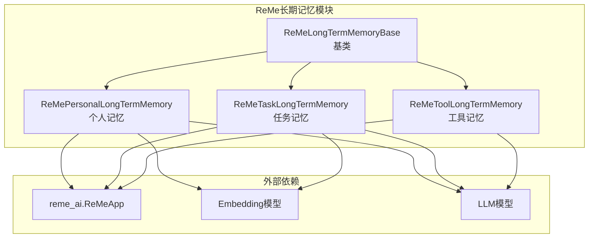
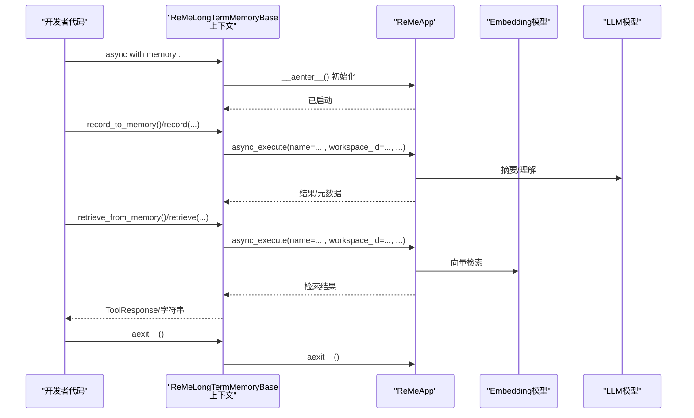
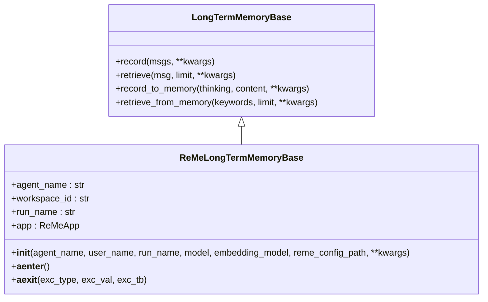
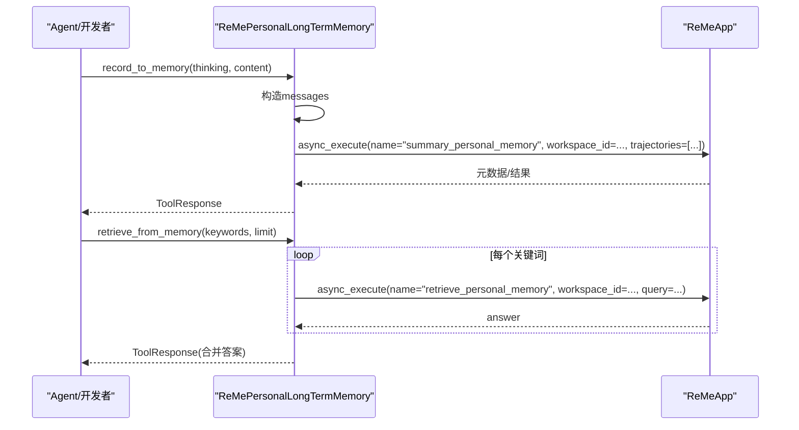
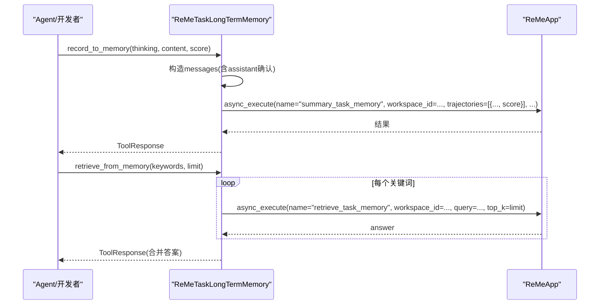
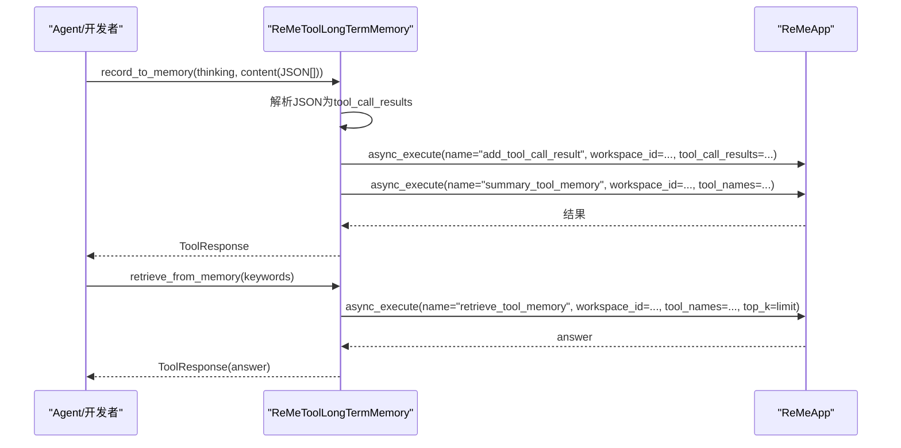
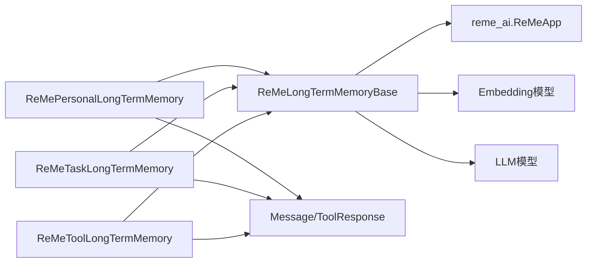

# ReMe增强记忆

<cite>
**本文引用的文件**
- [__init__.py](file://src/agentscope/memory/_long_term_memory/_reme/__init__.py)
- [reme_long_term_memory_base.py](file://src/agentscope/memory/_long_term_memory/_reme/_reme_long_term_memory_base.py)
- [reme_personal_long_term_memory.py](file://src/agentscope/memory/_long_term_memory/_reme/_reme_personal_long_term_memory.py)
- [reme_task_long_term_memory.py](file://src/agentscope/memory/_long_term_memory/_reme/_reme_task_long_term_memory.py)
- [reme_tool_long_term_memory.py](file://src/agentscope/memory/_long_term_memory/_reme/_reme_tool_long_term_memory.py)
- [long_term_memory_base.py](file://src/agentscope/memory/_long_term_memory/_long_term_memory_base.py)
- [personal_memory_example.py](file://examples/functionality/long_term_memory/reme/personal_memory_example.py)
- [task_memory_example.py](file://examples/functionality/long_term_memory/reme/task_memory_example.py)
- [tool_memory_example.py](file://examples/functionality/long_term_memory/reme/tool_memory_example.py)
- [README.md](file://examples/functionality/long_term_memory/reme/README.md)
- [memory_reme_test.py](file://tests/memory_reme_test.py)
</cite>

## 目录
1. [简介](#简介)
2. [项目结构](#项目结构)
3. [核心组件](#核心组件)
4. [架构总览](#架构总览)
5. [详细组件分析](#详细组件分析)
6. [依赖分析](#依赖分析)
7. [性能考虑](#性能考虑)
8. [故障排查指南](#故障排查指南)
9. [结论](#结论)
10. [附录](#附录)

## 简介
本技术文档围绕 AgentScope 的 ReMe 增强记忆系统，系统性阐述其设计理念与实现细节。ReMe 提供三类长期记忆：个人记忆（Personal）、任务记忆（Task）与工具记忆（Tool），分别面向用户偏好与事实、任务执行经验与最佳实践、以及工具使用模式与指导。ReMe 记忆通过与 ReMe 库集成，结合向量检索与摘要生成，实现跨会话、跨上下文的可搜索、可学习的记忆体系。本文将从架构、数据结构、存储策略、检索算法、配置选项、使用示例到性能优化与扩展进行深入解析。

## 项目结构
ReMe 增强记忆位于 AgentScope 的内存子模块中，采用“按类型分层”的组织方式：
- 基类层：统一抽象 ReMe 集成与生命周期管理
- 三类具体实现：个人、任务、工具记忆
- 示例与测试：覆盖典型用法与边界行为验证

图表来源
- [reme_long_term_memory_base.py:77-365](file://src/agentscope/memory/_long_term_memory/_reme/_reme_long_term_memory_base.py#L77-L365)
- [reme_personal_long_term_memory.py:17-415](file://src/agentscope/memory/_long_term_memory/_reme/_reme_personal_long_term_memory.py#L17-L415)
- [reme_task_long_term_memory.py:17-437](file://src/agentscope/memory/_long_term_memory/_reme/_reme_task_long_term_memory.py#L17-L437)
- [reme_tool_long_term_memory.py:17-546](file://src/agentscope/memory/_long_term_memory/_reme/_reme_tool_long_term_memory.py#L17-L546)

章节来源
- [__init__.py:1-13](file://src/agentscope/memory/_long_term_memory/_reme/__init__.py#L1-L13)
- [reme_long_term_memory_base.py:1-365](file://src/agentscope/memory/_long_term_memory/_reme/_reme_long_term_memory_base.py#L1-L365)

## 核心组件
- ReMeLongTermMemoryBase：ReMe 集成基类，负责与 ReMeApp 对接、模型参数提取、异步上下文管理、错误处理与兼容性提示。
- ReMePersonalLongTermMemory：个人记忆，聚焦用户偏好、习惯与事实的持久化与检索。
- ReMeTaskLongTermMemory：任务记忆，基于轨迹学习，支持评分与经验检索。
- ReMeToolLongTermMemory：工具记忆，记录工具调用元数据并生成使用指导。

章节来源
- [reme_long_term_memory_base.py:77-365](file://src/agentscope/memory/_long_term_memory/_reme/_reme_long_term_memory_base.py#L77-L365)
- [reme_personal_long_term_memory.py:17-415](file://src/agentscope/memory/_long_term_memory/_reme/_reme_personal_long_term_memory.py#L17-L415)
- [reme_task_long_term_memory.py:17-437](file://src/agentscope/memory/_long_term_memory/_reme/_reme_task_long_term_memory.py#L17-L437)
- [reme_tool_long_term_memory.py:17-546](file://src/agentscope/memory/_long_term_memory/_reme/_reme_tool_long_term_memory.py#L17-L546)

## 架构总览
ReMe 记忆系统以异步上下文管理器为核心，确保在进入上下文时初始化 ReMeApp 并在退出时清理资源；同时通过消息格式转换与 ReMe 内置操作名（如 summary_personal_memory、retrieve_personal_memory 等）完成记录与检索。嵌入模型用于语义检索，LLM 模型用于摘要与理解。

图表来源
- [reme_long_term_memory_base.py:287-365](file://src/agentscope/memory/_long_term_memory/_reme/_reme_long_term_memory_base.py#L287-L365)
- [reme_personal_long_term_memory.py:111-142](file://src/agentscope/memory/_long_term_memory/_reme/_reme_personal_long_term_memory.py#L111-L142)
- [reme_task_long_term_memory.py:118-143](file://src/agentscope/memory/_long_term_memory/_reme/_reme_task_long_term_memory.py#L118-L143)
- [reme_tool_long_term_memory.py:131-162](file://src/agentscope/memory/_long_term_memory/_reme/_reme_tool_long_term_memory.py#L131-L162)

## 详细组件分析

### ReMeLongTermMemoryBase 基类设计
- 职责
  - 将 AgentScope 的模型封装（DashScope/OpenAI）抽取 API Key、Endpoint、模型名与维度等参数，传递给 ReMeApp。
  - 提供异步上下文管理器，确保 ReMeApp 生命周期正确。
  - 统一暴露 record_to_memory、retrieve_from_memory、record、retrieve 抽象接口，由子类实现。
- 关键点
  - 支持 DashScope 与 OpenAI 模型；对不匹配类型抛出异常。
  - 维护 workspace_id（映射 ReMe 的 workspace_id）与 agent_name/run_name。
  - 异常处理：未安装 reme_ai 时给出明确安装指引；上下文未启动时报错。
  - 可选 reme_config_path 传入自定义 ReMe 配置文件路径。

图表来源
- [long_term_memory_base.py:11-95](file://src/agentscope/memory/_long_term_memory/_long_term_memory_base.py#L11-L95)
- [reme_long_term_memory_base.py:77-365](file://src/agentscope/memory/_long_term_memory/_reme/_reme_long_term_memory_base.py#L77-L365)

章节来源
- [reme_long_term_memory_base.py:94-286](file://src/agentscope/memory/_long_term_memory/_reme/_reme_long_term_memory_base.py#L94-L286)

### ReMePersonalLongTermMemory 个人记忆
- 设计理念
  - 存储用户偏好、习惯与事实，支持关键词检索与对话式检索。
  - 提供两种接口：工具函数（record_to_memory/retrieve_from_memory）与直接方法（record/retrieve）。
- 数据与流程
  - record_to_memory：接收 thinking 与 content 列表，内部构造消息序列并调用 ReMeApp 的 summary_personal_memory；返回 ToolResponse。
  - retrieve_from_memory：对每个关键词调用 ReMeApp 的 retrieve_personal_memory，拼接答案。
  - record：将 Msg 内容转为字符串后提交 summary_personal_memory。
  - retrieve：取最后一条消息内容作为查询，调用 retrieve_personal_memory。
- 错误处理
  - 上下文未启动抛出 RuntimeError。
  - 异常捕获并返回 ToolResponse 或警告信息，保证兼容性。

图表来源
- [reme_personal_long_term_memory.py:20-154](file://src/agentscope/memory/_long_term_memory/_reme/_reme_personal_long_term_memory.py#L20-L154)
- [reme_personal_long_term_memory.py:155-251](file://src/agentscope/memory/_long_term_memory/_reme/_reme_personal_long_term_memory.py#L155-L251)

章节来源
- [reme_personal_long_term_memory.py:20-251](file://src/agentscope/memory/_long_term_memory/_reme/_reme_personal_long_term_memory.py#L20-L251)

### ReMeTaskLongTermMemory 任务记忆
- 设计理念
  - 记录任务执行轨迹与经验，支持评分（0~1）以表达成功度；检索时按关键词返回相关经验。
- 数据与流程
  - record_to_memory：将 content 逐条包装为 user-assistant 对话，附加“已记录”确认；支持 score 参数；调用 summary_task_memory。
  - retrieve_from_memory：对每个关键词调用 retrieve_task_memory，拼接 answer。
  - record：将消息列表转为字符串后提交 summary_task_memory，支持 score。
  - retrieve：取最后一条消息内容作为查询，调用 retrieve_task_memory。
- 特殊点
  - 支持 score 评分，便于后续检索排序或筛选。

图表来源
- [reme_task_long_term_memory.py:25-154](file://src/agentscope/memory/_long_term_memory/_reme/_reme_task_long_term_memory.py#L25-L154)
- [reme_task_long_term_memory.py:156-264](file://src/agentscope/memory/_long_term_memory/_reme/_reme_task_long_term_memory.py#L156-L264)

章节来源
- [reme_task_long_term_memory.py:25-264](file://src/agentscope/memory/_long_term_memory/_reme/_reme_task_long_term_memory.py#L25-L264)

### ReMeToolLongTermMemory 工具记忆
- 设计理念
  - 记录工具调用元数据（时间戳、工具名、输入、输出、token 成本、成功与否、耗时），自动汇总生成使用指导；检索时返回对应工具的使用建议。
- 数据与流程
  - record_to_memory：解析 content 中的 JSON 字符串为工具调用结果，先 add_tool_call_result，再按工具名调用 summary_tool_memory；返回 ToolResponse。
  - retrieve_from_memory：将 keywords 以逗号连接传入 retrieve_tool_memory，返回 answer。
  - record：从消息内容提取 JSON 字符串，解析后走相同流程。
  - retrieve：从最后一条消息提取工具名，调用 retrieve_tool_memory。
- 特殊点
  - 不提供 record_to_memory/retrieve_from_memory 工具函数，仅提供直接方法；适合程序化注入系统提示，而非 Agent 直接调用工具。

图表来源
- [reme_tool_long_term_memory.py:25-173](file://src/agentscope/memory/_long_term_memory/_reme/_reme_tool_long_term_memory.py#L25-L173)
- [reme_tool_long_term_memory.py:175-277](file://src/agentscope/memory/_long_term_memory/_reme/_reme_tool_long_term_memory.py#L175-L277)

章节来源
- [reme_tool_long_term_memory.py:25-277](file://src/agentscope/memory/_long_term_memory/_reme/_reme_tool_long_term_memory.py#L25-L277)

### 使用示例与工作流
- 个人记忆示例：展示 record_to_memory、retrieve_from_memory、record、retrieve 与 ReActAgent 集成。
- 任务记忆示例：展示 record_to_memory（含 score）、retrieve_from_memory、record（含 score）、retrieve 与 ReActAgent 集成。
- 工具记忆示例：演示工具注册、record（JSON 形式）、retrieve（工具指导）、系统提示增强与 ReActAgent 使用。

章节来源
- [personal_memory_example.py:31-296](file://examples/functionality/long_term_memory/reme/personal_memory_example.py#L31-L296)
- [task_memory_example.py:32-343](file://examples/functionality/long_term_memory/reme/task_memory_example.py#L32-L343)
- [tool_memory_example.py:97-437](file://examples/functionality/long_term_memory/reme/tool_memory_example.py#L97-L437)
- [README.md:100-610](file://examples/functionality/long_term_memory/reme/README.md#L100-L610)

## 依赖分析
- 外部库
  - reme_ai：ReMeApp 核心，负责记忆的记录、检索与摘要。
  - Embedding 模型：用于向量检索（DashScope/OpenAI）。
  - LLM 模型：用于摘要与理解（DashScope/OpenAI）。
- 内部依赖
  - LongTermMemoryBase：定义统一接口。
  - Message/ToolResponse：消息与工具响应的数据结构。
  - 日志模块：记录调试信息与异常。

图表来源
- [reme_long_term_memory_base.py:77-365](file://src/agentscope/memory/_long_term_memory/_reme/_reme_long_term_memory_base.py#L77-L365)
- [reme_personal_long_term_memory.py:17-415](file://src/agentscope/memory/_long_term_memory/_reme/_reme_personal_long_term_memory.py#L17-L415)
- [reme_task_long_term_memory.py:17-437](file://src/agentscope/memory/_long_term_memory/_reme/_reme_task_long_term_memory.py#L17-L437)
- [reme_tool_long_term_memory.py:17-546](file://src/agentscope/memory/_long_term_memory/_reme/_reme_tool_long_term_memory.py#L17-L546)

章节来源
- [reme_long_term_memory_base.py:77-365](file://src/agentscope/memory/_long_term_memory/_reme/_reme_long_term_memory_base.py#L77-L365)

## 性能考虑
- 异步优先：所有操作均基于 async/await，避免阻塞主线程。
- 向量检索：通过 Embedding 模型进行语义检索，提升召回质量与速度。
- 摘要与压缩：利用 LLM 进行摘要与理解，减少冗余存储与检索开销。
- 上下文管理：严格使用 async with，确保资源及时释放，避免内存泄漏。
- 批量与去重：工具记忆在汇总阶段按工具名集合去重，减少重复计算。

[本节为通用性能讨论，无需特定文件引用]

## 故障排查指南
- 上下文未启动
  - 现象：调用 record_to_memory/retrieve_from_memory 或 record/retrieve 抛出 RuntimeError。
  - 排查：确保使用 async with memory: 包裹所有操作。
- 未安装 reme_ai
  - 现象：导入时报错，提示安装 reme-ai。
  - 排查：pip 安装 reme-ai，并参考示例设置 API Key。
- 工具记忆 JSON 格式错误
  - 现象：record_to_memory 返回“无有效工具调用结果”。
  - 排查：检查 content 是否为合法 JSON 字符串，字段是否完整。
- 无检索结果
  - 现象：retrieve_from_memory/retrieve 返回空或提示未找到。
  - 排查：确认已先 record，且 user_name/workspace_id 一致；关键词是否准确。

章节来源
- [reme_personal_long_term_memory.py:73-77](file://src/agentscope/memory/_long_term_memory/_reme/_reme_personal_long_term_memory.py#L73-L77)
- [reme_task_long_term_memory.py:83-87](file://src/agentscope/memory/_long_term_memory/_reme/_reme_task_long_term_memory.py#L83-L87)
- [reme_tool_long_term_memory.py:87-91](file://src/agentscope/memory/_long_term_memory/_reme/_reme_tool_long_term_memory.py#L87-L91)
- [memory_reme_test.py:194-244](file://tests/memory_reme_test.py#L194-L244)

## 结论
ReMe 增强记忆通过三类记忆的协同，实现了从“人”到“事”再到“工具”的全栈知识沉淀与复用。其异步上下文管理、向量检索与摘要生成相结合，既保证了易用性，也兼顾了性能与可扩展性。在实际应用中，建议：
- 明确三类记忆的职责边界，避免交叉使用。
- 在系统提示中明确记录与检索触发时机。
- 对工具记忆采用“记录—汇总—检索—注入”的闭环，持续提升工具使用质量。
- 通过测试用例与示例文件验证关键路径，确保稳定性。

[本节为总结性内容，无需特定文件引用]

## 附录

### 配置选项与最佳实践
- 基础参数
  - agent_name：代理名称标识
  - user_name：用户/工作区标识（映射 ReMe workspace_id）
  - run_name：运行会话标识
  - model/embedding_model：LLM 与 Embedding 模型封装（DashScope/OpenAI）
  - reme_config_path：自定义 ReMe 配置文件路径
- 最佳实践
  - 使用 async with 管理生命周期
  - 为个人与任务记忆提供清晰的 thinking 与 content
  - 为工具记忆提供完整的 JSON 元数据
  - 为任务记忆合理分配 score，区分成功与失败轨迹

章节来源
- [reme_long_term_memory_base.py:94-140](file://src/agentscope/memory/_long_term_memory/_reme/_reme_long_term_memory_base.py#L94-L140)
- [README.md:544-588](file://examples/functionality/long_term_memory/reme/README.md#L544-L588)