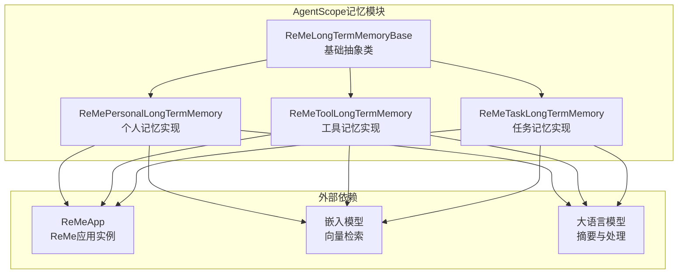
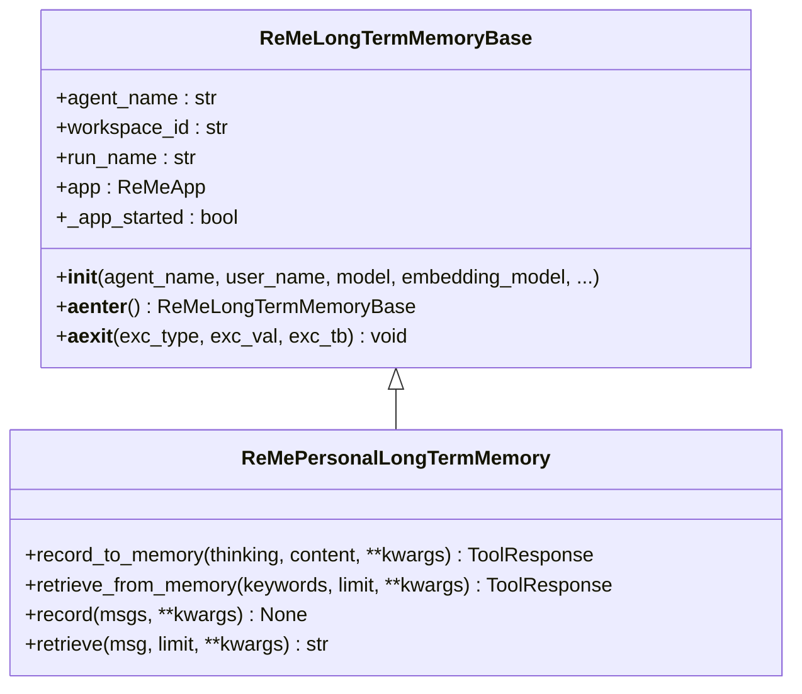
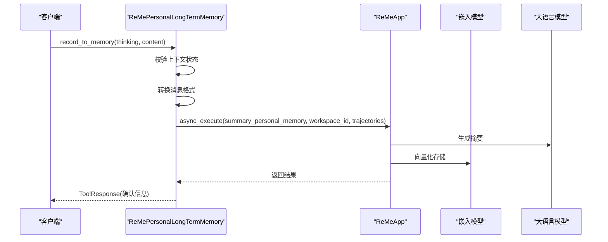
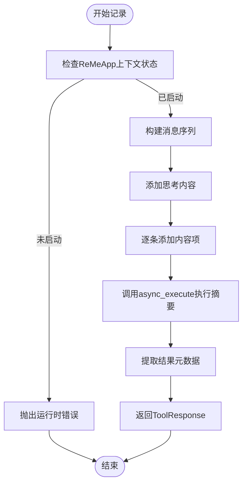
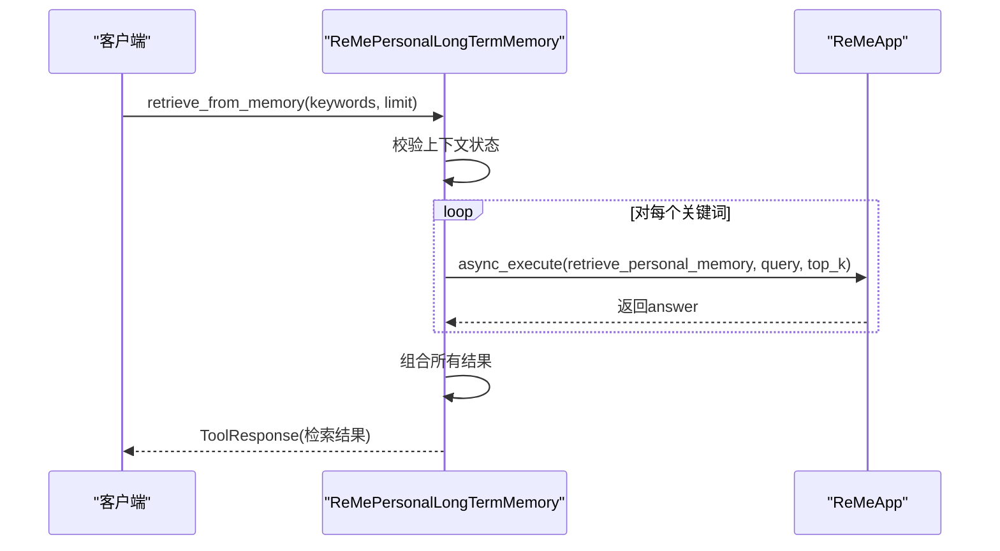
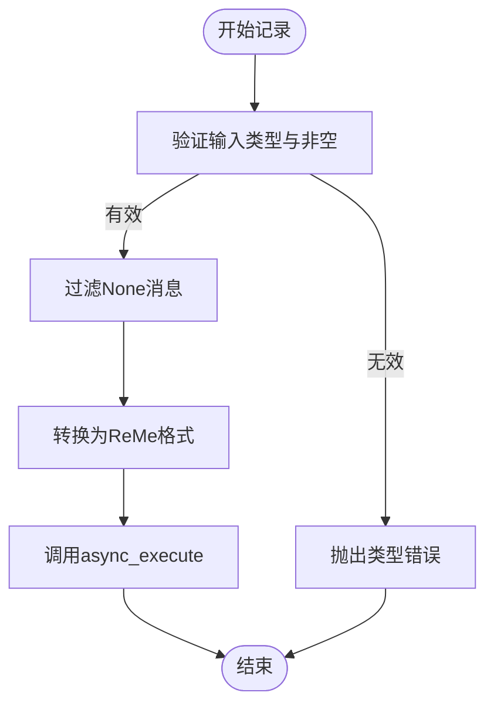
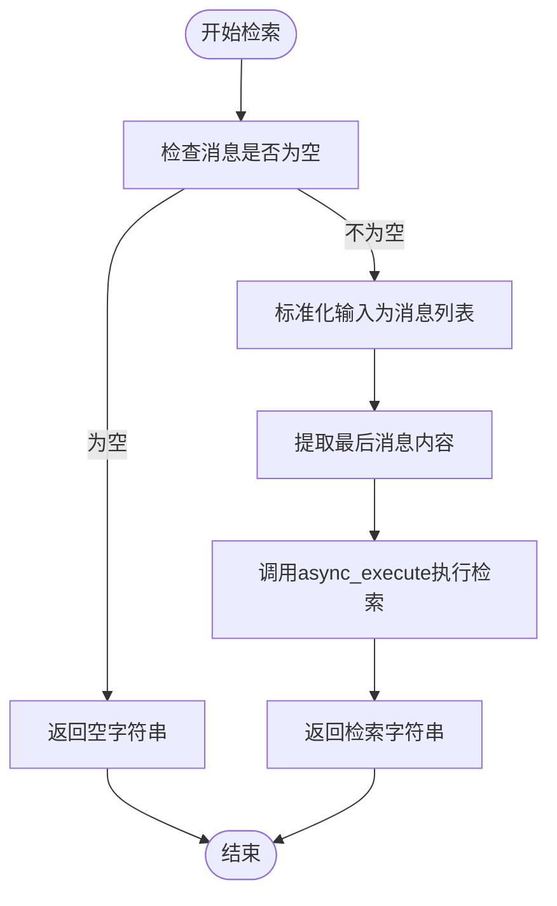
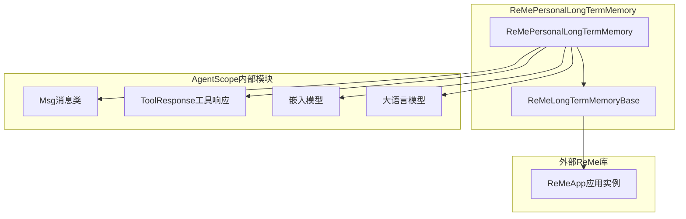
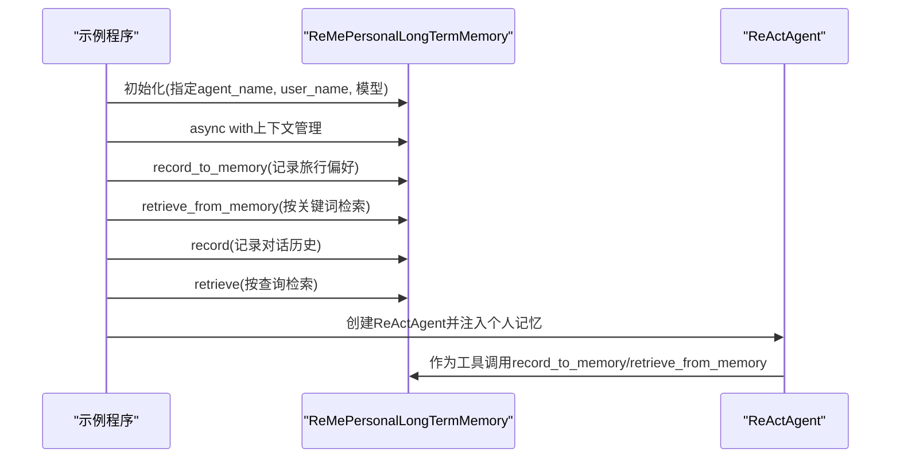

# 个人记忆实现

<cite>
**本文引用的文件**
- [reme_personal_long_term_memory.py](file://src/agentscope/memory/_long_term_memory/_reme/_reme_personal_long_term_memory.py)
- [reme_long_term_memory_base.py](file://src/agentscope/memory/_long_term_memory/_reme/_reme_long_term_memory_base.py)
- [personal_memory_example.py](file://examples/functionality/long_term_memory/reme/personal_memory_example.py)
- [README.md（ReMe个人记忆示例）](file://examples/functionality/long_term_memory/reme/README.md)
- [memory_reme_test.py](file://tests/memory_reme_test.py)
- [__init__.py（memory包）](file://src/agentscope/memory/__init__.py)
- [_reme包初始化](file://src/agentscope/memory/_long_term_memory/_reme/__init__.py)
- [message模块初始化](file://src/agentscope/message/__init__.py)
- [tool模块初始化](file://src/agentscope/tool/__init__.py)
</cite>

## 目录
1. [简介](#简介)
2. [项目结构](#项目结构)
3. [核心组件](#核心组件)
4. [架构概览](#架构概览)
5. [详细组件分析](#详细组件分析)
6. [依赖关系分析](#依赖关系分析)
7. [性能考虑](#性能考虑)
8. [故障排除指南](#故障排除指南)
9. [结论](#结论)
10. [附录](#附录)

## 简介
本文档深入解析ReMe个人记忆实现，重点围绕ReMePersonalLongTermMemory类的设计架构与实现细节。该类基于ReMe库提供持久化的个人记忆存储与检索能力，支持用户偏好记录、习惯维护、个人信息存储等应用场景。文档涵盖以下关键内容：
- 记忆记录机制（record_to_memory）
- 检索功能（retrieve_from_memory）
- 消息记录（record）与检索（retrieve）方法
- 消息格式转换、轨迹处理、工作空间管理
- 应用场景与最佳实践
- 配置参数说明与性能优化建议
- 使用示例与错误处理机制

## 项目结构
ReMe个人记忆实现位于AgentScope框架的记忆子系统中，采用分层设计：
- 基础抽象层：ReMeLongTermMemoryBase 提供ReMe集成、模型配置、上下文管理等通用能力
- 具体实现层：ReMePersonalLongTermMemory 实现个人记忆的记录与检索逻辑
- 示例与测试：提供完整的使用示例、接口演示与单元测试
- 工具与消息：通过ToolResponse与Msg对象实现工具调用与消息格式化

**图表来源**
- [reme_long_term_memory_base.py:1-365](file://src/agentscope/memory/_long_term_memory/_reme/_reme_long_term_memory_base.py#L1-L365)
- [reme_personal_long_term_memory.py:1-415](file://src/agentscope/memory/_long_term_memory/_reme/_reme_personal_long_term_memory.py#L1-L415)

**章节来源**
- [reme_long_term_memory_base.py:1-365](file://src/agentscope/memory/_long_term_memory/_reme/_reme_long_term_memory_base.py#L1-L365)
- [reme_personal_long_term_memory.py:1-415](file://src/agentscope/memory/_long_term_memory/_reme/_reme_personal_long_term_memory.py#L1-L415)

## 核心组件
ReMePersonalLongTermMemory是个人记忆的核心实现，继承自ReMeLongTermMemoryBase，提供以下核心能力：
- 异步上下文管理：确保ReMeApp正确初始化与资源清理
- 记录接口：支持显式工具函数记录与直接消息记录
- 检索接口：支持关键词检索与查询检索
- 消息格式转换：将AgentScope消息转换为ReMe可识别的格式
- 错误处理：统一的日志记录与异常处理策略

**章节来源**
- [reme_personal_long_term_memory.py:17-415](file://src/agentscope/memory/_long_term_memory/_reme/_reme_personal_long_term_memory.py#L17-L415)
- [reme_long_term_memory_base.py:77-365](file://src/agentscope/memory/_long_term_memory/_reme/_reme_long_term_memory_base.py#L77-L365)

## 架构概览
ReMePersonalLongTermMemory的架构遵循“抽象基类 + 具体实现”的模式，通过ReMeApp与嵌入模型、大语言模型协作完成记忆的存储与检索。

**图表来源**
- [reme_long_term_memory_base.py:77-365](file://src/agentscope/memory/_long_term_memory/_reme/_reme_long_term_memory_base.py#L77-L365)
- [reme_personal_long_term_memory.py:17-415](file://src/agentscope/memory/_long_term_memory/_reme/_reme_personal_long_term_memory.py#L17-L415)

## 详细组件分析

### ReMePersonalLongTermMemory类设计
该类继承自ReMeLongTermMemoryBase，实现了个人记忆的完整生命周期管理：
- 初始化阶段：提取模型配置、构建ReMeApp实例、设置工作空间标识
- 上下文管理：异步进入/退出时启动/关闭ReMeApp，确保资源正确释放
- 记录流程：将输入内容转换为ReMe格式并执行摘要与存储
- 检索流程：基于关键词或查询执行语义检索并返回结果

**图表来源**
- [reme_personal_long_term_memory.py:20-154](file://src/agentscope/memory/_long_term_memory/_reme/_reme_personal_long_term_memory.py#L20-L154)

**章节来源**
- [reme_personal_long_term_memory.py:17-415](file://src/agentscope/memory/_long_term_memory/_reme/_reme_personal_long_term_memory.py#L17-L415)

### 记录机制（record_to_memory）
record_to_memory提供显式的工具函数接口，用于记录重要用户信息到长期记忆：
- 输入参数：思考理由（thinking）、具体事实列表（content）
- 处理流程：校验上下文、构建消息序列、调用ReMe摘要流程、返回确认信息
- 输出格式：ToolResponse，包含文本块与元数据

**图表来源**
- [reme_personal_long_term_memory.py:20-154](file://src/agentscope/memory/_long_term_memory/_reme/_reme_personal_long_term_memory.py#L20-L154)

**章节来源**
- [reme_personal_long_term_memory.py:20-154](file://src/agentscope/memory/_long_term_memory/_reme/_reme_personal_long_term_memory.py#L20-L154)

### 检索功能（retrieve_from_memory）
retrieve_from_memory支持关键词驱动的记忆检索：
- 输入参数：关键词列表（keywords）、每关键词限制数量（limit，默认3）
- 处理流程：对每个关键词执行检索，合并结果并返回
- 输出格式：ToolResponse，包含组合后的检索文本

**图表来源**
- [reme_personal_long_term_memory.py:155-251](file://src/agentscope/memory/_long_term_memory/_reme/_reme_personal_long_term_memory.py#L155-L251)

**章节来源**
- [reme_personal_long_term_memory.py:155-251](file://src/agentscope/memory/_long_term_memory/_reme/_reme_personal_long_term_memory.py#L155-L251)

### 消息记录（record）
record方法支持直接记录消息对话，适用于程序化场景：
- 输入：单个消息或消息列表
- 处理：过滤None、验证类型、转换消息格式、调用ReMe摘要
- 特点：自动处理多轮对话，支持混合内容块（文本、思考）

**图表来源**
- [reme_personal_long_term_memory.py:253-331](file://src/agentscope/memory/_long_term_memory/_reme/_reme_personal_long_term_memory.py#L253-L331)

**章节来源**
- [reme_personal_long_term_memory.py:253-331](file://src/agentscope/memory/_long_term_memory/_reme/_reme_personal_long_term_memory.py#L253-L331)

### 检索（retrieve）
retrieve方法支持基于消息的查询检索：
- 输入：单个消息或消息列表
- 处理：提取最后一条消息的内容（支持多块内容拼接），执行检索
- 输出：字符串形式的检索结果

**图表来源**
- [reme_personal_long_term_memory.py:332-415](file://src/agentscope/memory/_long_term_memory/_reme/_reme_personal_long_term_memory.py#L332-L415)

**章节来源**
- [reme_personal_long_term_memory.py:332-415](file://src/agentscope/memory/_long_term_memory/_reme/_reme_personal_long_term_memory.py#L332-L415)

### 消息格式转换与轨迹处理
ReMePersonalLongTermMemory在消息处理方面具备以下特点：
- 支持多种内容块类型：文本块、思考块等
- 自动拼接多块内容为单一查询字符串
- 将AgentScope消息映射为ReMe的轨迹格式
- 在记录过程中自动添加助手确认消息

**章节来源**
- [reme_personal_long_term_memory.py:288-331](file://src/agentscope/memory/_long_term_memory/_reme/_reme_personal_long_term_memory.py#L288-L331)
- [reme_personal_long_term_memory.py:378-414](file://src/agentscope/memory/_long_term_memory/_reme/_reme_personal_long_term_memory.py#L378-L414)

### 工作空间管理
ReMePersonalLongTermMemory通过user_name映射到ReMe的工作空间ID，实现不同用户/会话的隔离：
- 工作空间ID：由user_name传入并存储为workspace_id
- 向量存储隔离：每个工作空间独立的向量存储
- 会话标识：run_name用于区分不同运行会话

**章节来源**
- [reme_long_term_memory_base.py:187-191](file://src/agentscope/memory/_long_term_memory/_reme/_reme_long_term_memory_base.py#L187-L191)

## 依赖关系分析
ReMePersonalLongTermMemory的依赖关系体现了清晰的分层设计：

**图表来源**
- [reme_personal_long_term_memory.py:9-14](file://src/agentscope/memory/_long_term_memory/_reme/_reme_personal_long_term_memory.py#L9-L14)
- [reme_long_term_memory_base.py:72-74](file://src/agentscope/memory/_long_term_memory/_reme/_reme_long_term_memory_base.py#L72-L74)

**章节来源**
- [reme_personal_long_term_memory.py:9-14](file://src/agentscope/memory/_long_term_memory/_reme/_reme_personal_long_term_memory.py#L9-L14)
- [reme_long_term_memory_base.py:72-74](file://src/agentscope/memory/_long_term_memory/_reme/_reme_long_term_memory_base.py#L72-L74)

## 性能考虑
针对ReMePersonalLongTermMemory的性能优化建议：
- 上下文管理：始终使用async with确保ReMeApp正确初始化与资源回收
- 批量操作：在可能的情况下合并多次记录请求，减少ReMeApp调用次数
- 关键词优化：合理设计关键词，避免过于宽泛导致检索开销增加
- 内容长度控制：对于长文本内容，考虑预处理或截断以提升检索效率
- 缓存策略：结合AgentScope的内存机制，对频繁访问的记忆进行缓存

## 故障排除指南
常见问题与解决方案：
- 运行时错误："ReMeApp上下文未启动"
  - 症状：调用记录或检索方法时抛出RuntimeError
  - 解决：确保使用async with包装所有内存操作
- 类型错误：输入消息类型不正确
  - 症状：TypeError提示消息必须为Msg对象
  - 解决：检查输入类型，确保为Msg或Msg列表
- 空结果：检索无匹配记忆
  - 症状：返回"未找到相关记忆"
  - 解决：确认已先记录相应内容，检查关键词准确性
- 导入错误：缺少reme_ai库
  - 症状：ImportError提示需要安装reme-ai
  - 解决：执行pip install reme-ai

**章节来源**
- [reme_personal_long_term_memory.py:73-77](file://src/agentscope/memory/_long_term_memory/_reme/_reme_personal_long_term_memory.py#L73-L77)
- [reme_personal_long_term_memory.py:277-280](file://src/agentscope/memory/_long_term_memory/_reme/_reme_personal_long_term_memory.py#L277-L280)
- [reme_long_term_memory_base.py:261-269](file://src/agentscope/memory/_long_term_memory/_reme/_reme_long_term_memory_base.py#L261-L269)

## 结论
ReMePersonalLongTermMemory通过清晰的接口设计与完善的错误处理机制，为AgentScope提供了可靠的个人记忆能力。其异步上下文管理、消息格式转换、工作空间隔离等特性，使其能够适应复杂的对话场景。配合ReActAgent的工具集成，可以实现智能的记忆记录与检索，显著提升个性化服务的质量与连续性。

## 附录

### 使用示例
以下示例展示了ReMePersonalLongTermMemory的主要使用方式：

**图表来源**
- [personal_memory_example.py:31-281](file://examples/functionality/long_term_memory/reme/personal_memory_example.py#L31-L281)

**章节来源**
- [personal_memory_example.py:31-281](file://examples/functionality/long_term_memory/reme/personal_memory_example.py#L31-L281)

### 配置参数说明
ReMePersonalLongTermMemory的初始化参数：
- agent_name：代理名称标识符
- user_name：用户唯一标识符（映射为ReMe的workspace_id）
- run_name：当前执行运行名称
- model：聊天模型实例（DashScopeChatModel或OpenAIChatModel）
- embedding_model：嵌入模型实例（DashScopeTextEmbedding或OpenAITextEmbedding）
- reme_config_path：自定义ReMe配置文件路径
- 其他kwargs：传递给ReMeApp的额外配置参数

**章节来源**
- [reme_long_term_memory_base.py:94-140](file://src/agentscope/memory/_long_term_memory/_reme/_reme_long_term_memory_base.py#L94-L140)

### 最佳实践指南
- 明确记录时机：当用户分享个人信息、偏好或重要事实时及时记录
- 设计检索策略：使用具体关键词，避免过于宽泛的查询
- 系统提示设计：为ReActAgent提供清晰的记忆使用指导
- 错误处理：在生产环境中妥善处理异常并记录日志
- 性能优化：合理规划批量操作与缓存策略

**章节来源**
- [README.md（ReMe个人记忆示例）:544-564](file://examples/functionality/long_term_memory/reme/README.md#L544-L564)