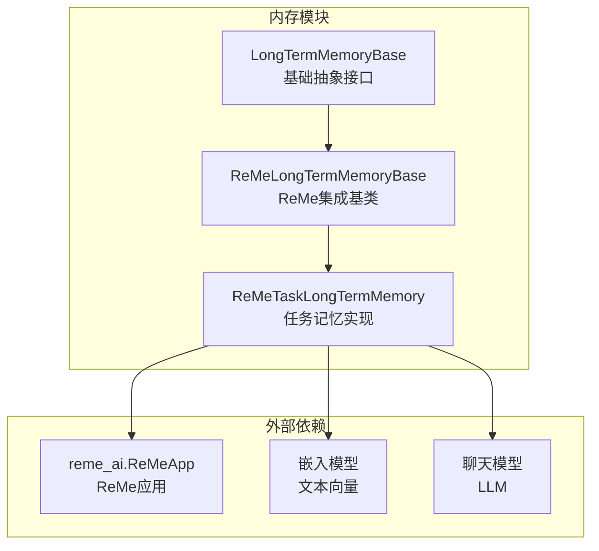
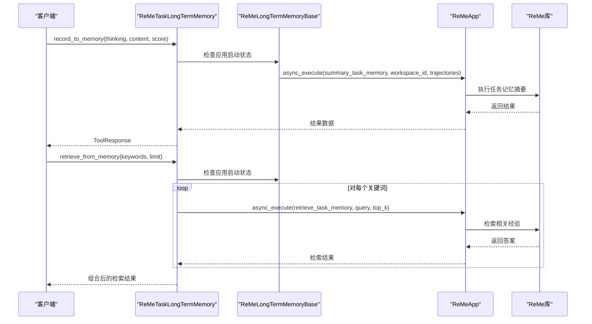
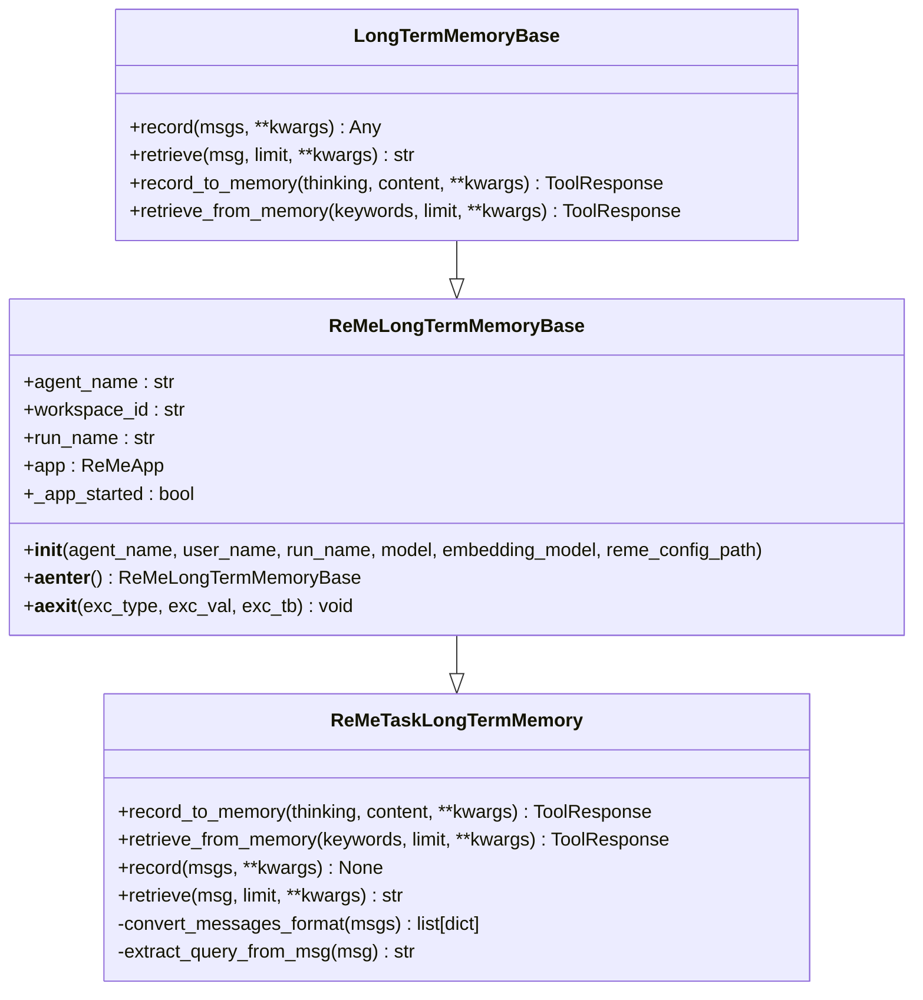
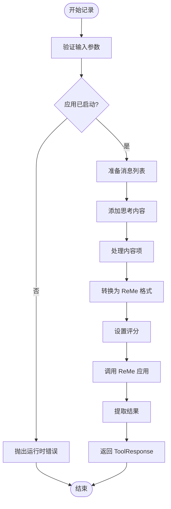
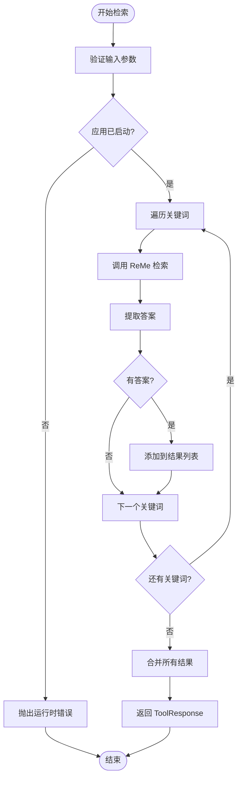
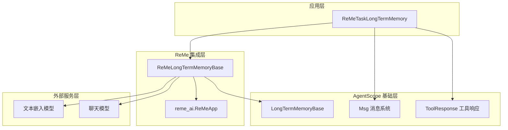

# 任务记忆实现

<cite>
**本文引用的文件**
- [reme_task_long_term_memory.py](file://src/agentscope/memory/_long_term_memory/_reme/_reme_task_long_term_memory.py)
- [reme_long_term_memory_base.py](file://src/agentscope/memory/_long_term_memory/_reme/_reme_long_term_memory_base.py)
- [long_term_memory_base.py](file://src/agentscope/memory/_long_term_memory/_long_term_memory_base.py)
- [task_memory_example.py](file://examples/functionality/long_term_memory/reme/task_memory_example.py)
- [memory_reme_test.py](file://tests/memory_reme_test.py)
- [__init__.py](file://src/agentscope/memory/_long_term_memory/__init__.py)
</cite>

## 目录
1. [简介](#简介)
2. [项目结构](#项目结构)
3. [核心组件](#核心组件)
4. [架构概览](#架构概览)
5. [详细组件分析](#详细组件分析)
6. [依赖关系分析](#依赖关系分析)
7. [性能考虑](#性能考虑)
8. [故障排除指南](#故障排除指南)
9. [结论](#结论)
10. [附录](#附录)

## 简介
本文件为 ReMe 任务记忆实现的技术文档，深入解析 ReMeTaskLongTermMemory 类的设计理念与实现架构。该类基于 ReMe 库构建，用于学习执行轨迹并检索相关的任务经验，支持任务历史记录、进度跟踪、结果存储等功能。文档涵盖数据结构设计、存储策略、检索算法、状态管理、时间戳处理、任务关联性分析等核心机制，并提供项目管理、任务完成度跟踪、历史任务查询等实际应用场景及配置选项、API 接口说明、错误处理和性能优化建议。

## 项目结构
ReMe 任务记忆实现位于 AgentScope 的内存模块中，采用分层架构：
- 基础抽象层：LongTermMemoryBase 定义通用接口
- ReMe 基础层：ReMeLongTermMemoryBase 实现 ReMe 集成与上下文管理
- 具体实现层：ReMeTaskLongTermMemory 提供任务记忆功能

**图表来源**
- [long_term_memory_base.py:11-95](file://src/agentscope/memory/_long_term_memory/_long_term_memory_base.py#L11-L95)
- [reme_long_term_memory_base.py:77-365](file://src/agentscope/memory/_long_term_memory/_reme/_reme_long_term_memory_base.py#L77-L365)
- [reme_task_long_term_memory.py:17-437](file://src/agentscope/memory/_long_term_memory/_reme/_reme_task_long_term_memory.py#L17-L437)

**章节来源**
- [__init__.py:4-19](file://src/agentscope/memory/_long_term_memory/__init__.py#L4-L19)
- [long_term_memory_base.py:11-95](file://src/agentscope/memory/_long_term_memory/_long_term_memory_base.py#L11-L95)

## 核心组件
ReMeTaskLongTermMemory 类是任务记忆的核心实现，提供以下关键能力：

### 主要特性
- **执行轨迹学习**：从任务执行过程中提取有价值的经验
- **关键词检索**：基于关键词搜索相关任务经验
- **消息格式转换**：将 AgentScope 消息转换为 ReMe 格式
- **评分机制**：支持对任务轨迹进行质量评分
- **异步上下文管理**：确保 ReMe 应用正确初始化和清理

### 数据结构设计
任务记忆采用以下数据结构：
- **轨迹消息列表**：包含用户和助手角色的消息序列
- **评分字段**：量化任务执行的质量（默认 1.0）
- **元数据信息**：包含 ReMe 返回的结果信息
- **内容块结构**：支持文本和思维内容的组合

**章节来源**
- [reme_task_long_term_memory.py:25-155](file://src/agentscope/memory/_long_term_memory/_reme/_reme_task_long_term_memory.py#L25-L155)
- [reme_task_long_term_memory.py:266-355](file://src/agentscope/memory/_long_term_memory/_reme/_reme_task_long_term_memory.py#L266-L355)

## 架构概览
ReMe 任务记忆实现采用分层架构，通过 ReMe 应用程序接口与外部 ReMe 库交互。

**图表来源**
- [reme_task_long_term_memory.py:25-155](file://src/agentscope/memory/_long_term_memory/_reme/_reme_task_long_term_memory.py#L25-L155)
- [reme_task_long_term_memory.py:156-265](file://src/agentscope/memory/_long_term_memory/_reme/_reme_task_long_term_memory.py#L156-L265)

## 详细组件分析

### ReMeTaskLongTermMemory 类设计
该类继承自 ReMeLongTermMemoryBase，实现了任务特定的记忆功能。

**图表来源**
- [reme_long_term_memory_base.py:77-365](file://src/agentscope/memory/_long_term_memory/_reme/_reme_long_term_memory_base.py#L77-L365)
- [reme_task_long_term_memory.py:17-437](file://src/agentscope/memory/_long_term_memory/_reme/_reme_task_long_term_memory.py#L17-L437)

### 记录流程分析
记录任务记忆涉及多个步骤，包括输入验证、消息格式转换和 ReMe 应用调用。

**图表来源**
- [reme_task_long_term_memory.py:25-155](file://src/agentscope/memory/_long_term_memory/_reme/_reme_task_long_term_memory.py#L25-L155)

### 检索流程分析
检索任务记忆采用关键词搜索策略，支持多关键词查询和结果合并。

**图表来源**
- [reme_task_long_term_memory.py:156-265](file://src/agentscope/memory/_long_term_memory/_reme/_reme_task_long_term_memory.py#L156-L265)

**章节来源**
- [reme_task_long_term_memory.py:17-437](file://src/agentscope/memory/_long_term_memory/_reme/_reme_task_long_term_memory.py#L17-L437)

### 数据结构与存储策略
任务记忆的数据结构设计体现了以下特点：

#### 消息格式设计
- **角色映射**：用户消息映射为 "user" 角色，助手消息映射为 "assistant" 角色
- **内容处理**：支持字符串、列表和复杂对象的灵活转换
- **思维分离**：将思考内容与执行内容分离存储

#### 存储策略
- **轨迹存储**：以对话形式存储任务执行过程
- **评分机制**：支持对任务轨迹进行质量评估
- **元数据保留**：保留 ReMe 返回的完整元数据信息

**章节来源**
- [reme_task_long_term_memory.py:90-144](file://src/agentscope/memory/_long_term_memory/_reme/_reme_task_long_term_memory.py#L90-L144)
- [reme_task_long_term_memory.py:303-355](file://src/agentscope/memory/_long_term_memory/_reme/_reme_task_long_term_memory.py#L303-L355)

### 检索算法实现
任务记忆的检索算法基于关键词匹配和语义相似度计算：

#### 关键词检索流程
1. **关键词预处理**：对输入关键词进行标准化处理
2. **逐词检索**：对每个关键词单独执行检索操作
3. **结果聚合**：将多个关键词的检索结果进行合并
4. **排序优化**：根据相关性和评分对结果进行排序

#### 检索参数配置
- **limit 参数**：控制每个关键词返回的记忆数量
- **top_k 参数**：指定检索的体验数量上限
- **评分过滤**：可选的评分阈值过滤机制

**章节来源**
- [reme_task_long_term_memory.py:156-265](file://src/agentscope/memory/_long_term_memory/_reme/_reme_task_long_term_memory.py#L156-L265)

## 依赖关系分析
ReMe 任务记忆实现具有清晰的依赖层次结构：

**图表来源**
- [reme_long_term_memory_base.py:77-365](file://src/agentscope/memory/_long_term_memory/_reme/_reme_long_term_memory_base.py#L77-L365)
- [reme_task_long_term_memory.py:17-437](file://src/agentscope/memory/_long_term_memory/_reme/_reme_task_long_term_memory.py#L17-L437)

**章节来源**
- [reme_long_term_memory_base.py:77-365](file://src/agentscope/memory/_long_term_memory/_reme/_reme_long_term_memory_base.py#L77-L365)

## 性能考虑
针对 ReMe 任务记忆实现，建议关注以下性能优化点：

### 异步操作优化
- **批量处理**：支持批量记录和检索操作，减少 ReMe 应用调用次数
- **并发控制**：合理控制并发请求的数量，避免 ReMe 应用过载
- **连接池管理**：复用 ReMe 应用连接，减少初始化开销

### 内存管理
- **消息缓存**：对频繁访问的任务经验进行本地缓存
- **结果去重**：在检索结果中去除重复内容
- **增量更新**：支持增量更新而非全量替换

### 网络优化
- **超时配置**：合理设置 ReMe 应用调用的超时时间
- **重试机制**：实现智能重试策略，提高成功率
- **断路器模式**：在网络异常时快速失败，避免雪崩效应

## 故障排除指南
ReMe 任务记忆实现提供了完善的错误处理机制：

### 常见错误类型
1. **应用未启动错误**：当尝试在未初始化的 ReMe 应用上调用方法时
2. **输入验证错误**：当传入的消息格式不符合要求时
3. **网络连接错误**：当 ReMe 应用无法连接到外部服务时
4. **权限认证错误**：当 API 密钥或端点配置不正确时

### 错误处理策略
- **异常捕获**：在关键操作点捕获并处理异常
- **降级处理**：在 ReMe 应用不可用时提供降级行为
- **日志记录**：详细记录错误信息便于调试
- **用户友好提示**：向用户提供清晰的错误信息

**章节来源**
- [reme_task_long_term_memory.py:145-155](file://src/agentscope/memory/_long_term_memory/_reme/_reme_task_long_term_memory.py#L145-L155)
- [reme_task_long_term_memory.py:344-355](file://src/agentscope/memory/_long_term_memory/_reme/_reme_task_long_term_memory.py#L344-L355)

## 结论
ReMe 任务记忆实现通过精心设计的架构和数据结构，为 AgentScope 提供了强大的任务经验管理能力。该实现不仅支持基本的记录和检索功能，还具备良好的扩展性和稳定性。通过合理的配置和使用，可以显著提升任务执行效率和知识复用率。

## 附录

### 使用场景示例
1. **项目管理**：记录项目规划、开发、测试各阶段的最佳实践
2. **任务完成度跟踪**：跟踪任务执行进度和关键里程碑
3. **历史任务查询**：快速检索类似任务的解决方案和经验教训
4. **团队知识库**：构建组织层面的任务经验和最佳实践库

### API 接口说明
- `record_to_memory(thinking, content, score=1.0)`：记录任务执行经验
- `retrieve_from_memory(keywords, limit=5)`：基于关键词检索任务经验
- `record(msgs, score=1.0)`：直接记录消息对话
- `retrieve(msg, limit=5)`：基于消息内容检索相关经验

### 配置选项
- **模型配置**：支持 DashScope 和 OpenAI 聊天模型
- **嵌入模型**：支持多种文本嵌入模型
- **工作空间隔离**：通过 workspace_id 实现用户隔离
- **自定义配置**：支持通过 reme_config_path 指定配置文件