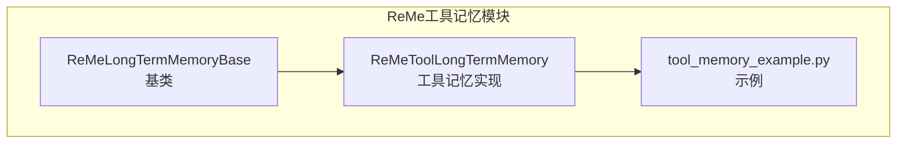
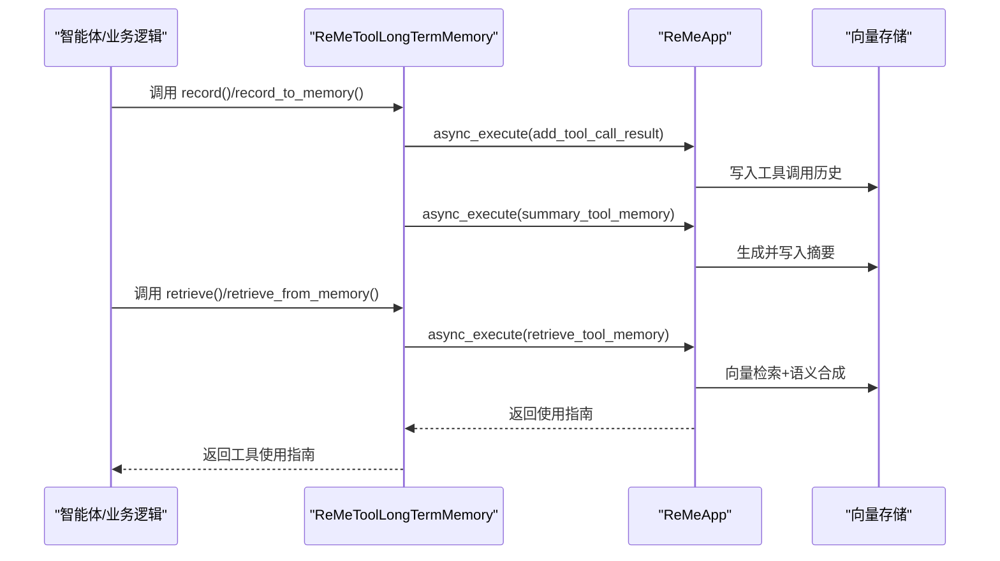
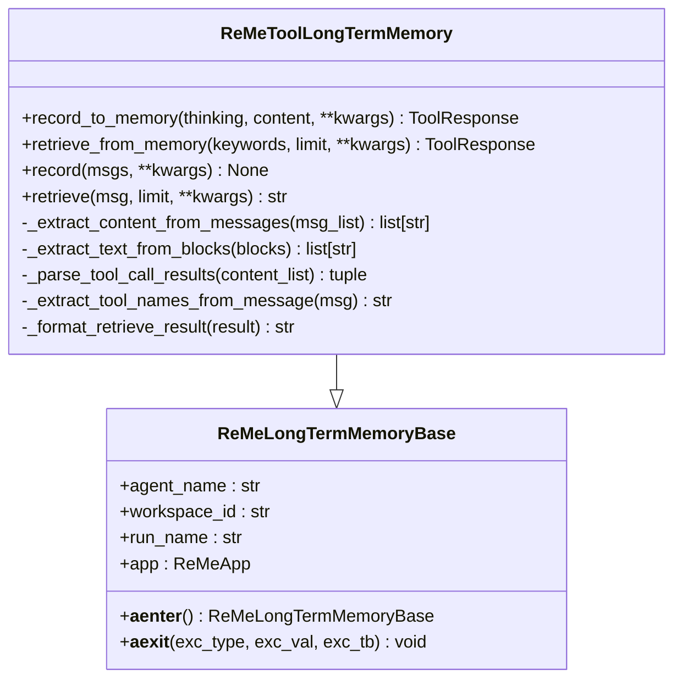
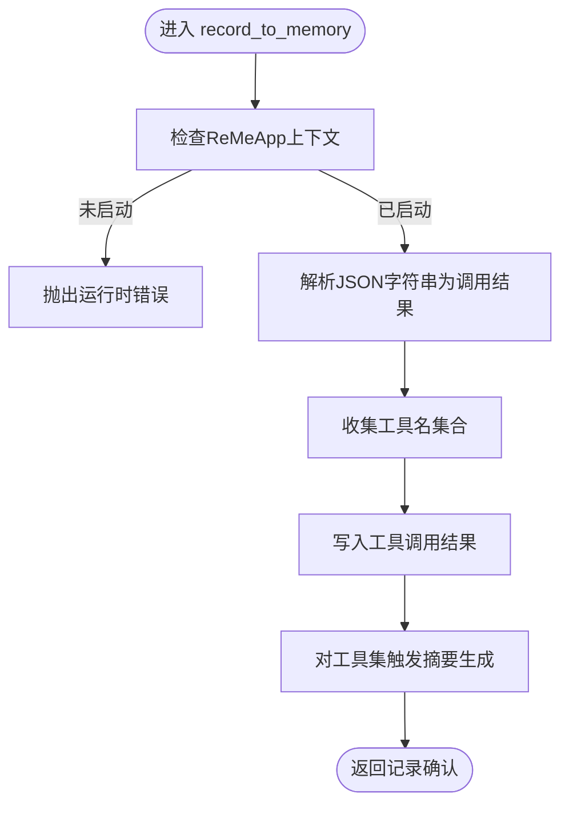
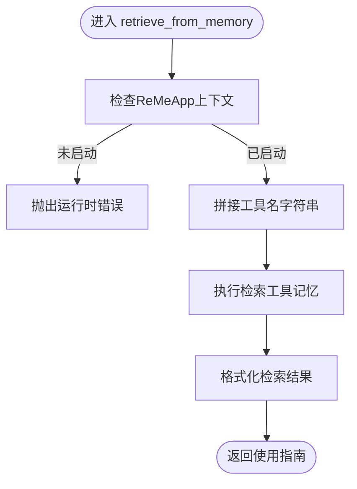
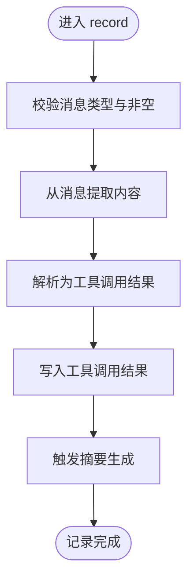
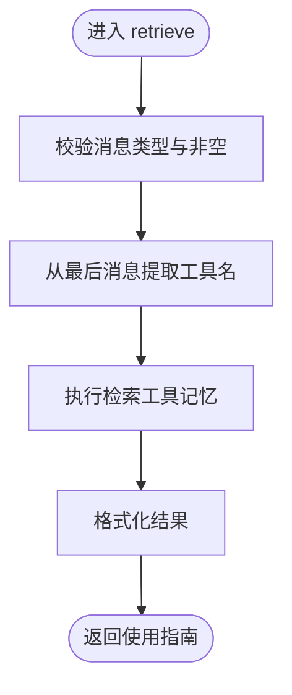
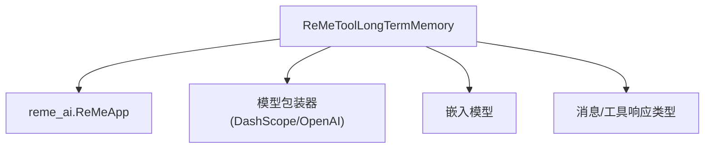

# 工具记忆实现

<cite>
**本文引用的文件**
- [reme_tool_long_term_memory.py](file://src/agentscope/memory/_long_term_memory/_reme/_reme_tool_long_term_memory.py)
- [reme_long_term_memory_base.py](file://src/agentscope/memory/_long_term_memory/_reme/_reme_long_term_memory_base.py)
- [tool_memory_example.py](file://examples/functionality/long_term_memory/reme/tool_memory_example.py)
- [README.md](file://examples/functionality/long_term_memory/reme/README.md)
- [__init__.py](file://src/agentscope/memory/_long_term_memory/_reme/__init__.py)
- [__init__.py](file://src/agentscope/memory/_long_term_memory/__init__.py)
</cite>

## 目录
1. [简介](#简介)
2. [项目结构](#项目结构)
3. [核心组件](#核心组件)
4. [架构概览](#架构概览)
5. [详细组件分析](#详细组件分析)
6. [依赖分析](#依赖分析)
7. [性能考虑](#性能考虑)
8. [故障排查指南](#故障排查指南)
9. [结论](#结论)
10. [附录](#附录)

## 简介
本文件面向ReMe工具记忆（ReMeToolLongTermMemory）的实现与应用，系统性阐述其设计思路、数据模型、处理流程与实际应用场景。ReMe工具记忆通过记录工具调用历史，自动生成使用指南与最佳实践，帮助智能体在后续任务中做出更优的工具选择与参数配置决策。本文将从代码结构、数据流、错误处理、性能特征等方面进行深入解析，并提供配置参数、API使用示例、数据分析方法与扩展指南。

## 项目结构
ReMe工具记忆位于AgentScope的记忆模块中，采用“基类+具体实现”的分层设计：
- 基类：ReMeLongTermMemoryBase，负责ReMe库集成、模型配置、异步上下文管理与通用接口定义
- 实现类：ReMeToolLongTermMemory，继承基类，实现工具记忆的记录与检索能力
- 示例：tool_memory_example.py 展示了完整的工具记忆工作流，包括工具注册、历史记录、指南检索与系统提示增强

图表来源
- [reme_tool_long_term_memory.py:17-546](file://src/agentscope/memory/_long_term_memory/_reme/_reme_tool_long_term_memory.py#L17-L546)
- [reme_long_term_memory_base.py:77-365](file://src/agentscope/memory/_long_term_memory/_reme/_reme_long_term_memory_base.py#L77-L365)
- [tool_memory_example.py:1-437](file://examples/functionality/long_term_memory/reme/tool_memory_example.py#L1-L437)

章节来源
- [reme_tool_long_term_memory.py:1-546](file://src/agentscope/memory/_long_term_memory/_reme/_reme_tool_long_term_memory.py#L1-L546)
- [reme_long_term_memory_base.py:1-365](file://src/agentscope/memory/_long_term_memory/_reme/_reme_long_term_memory_base.py#L1-L365)
- [tool_memory_example.py:1-437](file://examples/functionality/long_term_memory/reme/tool_memory_example.py#L1-L437)

## 核心组件
- ReMeLongTermMemoryBase：ReMe记忆系统的抽象基类，负责：
  - 模型与嵌入模型的配置提取与传递
  - ReMeApp的初始化与异步上下文管理
  - 统一的错误处理与依赖缺失提示
- ReMeToolLongTermMemory：工具记忆的具体实现，提供：
  - 记录工具执行结果并触发总结（record_to_memory）
  - 从记忆中检索工具使用指南（retrieve_from_memory）
  - 从消息内容解析并记录工具调用结果（record）
  - 直接检索工具使用指南（retrieve）

章节来源
- [reme_long_term_memory_base.py:77-365](file://src/agentscope/memory/_long_term_memory/_reme/_reme_long_term_memory_base.py#L77-L365)
- [reme_tool_long_term_memory.py:17-546](file://src/agentscope/memory/_long_term_memory/_reme/_reme_tool_long_term_memory.py#L17-L546)

## 架构概览
ReMe工具记忆的运行时架构由三层组成：
- 应用层：ReActAgent或业务逻辑通过工具记忆接口发起记录与检索请求
- 记忆层：ReMeToolLongTermMemory封装ReMeApp，负责数据写入、摘要生成与检索
- 存储层：向量存储与元数据持久化，支持跨会话、跨上下文的长期记忆

图表来源
- [reme_tool_long_term_memory.py:25-277](file://src/agentscope/memory/_long_term_memory/_reme/_reme_tool_long_term_memory.py#L25-L277)
- [reme_tool_long_term_memory.py:353-546](file://src/agentscope/memory/_long_term_memory/_reme/_reme_tool_long_term_memory.py#L353-L546)

## 详细组件分析

### ReMeToolLongTermMemory 类设计与实现
- 设计目标：以工具调用历史为基础，构建可复用的使用指南与最佳实践知识库
- 关键职责：
  - 解析并校验工具调用结果（JSON格式）
  - 将调用历史写入ReMe并触发摘要生成
  - 支持按工具名检索使用指南
  - 提供消息内容解析与记录能力

图表来源
- [reme_tool_long_term_memory.py:17-546](file://src/agentscope/memory/_long_term_memory/_reme/_reme_tool_long_term_memory.py#L17-L546)
- [reme_long_term_memory_base.py:77-365](file://src/agentscope/memory/_long_term_memory/_reme/_reme_long_term_memory_base.py#L77-L365)

章节来源
- [reme_tool_long_term_memory.py:17-546](file://src/agentscope/memory/_long_term_memory/_reme/_reme_tool_long_term_memory.py#L17-L546)

### 数据模型与字段规范
工具调用历史记录采用统一的JSON结构，字段如下：
- create_time：字符串，格式为“YYYY-MM-DD HH:MM:SS”
- tool_name：字符串，工具名称
- input：字典，调用参数
- output：字符串，工具输出
- token_cost：整数，令牌消耗
- success：布尔值，是否成功
- time_cost：浮点数，执行耗时（秒）

章节来源
- [reme_tool_long_term_memory.py:56-70](file://src/agentscope/memory/_long_term_memory/_reme/_reme_tool_long_term_memory.py#L56-L70)
- [tool_memory_example.py:110-177](file://examples/functionality/long_term_memory/reme/tool_memory_example.py#L110-L177)

### 处理流程与控制流

#### 记录流程（record_to_memory）
- 输入：思考说明与工具调用结果列表（JSON字符串）
- 处理：
  - 校验ReMeApp上下文状态
  - 解析JSON并收集工具名集合
  - 调用ReMeApp写入工具调用结果
  - 对涉及工具触发摘要生成
- 输出：确认信息（记录数量与生成的指南）

图表来源
- [reme_tool_long_term_memory.py:25-174](file://src/agentscope/memory/_long_term_memory/_reme/_reme_tool_long_term_memory.py#L25-L174)

章节来源
- [reme_tool_long_term_memory.py:25-174](file://src/agentscope/memory/_long_term_memory/_reme/_reme_tool_long_term_memory.py#L25-L174)

#### 检索流程（retrieve_from_memory）
- 输入：工具名列表与限制条数
- 处理：
  - 校验ReMeApp上下文状态
  - 将工具名拼接为逗号分隔字符串
  - 调用ReMeApp检索工具记忆
  - 提取并格式化答案
- 输出：使用指南文本或提示信息

图表来源
- [reme_tool_long_term_memory.py:175-277](file://src/agentscope/memory/_long_term_memory/_reme/_reme_tool_long_term_memory.py#L175-L277)

章节来源
- [reme_tool_long_term_memory.py:175-277](file://src/agentscope/memory/_long_term_memory/_reme/_reme_tool_long_term_memory.py#L175-L277)

#### 消息解析与记录（record）
- 输入：消息列表（每条消息的内容为JSON字符串）
- 处理：
  - 过滤None并校验类型
  - 从消息中提取内容并解析为工具调用结果
  - 写入结果并触发摘要生成
- 输出：无（记录完成）

图表来源
- [reme_tool_long_term_memory.py:353-433](file://src/agentscope/memory/_long_term_memory/_reme/_reme_tool_long_term_memory.py#L353-L433)

章节来源
- [reme_tool_long_term_memory.py:353-433](file://src/agentscope/memory/_long_term_memory/_reme/_reme_tool_long_term_memory.py#L353-L433)

#### 检索指南（retrieve）
- 输入：消息（包含工具名）或消息列表
- 处理：
  - 校验ReMeApp上下文状态
  - 从最后一条消息提取工具名
  - 执行检索并格式化结果
- 输出：使用指南字符串

图表来源
- [reme_tool_long_term_memory.py:474-546](file://src/agentscope/memory/_long_term_memory/_reme/_reme_tool_long_term_memory.py#L474-L546)

章节来源
- [reme_tool_long_term_memory.py:474-546](file://src/agentscope/memory/_long_term_memory/_reme/_reme_tool_long_term_memory.py#L474-L546)

### 工具效果评估与使用模式识别
- 成功率统计：基于success字段聚合各工具的成功次数与失败次数，用于计算成功率
- 使用频率分析：基于tool_name与时间戳统计工具调用频次与趋势
- 性能特征：结合time_cost与token_cost分析工具执行效率与成本
- 最佳实践总结：通过摘要生成与向量检索，提炼参数组合、调用顺序与注意事项

章节来源
- [reme_tool_long_term_memory.py:56-70](file://src/agentscope/memory/_long_term_memory/_reme/_reme_tool_long_term_memory.py#L56-L70)
- [tool_memory_example.py:110-177](file://examples/functionality/long_term_memory/reme/tool_memory_example.py#L110-L177)

### 实际应用场景
- 工具选择建议：根据检索到的指南与历史成功率，推荐更优的工具与参数组合
- 使用技巧分享：总结常见问题与规避策略，提升工具使用的稳定性
- 性能优化建议：结合time_cost与token_cost，指导减少开销的调用方式
- 系统提示增强：将检索到的指南注入智能体系统提示，提升工具使用质量

章节来源
- [tool_memory_example.py:204-257](file://examples/functionality/long_term_memory/reme/tool_memory_example.py#L204-L257)
- [README.md:503-519](file://examples/functionality/long_term_memory/reme/README.md#L503-L519)

## 依赖分析
- 外部依赖：reme_ai（ReMe库），需单独安装
- AgentScope内部依赖：模型包装器（DashScope/OpenAI）、嵌入模型、消息与工具响应类型
- 上下文管理：必须使用async with确保ReMeApp正确初始化与清理

图表来源
- [reme_tool_long_term_memory.py:9-14](file://src/agentscope/memory/_long_term_memory/_reme/_reme_tool_long_term_memory.py#L9-L14)
- [reme_long_term_memory_base.py:72-74](file://src/agentscope/memory/_long_term_memory/_reme/_reme_long_term_memory_base.py#L72-L74)

章节来源
- [reme_tool_long_term_memory.py:9-14](file://src/agentscope/memory/_long_term_memory/_reme/_reme_tool_long_term_memory.py#L9-L14)
- [reme_long_term_memory_base.py:72-74](file://src/agentscope/memory/_long_term_memory/_reme/_reme_long_term_memory_base.py#L72-L74)

## 性能考虑
- 异步执行：所有ReMe操作均采用异步，避免阻塞主线程
- 向量检索：利用嵌入模型与向量存储，提高检索效率
- 摘要生成：仅在新增调用结果后触发摘要，降低重复计算
- 上下文管理：使用异步上下文管理器确保资源正确释放

章节来源
- [reme_tool_long_term_memory.py:130-146](file://src/agentscope/memory/_long_term_memory/_reme/_reme_tool_long_term_memory.py#L130-L146)
- [reme_long_term_memory_base.py:287-365](file://src/agentscope/memory/_long_term_memory/_reme/_reme_long_term_memory_base.py#L287-L365)

## 故障排查指南
- 上下文未启动：确保使用async with包裹工具记忆实例
- JSON解析失败：检查消息内容是否为合法JSON字符串
- 无检索结果：确认已先记录工具调用历史，且工具名一致
- 摘要未生成：需要足够多的历史记录以触发自动摘要

章节来源
- [reme_tool_long_term_memory.py:87-91](file://src/agentscope/memory/_long_term_memory/_reme/_reme_tool_long_term_memory.py#L87-L91)
- [reme_tool_long_term_memory.py:110-118](file://src/agentscope/memory/_long_term_memory/_reme/_reme_tool_long_term_memory.py#L110-L118)
- [README.md:589-604](file://examples/functionality/long_term_memory/reme/README.md#L589-L604)

## 结论
ReMe工具记忆通过结构化的数据模型与智能的摘要生成机制，实现了工具使用经验的沉淀与复用。其异步架构与向量检索能力保证了良好的性能表现，配合系统提示增强与智能体集成，显著提升了工具使用的准确性与效率。建议在实际应用中持续记录工具调用历史，定期评估成功率与性能指标，以不断优化工具使用策略。

## 附录

### 配置参数与初始化
- agent_name：智能体标识
- user_name：用户/工作区标识（映射到ReMe的workspace_id）
- run_name：运行标识
- model：聊天模型（DashScope/OpenAI）
- embedding_model：嵌入模型（DashScope/OpenAI）
- reme_config_path：ReMe配置文件路径（可选）
- 其他kwargs：传递给ReMeApp的额外配置

章节来源
- [reme_long_term_memory_base.py:94-140](file://src/agentscope/memory/_long_term_memory/_reme/_reme_long_term_memory_base.py#L94-L140)

### API使用示例
- 初始化与异步上下文：参考示例文件中的async with用法
- 记录工具历史：使用record方法传入包含JSON字符串的消息列表
- 检索使用指南：使用retrieve方法传入包含工具名的消息
- 系统提示增强：将检索到的指南注入智能体系统提示

章节来源
- [tool_memory_example.py:368-406](file://examples/functionality/long_term_memory/reme/tool_memory_example.py#L368-L406)
- [tool_memory_example.py:204-257](file://examples/functionality/long_term_memory/reme/tool_memory_example.py#L204-L257)

### 数据分析方法
- 成功率计算：success为True的次数占比
- 使用频率：按工具名与时间维度统计调用次数
- 性能分析：time_cost与token_cost的分布与趋势
- 指南质量：通过检索命中率与用户反馈评估摘要质量

章节来源
- [reme_tool_long_term_memory.py:56-70](file://src/agentscope/memory/_long_term_memory/_reme/_reme_tool_long_term_memory.py#L56-L70)
- [tool_memory_example.py:110-177](file://examples/functionality/long_term_memory/reme/tool_memory_example.py#L110-L177)

### 扩展指南
- 新增工具类型：可在现有基础上扩展新的工具记忆类型
- 自定义摘要策略：调整摘要生成参数与阈值
- 多模态内容：支持图片、音频等多模态工具调用记录
- 与其他记忆类型集成：与个人记忆、任务记忆协同使用

章节来源
- [__init__.py:4-6](file://src/agentscope/memory/_long_term_memory/_reme/__init__.py#L4-L6)
- [__init__.py:6-10](file://src/agentscope/memory/_long_term_memory/__init__.py#L6-L10)