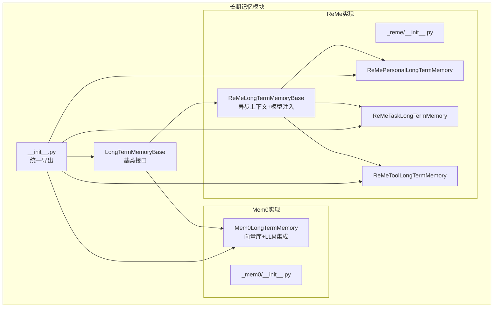
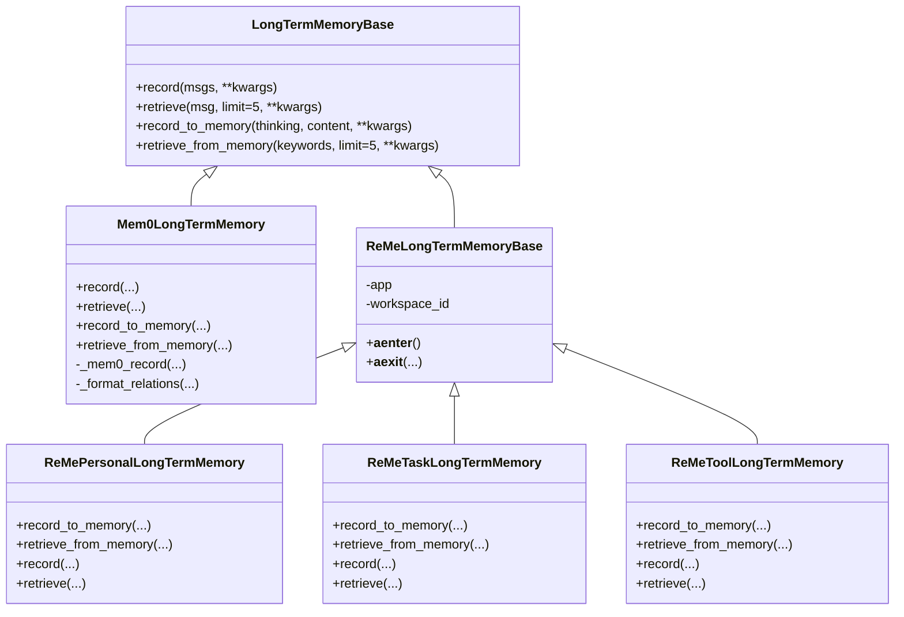
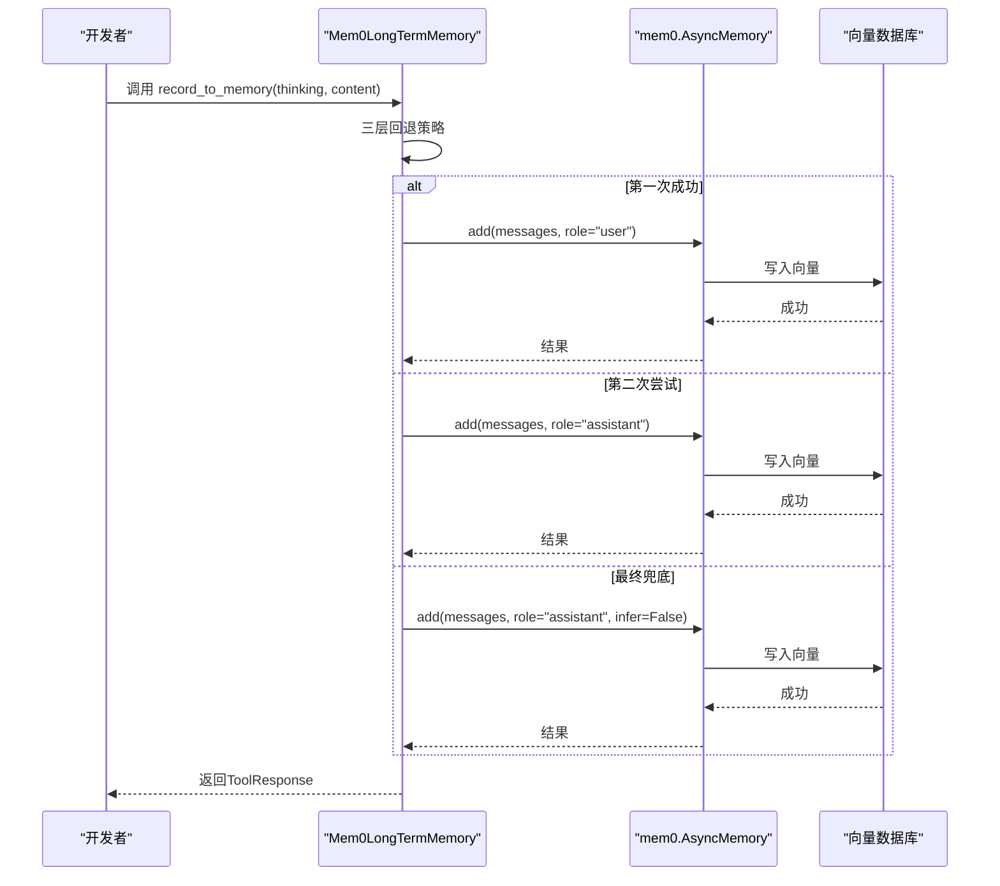
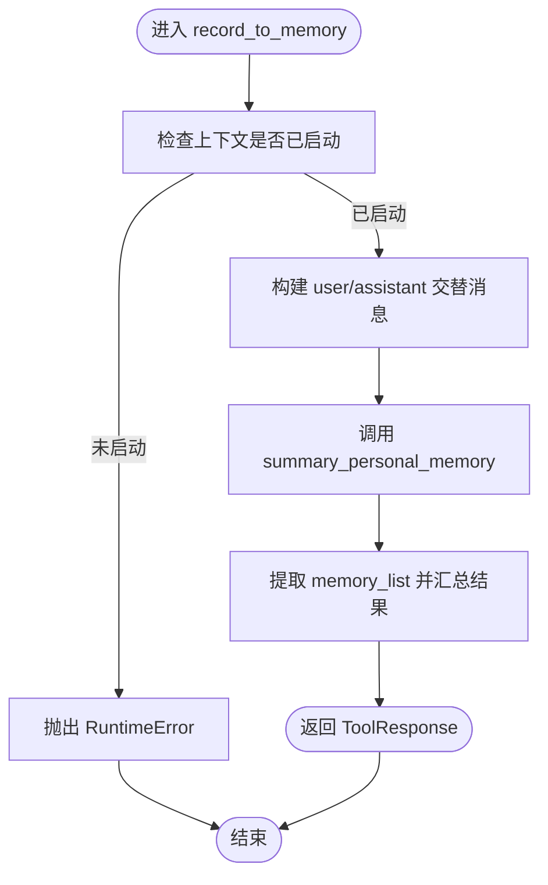
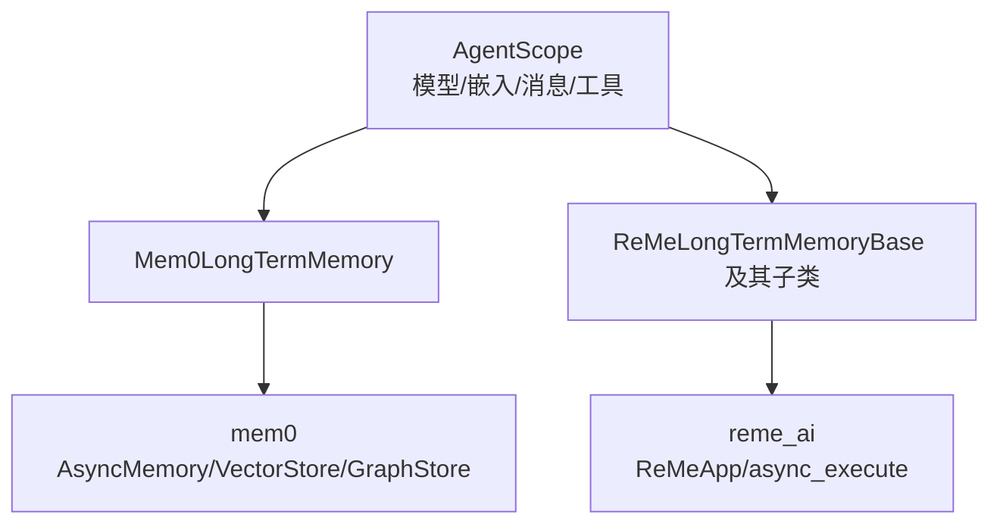

# 长期记忆

<cite>
**本文引用的文件**
- [src/agentscope/memory/_long_term_memory/__init__.py](file://src/agentscope/memory/_long_term_memory/__init__.py)
- [src/agentscope/memory/_long_term_memory/_long_term_memory_base.py](file://src/agentscope/memory/_long_term_memory/_long_term_memory_base.py)
- [src/agentscope/memory/_long_term_memory/_mem0/__init__.py](file://src/agentscope/memory/_long_term_memory/_mem0/__init__.py)
- [src/agentscope/memory/_long_term_memory/_mem0/_mem0_long_term_memory.py](file://src/agentscope/memory/_long_term_memory/_mem0/_mem0_long_term_memory.py)
- [src/agentscope/memory/_long_term_memory/_reme/__init__.py](file://src/agentscope/memory/_long_term_memory/_reme/__init__.py)
- [src/agentscope/memory/_long_term_memory/_reme/_reme_long_term_memory_base.py](file://src/agentscope/memory/_long_term_memory/_reme/_reme_long_term_memory_base.py)
- [src/agentscope/memory/_long_term_memory/_reme/_reme_personal_long_term_memory.py](file://src/agentscope/memory/_long_term_memory/_reme/_reme_personal_long_term_memory.py)
- [src/agentscope/memory/_long_term_memory/_reme/_reme_task_long_term_memory.py](file://src/agentscope/memory/_long_term_memory/_reme/_reme_task_long_term_memory.py)
- [src/agentscope/memory/_long_term_memory/_reme/_reme_tool_long_term_memory.py](file://src/agentscope/memory/_long_term_memory/_reme/_reme_tool_long_term_memory.py)
- [examples/functionality/long_term_memory/mem0/memory_example.py](file://examples/functionality/long_term_memory/mem0/memory_example.py)
- [examples/functionality/long_term_memory/reme/personal_memory_example.py](file://examples/functionality/long_term_memory/reme/personal_memory_example.py)
- [examples/functionality/long_term_memory/reme/task_memory_example.py](file://examples/functionality/long_term_memory/reme/task_memory_example.py)
- [examples/functionality/long_term_memory/reme/tool_memory_example.py](file://examples/functionality/long_term_memory/reme/tool_memory_example.py)
- [tests/memory_reme_test.py](file://tests/memory_reme_test.py)
- [tests/mem0_utils_test.py](file://tests/mem0_utils_test.py)
</cite>

## 目录
1. [简介](#简介)
2. [项目结构](#项目结构)
3. [核心组件](#核心组件)
4. [架构总览](#架构总览)
5. [详细组件分析](#详细组件分析)
6. [依赖关系分析](#依赖关系分析)
7. [性能考虑](#性能考虑)
8. [故障排查指南](#故障排查指南)
9. [结论](#结论)
10. [附录](#附录)

## 简介
本技术文档面向AgentScope长期记忆系统，系统性阐述其基础架构、扩展机制与实现细节。重点覆盖：
- 基类LongTermMemoryBase的设计理念与扩展点
- Mem0长期记忆的向量数据库存储、相似度检索与上下文增强
- ReMe增强记忆的三类实现：个人记忆(ReMePersonalLongTermMemory)、任务记忆(ReMeTaskLongTermMemory)、工具记忆(ReMeToolLongTermMemory)及其应用场景
- 持久化策略、数据同步机制与版本管理
- 配置项说明（存储参数、检索阈值、缓存策略）
- 使用示例、性能优化建议与最佳实践

## 项目结构
长期记忆模块位于agentscope.memory._long_term_memory下，按“实现方案+增强记忆类型”分层组织：
- 基类与导出入口：_long_term_memory_base.py、__init__.py
- Mem0实现：_mem0子包，包含Mem0LongTermMemory及适配器
- ReMe实现：_reme子包，包含ReMeLongTermMemoryBase与三类具体实现

图表来源
- [src/agentscope/memory/_long_term_memory/__init__.py:1-19](file://src/agentscope/memory/_long_term_memory/__init__.py#L1-L19)
- [src/agentscope/memory/_long_term_memory/_long_term_memory_base.py:11-95](file://src/agentscope/memory/_long_term_memory/_long_term_memory_base.py#L11-L95)
- [src/agentscope/memory/_long_term_memory/_mem0/__init__.py:1-10](file://src/agentscope/memory/_long_term_memory/_mem0/__init__.py#L1-L10)
- [src/agentscope/memory/_long_term_memory/_reme/__init__.py:1-13](file://src/agentscope/memory/_long_term_memory/_reme/__init__.py#L1-L13)

章节来源
- [src/agentscope/memory/_long_term_memory/__init__.py:1-19](file://src/agentscope/memory/_long_term_memory/__init__.py#L1-L19)
- [src/agentscope/memory/_long_term_memory/_long_term_memory_base.py:11-95](file://src/agentscope/memory/_long_term_memory/_long_term_memory_base.py#L11-L95)

## 核心组件
- LongTermMemoryBase：定义开发者与工具函数两类接口，支持消息级记录与检索、关键词检索与记录等能力，作为所有实现的抽象基类。
- Mem0LongTermMemory：基于mem0库，集成向量数据库与LLM，提供语义检索、关系抽取、多策略记录与异步检索。
- ReMeLongTermMemoryBase：ReMe库的适配基类，负责模型与嵌入配置注入、异步上下文管理、错误提示与可选依赖处理。
- ReMePersonalLongTermMemory：个人偏好与历史信息的记忆，支持对话式总结与关键词检索。
- ReMeTaskLongTermMemory：任务执行经验与最佳实践的记忆，支持轨迹评分与检索。
- ReMeToolLongTermMemory：工具调用结果与使用指南的记忆，支持JSON格式的历史记录与生成使用建议。

章节来源
- [src/agentscope/memory/_long_term_memory/_long_term_memory_base.py:11-95](file://src/agentscope/memory/_long_term_memory/_long_term_memory_base.py#L11-L95)
- [src/agentscope/memory/_long_term_memory/_mem0/_mem0_long_term_memory.py:72-747](file://src/agentscope/memory/_long_term_memory/_mem0/_mem0_long_term_memory.py#L72-L747)
- [src/agentscope/memory/_long_term_memory/_reme/_reme_long_term_memory_base.py:77-365](file://src/agentscope/memory/_long_term_memory/_reme/_reme_long_term_memory_base.py#L77-L365)
- [src/agentscope/memory/_long_term_memory/_reme/_reme_personal_long_term_memory.py:17-415](file://src/agentscope/memory/_long_term_memory/_reme/_reme_personal_long_term_memory.py#L17-L415)
- [src/agentscope/memory/_long_term_memory/_reme/_reme_task_long_term_memory.py:17-437](file://src/agentscope/memory/_long_term_memory/_reme/_reme_task_long_term_memory.py#L17-L437)
- [src/agentscope/memory/_long_term_memory/_reme/_reme_tool_long_term_memory.py:17-546](file://src/agentscope/memory/_long_term_memory/_reme/_reme_tool_long_term_memory.py#L17-L546)

## 架构总览
长期记忆系统采用“基类抽象 + 多实现并行”的架构。Mem0侧重向量检索与关系抽取；ReMe侧重以“记忆流”为核心的对话式总结与检索。两者均通过统一的工具函数接口与开发者接口融入Agent工作流。

图表来源
- [src/agentscope/memory/_long_term_memory/_long_term_memory_base.py:11-95](file://src/agentscope/memory/_long_term_memory/_long_term_memory_base.py#L11-L95)
- [src/agentscope/memory/_long_term_memory/_mem0/_mem0_long_term_memory.py:72-747](file://src/agentscope/memory/_long_term_memory/_mem0/_mem0_long_term_memory.py#L72-L747)
- [src/agentscope/memory/_long_term_memory/_reme/_reme_long_term_memory_base.py:77-365](file://src/agentscope/memory/_long_term_memory/_reme/_reme_long_term_memory_base.py#L77-L365)
- [src/agentscope/memory/_long_term_memory/_reme/_reme_personal_long_term_memory.py:17-415](file://src/agentscope/memory/_long_term_memory/_reme/_reme_personal_long_term_memory.py#L17-L415)
- [src/agentscope/memory/_long_term_memory/_reme/_reme_task_long_term_memory.py:17-437](file://src/agentscope/memory/_long_term_memory/_reme/_reme_task_long_term_memory.py#L17-L437)
- [src/agentscope/memory/_long_term_memory/_reme/_reme_tool_long_term_memory.py:17-546](file://src/agentscope/memory/_long_term_memory/_reme/_reme_tool_long_term_memory.py#L17-L546)

## 详细组件分析

### 基类LongTermMemoryBase设计与扩展
- 设计理念
  - 提供开发者接口(record/retrieve)与工具函数接口(record_to_memory/retrieve_from_memory)，前者用于在回复前后自动注入/提取记忆，后者用于显式记忆操作。
  - 继承自StateModule，便于与Agent状态模块协同。
- 扩展机制
  - 子类需实现四个方法；若不实现则抛出未实现异常，确保明确职责边界。
  - 支持Msg对象列表输入，便于与Agent消息系统无缝对接。

章节来源
- [src/agentscope/memory/_long_term_memory/_long_term_memory_base.py:11-95](file://src/agentscope/memory/_long_term_memory/_long_term_memory_base.py#L11-L95)

### Mem0长期记忆实现
- 向量数据库与检索
  - 通过mem0.AsyncMemory进行异步写入与查询，支持Qdrant等向量存储，默认开启磁盘持久化(on_disk=True)。
  - 检索时对每个关键词并发发起查询，使用asyncio.gather聚合结果，并可返回关系三元组。
- 记忆记录策略
  - 三层回退策略：优先以“user”角色记录；失败后尝试“assistant”角色；最后兜底直接记录(infer=False)。
  - 支持显式记录(record_to_memory)与对话式记录(record)两种路径。
- 上下文增强
  - 通过LLM与嵌入模型配置，结合mem0的提示词与推理机制，从消息中抽取语义记忆与关系。
- 异步与日志
  - 内部使用异步接口；可选择抑制mem0日志，避免特定版本的无害验证错误干扰。

图表来源
- [src/agentscope/memory/_long_term_memory/_mem0/_mem0_long_term_memory.py:380-506](file://src/agentscope/memory/_long_term_memory/_mem0/_mem0_long_term_memory.py#L380-L506)
- [src/agentscope/memory/_long_term_memory/_mem0/_mem0_long_term_memory.py:642-681](file://src/agentscope/memory/_long_term_memory/_mem0/_mem0_long_term_memory.py#L642-L681)

章节来源
- [src/agentscope/memory/_long_term_memory/_mem0/_mem0_long_term_memory.py:72-747](file://src/agentscope/memory/_long_term_memory/_mem0/_mem0_long_term_memory.py#L72-L747)

### ReMe个人记忆(ReMePersonalLongTermMemory)
- 记录流程
  - record_to_memory：支持thinking与内容列表，内部将内容转为user/assistant交替的消息序列，调用summary_personal_memory进行总结。
  - record：接收Msg列表，转换为轨迹后调用summary_personal_memory。
- 检索流程
  - retrieve_from_memory：对每个关键词调用retrieve_personal_memory，拼接答案。
  - retrieve：取最后一个消息的内容作为查询，调用retrieve_personal_memory。
- 异步上下文
  - 必须在async with上下文中初始化，否则会抛出运行时错误。

图表来源
- [src/agentscope/memory/_long_term_memory/_reme/_reme_personal_long_term_memory.py:20-154](file://src/agentscope/memory/_long_term_memory/_reme/_reme_personal_long_term_memory.py#L20-L154)

章节来源
- [src/agentscope/memory/_long_term_memory/_reme/_reme_personal_long_term_memory.py:17-415](file://src/agentscope/memory/_long_term_memory/_reme/_reme_personal_long_term_memory.py#L17-L415)

### ReMe任务记忆(ReMeTaskLongTermMemory)
- 记录流程
  - record_to_memory：支持thinking与内容列表，调用summary_task_memory；支持score参数表示轨迹质量。
  - record：接收Msg列表，转换为轨迹并调用summary_task_memory。
- 检索流程
  - retrieve_from_memory：对每个关键词调用retrieve_task_memory，拼接答案。
  - retrieve：取最后一个消息内容作为查询，调用retrieve_task_memory。
- 评分与轨迹
  - 支持为轨迹设置score，用于后续检索排序或筛选。

章节来源
- [src/agentscope/memory/_long_term_memory/_reme/_reme_task_long_term_memory.py:17-437](file://src/agentscope/memory/_long_term_memory/_reme/_reme_task_long_term_memory.py#L17-L437)

### ReMe工具记忆(ReMeToolLongTermMemory)
- 记录流程
  - record_to_memory：要求内容为JSON字符串，每条JSON包含工具名、输入、输出、token消耗、成功与否、耗时等字段；先add_tool_call_result，再对涉及工具调用summary_tool_memory。
  - record：从Msg内容解析JSON，走相同流程。
- 检索流程
  - retrieve_from_memory：将多个工具名合并为逗号分隔字符串，调用retrieve_tool_memory一次性获取指南。
  - retrieve：从最后一个消息提取工具名，调用retrieve_tool_memory。
- 数据格式
  - 工具调用历史必须符合约定字段，否则跳过并告警。

章节来源
- [src/agentscope/memory/_long_term_memory/_reme/_reme_tool_long_term_memory.py:17-546](file://src/agentscope/memory/_long_term_memory/_reme/_reme_tool_long_term_memory.py#L17-L546)

### 使用示例与集成
- Mem0示例
  - 展示了如何初始化Mem0LongTermMemory、记录对话、检索偏好与天气相关记忆，并与ReActAgent集成。
- ReMe个人记忆示例
  - 展示record_to_memory、retrieve_from_memory、record、retrieve与ReActAgent集成。
- ReMe任务记忆示例
  - 展示记录调试轨迹、检索任务经验、与ReActAgent集成。
- ReMe工具记忆示例
  - 展示注册工具、记录历史、检索使用指南、增强系统提示并使用ReActAgent。

章节来源
- [examples/functionality/long_term_memory/mem0/memory_example.py:26-186](file://examples/functionality/long_term_memory/mem0/memory_example.py#L26-L186)
- [examples/functionality/long_term_memory/reme/personal_memory_example.py:31-296](file://examples/functionality/long_term_memory/reme/personal_memory_example.py#L31-L296)
- [examples/functionality/long_term_memory/reme/task_memory_example.py:32-343](file://examples/functionality/long_term_memory/reme/task_memory_example.py#L32-L343)
- [examples/functionality/long_term_memory/reme/tool_memory_example.py:347-437](file://examples/functionality/long_term_memory/reme/tool_memory_example.py#L347-L437)

## 依赖关系分析
- 外部依赖
  - mem0：向量存储、图存储、LLM与嵌入工厂注册、异步内存接口。
  - reme_ai：ReMeApp异步上下文、记忆操作（summary/retrieve）。
  - AgentScope内部：模型、嵌入、消息、工具响应、状态模块。
- 版本与兼容
  - Mem0对LLM/嵌入工厂注册存在版本差异，代码中根据版本动态调整注册方式。
  - ReMe需要Python 3.12+，测试中体现该限制。

图表来源
- [src/agentscope/memory/_long_term_memory/_mem0/_mem0_long_term_memory.py:92-133](file://src/agentscope/memory/_long_term_memory/_mem0/_mem0_long_term_memory.py#L92-L133)
- [src/agentscope/memory/_long_term_memory/_reme/_reme_long_term_memory_base.py:262-282](file://src/agentscope/memory/_long_term_memory/_reme/_reme_long_term_memory_base.py#L262-L282)

章节来源
- [src/agentscope/memory/_long_term_memory/_mem0/_mem0_long_term_memory.py:92-133](file://src/agentscope/memory/_long_term_memory/_mem0/_mem0_long_term_memory.py#L92-L133)
- [src/agentscope/memory/_long_term_memory/_reme/_reme_long_term_memory_base.py:262-282](file://src/agentscope/memory/_long_term_memory/_reme/_reme_long_term_memory_base.py#L262-L282)

## 性能考虑
- 并发检索
  - Mem0检索对每个关键词并发查询，使用asyncio.gather聚合，提升整体吞吐。
- 记录策略
  - Mem0三层回退策略降低推理失败导致的记录丢失风险，但可能增加调用次数；可根据业务权衡infer开关。
- ReMe上下文
  - ReMeApp需在async with中启动，避免重复初始化开销；单次会话内复用同一实例。
- 向量存储
  - Mem0默认启用磁盘持久化(on_disk=True)，兼顾可靠性与性能；可根据部署环境调整路径与维度。

章节来源
- [src/agentscope/memory/_long_term_memory/_mem0/_mem0_long_term_memory.py:533-543](file://src/agentscope/memory/_long_term_memory/_mem0/_mem0_long_term_memory.py#L533-L543)
- [src/agentscope/memory/_long_term_memory/_reme/_reme_long_term_memory_base.py:287-365](file://src/agentscope/memory/_long_term_memory/_reme/_reme_long_term_memory_base.py#L287-L365)

## 故障排查指南
- ReMe上下文未启动
  - 现象：调用record_to_memory/retrieve_from_memory或record/retrieve时报RuntimeError。
  - 处理：确保在async with上下文中初始化ReMe实例。
- 模型/嵌入配置错误
  - 现象：初始化时报错或运行时报错。
  - 处理：确认传入模型类型与嵌入模型类型匹配，且具备正确的api_key/base_url等参数。
- Mem0日志噪音
  - 现象：特定版本QDRANT报验证错误但不影响功能。
  - 处理：设置suppress_mem0_logging=True以抑制日志。
- 工具历史JSON无效
  - 现象：record_to_memory对工具记忆返回“无有效记录”。
  - 处理：确保每条内容为合法JSON且包含必需字段。

章节来源
- [src/agentscope/memory/_long_term_memory/_reme/_reme_personal_long_term_memory.py:73-77](file://src/agentscope/memory/_long_term_memory/_reme/_reme_personal_long_term_memory.py#L73-L77)
- [src/agentscope/memory/_long_term_memory/_reme/_reme_task_long_term_memory.py:83-87](file://src/agentscope/memory/_long_term_memory/_reme/_reme_task_long_term_memory.py#L83-L87)
- [src/agentscope/memory/_long_term_memory/_reme/_reme_tool_long_term_memory.py:87-91](file://src/agentscope/memory/_long_term_memory/_reme/_reme_tool_long_term_memory.py#L87-L91)
- [src/agentscope/memory/_long_term_memory/_mem0/_mem0_long_term_memory.py:325-336](file://src/agentscope/memory/_long_term_memory/_mem0/_mem0_long_term_memory.py#L325-L336)
- [src/agentscope/memory/_long_term_memory/_reme/_reme_tool_long_term_memory.py:110-118](file://src/agentscope/memory/_long_term_memory/_reme/_reme_tool_long_term_memory.py#L110-L118)

## 结论
AgentScope长期记忆系统通过统一基类与多种实现方案，满足不同场景下的记忆需求。Mem0强调向量检索与关系抽取，适合通用语义记忆；ReMe强调对话式总结与经验沉淀，适合个人偏好、任务经验与工具使用指南。通过清晰的工具函数接口与异步上下文管理，系统易于与Agent工作流集成，并具备良好的扩展性与可维护性。

## 附录

### 配置选项与参数说明
- Mem0LongTermMemory
  - agent_name/user_name/run_name：标识符，至少提供一个
  - model/embedding_model：LLM与嵌入模型实例
  - vector_store_config：向量存储配置，默认Qdrant且on_disk=True
  - mem0_config：完整mem0配置，可覆盖LLM/嵌入/向量存储
  - default_memory_type：默认记忆类型
  - suppress_mem0_logging：是否抑制mem0日志
- ReMeLongTermMemoryBase
  - agent_name/user_name：agent名称与工作区ID映射
  - model/embedding_model：DashScope/OpenAI模型实例
  - reme_config_path：自定义ReMe配置文件路径
  - 其他kwargs：传递给ReMeApp的命令行风格配置
- ReMe个人/任务/工具记忆
  - record_to_memory/retrieve_from_memory：关键词/内容/JSON格式
  - record/retrieve：Msg输入，个人与任务记忆支持score

章节来源
- [src/agentscope/memory/_long_term_memory/_mem0/_mem0_long_term_memory.py:263-379](file://src/agentscope/memory/_long_term_memory/_mem0/_mem0_long_term_memory.py#L263-L379)
- [src/agentscope/memory/_long_term_memory/_reme/_reme_long_term_memory_base.py:94-282](file://src/agentscope/memory/_long_term_memory/_reme/_reme_long_term_memory_base.py#L94-L282)
- [src/agentscope/memory/_long_term_memory/_reme/_reme_personal_long_term_memory.py:20-64](file://src/agentscope/memory/_long_term_memory/_reme/_reme_personal_long_term_memory.py#L20-L64)
- [src/agentscope/memory/_long_term_memory/_reme/_reme_task_long_term_memory.py:25-74](file://src/agentscope/memory/_long_term_memory/_reme/_reme_task_long_term_memory.py#L25-L74)
- [src/agentscope/memory/_long_term_memory/_reme/_reme_tool_long_term_memory.py:25-78](file://src/agentscope/memory/_long_term_memory/_reme/_reme_tool_long_term_memory.py#L25-L78)

### 使用示例路径
- Mem0
  - [examples/functionality/long_term_memory/mem0/memory_example.py:26-186](file://examples/functionality/long_term_memory/mem0/memory_example.py#L26-L186)
- ReMe个人记忆
  - [examples/functionality/long_term_memory/reme/personal_memory_example.py:31-296](file://examples/functionality/long_term_memory/reme/personal_memory_example.py#L31-L296)
- ReMe任务记忆
  - [examples/functionality/long_term_memory/reme/task_memory_example.py:32-343](file://examples/functionality/long_term_memory/reme/task_memory_example.py#L32-L343)
- ReMe工具记忆
  - [examples/functionality/long_term_memory/reme/tool_memory_example.py:347-437](file://examples/functionality/long_term_memory/reme/tool_memory_example.py#L347-L437)

### 测试参考
- ReMe记忆单元测试
  - [tests/memory_reme_test.py:42-768](file://tests/memory_reme_test.py#L42-L768)
- Mem0工具适配测试（事件循环与并行调用）
  - [tests/mem0_utils_test.py:62-208](file://tests/mem0_utils_test.py#L62-L208)