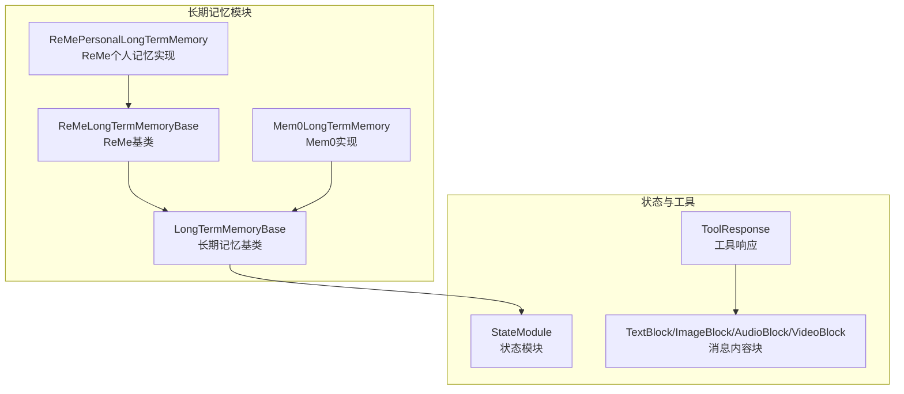
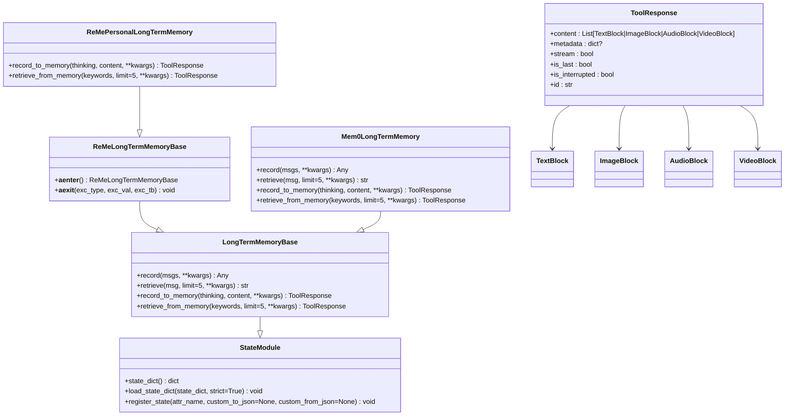
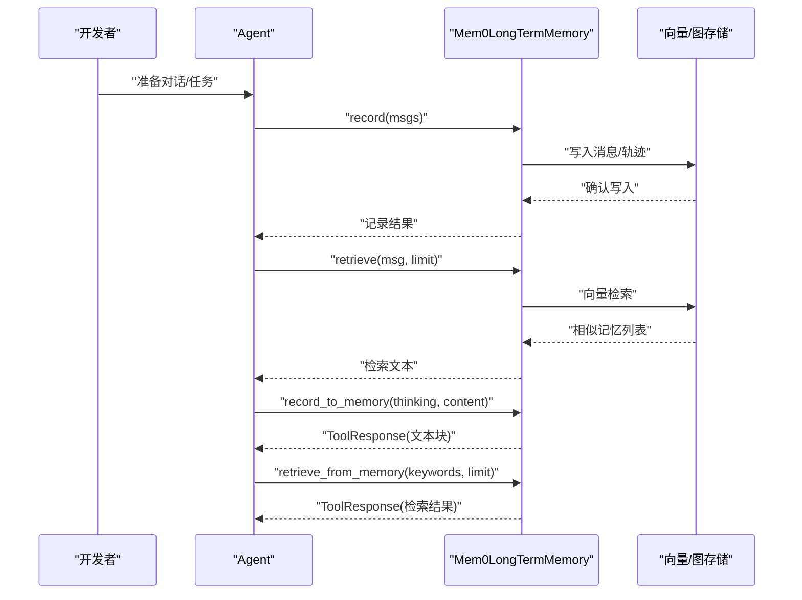
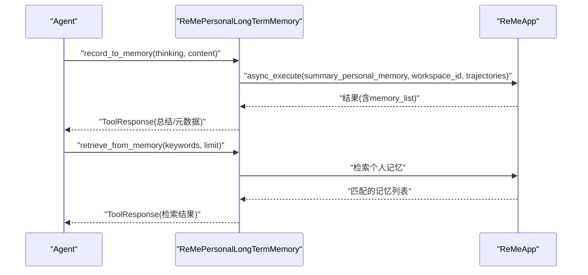
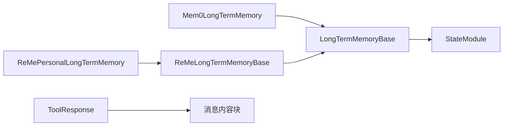

# 长期记忆基类

<cite>
**本文引用的文件列表**
- [长期记忆基类（_long_term_memory_base.py）](file://src/agentscope/memory/_long_term_memory/_long_term_memory_base.py)
- [状态模块（_state_module.py）](file://src/agentscope/module/_state_module.py)
- [工具响应（_response.py）](file://src/agentscope/tool/_response.py)
- [消息内容块（_message_block.py）](file://src/agentscope/message/_message_block.py)
- [ReMe长期记忆基类（_reme_long_term_memory_base.py）](file://src/agentscope/memory/_long_term_memory/_reme/_reme_long_term_memory_base.py)
- [ReMe个人记忆实现（_reme_personal_long_term_memory.py）](file://src/agentscope/memory/_long_term_memory/_reme/_reme_personal_long_term_memory.py)
- [Mem0长期记忆实现（_mem0_long_term_memory.py）](file://src/agentscope/memory/_long_term_memory/_mem0/_mem0_long_term_memory.py)
- [长期记忆模块导出（__init__.py）](file://src/agentscope/memory/_long_term_memory/__init__.py)
- [Mem0示例（memory_example.py）](file://examples/functionality/long_term_memory/mem0/memory_example.py)
- [ReMe个人记忆示例（personal_memory_example.py）](file://examples/functionality/long_term_memory/reme/personal_memory_example.py)
</cite>

## 目录
1. [简介](#简介)
2. [项目结构](#项目结构)
3. [核心组件](#核心组件)
4. [架构概览](#架构概览)
5. [详细组件分析](#详细组件分析)
6. [依赖关系分析](#依赖关系分析)
7. [性能考量](#性能考量)
8. [故障排查指南](#故障排查指南)
9. [结论](#结论)
10. [附录](#附录)

## 简介
本文件面向AgentScope长期记忆系统，聚焦LongTermMemoryBase基类的设计与实现，系统性阐述其继承自StateModule的状态管理机制、四个核心方法的职责与实现要求，并结合Mem0与ReMe两种主流实现给出扩展与最佳实践指导。读者可据此理解如何在AgentScope中构建可插拔、可扩展的长期记忆能力，支持开发者主动记录与检索，以及智能体自愿记录与关键词检索。

## 项目结构
围绕长期记忆的核心文件组织如下：
- 基类与接口层：LongTermMemoryBase（长期记忆基类）
- 状态管理：StateModule（状态模块，提供嵌套序列化/反序列化能力）
- 工具响应：ToolResponse（统一的工具调用输出结构）
- 消息内容块：TextBlock/ImageBlock/AudioBlock/VideoBlock等（消息内容的多模态块）
- 具体实现：Mem0LongTermMemory（基于mem0）、ReMePersonalLongTermMemory（基于ReMe）

图表来源
- [长期记忆基类（_long_term_memory_base.py）:11-95](file://src/agentscope/memory/_long_term_memory/_long_term_memory_base.py#L11-L95)
- [状态模块（_state_module.py）:20-152](file://src/agentscope/module/_state_module.py#L20-L152)
- [工具响应（_response.py）:11-33](file://src/agentscope/tool/_response.py#L11-L33)
- [消息内容块（_message_block.py）:9-129](file://src/agentscope/message/_message_block.py#L9-L129)
- [ReMe长期记忆基类（_reme_long_term_memory_base.py）:77-365](file://src/agentscope/memory/_long_term_memory/_reme/_reme_long_term_memory_base.py#L77-L365)
- [ReMe个人记忆实现（_reme_personal_long_term_memory.py）:17-200](file://src/agentscope/memory/_long_term_memory/_reme/_reme_personal_long_term_memory.py#L17-L200)
- [Mem0长期记忆实现（_mem0_long_term_memory.py）:72-200](file://src/agentscope/memory/_long_term_memory/_mem0/_mem0_long_term_memory.py#L72-L200)

章节来源
- [长期记忆模块导出（__init__.py）:1-19](file://src/agentscope/memory/_long_term_memory/__init__.py#L1-L19)

## 核心组件
- LongTermMemoryBase：定义长期记忆的统一接口，包含开发者接口（record/retrieve）与智能体工具接口（record_to_memory/retrieve_from_memory），并继承自StateModule以支持状态序列化。
- StateModule：提供嵌套模块注册、属性注册、状态字典序列化/反序列化能力，确保复杂对象的持久化与恢复。
- ToolResponse：统一的工具调用结果载体，content为多模态内容块列表，metadata用于传递内部元数据。
- ReMeLongTermMemoryBase：ReMe实现的抽象基类，负责模型配置注入、异步上下文管理、错误提示与依赖检查。
- 具体实现：
  - Mem0LongTermMemory：基于mem0的向量存储与图存储集成，支持多种向量库与嵌入维度配置。
  - ReMePersonalLongTermMemory：基于ReMe的个人记忆记录与检索，强调用户偏好、习惯与事实的结构化存储。

章节来源
- [长期记忆基类（_long_term_memory_base.py）:11-95](file://src/agentscope/memory/_long_term_memory/_long_term_memory_base.py#L11-L95)
- [状态模块（_state_module.py）:20-152](file://src/agentscope/module/_state_module.py#L20-L152)
- [工具响应（_response.py）:11-33](file://src/agentscope/tool/_response.py#L11-L33)
- [消息内容块（_message_block.py）:9-129](file://src/agentscope/message/_message_block.py#L9-L129)
- [ReMe长期记忆基类（_reme_long_term_memory_base.py）:77-365](file://src/agentscope/memory/_long_term_memory/_reme/_reme_long_term_memory_base.py#L77-L365)
- [ReMe个人记忆实现（_reme_personal_long_term_memory.py）:17-200](file://src/agentscope/memory/_long_term_memory/_reme/_reme_personal_long_term_memory.py#L17-L200)
- [Mem0长期记忆实现（_mem0_long_term_memory.py）:72-200](file://src/agentscope/memory/_long_term_memory/_mem0/_mem0_long_term_memory.py#L72-L200)

## 架构概览
LongTermMemoryBase作为统一接口，向上游Agent提供一致的记忆能力；向下通过具体实现对接外部存储或服务（如mem0、ReMe）。StateModule为状态持久化提供基础，确保复杂对象可被序列化与恢复。

图表来源
- [长期记忆基类（_long_term_memory_base.py）:11-95](file://src/agentscope/memory/_long_term_memory/_long_term_memory_base.py#L11-L95)
- [状态模块（_state_module.py）:20-152](file://src/agentscope/module/_state_module.py#L20-L152)
- [ReMe长期记忆基类（_reme_long_term_memory_base.py）:77-365](file://src/agentscope/memory/_long_term_memory/_reme/_reme_long_term_memory_base.py#L77-L365)
- [ReMe个人记忆实现（_reme_personal_long_term_memory.py）:17-200](file://src/agentscope/memory/_long_term_memory/_reme/_reme_personal_long_term_memory.py#L17-L200)
- [Mem0长期记忆实现（_mem0_long_term_memory.py）:72-200](file://src/agentscope/memory/_long_term_memory/_mem0/_mem0_long_term_memory.py#L72-L200)
- [工具响应（_response.py）:11-33](file://src/agentscope/tool/_response.py#L11-L33)
- [消息内容块（_message_block.py）:9-129](file://src/agentscope/message/_message_block.py#L9-L129)

## 详细组件分析

### LongTermMemoryBase 设计与方法详解
- 继承关系与职责
  - 继承自StateModule，具备状态序列化/反序列化能力，便于在Agent生命周期内保存/恢复记忆状态。
  - 定义四个核心异步方法，分别面向开发者与智能体两类使用场景。

- 方法一：record(msgs, **kwargs) -> Any
  - 职责：开发者主动将输入消息记录到长期记忆，通常在对话开始或关键节点执行。
  - 参数：
    - msgs: list[Msg | None]，待记录的消息列表，支持None占位。
  - 返回：实现类可自由定义，常见为记录结果或状态。
  - 异常：未实现时抛出NotImplementedError。
  - 最佳实践：
    - 在Agent回复前调用，确保系统提示词能整合检索到的记忆。
    - 对消息进行清洗与摘要，避免冗余与敏感信息。
    - 结合业务语境选择合适的记忆类型（如会话摘要、任务轨迹等）。

- 方法二：retrieve(msg, limit=5, **kwargs) -> str
  - 职责：根据输入消息检索相关记忆，返回字符串形式的检索结果，供系统提示词拼接。
  - 参数：
    - msg: Msg | list[Msg] | None，单条或多条消息，或None。
    - limit: int，默认5，限制检索数量。
  - 返回：str，检索到的记忆文本片段。
  - 异常：未实现时抛出NotImplementedError。
  - 最佳实践：
    - 将检索结果与系统提示词合并，避免直接暴露原始检索结构。
    - 控制limit与上下文长度，防止超出模型上下文窗口。

- 方法三：record_to_memory(thinking, content, **kwargs) -> ToolResponse
  - 职责：智能体自愿记录重要信息，需提供思考过程与具体内容。
  - 参数：
    - thinking: str，记录动机与价值说明。
    - content: list[str]，具体要记住的事实或要点，建议结构化、简洁明确。
  - 返回：ToolResponse，包含文本块等多模态内容，metadata可携带实现细节。
  - 异常：未实现时抛出NotImplementedError。
  - 最佳实践：
    - 使用明确的“谁、何时、何地、何事、为何、如何”结构。
    - 将高价值事实拆分为独立条目，便于后续检索与去重。

- 方法四：retrieve_from_memory(keywords, limit=5, **kwargs) -> ToolResponse
  - 职责：基于关键词检索记忆，适合回答用户偏好、历史行为等问题。
  - 参数：
    - keywords: list[str]，关键词列表，越具体效果越好。
    - limit: int，默认5，每关键词最大检索条数。
  - 返回：ToolResponse，包含检索到的记忆文本块。
  - 异常：未实现时抛出NotImplementedError。
  - 最佳实践：
    - 多关键词组合提升召回质量。
    - 在回答前先检索，避免臆测。

章节来源
- [长期记忆基类（_long_term_memory_base.py）:24-95](file://src/agentscope/memory/_long_term_memory/_long_term_memory_base.py#L24-L95)

### StateModule 状态管理机制
- 关键能力
  - 自动跟踪子模块：当属性为StateModule实例时，自动登记到模块字典，参与状态序列化。
  - 属性注册：register_state(attr_name, custom_to_json, custom_from_json)，支持自定义JSON转换函数。
  - 序列化/反序列化：state_dict与load_state_dict，递归处理嵌套模块与注册属性。
- 使用建议
  - 在构造函数中先调用super().__init__()，再设置属性，避免异常。
  - 对非原生JSON可序列化属性，提供custom_to_json/custom_from_json。

章节来源
- [状态模块（_state_module.py）:20-152](file://src/agentscope/module/_state_module.py#L20-L152)

### ToolResponse 与消息内容块
- ToolResponse
  - content：List[TextBlock | ImageBlock | AudioBlock | VideoBlock]，工具输出的多模态内容。
  - metadata：内部元数据，便于Agent内部解析。
  - 流式控制：stream/is_last/is_interrupted，支持流式输出。
  - id：唯一标识，便于追踪。
- 消息内容块
  - TextBlock：纯文本块。
  - ThinkingBlock：思考块。
  - 图像/音频/视频块：支持Base64或URL源。

章节来源
- [工具响应（_response.py）:11-33](file://src/agentscope/tool/_response.py#L11-L33)
- [消息内容块（_message_block.py）:9-129](file://src/agentscope/message/_message_block.py#L9-L129)

### Mem0 实现流程（Mem0LongTermMemory）
- 记录流程（record）
  - 输入：msgs（消息列表）。
  - 处理：将消息转换为mem0可识别格式，调用底层存储写入。
  - 输出：记录结果（如写入ID、元数据）。
- 检索流程（retrieve）
  - 输入：msg（查询消息）。
  - 处理：对查询进行嵌入向量化，向量检索相似记忆，返回文本摘要。
  - 输出：检索到的记忆文本。
- 智能体工具（record_to_memory/retrieve_from_memory）
  - 通过工具调用接口实现，返回ToolResponse，content为TextBlock列表。

图表来源
- [Mem0长期记忆实现（_mem0_long_term_memory.py）:72-200](file://src/agentscope/memory/_long_term_memory/_mem0/_mem0_long_term_memory.py#L72-L200)
- [Mem0示例（memory_example.py）:96-134](file://examples/functionality/long_term_memory/mem0/memory_example.py#L96-L134)

章节来源
- [Mem0长期记忆实现（_mem0_long_term_memory.py）:72-200](file://src/agentscope/memory/_long_term_memory/_mem0/_mem0_long_term_memory.py#L72-L200)
- [Mem0示例（memory_example.py）:96-134](file://examples/functionality/long_term_memory/mem0/memory_example.py#L96-L134)

### ReMe 实现流程（ReMePersonalLongTermMemory）
- 记录流程（record_to_memory）
  - 输入：thinking（记录动机）、content（要点列表）。
  - 处理：组装消息轨迹，调用ReMeApp的summary_personal_memory执行器，生成个人记忆。
  - 输出：ToolResponse，包含成功/失败信息与metadata。
- 检索流程（retrieve_from_memory）
  - 输入：keywords（关键词列表）、limit（每关键词上限）。
  - 处理：调用ReMeApp检索个人记忆，返回匹配结果。
  - 输出：ToolResponse，包含检索到的记忆文本块。
- 异步上下文管理
  - 通过__aenter__/__aexit__确保ReMeApp正确初始化与清理，避免未启动上下文导致的运行时错误。

图表来源
- [ReMe个人记忆实现（_reme_personal_long_term_memory.py）:17-200](file://src/agentscope/memory/_long_term_memory/_reme/_reme_personal_long_term_memory.py#L17-L200)
- [ReMe个人记忆示例（personal_memory_example.py）:40-79](file://examples/functionality/long_term_memory/reme/personal_memory_example.py#L40-L79)

章节来源
- [ReMe个人记忆实现（_reme_personal_long_term_memory.py）:17-200](file://src/agentscope/memory/_long_term_memory/_reme/_reme_personal_long_term_memory.py#L17-L200)
- [ReMe个人记忆示例（personal_memory_example.py）:40-79](file://examples/functionality/long_term_memory/reme/personal_memory_example.py#L40-L79)

### 方法参数、返回值与异常处理规范
- record(msgs, **kwargs)
  - 参数：msgs为消息列表；kwargs透传给实现。
  - 返回：实现类自定义（常见为字典或状态）。
  - 异常：未实现抛NotImplementedError。
- retrieve(msg, limit=5, **kwargs)
  - 参数：msg支持单条或多条消息；limit限制检索数量。
  - 返回：str，检索到的记忆文本。
  - 异常：未实现抛NotImplementedError。
- record_to_memory(thinking, content, **kwargs)
  - 参数：thinking为记录动机；content为要点列表。
  - 返回：ToolResponse，content为TextBlock列表。
  - 异常：未实现抛NotImplementedError。
- retrieve_from_memory(keywords, limit=5, **kwargs)
  - 参数：keywords为关键词列表；limit为每关键词上限。
  - 返回：ToolResponse，content为TextBlock列表。
  - 异常：未实现抛NotImplementedError。

章节来源
- [长期记忆基类（_long_term_memory_base.py）:24-95](file://src/agentscope/memory/_long_term_memory/_long_term_memory_base.py#L24-L95)

### 自定义长期记忆实现指导
- 继承关系
  - 必须继承LongTermMemoryBase；若涉及外部服务，可参考ReMeLongTermMemoryBase的异步上下文与依赖注入模式。
- 接口实现
  - 四个方法均需按上述签名实现；对于未使用的工具方法，可在基类基础上保持未实现，或提供空实现。
- 状态管理
  - 若存在需要持久化的内部状态，使用StateModule.register_state进行注册，确保可序列化。
- 错误处理
  - 对外部依赖（如网络、存储）进行异常捕获，返回ToolResponse或抛出有意义的异常。
- 性能优化
  - 合理设置limit与分页策略，避免一次性返回过多内容。
  - 对高频检索建立缓存或索引，减少重复计算。
- 扩展示例
  - 可参考Mem0LongTermMemory与ReMePersonalLongTermMemory的实现，结合自身存储后端（如数据库、向量库、图数据库）完成适配。

章节来源
- [长期记忆基类（_long_term_memory_base.py）:11-95](file://src/agentscope/memory/_long_term_memory/_long_term_memory_base.py#L11-L95)
- [ReMe长期记忆基类（_reme_long_term_memory_base.py）:77-365](file://src/agentscope/memory/_long_term_memory/_reme/_reme_long_term_memory_base.py#L77-L365)
- [Mem0长期记忆实现（_mem0_long_term_memory.py）:72-200](file://src/agentscope/memory/_long_term_memory/_mem0/_mem0_long_term_memory.py#L72-L200)
- [ReMe个人记忆实现（_reme_personal_long_term_memory.py）:17-200](file://src/agentscope/memory/_long_term_memory/_reme/_reme_personal_long_term_memory.py#L17-L200)

## 依赖关系分析
- 组件耦合
  - LongTermMemoryBase与StateModule：强耦合（继承），确保状态管理能力。
  - 具体实现与外部库：Mem0LongTermMemory依赖mem0库，ReMePersonalLongTermMemory依赖reme_ai库。
- 外部依赖
  - 模型与嵌入：实现类通常需要ChatModelBase与EmbeddingModelBase，用于推理与向量化。
  - 存储：Mem0支持多种向量库（如Qdrant、Milvus等），ReMe支持图/向量存储。
- 循环依赖
  - 当前设计无循环依赖，实现类仅依赖基类与通用工具类型。

图表来源
- [长期记忆基类（_long_term_memory_base.py）:11-95](file://src/agentscope/memory/_long_term_memory/_long_term_memory_base.py#L11-L95)
- [状态模块（_state_module.py）:20-152](file://src/agentscope/module/_state_module.py#L20-L152)
- [Mem0长期记忆实现（_mem0_long_term_memory.py）:72-200](file://src/agentscope/memory/_long_term_memory/_mem0/_mem0_long_term_memory.py#L72-L200)
- [ReMe长期记忆基类（_reme_long_term_memory_base.py）:77-365](file://src/agentscope/memory/_long_term_memory/_reme/_reme_long_term_memory_base.py#L77-L365)
- [ReMe个人记忆实现（_reme_personal_long_term_memory.py）:17-200](file://src/agentscope/memory/_long_term_memory/_reme/_reme_personal_long_term_memory.py#L17-L200)
- [工具响应（_response.py）:11-33](file://src/agentscope/tool/_response.py#L11-L33)
- [消息内容块（_message_block.py）:9-129](file://src/agentscope/message/_message_block.py#L9-L129)

## 性能考量
- 检索效率
  - 向量检索：合理设置维度与索引参数，控制limit与top-k，避免全表扫描。
  - 关键词检索：对关键词进行预处理（分词、去停用词），提升召回质量。
- 写入吞吐
  - 批量写入：将多个要点合并为一次写入，减少往返开销。
  - 去重与压缩：对重复内容进行去重，对长文本进行摘要。
- 上下文控制
  - 检索结果与系统提示词拼接时，严格控制上下文长度，避免超出模型上下文窗口。
- 缓存策略
  - 对热点关键词与常用轨迹建立本地缓存，降低重复检索成本。

## 故障排查指南
- 未实现方法
  - 症状：调用record/retrieve或工具方法抛出NotImplementedError。
  - 处理：确保自定义实现覆盖所有必需方法，或在基类中提供空实现。
- ReMe上下文未启动
  - 症状：调用record_to_memory/retrieve_from_memory时报错，提示未启动ReMeApp上下文。
  - 处理：使用async with管理ReMePersonalLongTermMemory，确保上下文正确初始化与关闭。
- 依赖缺失
  - 症状：导入mem0或reme_ai报ImportError。
  - 处理：按照实现类注释安装对应依赖，并检查版本兼容性。
- 异常返回
  - 症状：工具调用返回ToolResponse且content包含错误文本。
  - 处理：检查输入参数（如keywords/thinking/content）是否符合实现要求，查看日志定位问题。

章节来源
- [ReMe个人记忆实现（_reme_personal_long_term_memory.py）:73-77](file://src/agentscope/memory/_long_term_memory/_reme/_reme_personal_long_term_memory.py#L73-L77)
- [Mem0示例（memory_example.py）:96-134](file://examples/functionality/long_term_memory/mem0/memory_example.py#L96-L134)
- [ReMe个人记忆示例（personal_memory_example.py）:40-79](file://examples/functionality/long_term_memory/reme/personal_memory_example.py#L40-L79)

## 结论
LongTermMemoryBase通过清晰的接口设计与StateModule的状态管理能力，为AgentScope提供了统一的长期记忆抽象。结合Mem0与ReMe的具体实现，开发者可以快速接入向量/图存储，满足从开发者驱动记录到智能体自愿记录的多样化需求。遵循本文的方法签名、异常处理与最佳实践，可高效构建稳定、可扩展的长期记忆系统。

## 附录
- 相关示例
  - Mem0长期记忆示例：演示record/retrieve与ReActAgent集成。
  - ReMe个人记忆示例：演示record_to_memory/retrieve_from_memory与系统提示词集成。
- 模块导出
  - 长期记忆模块统一导出LongTermMemoryBase、Mem0LongTermMemory、ReMePersonalLongTermMemory、ReMeTaskLongTermMemory、ReMeToolLongTermMemory。

章节来源
- [Mem0示例（memory_example.py）:96-134](file://examples/functionality/long_term_memory/mem0/memory_example.py#L96-L134)
- [ReMe个人记忆示例（personal_memory_example.py）:40-79](file://examples/functionality/long_term_memory/reme/personal_memory_example.py#L40-L79)
- [长期记忆模块导出（__init__.py）:1-19](file://src/agentscope/memory/_long_term_memory/__init__.py#L1-L19)