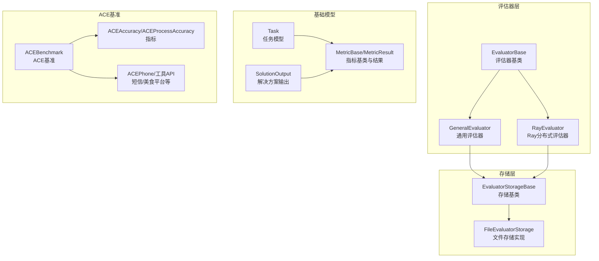
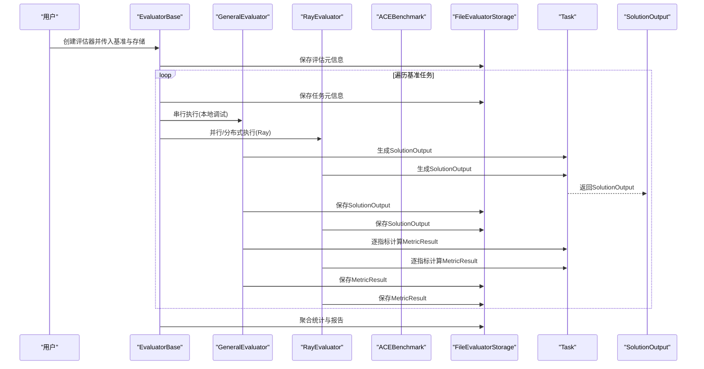
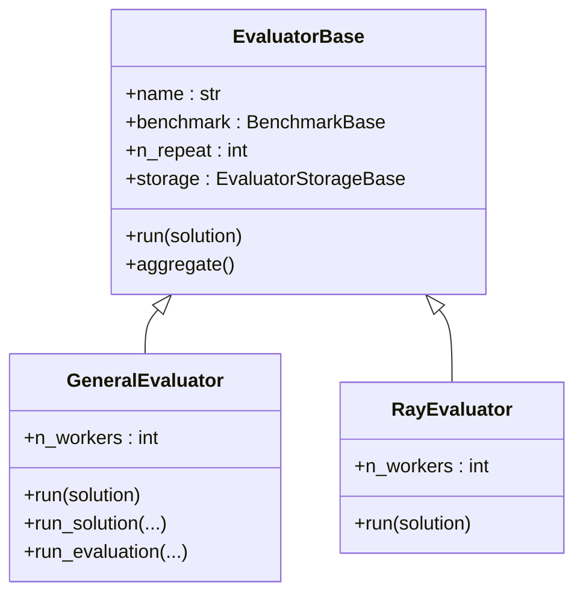
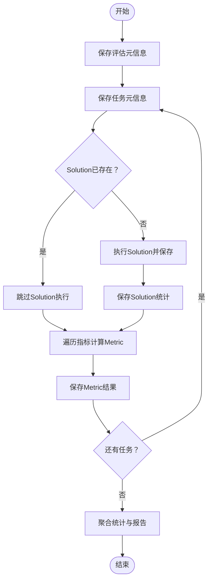
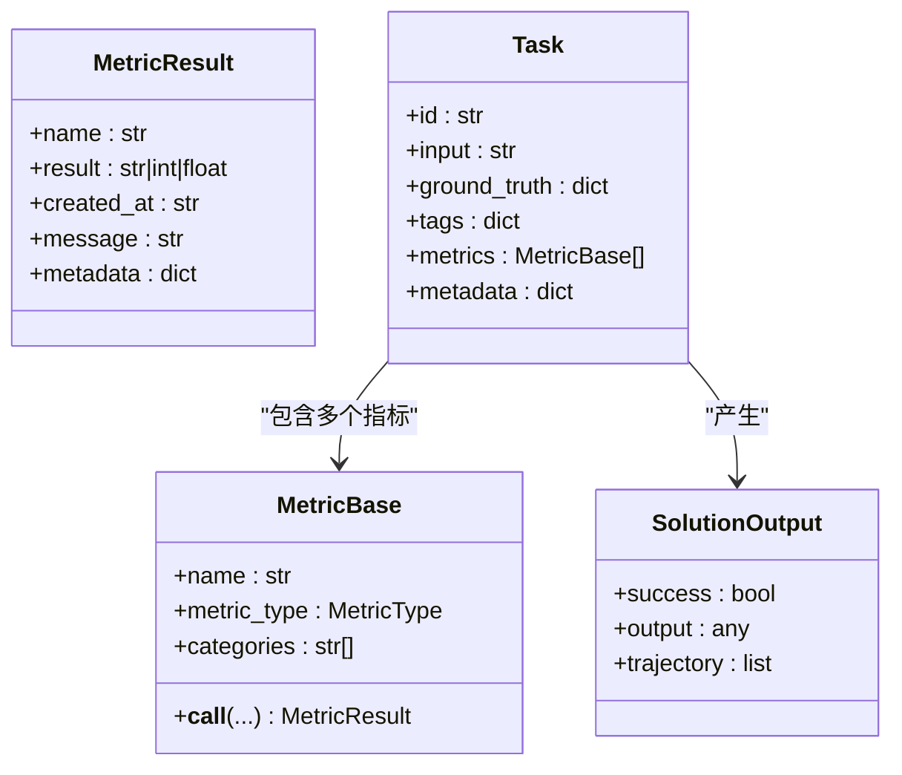
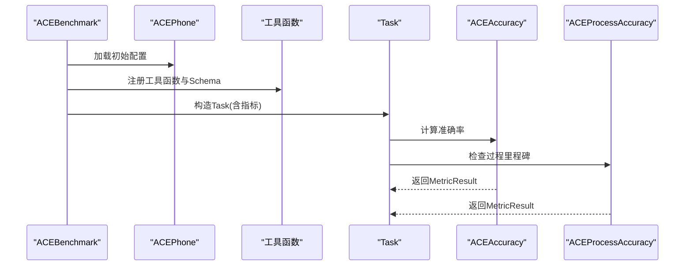
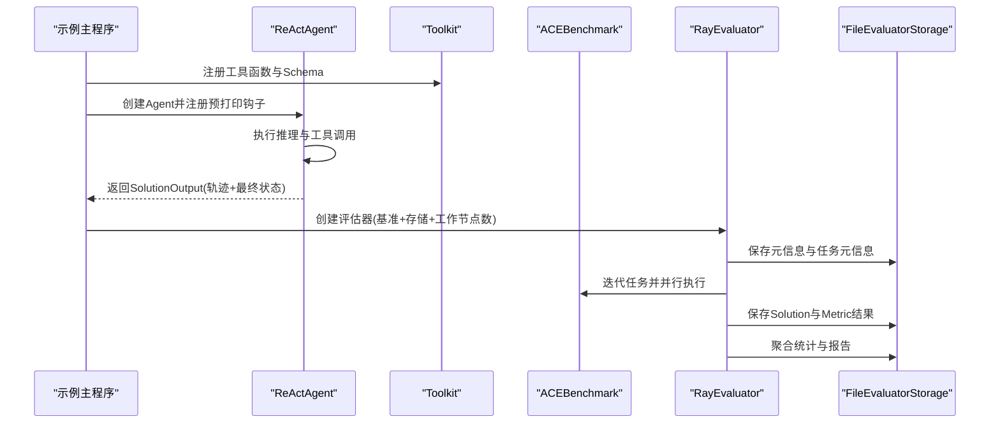
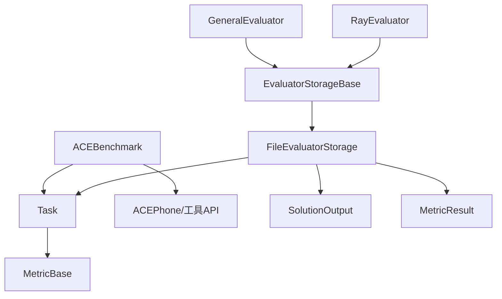

# 评估系统

<cite>
**本文引用的文件**
- [评估模块入口](file://src/agentscope/evaluate/__init__.py)
- [评估器基类](file://src/agentscope/evaluate/_evaluator/_evaluator_base.py)
- [通用评估器](file://src/agentscope/evaluate/_evaluator/_general_evaluator.py)
- [Ray分布式评估器](file://src/agentscope/evaluate/_evaluator/_ray_evaluator.py)
- [评估存储基类](file://src/agentscope/evaluate/_evaluator_storage/_evaluator_storage_base.py)
- [文件存储实现](file://src/agentscope/evaluate/_evaluator_storage/_file_evaluator_storage.py)
- [指标基类与结果类型](file://src/agentscope/evaluate/_metric_base.py)
- [任务与解决方案模型](file://src/agentscope/evaluate/_task.py)
- [解决方案输出模型](file://src/agentscope/evaluate/_solution.py)
- [ACE基准测试](file://src/agentscope/evaluate/_ace_benchmark/_ace_benchmark.py)
- [ACE指标实现](file://src/agentscope/evaluate/_ace_benchmark/_ace_metric.py)
- [ACE工具：电话](file://src/agentscope/evaluate/_ace_benchmark/_ace_tools_zh.py)
- [ACE工具API集合](file://src/agentscope/evaluate/_ace_benchmark/_ace_tools_api/__init__.py)
- [ACE工具：短信API](file://src/agentscope/evaluate/_ace_benchmark/_ace_tools_api/_message_api.py)
- [ACE工具：美食平台API](file://src/agentscope/evaluate/_ace_benchmark/_ace_tools_api/_food_platform_api.py)
- [ACE示例：主程序](file://examples/evaluation/ace_bench/main.py)
- [ACE示例：说明文档](file://examples/evaluation/ace_bench/README.md)
</cite>

## 目录
1. [简介](#简介)
2. [项目结构](#项目结构)
3. [核心组件](#核心组件)
4. [架构总览](#架构总览)
5. [详细组件分析](#详细组件分析)
6. [依赖关系分析](#依赖关系分析)
7. [性能考量](#性能考量)
8. [故障排查指南](#故障排查指南)
9. [结论](#结论)
10. [附录](#附录)

## 简介
本技术文档面向AgentScope评估系统，聚焦以下目标：
- 解释评估器架构的设计理念：评估流程管理、结果收集、报告生成
- 阐述ACE基准测试的实现机制：测试用例设计、评分标准、指标计算
- 介绍评估存储系统：结果持久化、查询接口、可视化支持
- 说明通用评估器的使用方式：自定义评估指标、批处理执行、分布式评估
- 提供评估系统的配置选项：测试参数、评估策略、结果导出
- 给出具体评估示例、指标解释说明、性能分析方法
- 提供完整的API参考与评估最佳实践

## 项目结构
评估子系统位于src/agentscope/evaluate目录下，采用“功能域+层次”的组织方式：
- 评估器层：EvaluatorBase、GeneralEvaluator、RayEvaluator
- 存储层：EvaluatorStorageBase、FileEvaluatorStorage
- 基础模型：MetricBase、MetricResult、Task、SolutionOutput
- 基准测试：ACEBenchmark及配套指标与工具API
- 示例：examples/evaluation/ace_bench

图表来源
- [评估模块入口:1-45](file://src/agentscope/evaluate/__init__.py#L1-L45)
- [评估器基类:1-305](file://src/agentscope/evaluate/_evaluator/_evaluator_base.py#L1-L305)
- [通用评估器:1-179](file://src/agentscope/evaluate/_evaluator/_general_evaluator.py#L1-L179)
- [Ray分布式评估器:1-268](file://src/agentscope/evaluate/_evaluator/_ray_evaluator.py#L1-L268)
- [评估存储基类:1-255](file://src/agentscope/evaluate/_evaluator_storage/_evaluator_storage_base.py#L1-L255)
- [文件存储实现:1-461](file://src/agentscope/evaluate/_evaluator_storage/_file_evaluator_storage.py#L1-L461)
- [指标基类与结果类型:1-102](file://src/agentscope/evaluate/_metric_base.py#L1-L102)
- [ACE基准测试:1-241](file://src/agentscope/evaluate/_ace_benchmark/_ace_benchmark.py#L1-L241)
- [ACE指标实现:1-117](file://src/agentscope/evaluate/_ace_benchmark/_ace_metric.py#L1-L117)
- [ACE工具：电话](file://src/agentscope/evaluate/_ace_benchmark/_ace_tools_zh.py)

章节来源
- [评估模块入口:1-45](file://src/agentscope/evaluate/__init__.py#L1-L45)

## 核心组件
- 评估器基类EvaluatorBase：统一评估流程控制、元数据保存、聚合统计与报告生成
- 通用评估器GeneralEvaluator：单进程串行执行，便于本地调试与追踪
- Ray分布式评估器RayEvaluator：基于Ray的并行/分布式执行，支持多工作节点
- 存储系统：EvaluatorStorageBase抽象与FileEvaluatorStorage文件实现，提供解耦的结果持久化
- 指标体系：MetricBase/MetricResult，支持类别型与数值型指标
- 任务与解决方案：Task封装输入、标签、指标；SolutionOutput封装轨迹与最终状态
- ACE基准：ACEBenchmark加载数据、构造Task、注入指标与工具；ACE指标实现准确率与过程准确率；ACEPhone及工具API模拟真实业务状态

章节来源
- [评估器基类:1-305](file://src/agentscope/evaluate/_evaluator/_evaluator_base.py#L1-L305)
- [通用评估器:1-179](file://src/agentscope/evaluate/_evaluator/_general_evaluator.py#L1-L179)
- [Ray分布式评估器:1-268](file://src/agentscope/evaluate/_evaluator/_ray_evaluator.py#L1-L268)
- [评估存储基类:1-255](file://src/agentscope/evaluate/_evaluator_storage/_evaluator_storage_base.py#L1-L255)
- [文件存储实现:1-461](file://src/agentscope/evaluate/_evaluator_storage/_file_evaluator_storage.py#L1-L461)
- [指标基类与结果类型:1-102](file://src/agentscope/evaluate/_metric_base.py#L1-L102)
- [ACE基准测试:1-241](file://src/agentscope/evaluate/_ace_benchmark/_ace_benchmark.py#L1-L241)
- [ACE指标实现:1-117](file://src/agentscope/evaluate/_ace_benchmark/_ace_metric.py#L1-L117)

## 架构总览
评估系统以“评估器”为核心调度器，围绕“存储系统”完成解耦的数据持久化；“基准测试”负责任务构造与指标注入；“指标体系”提供统一的评分与结果封装。

图表来源
- [评估器基类:96-305](file://src/agentscope/evaluate/_evaluator/_evaluator_base.py#L96-L305)
- [通用评估器:124-179](file://src/agentscope/evaluate/_evaluator/_general_evaluator.py#L124-L179)
- [Ray分布式评估器:222-268](file://src/agentscope/evaluate/_evaluator/_ray_evaluator.py#L222-L268)
- [文件存储实现:72-124](file://src/agentscope/evaluate/_evaluator_storage/_file_evaluator_storage.py#L72-L124)
- [ACE基准测试:229-241](file://src/agentscope/evaluate/_ace_benchmark/_ace_benchmark.py#L229-L241)

## 详细组件分析

### 评估器基类与通用/分布式评估器
- EvaluatorBase职责
  - 统一评估生命周期：保存元信息、遍历任务、调用Solution函数、保存中间结果、聚合统计
  - 聚合逻辑：按重复次数与指标类型分别统计分布与汇总值（均值/最大/最小）
- GeneralEvaluator
  - 单线程串行执行，便于调试与OpenTelemetry追踪
  - 支持从存储恢复：若Solution/Metric已存在则跳过重算
- RayEvaluator
  - 使用Ray Actors并行执行Solution与Evaluation
  - 支持并发度配置，提升大规模任务吞吐

图表来源
- [评估器基类:18-63](file://src/agentscope/evaluate/_evaluator/_evaluator_base.py#L18-L63)
- [通用评估器:14-42](file://src/agentscope/evaluate/_evaluator/_general_evaluator.py#L14-L42)
- [Ray分布式评估器:189-221](file://src/agentscope/evaluate/_evaluator/_ray_evaluator.py#L189-L221)

章节来源
- [评估器基类:18-305](file://src/agentscope/evaluate/_evaluator/_evaluator_base.py#L18-L305)
- [通用评估器:14-179](file://src/agentscope/evaluate/_evaluator/_general_evaluator.py#L14-L179)
- [Ray分布式评估器:1-268](file://src/agentscope/evaluate/_evaluator/_ray_evaluator.py#L1-L268)

### 评估存储系统
- EvaluatorStorageBase定义统一接口：保存/读取Solution、保存/读取Metric、保存/读取聚合结果、保存元信息与任务元信息、保存/读取统计、获取Agent预打印钩子
- FileEvaluatorStorage实现文件系统存储，目录结构清晰，支持断点续跑与结果回溯

图表来源
- [评估存储基类:17-255](file://src/agentscope/evaluate/_evaluator_storage/_evaluator_storage_base.py#L17-L255)
- [文件存储实现:40-461](file://src/agentscope/evaluate/_evaluator_storage/_file_evaluator_storage.py#L40-L461)
- [评估器基类:96-305](file://src/agentscope/evaluate/_evaluator/_evaluator_base.py#L96-L305)

章节来源
- [评估存储基类:1-255](file://src/agentscope/evaluate/_evaluator_storage/_evaluator_storage_base.py#L1-L255)
- [文件存储实现:1-461](file://src/agentscope/evaluate/_evaluator_storage/_file_evaluator_storage.py#L1-L461)

### 指标体系与任务模型
- MetricBase/MetricResult
  - 支持类别型与数值型指标
  - 结果包含名称、结果值、时间戳、可选消息与元数据
- Task/SolutionOutput
  - Task封装输入、标签、指标、元数据（含工具与电话实例）
  - SolutionOutput封装成功标志、最终输出、轨迹（如工具调用序列）

图表来源
- [指标基类与结果类型:14-102](file://src/agentscope/evaluate/_metric_base.py#L14-L102)
- [任务与解决方案模型](file://src/agentscope/evaluate/_task.py)
- [解决方案输出模型](file://src/agentscope/evaluate/_solution.py)

章节来源
- [指标基类与结果类型:1-102](file://src/agentscope/evaluate/_metric_base.py#L1-L102)
- [任务与解决方案模型](file://src/agentscope/evaluate/_task.py)
- [解决方案输出模型](file://src/agentscope/evaluate/_solution.py)

### ACE基准测试实现
- 数据加载与下载
  - 自动校验本地数据完整性，缺失时从远程URL批量下载
  - 合并任务与“可能答案”，构建Task集合
- 任务构造
  - 初始化ACEPhone并加载初始配置
  - 为每个任务注册工具函数与JSON Schema
  - 注入指标：ACEAccuracy、ACEProcessAccuracy
- 指标计算
  - ACEAccuracy：对比最终状态与“可能答案”，容忍部分键名差异
  - ACEProcessAccuracy：检查工具调用轨迹是否包含里程碑函数

图表来源
- [ACE基准测试:58-241](file://src/agentscope/evaluate/_ace_benchmark/_ace_benchmark.py#L58-L241)
- [ACE指标实现:8-117](file://src/agentscope/evaluate/_ace_benchmark/_ace_metric.py#L8-L117)
- [ACE工具：电话](file://src/agentscope/evaluate/_ace_benchmark/_ace_tools_zh.py)

章节来源
- [ACE基准测试:1-241](file://src/agentscope/evaluate/_ace_benchmark/_ace_benchmark.py#L1-L241)
- [ACE指标实现:1-117](file://src/agentscope/evaluate/_ace_benchmark/_ace_metric.py#L1-L117)

### 通用评估器使用方式与最佳实践
- 自定义评估指标
  - 继承MetricBase，实现异步__call__返回MetricResult
  - 类别型指标需提供categories
- 批处理执行
  - 通过n_repeat控制重复次数，EvaluatorBase自动聚合
- 分布式评估
  - 使用RayEvaluator并设置n_workers，利用Ray Actors并行加速
- 断点续跑
  - FileEvaluatorStorage按任务与重复ID分层存储，自动跳过已完成项

章节来源
- [指标基类与结果类型:47-102](file://src/agentscope/evaluate/_metric_base.py#L47-L102)
- [通用评估器:14-179](file://src/agentscope/evaluate/_evaluator/_general_evaluator.py#L14-L179)
- [Ray分布式评估器:189-268](file://src/agentscope/evaluate/_evaluator/_ray_evaluator.py#L189-L268)
- [文件存储实现:1-461](file://src/agentscope/evaluate/_evaluator_storage/_file_evaluator_storage.py#L1-L461)

### 评估示例与运行流程
- 示例脚本展示了如何：
  - 构建ReAct Agent并注册工具
  - 从Agent记忆中提取轨迹与最终状态
  - 使用RayEvaluator对ACEBench任务进行分布式评估
  - 通过FileEvaluatorStorage保存结果与统计

图表来源
- [ACE示例：主程序:23-131](file://examples/evaluation/ace_bench/main.py#L23-L131)
- [Ray分布式评估器:222-268](file://src/agentscope/evaluate/_evaluator/_ray_evaluator.py#L222-L268)
- [文件存储实现:72-124](file://src/agentscope/evaluate/_evaluator_storage/_file_evaluator_storage.py#L72-L124)

章节来源
- [ACE示例：主程序:1-131](file://examples/evaluation/ace_bench/main.py#L1-L131)
- [ACE示例：说明文档:1-19](file://examples/evaluation/ace_bench/README.md#L1-L19)

## 依赖关系分析
- 评估器依赖存储系统与基准测试
- 任务依赖指标体系与工具API
- 文件存储实现依赖Task/SolutionOutput/MetricResult

图表来源
- [通用评估器:1-179](file://src/agentscope/evaluate/_evaluator/_general_evaluator.py#L1-L179)
- [Ray分布式评估器:1-268](file://src/agentscope/evaluate/_evaluator/_ray_evaluator.py#L1-L268)
- [评估存储基类:1-255](file://src/agentscope/evaluate/_evaluator_storage/_evaluator_storage_base.py#L1-L255)
- [文件存储实现:1-461](file://src/agentscope/evaluate/_evaluator_storage/_file_evaluator_storage.py#L1-L461)
- [ACE基准测试:1-241](file://src/agentscope/evaluate/_ace_benchmark/_ace_benchmark.py#L1-L241)
- [指标基类与结果类型:1-102](file://src/agentscope/evaluate/_metric_base.py#L1-L102)
- [任务与解决方案模型](file://src/agentscope/evaluate/_task.py)
- [解决方案输出模型](file://src/agentscope/evaluate/_solution.py)

章节来源
- [评估模块入口:1-45](file://src/agentscope/evaluate/__init__.py#L1-L45)

## 性能考量
- 并发与吞吐
  - RayEvaluator通过actors与并发度配置提升吞吐
  - 通用评估器适合小规模调试，避免Ray环境开销
- I/O与存储
  - FileEvaluatorStorage采用分层文件结构，建议合理规划磁盘空间与清理策略
  - 聚合阶段对每个重复与指标进行遍历，建议控制重复次数与指标数量
- 指标计算复杂度
  - ACEProcessAccuracy对轨迹字符串匹配，建议控制轨迹长度或提前过滤
  - ACEAccuracy对状态字典对比，注意键名规范化与缺失键处理

## 故障排查指南
- Ray不可用
  - RayEvaluator在初始化时检查Ray可用性，未安装会抛出导入异常
- JSON解析错误
  - FileEvaluatorStorage在读取JSON时捕获JSONDecodeError，定位文件路径与编码问题
- 结果缺失
  - 通过evaluation_result_exists/solution_result_exists判断是否需要重新执行
- 指标不一致
  - ACEAccuracy要求最终输出包含全部“可能答案”键，缺失键会触发错误提示

章节来源
- [Ray分布式评估器:14-36](file://src/agentscope/evaluate/_evaluator/_ray_evaluator.py#L14-L36)
- [文件存储实现:194-203](file://src/agentscope/evaluate/_evaluator_storage/_file_evaluator_storage.py#L194-L203)
- [ACE指标实现:90-117](file://src/agentscope/evaluate/_ace_benchmark/_ace_metric.py#L90-L117)

## 结论
AgentScope评估系统通过清晰的分层设计实现了从任务构造、指标计算到结果聚合与持久化的完整闭环。ACE基准测试提供了真实场景下的评估范式，结合通用与分布式评估器，既能满足本地调试需求，也能支撑大规模并行评估。文件存储系统保证了断点续跑与结果可追溯性，为后续可视化与报告生成奠定基础。

## 附录

### API参考（节选）
- 评估器
  - EvaluatorBase.run(solution): 异步执行评估
  - EvaluatorBase.aggregate(): 聚合统计与报告
  - GeneralEvaluator.__init__(name, benchmark, n_repeat, storage, n_workers)
  - RayEvaluator.__init__(name, benchmark, n_repeat, storage, n_workers)
- 存储
  - EvaluatorStorageBase.save_solution_result/get_solution_result
  - EvaluatorStorageBase.save_evaluation_result/get_evaluation_result
  - EvaluatorStorageBase.save_aggregation_result
  - EvaluatorStorageBase.save_evaluation_meta/save_task_meta
  - EvaluatorStorageBase.save_solution_stats/get_solution_stats
  - EvaluatorStorageBase.get_agent_pre_print_hook
  - FileEvaluatorStorage（文件系统实现）
- 指标
  - MetricBase.__call__: 异步计算返回MetricResult
  - MetricResult(name, result, message, metadata)
- 任务与解决方案
  - Task(id, input, ground_truth, tags, metrics, metadata)
  - SolutionOutput(success, output, trajectory)
- ACE基准
  - ACEBenchmark(data_dir)
  - ACEAccuracy(state), ACEProcessAccuracy(mile_stone)
  - ACEPhone与工具API（短信、美食平台等）

章节来源
- [评估器基类:48-305](file://src/agentscope/evaluate/_evaluator/_evaluator_base.py#L48-L305)
- [通用评估器:17-179](file://src/agentscope/evaluate/_evaluator/_general_evaluator.py#L17-L179)
- [Ray分布式评估器:189-268](file://src/agentscope/evaluate/_evaluator/_ray_evaluator.py#L189-L268)
- [评估存储基类:17-255](file://src/agentscope/evaluate/_evaluator_storage/_evaluator_storage_base.py#L17-L255)
- [文件存储实现:16-461](file://src/agentscope/evaluate/_evaluator_storage/_file_evaluator_storage.py#L16-L461)
- [指标基类与结果类型:14-102](file://src/agentscope/evaluate/_metric_base.py#L14-L102)
- [ACE基准测试:58-241](file://src/agentscope/evaluate/_ace_benchmark/_ace_benchmark.py#L58-L241)
- [ACE指标实现:8-117](file://src/agentscope/evaluate/_ace_benchmark/_ace_metric.py#L8-L117)