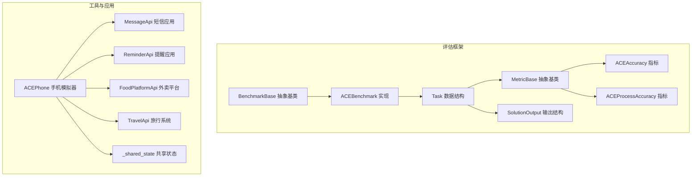
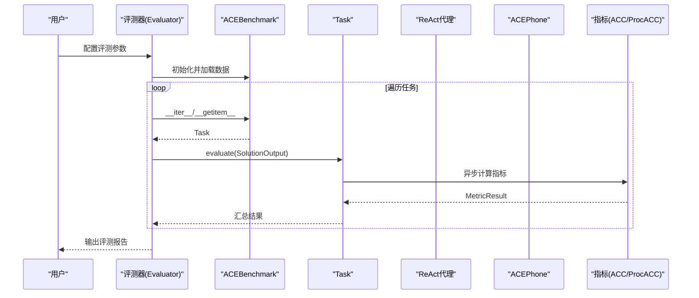
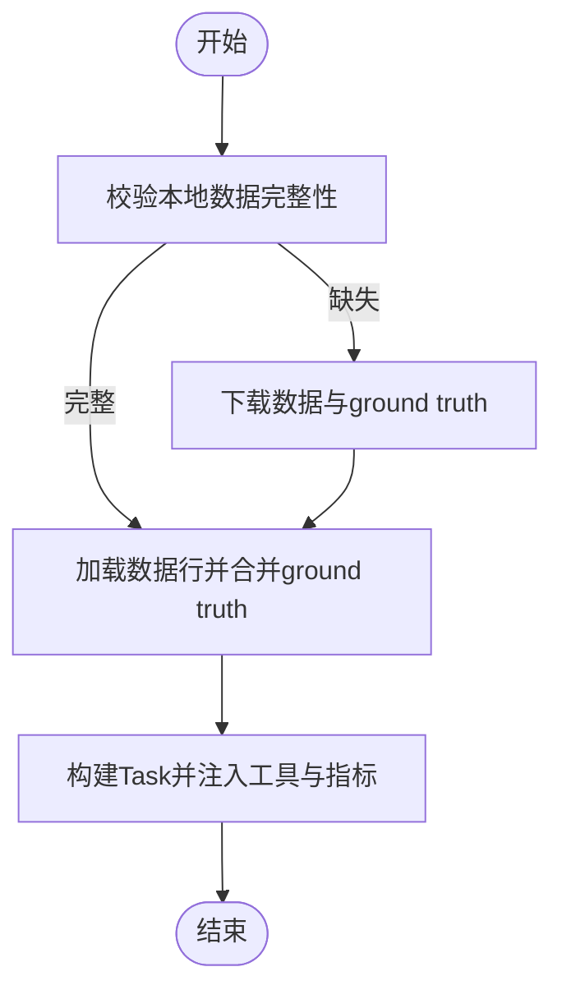
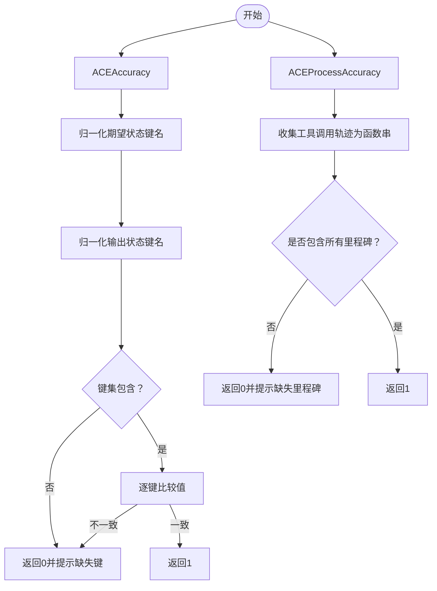
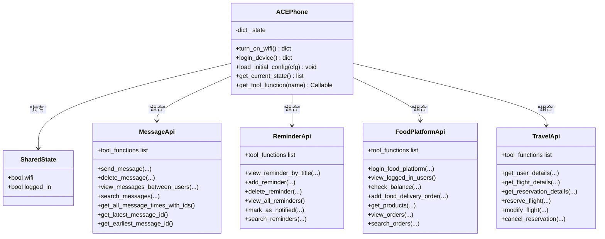
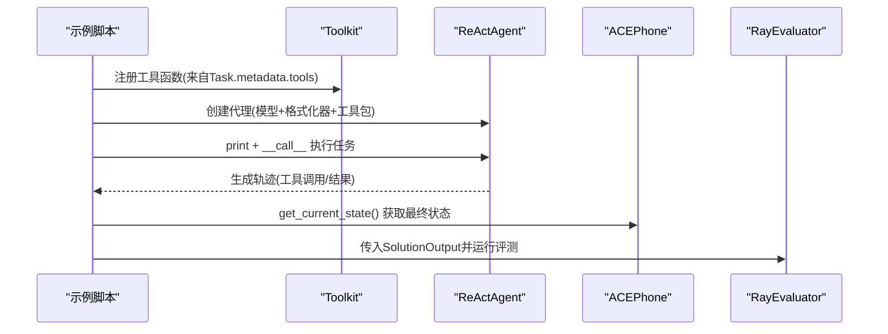
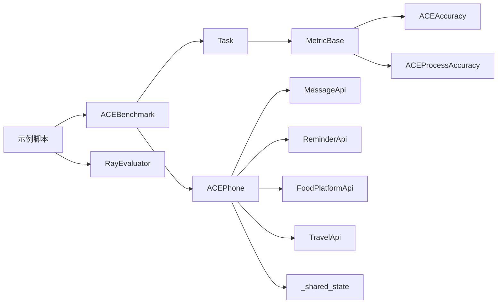

# ACE基准测试

<cite>
**本文引用的文件**
- [src/agentscope/evaluate/_ace_benchmark/__init__.py](file://src/agentscope/evaluate/_ace_benchmark/__init__.py)
- [src/agentscope/evaluate/_ace_benchmark/_ace_benchmark.py](file://src/agentscope/evaluate/_ace_benchmark/_ace_benchmark.py)
- [src/agentscope/evaluate/_ace_benchmark/_ace_metric.py](file://src/agentscope/evaluate/_ace_benchmark/_ace_metric.py)
- [src/agentscope/evaluate/_ace_benchmark/_ace_tools_zh.py](file://src/agentscope/evaluate/_ace_benchmark/_ace_tools_zh.py)
- [src/agentscope/evaluate/_ace_benchmark/_ace_tools_api/__init__.py](file://src/agentscope/evaluate/_ace_benchmark/_ace_tools_api/__init__.py)
- [src/agentscope/evaluate/_ace_benchmark/_ace_tools_api/_shared_state.py](file://src/agentscope/evaluate/_ace_benchmark/_ace_tools_api/_shared_state.py)
- [src/agentscope/evaluate/_ace_benchmark/_ace_tools_api/_food_platform_api.py](file://src/agentscope/evaluate/_ace_benchmark/_ace_tools_api/_food_platform_api.py)
- [src/agentscope/evaluate/_ace_benchmark/_ace_tools_api/_message_api.py](file://src/agentscope/evaluate/_ace_benchmark/_ace_tools_api/_message_api.py)
- [src/agentscope/evaluate/_ace_benchmark/_ace_tools_api/_reminder_api.py](file://src/agentscope/evaluate/_ace_benchmark/_ace_tools_api/_reminder_api.py)
- [src/agentscope/evaluate/_ace_benchmark/_ace_tools_api/_travel_api.py](file://src/agentscope/evaluate/_ace_benchmark/_ace_tools_api/_travel_api.py)
- [src/agentscope/evaluate/_benchmark_base.py](file://src/agentscope/evaluate/_benchmark_base.py)
- [src/agentscope/evaluate/_task.py](file://src/agentscope/evaluate/_task.py)
- [src/agentscope/evaluate/_metric_base.py](file://src/agentscope/evaluate/_metric_base.py)
- [src/agentscope/evaluate/_solution.py](file://src/agentscope/evaluate/_solution.py)
- [examples/evaluation/ace_bench/main.py](file://examples/evaluation/ace_bench/main.py)
</cite>

## 目录
1. [简介](#简介)
2. [项目结构](#项目结构)
3. [核心组件](#核心组件)
4. [架构总览](#架构总览)
5. [详细组件分析](#详细组件分析)
6. [依赖分析](#依赖分析)
7. [性能考量](#性能考量)
8. [故障排查指南](#故障排查指南)
9. [结论](#结论)
10. [附录](#附录)

## 简介
本技术文档围绕AgentScope中的ACE基准测试系统展开，系统性阐述其整体设计理念、测试框架架构、评估维度与评分标准，并深入解析各项ACE指标的实现机制（如准确率、过程准确率、电话通话评估算法），同时介绍ACE工具API的设计思路（食物平台API、消息API、提醒API、共享状态管理），解释ACE中文工具的支持机制（本地化适配、文化背景考虑、语言处理优化），并提供ACE基准的配置选项、测试示例、指标解读与性能基准对比，最后给出完整的API参考与最佳实践。

## 项目结构
ACE基准测试位于评估模块的“_ace_benchmark”子目录下，围绕以下关键层次组织：
- 基准层：BenchmarkBase抽象基类与具体实现ACEBenchmark
- 任务层：Task数据结构与评估流程
- 指标层：MetricBase抽象基类与具体指标（ACEAccuracy、ACEProcessAccuracy）
- 工具层：ACEPhone模拟手机，内含MessageApi、ReminderApi、FoodPlatformApi、TravelApi等应用
- 示例层：examples/evaluation/ace_bench/main.py展示如何运行ReAct代理执行任务并进行评估

图表来源
- [src/agentscope/evaluate/_benchmark_base.py:9-44](file://src/agentscope/evaluate/_benchmark_base.py#L9-L44)
- [src/agentscope/evaluate/_ace_benchmark/_ace_benchmark.py:19-241](file://src/agentscope/evaluate/_ace_benchmark/_ace_benchmark.py#L19-L241)
- [src/agentscope/evaluate/_task.py:11-54](file://src/agentscope/evaluate/_task.py#L11-L54)
- [src/agentscope/evaluate/_metric_base.py:47-102](file://src/agentscope/evaluate/_metric_base.py#L47-L102)
- [src/agentscope/evaluate/_ace_benchmark/_ace_metric.py:8-132](file://src/agentscope/evaluate/_ace_benchmark/_ace_metric.py#L8-L132)
- [src/agentscope/evaluate/_solution.py:16-37](file://src/agentscope/evaluate/_solution.py#L16-L37)
- [src/agentscope/evaluate/_ace_benchmark/_ace_tools_zh.py:42-123](file://src/agentscope/evaluate/_ace_benchmark/_ace_tools_zh.py#L42-L123)
- [src/agentscope/evaluate/_ace_benchmark/_ace_tools_api/_shared_state.py:5-21](file://src/agentscope/evaluate/_ace_benchmark/_ace_tools_api/_shared_state.py#L5-L21)
- [src/agentscope/evaluate/_ace_benchmark/_ace_tools_api/_message_api.py:8-341](file://src/agentscope/evaluate/_ace_benchmark/_ace_tools_api/_message_api.py#L8-L341)
- [src/agentscope/evaluate/_ace_benchmark/_ace_tools_api/_reminder_api.py:8-215](file://src/agentscope/evaluate/_ace_benchmark/_ace_tools_api/_reminder_api.py#L8-L215)
- [src/agentscope/evaluate/_ace_benchmark/_ace_tools_api/_food_platform_api.py:7-303](file://src/agentscope/evaluate/_ace_benchmark/_ace_tools_api/_food_platform_api.py#L7-L303)
- [src/agentscope/evaluate/_ace_benchmark/_ace_tools_api/_travel_api.py:13-835](file://src/agentscope/evaluate/_ace_benchmark/_ace_tools_api/_travel_api.py#L13-L835)

章节来源
- [src/agentscope/evaluate/_ace_benchmark/__init__.py:1-17](file://src/agentscope/evaluate/_ace_benchmark/__init__.py#L1-L17)
- [src/agentscope/evaluate/_ace_benchmark/_ace_benchmark.py:1-241](file://src/agentscope/evaluate/_ace_benchmark/_ace_benchmark.py#L1-L241)
- [examples/evaluation/ace_bench/main.py:1-131](file://examples/evaluation/ace_bench/main.py#L1-L131)

## 核心组件
- ACEBenchmark：继承自BenchmarkBase，负责加载与下载ACE数据集、构造Task对象、注入工具函数与指标，并支持迭代访问任务集合。
- Task：封装任务标识、输入、地面真值、评估指标、标签与元数据；提供异步评估接口evaluate。
- 指标体系：ACEAccuracy用于最终状态比对；ACEProcessAccuracy用于过程里程碑校验。
- 工具API：ACEPhone作为统一入口，聚合MessageApi、ReminderApi、FoodPlatformApi、TravelApi，并通过共享状态控制网络与登录状态。
- 解决方案输出：SolutionOutput承载成功标志、最终输出（状态序列）、轨迹（工具调用与结果）。

章节来源
- [src/agentscope/evaluate/_ace_benchmark/_ace_benchmark.py:19-241](file://src/agentscope/evaluate/_ace_benchmark/_ace_benchmark.py#L19-L241)
- [src/agentscope/evaluate/_task.py:11-54](file://src/agentscope/evaluate/_task.py#L11-L54)
- [src/agentscope/evaluate/_ace_benchmark/_ace_metric.py:8-132](file://src/agentscope/evaluate/_ace_benchmark/_ace_metric.py#L8-L132)
- [src/agentscope/evaluate/_ace_benchmark/_ace_tools_zh.py:42-123](file://src/agentscope/evaluate/_ace_benchmark/_ace_tools_zh.py#L42-L123)
- [src/agentscope/evaluate/_solution.py:16-37](file://src/agentscope/evaluate/_solution.py#L16-L37)

## 架构总览
ACE基准测试采用“数据驱动+工具模拟+指标评估”的分层架构。数据由ACEBenchmark加载并转换为Task；代理执行任务后产出SolutionOutput；Task.evaluate并发调用各指标计算MetricResult；最终由存储器持久化结果。

图表来源
- [examples/evaluation/ace_bench/main.py:86-131](file://examples/evaluation/ace_bench/main.py#L86-L131)
- [src/agentscope/evaluate/_ace_benchmark/_ace_benchmark.py:229-241](file://src/agentscope/evaluate/_ace_benchmark/_ace_benchmark.py#L229-L241)
- [src/agentscope/evaluate/_task.py:38-54](file://src/agentscope/evaluate/_task.py#L38-L54)
- [src/agentscope/evaluate/_ace_benchmark/_ace_metric.py:23-132](file://src/agentscope/evaluate/_ace_benchmark/_ace_metric.py#L23-L132)

## 详细组件分析

### ACEBenchmark：数据加载与任务构造
- 数据来源：默认从远程仓库拉取中文数据集与对应ground truth，自动校验完整性并下载缺失部分。
- 数据装载：按子目录与文件名读取JSON Lines，合并ground truth与问题描述，补充语言与类别标签。
- 任务构造：将每条样本转换为Task，注入工具函数（Message、Reminder、Food、Travel、Phone自身能力）与指标（Accuracy、ProcessAccuracy），并携带phone实例以提取最终状态。

图表来源
- [src/agentscope/evaluate/_ace_benchmark/_ace_benchmark.py:130-174](file://src/agentscope/evaluate/_ace_benchmark/_ace_benchmark.py#L130-L174)
- [src/agentscope/evaluate/_ace_benchmark/_ace_benchmark.py:87-128](file://src/agentscope/evaluate/_ace_benchmark/_ace_benchmark.py#L87-L128)
- [src/agentscope/evaluate/_ace_benchmark/_ace_benchmark.py:175-227](file://src/agentscope/evaluate/_ace_benchmark/_ace_benchmark.py#L175-L227)

章节来源
- [src/agentscope/evaluate/_ace_benchmark/_ace_benchmark.py:22-86](file://src/agentscope/evaluate/_ace_benchmark/_ace_benchmark.py#L22-L86)
- [src/agentscope/evaluate/_ace_benchmark/_ace_benchmark.py:130-174](file://src/agentscope/evaluate/_ace_benchmark/_ace_benchmark.py#L130-L174)
- [src/agentscope/evaluate/_ace_benchmark/_ace_benchmark.py:175-227](file://src/agentscope/evaluate/_ace_benchmark/_ace_benchmark.py#L175-L227)

### 指标体系：准确率与过程准确率
- ACEAccuracy：将指标期望状态与代理最终输出进行键值对比，容忍少量键名大小写差异；要求输出包含全部期望键。
- ACEProcessAccuracy：将工具调用轨迹规范化为函数调用字符串序列，校验是否包含所有里程碑步骤；任一缺失即判定失败。

图表来源
- [src/agentscope/evaluate/_ace_benchmark/_ace_metric.py:70-132](file://src/agentscope/evaluate/_ace_benchmark/_ace_metric.py#L70-L132)
- [src/agentscope/evaluate/_ace_benchmark/_ace_metric.py:8-68](file://src/agentscope/evaluate/_ace_benchmark/_ace_metric.py#L8-L68)

章节来源
- [src/agentscope/evaluate/_ace_benchmark/_ace_metric.py:8-132](file://src/agentscope/evaluate/_ace_benchmark/_ace_metric.py#L8-L132)

### ACEPhone与工具API：中文场景适配
- ACEPhone：统一管理共享状态（WiFi、登录），聚合各类应用API，提供工具函数映射与包装，确保返回标准化的ToolResponse。
- MessageApi：短信应用，支持发送、删除、查询、检索、时间索引等，内置典型中文场景对话与联系人。
- ReminderApi：提醒应用，支持新增、删除、查询、搜索、标记通知等，包含中文任务描述与时间格式。
- FoodPlatformApi：外卖平台，内置中文用户、商家与菜单，支持登录、余额查询、下单、订单查询与搜索。
- TravelApi：旅行系统，支持用户认证、航班查询、预订、修改、取消与费用计算，包含中文城市名与会员等级。
- 共享状态：SharedState通过属性暴露WiFi与登录状态，保障各应用在受限环境下的行为一致性。

图表来源
- [src/agentscope/evaluate/_ace_benchmark/_ace_tools_zh.py:42-123](file://src/agentscope/evaluate/_ace_benchmark/_ace_tools_zh.py#L42-L123)
- [src/agentscope/evaluate/_ace_benchmark/_ace_tools_api/_shared_state.py:5-21](file://src/agentscope/evaluate/_ace_benchmark/_ace_tools_api/_shared_state.py#L5-L21)
- [src/agentscope/evaluate/_ace_benchmark/_ace_tools_api/_message_api.py:8-341](file://src/agentscope/evaluate/_ace_benchmark/_ace_tools_api/_message_api.py#L8-L341)
- [src/agentscope/evaluate/_ace_benchmark/_ace_tools_api/_reminder_api.py:8-215](file://src/agentscope/evaluate/_ace_benchmark/_ace_tools_api/_reminder_api.py#L8-L215)
- [src/agentscope/evaluate/_ace_benchmark/_ace_tools_api/_food_platform_api.py:7-303](file://src/agentscope/evaluate/_ace_benchmark/_ace_tools_api/_food_platform_api.py#L7-L303)
- [src/agentscope/evaluate/_ace_benchmark/_ace_tools_api/_travel_api.py:13-835](file://src/agentscope/evaluate/_ace_benchmark/_ace_tools_api/_travel_api.py#L13-L835)

章节来源
- [src/agentscope/evaluate/_ace_benchmark/_ace_tools_zh.py:42-123](file://src/agentscope/evaluate/_ace_benchmark/_ace_tools_zh.py#L42-L123)
- [src/agentscope/evaluate/_ace_benchmark/_ace_tools_api/_message_api.py:119-341](file://src/agentscope/evaluate/_ace_benchmark/_ace_tools_api/_message_api.py#L119-L341)
- [src/agentscope/evaluate/_ace_benchmark/_ace_tools_api/_reminder_api.py:89-215](file://src/agentscope/evaluate/_ace_benchmark/_ace_tools_api/_reminder_api.py#L89-L215)
- [src/agentscope/evaluate/_ace_benchmark/_ace_tools_api/_food_platform_api.py:124-303](file://src/agentscope/evaluate/_ace_benchmark/_ace_tools_api/_food_platform_api.py#L124-L303)
- [src/agentscope/evaluate/_ace_benchmark/_ace_tools_api/_travel_api.py:239-835](file://src/agentscope/evaluate/_ace_benchmark/_ace_tools_api/_travel_api.py#L239-L835)

### 评测流程与示例
- 示例脚本展示了如何：
  - 注册工具函数（来自Task.metadata["tools"]）
  - 创建ReAct代理并执行任务
  - 从代理记忆中提取工具调用轨迹
  - 通过ACEPhone获取最终状态
  - 封装SolutionOutput并交由Task.evaluate计算指标
  - 使用RayEvaluator并行执行评测，结果保存至文件存储

图表来源
- [examples/evaluation/ace_bench/main.py:23-84](file://examples/evaluation/ace_bench/main.py#L23-L84)
- [examples/evaluation/ace_bench/main.py:86-131](file://examples/evaluation/ace_bench/main.py#L86-L131)

章节来源
- [examples/evaluation/ace_bench/main.py:1-131](file://examples/evaluation/ace_bench/main.py#L1-L131)

## 依赖分析
- 组件耦合与内聚
  - ACEBenchmark与Task、MetricBase高度内聚，职责清晰：数据加载、任务构造、指标评估。
  - ACEPhone与各应用API松耦合，通过统一工具函数映射与共享状态解耦。
  - 指标与SolutionOutput解耦，便于扩展不同评估维度。
- 外部依赖
  - 数据下载依赖requests与tqdm；示例脚本依赖RayEvaluator进行分布式评测。
- 潜在循环依赖
  - 当前模块间无循环导入迹象，工具API均通过共享状态间接交互。

图表来源
- [src/agentscope/evaluate/_ace_benchmark/_ace_benchmark.py:13-21](file://src/agentscope/evaluate/_ace_benchmark/_ace_benchmark.py#L13-L21)
- [src/agentscope/evaluate/_ace_benchmark/_ace_metric.py:4-6](file://src/agentscope/evaluate/_ace_benchmark/_ace_metric.py#L4-L6)
- [src/agentscope/evaluate/_ace_benchmark/_ace_tools_zh.py:6-14](file://src/agentscope/evaluate/_ace_benchmark/_ace_tools_zh.py#L6-L14)
- [examples/evaluation/ace_bench/main.py:12-20](file://examples/evaluation/ace_bench/main.py#L12-L20)

章节来源
- [src/agentscope/evaluate/_ace_benchmark/_ace_benchmark.py:1-241](file://src/agentscope/evaluate/_ace_benchmark/_ace_benchmark.py#L1-L241)
- [src/agentscope/evaluate/_ace_benchmark/_ace_metric.py:1-132](file://src/agentscope/evaluate/_ace_benchmark/_ace_metric.py#L1-L132)
- [src/agentscope/evaluate/_ace_benchmark/_ace_tools_zh.py:1-123](file://src/agentscope/evaluate/_ace_benchmark/_ace_tools_zh.py#L1-L123)
- [examples/evaluation/ace_bench/main.py:1-131](file://examples/evaluation/ace_bench/main.py#L1-L131)

## 性能考量
- 并行评测：示例脚本使用RayEvaluator并行执行多个任务，显著缩短评测时长。
- I/O优化：数据下载与存储采用流式写入与文件存储，避免内存峰值过高。
- 指标计算：指标为纯逻辑判断，复杂度低；建议在代理侧减少冗余工具调用以降低轨迹长度。
- 状态一致性：共享状态统一管理网络与登录状态，避免重复初始化带来的开销。

## 故障排查指南
- 数据下载失败
  - 现象：下载URL不可达或返回非2xx。
  - 处理：检查网络与代理设置，确认URL可达；可手动下载后放置至data_dir。
- 任务构造异常
  - 现象：工具schema格式不兼容或函数名缺失。
  - 处理：核对function字段与tool_functions映射；确保schema中类型字段统一为“object”而非“dict”。
- 指标计算报错
  - 现象：键缺失或值不一致。
  - 处理：对照ground truth与输出，修正键名大小写与值；必要时调整代理策略。
- 工具调用失败
  - 现象：WiFi未开启或未登录导致功能受限。
  - 处理：先调用turn_on_wifi与login_device，再执行业务工具。

章节来源
- [src/agentscope/evaluate/_ace_benchmark/_ace_benchmark.py:149-174](file://src/agentscope/evaluate/_ace_benchmark/_ace_benchmark.py#L149-L174)
- [src/agentscope/evaluate/_ace_benchmark/_ace_benchmark.py:188-206](file://src/agentscope/evaluate/_ace_benchmark/_ace_benchmark.py#L188-L206)
- [src/agentscope/evaluate/_ace_benchmark/_ace_tools_zh.py:69-88](file://src/agentscope/evaluate/_ace_benchmark/_ace_tools_zh.py#L69-L88)
- [src/agentscope/evaluate/_ace_benchmark/_ace_tools_api/_message_api.py:135-145](file://src/agentscope/evaluate/_ace_benchmark/_ace_tools_api/_message_api.py#L135-L145)
- [src/agentscope/evaluate/_ace_benchmark/_ace_tools_api/_food_platform_api.py:137-150](file://src/agentscope/evaluate/_ace_benchmark/_ace_tools_api/_food_platform_api.py#L137-L150)

## 结论
ACE基准测试系统通过清晰的数据-任务-指标-工具分层架构，实现了对AI代理在多应用、多步骤中文场景下的综合评估。其指标设计兼顾最终状态与过程里程碑，工具API贴近真实中文使用情境，示例脚本提供了可复用的评测流水线。建议在实际部署中结合RayEvaluator进行大规模并行评测，并针对代理策略与工具调用路径持续优化以提升评测效率与稳定性。

## 附录

### 配置选项与使用要点
- 数据目录与结果目录：通过命令行参数指定，评测器将自动下载并缓存数据。
- 评测器参数：n_workers控制并行工作进程数；n_repeat控制重复次数。
- 代理配置：示例脚本使用ReActAgent与DashScope模型，可替换为其他模型与格式化器。
- 工具注册：示例脚本从Task.metadata["tools"]批量注册工具函数，确保Schema与函数名一致。

章节来源
- [examples/evaluation/ace_bench/main.py:86-131](file://examples/evaluation/ace_bench/main.py#L86-L131)

### 指标解读与示例
- Accuracy（准确率）：最终状态与期望状态逐键比对，键名大小写容差；任一键缺失或值不一致即失败。
- ProcessAccuracy（过程准确率）：将工具调用轨迹规范化为函数串，校验是否包含所有里程碑；缺一不可。
- 示例流程：示例脚本执行任务后，从代理记忆中提取轨迹，调用ACEPhone获取最终状态，封装SolutionOutput并交由Task.evaluate计算指标。

章节来源
- [src/agentscope/evaluate/_ace_benchmark/_ace_metric.py:70-132](file://src/agentscope/evaluate/_ace_benchmark/_ace_metric.py#L70-L132)
- [src/agentscope/evaluate/_ace_benchmark/_ace_metric.py:8-68](file://src/agentscope/evaluate/_ace_benchmark/_ace_metric.py#L8-L68)
- [examples/evaluation/ace_bench/main.py:23-84](file://examples/evaluation/ace_bench/main.py#L23-L84)

### API参考（节选）
- ACEBenchmark
  - 方法：__iter__、__getitem__、__len__、_load_data、_verify_data、_download_data、_data_to_task
- Task
  - 字段：id、input、ground_truth、metrics、tags、metadata
  - 方法：evaluate(solution)
- MetricBase/MetricResult
  - MetricType：NUMERICAL
  - MetricResult：name、result、created_at、message、metadata
- ACEAccuracy
  - 参数：state（期望状态列表）
  - 方法：__call__(solution) -> MetricResult
- ACEProcessAccuracy
  - 参数：mile_stone（里程碑列表）
  - 方法：__call__(solution) -> MetricResult
- ACEPhone
  - 方法：turn_on_wifi()、login_device()、load_initial_config(cfg)、get_current_state()、get_tool_function(name)
- MessageApi
  - 工具函数：send_message、delete_message、view_messages_between_users、search_messages、get_all_message_times_with_ids、get_latest_message_id、get_earliest_message_id
- ReminderApi
  - 工具函数：view_reminder_by_title、add_reminder、delete_reminder、view_all_reminders、mark_as_notified、search_reminders
- FoodPlatformApi
  - 工具函数：login_food_platform、view_logged_in_users、check_balance、add_food_delivery_order、get_products、view_orders、search_orders
- TravelApi
  - 工具函数：get_user_details、get_flight_details、get_reservation_details、reserve_flight、modify_flight、cancel_reservation

章节来源
- [src/agentscope/evaluate/_ace_benchmark/_ace_benchmark.py:19-241](file://src/agentscope/evaluate/_ace_benchmark/_ace_benchmark.py#L19-L241)
- [src/agentscope/evaluate/_task.py:11-54](file://src/agentscope/evaluate/_task.py#L11-L54)
- [src/agentscope/evaluate/_metric_base.py:47-102](file://src/agentscope/evaluate/_metric_base.py#L47-L102)
- [src/agentscope/evaluate/_ace_benchmark/_ace_metric.py:8-132](file://src/agentscope/evaluate/_ace_benchmark/_ace_metric.py#L8-L132)
- [src/agentscope/evaluate/_ace_benchmark/_ace_tools_zh.py:42-123](file://src/agentscope/evaluate/_ace_benchmark/_ace_tools_zh.py#L42-L123)
- [src/agentscope/evaluate/_ace_benchmark/_ace_tools_api/_message_api.py:119-341](file://src/agentscope/evaluate/_ace_benchmark/_ace_tools_api/_message_api.py#L119-L341)
- [src/agentscope/evaluate/_ace_benchmark/_ace_tools_api/_reminder_api.py:89-215](file://src/agentscope/evaluate/_ace_benchmark/_ace_tools_api/_reminder_api.py#L89-L215)
- [src/agentscope/evaluate/_ace_benchmark/_ace_tools_api/_food_platform_api.py:124-303](file://src/agentscope/evaluate/_ace_benchmark/_ace_tools_api/_food_platform_api.py#L124-L303)
- [src/agentscope/evaluate/_ace_benchmark/_ace_tools_api/_travel_api.py:239-835](file://src/agentscope/evaluate/_ace_benchmark/_ace_tools_api/_travel_api.py#L239-L835)