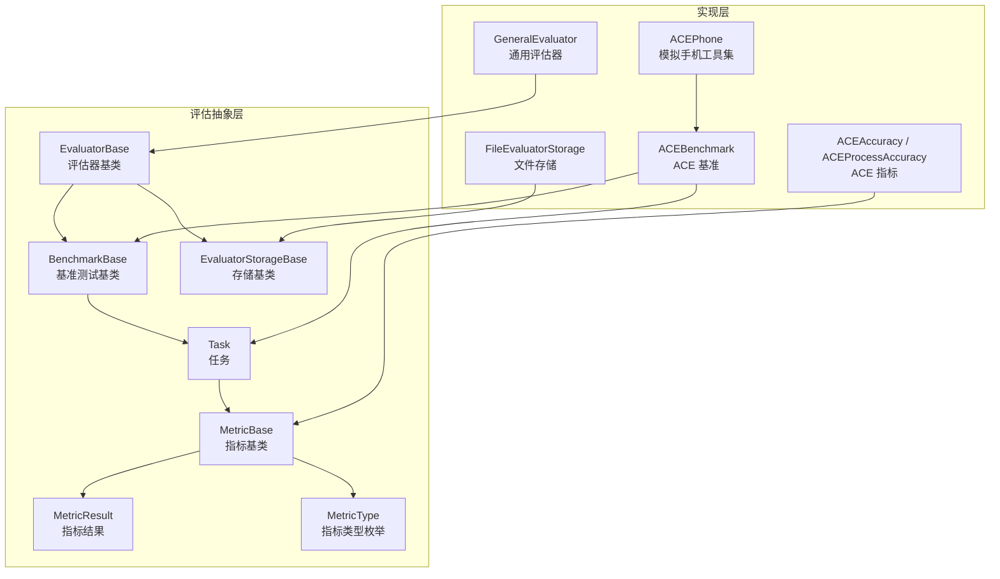
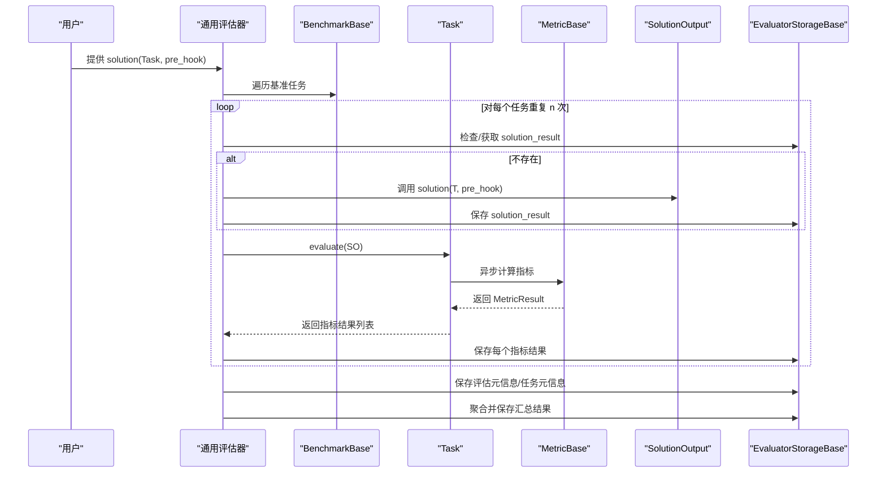
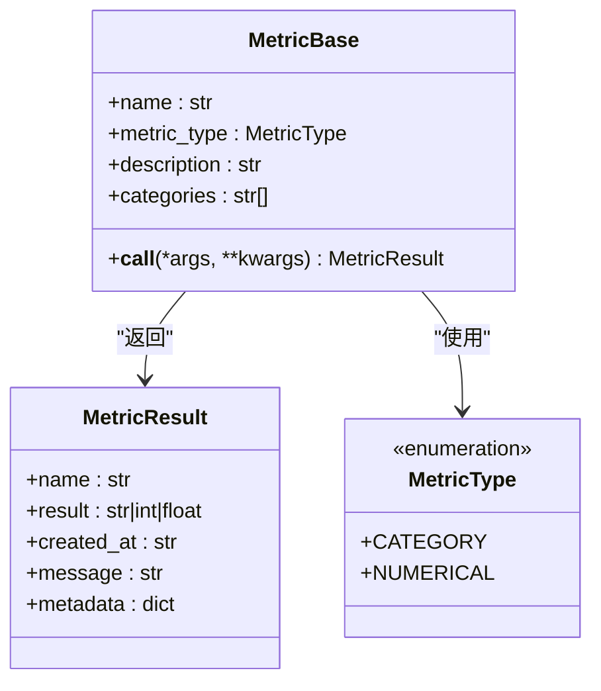
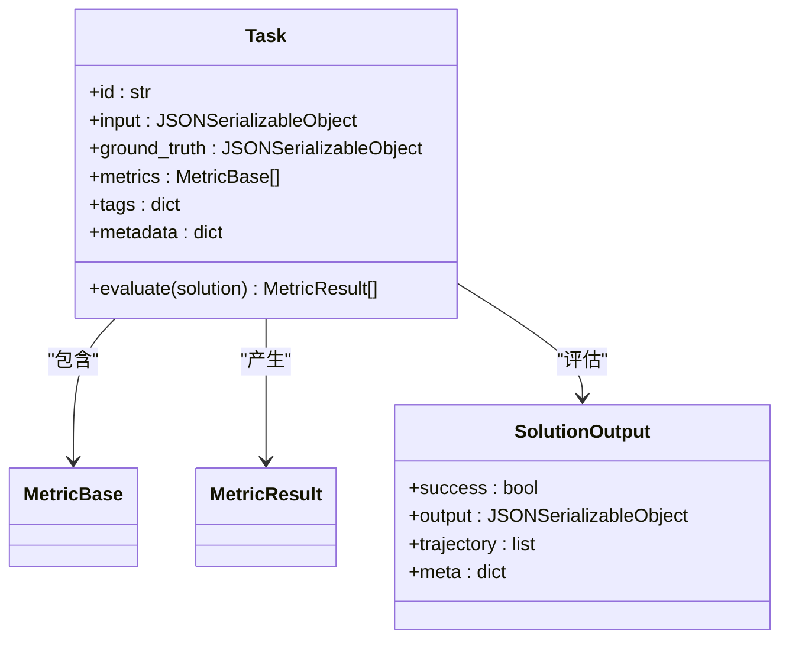
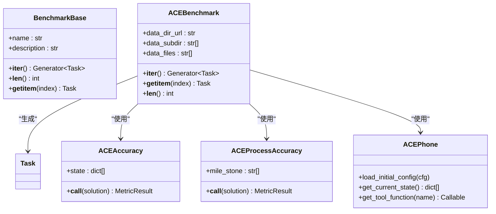
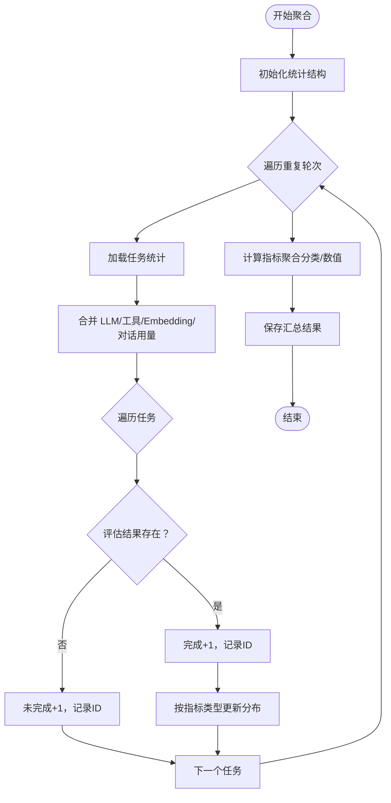
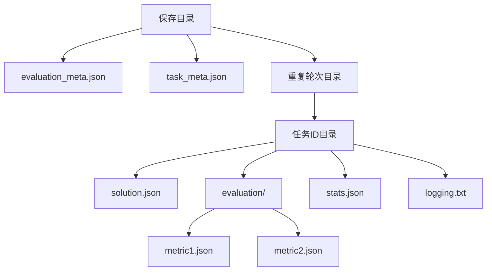
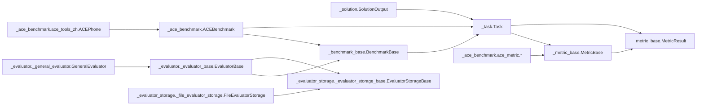

# 指标系统

<cite>
**本文引用的文件**
- [src/agentscope/evaluate/__init__.py](file://src/agentscope/evaluate/__init__.py)
- [src/agentscope/evaluate/_metric_base.py](file://src/agentscope/evaluate/_metric_base.py)
- [src/agentscope/evaluate/_task.py](file://src/agentscope/evaluate/_task.py)
- [src/agentscope/evaluate/_solution.py](file://src/agentscope/evaluate/_solution.py)
- [src/agentscope/evaluate/_benchmark_base.py](file://src/agentscope/evaluate/_benchmark_base.py)
- [src/agentscope/evaluate/_ace_benchmark/ace_benchmark.py](file://src/agentscope/evaluate/_ace_benchmark/ace_benchmark.py)
- [src/agentscope/evaluate/_ace_benchmark/ace_metric.py](file://src/agentscope/evaluate/_ace_benchmark/ace_metric.py)
- [src/agentscope/evaluate/_ace_benchmark/ace_tools_zh.py](file://src/agentscope/evaluate/_ace_benchmark/ace_tools_zh.py)
- [src/agentscope/evaluate/_evaluator/_evaluator_base.py](file://src/agentscope/evaluate/_evaluator/_evaluator_base.py)
- [src/agentscope/evaluate/_evaluator/_general_evaluator.py](file://src/agentscope/evaluate/_evaluator/_general_evaluator.py)
- [src/agentscope/evaluate/_evaluator_storage/_evaluator_storage_base.py](file://src/agentscope/evaluate/_evaluator_storage/_evaluator_storage_base.py)
- [src/agentscope/evaluate/_evaluator_storage/_file_evaluator_storage.py](file://src/agentscope/evaluate/_evaluator_storage/_file_evaluator_storage.py)
</cite>

## 目录
1. [简介](#简介)
2. [项目结构](#项目结构)
3. [核心组件](#核心组件)
4. [架构总览](#架构总览)
5. [详细组件分析](#详细组件分析)
6. [依赖关系分析](#依赖关系分析)
7. [性能考量](#性能考量)
8. [故障排查指南](#故障排查指南)
9. [结论](#结论)
10. [附录：API 参考与最佳实践](#附录api-参考与最佳实践)

## 简介
本文件面向 AgentScope 的“指标系统”，系统性梳理从指标抽象、结果表示、类型系统，到基准测试框架、评估流程、结果聚合与存储的完整设计与实现。文档同时给出任务与解决方案的数据模型说明、扩展机制（自定义指标、指标组合、结果聚合）、使用示例与性能分析建议，并提供可直接定位源码位置的“章节来源”和“图表来源”。

## 项目结构
评估模块位于 src/agentscope/evaluate 下，采用“按职责分层”的组织方式：
- 抽象层：指标基类、任务基类、基准测试基类、评估器基类、存储基类
- 实现层：通用评估器、文件存储、ACE 基准与指标
- 工具与数据模型：SolutionOutput、DictMixin、JSON 可序列化类型等

图表来源
- [src/agentscope/evaluate/_metric_base.py:47-101](file://src/agentscope/evaluate/_metric_base.py#L47-L101)
- [src/agentscope/evaluate/_task.py:11-53](file://src/agentscope/evaluate/_task.py#L11-L53)
- [src/agentscope/evaluate/_benchmark_base.py:9-43](file://src/agentscope/evaluate/_benchmark_base.py#L9-L43)
- [src/agentscope/evaluate/_evaluator/_evaluator_base.py:18-63](file://src/agentscope/evaluate/_evaluator/_evaluator_base.py#L18-L63)
- [src/agentscope/evaluate/_evaluator_storage/_evaluator_storage_base.py:13-254](file://src/agentscope/evaluate/_evaluator_storage/_evaluator_storage_base.py#L13-L254)
- [src/agentscope/evaluate/_evaluator/_general_evaluator.py:14-178](file://src/agentscope/evaluate/_evaluator/_general_evaluator.py#L14-L178)
- [src/agentscope/evaluate/_evaluator_storage/_file_evaluator_storage.py:16-460](file://src/agentscope/evaluate/_evaluator_storage/_file_evaluator_storage.py#L16-L460)
- [src/agentscope/evaluate/_ace_benchmark/ace_benchmark.py:19-240](file://src/agentscope/evaluate/_ace_benchmark/ace_benchmark.py#L19-L240)
- [src/agentscope/evaluate/_ace_benchmark/ace_metric.py:8-131](file://src/agentscope/evaluate/_ace_benchmark/ace_metric.py#L8-L131)
- [src/agentscope/evaluate/_ace_benchmark/ace_tools_zh.py:42-122](file://src/agentscope/evaluate/_ace_benchmark/ace_tools_zh.py#L42-L122)

章节来源
- [src/agentscope/evaluate/__init__.py:1-44](file://src/agentscope/evaluate/__init__.py#L1-L44)

## 核心组件
- 指标抽象与结果
  - 指标基类：定义名称、类型、描述、候选类别；统一异步调用接口返回指标结果
  - 指标结果：包含指标名、数值/分类结果、时间戳、消息与元信息
  - 指标类型：分类（category）与数值（numerical）
- 任务与解决方案
  - 任务：包含输入、真实标签、指标列表、标签与元信息；支持对给定解决方案批量评估
  - 解决方案：包含成功标志、最终输出、轨迹（工具调用与结果、文本块）、元信息
- 基准测试框架
  - 基类：定义迭代、长度、索引访问等协议
  - ACE 基准：加载数据、构造任务、注入指标与工具
- 评估器与存储
  - 评估器基类：定义运行协议、保存元信息、聚合统计
  - 通用评估器：顺序执行、带追踪上下文、结果持久化
  - 存储基类：统一存取接口；文件存储实现具体文件组织与读写

章节来源
- [src/agentscope/evaluate/_metric_base.py:14-101](file://src/agentscope/evaluate/_metric_base.py#L14-L101)
- [src/agentscope/evaluate/_task.py:11-53](file://src/agentscope/evaluate/_task.py#L11-L53)
- [src/agentscope/evaluate/_solution.py:16-36](file://src/agentscope/evaluate/_solution.py#L16-L36)
- [src/agentscope/evaluate/_benchmark_base.py:9-43](file://src/agentscope/evaluate/_benchmark_base.py#L9-L43)
- [src/agentscope/evaluate/_ace_benchmark/ace_benchmark.py:19-240](file://src/agentscope/evaluate/_ace_benchmark/ace_benchmark.py#L19-L240)
- [src/agentscope/evaluate/_evaluator/_evaluator_base.py:18-304](file://src/agentscope/evaluate/_evaluator/_evaluator_base.py#L18-L304)
- [src/agentscope/evaluate/_evaluator/_general_evaluator.py:14-178](file://src/agentscope/evaluate/_evaluator/_general_evaluator.py#L14-L178)
- [src/agentscope/evaluate/_evaluator_storage/_evaluator_storage_base.py:13-254](file://src/agentscope/evaluate/_evaluator_storage/_evaluator_storage_base.py#L13-L254)
- [src/agentscope/evaluate/_evaluator_storage/_file_evaluator_storage.py:16-460](file://src/agentscope/evaluate/_evaluator_storage/_file_evaluator_storage.py#L16-L460)

## 架构总览
下图展示从“任务—指标—解决方案—评估器—存储—聚合”的端到端流程。

图表来源
- [src/agentscope/evaluate/_evaluator/_general_evaluator.py:43-178](file://src/agentscope/evaluate/_evaluator/_general_evaluator.py#L43-L178)
- [src/agentscope/evaluate/_task.py:38-53](file://src/agentscope/evaluate/_task.py#L38-L53)
- [src/agentscope/evaluate/_evaluator/_evaluator_base.py:65-304](file://src/agentscope/evaluate/_evaluator/_evaluator_base.py#L65-L304)
- [src/agentscope/evaluate/_evaluator_storage/_evaluator_storage_base.py:17-254](file://src/agentscope/evaluate/_evaluator_storage/_evaluator_storage_base.py#L17-L254)

## 详细组件分析

### 指标基类与结果表示
- 设计要点
  - 指标基类通过异步调用接口统一评估入口，便于在不同评估器中复用
  - 结果对象包含时间戳、可选消息与元信息，便于审计与溯源
  - 类型系统区分分类与数值两类，驱动后续聚合策略
- 数据结构与复杂度
  - 指标结果为轻量数据类，序列化开销低
  - 分类与数值两类结果的聚合复杂度均为 O(N)，N 为任务数
- 错误处理
  - 分类指标必须提供候选类别，否则初始化即抛出异常
  - 数值指标以标量作为结果，便于统计均值/最值

图表来源
- [src/agentscope/evaluate/_metric_base.py:47-101](file://src/agentscope/evaluate/_metric_base.py#L47-L101)

章节来源
- [src/agentscope/evaluate/_metric_base.py:14-101](file://src/agentscope/evaluate/_metric_base.py#L14-L101)

### 任务与解决方案数据模型
- 任务
  - 输入、真实标签、指标集合、标签与元信息
  - 支持异步评估：遍历指标并收集结果
- 解决方案
  - 成功标志、最终输出、轨迹（工具调用/结果/文本块）
  - 元信息用于扩展统计或调试

图表来源
- [src/agentscope/evaluate/_task.py:11-53](file://src/agentscope/evaluate/_task.py#L11-L53)
- [src/agentscope/evaluate/_solution.py:16-36](file://src/agentscope/evaluate/_solution.py#L16-L36)

章节来源
- [src/agentscope/evaluate/_task.py:11-53](file://src/agentscope/evaluate/_task.py#L11-L53)
- [src/agentscope/evaluate/_solution.py:16-36](file://src/agentscope/evaluate/_solution.py#L16-L36)

### 基准测试基类与 ACE 基准
- 基准测试基类
  - 定义迭代、长度与索引协议，确保评估器可统一消费
- ACE 基准
  - 自动下载/校验数据，加载多文件并合并真实标签与里程碑
  - 将每条数据转换为 Task，注入指标（准确率、过程准确率）与工具函数
  - 使用模拟手机工具集（Message/Reminder/FoodPlatform/Travel）支撑轨迹与状态判定

图表来源
- [src/agentscope/evaluate/_benchmark_base.py:9-43](file://src/agentscope/evaluate/_benchmark_base.py#L9-L43)
- [src/agentscope/evaluate/_ace_benchmark/ace_benchmark.py:19-240](file://src/agentscope/evaluate/_ace_benchmark/ace_benchmark.py#L19-L240)
- [src/agentscope/evaluate/_ace_benchmark/ace_metric.py:8-131](file://src/agentscope/evaluate/_ace_benchmark/ace_metric.py#L8-L131)
- [src/agentscope/evaluate/_ace_benchmark/ace_tools_zh.py:42-122](file://src/agentscope/evaluate/_ace_benchmark/ace_tools_zh.py#L42-L122)

章节来源
- [src/agentscope/evaluate/_benchmark_base.py:9-43](file://src/agentscope/evaluate/_benchmark_base.py#L9-L43)
- [src/agentscope/evaluate/_ace_benchmark/ace_benchmark.py:19-240](file://src/agentscope/evaluate/_ace_benchmark/ace_benchmark.py#L19-L240)
- [src/agentscope/evaluate/_ace_benchmark/ace_metric.py:8-131](file://src/agentscope/evaluate/_ace_benchmark/ace_metric.py#L8-L131)
- [src/agentscope/evaluate/_ace_benchmark/ace_tools_zh.py:42-122](file://src/agentscope/evaluate/_ace_benchmark/ace_tools_zh.py#L42-L122)

### 评估器与结果聚合
- 评估器基类
  - 统一运行协议，保存评估/任务元信息
  - 聚合逻辑：按重复轮次统计完成/未完成任务、指标分布与聚合（分类分布率、数值均值/最值/最小值）
- 通用评估器
  - 顺序执行，支持 OpenTelemetry 追踪上下文
  - 对每个任务/重复轮次保存统计信息，最后调用聚合

图表来源
- [src/agentscope/evaluate/_evaluator/_evaluator_base.py:96-304](file://src/agentscope/evaluate/_evaluator/_evaluator_base.py#L96-L304)

章节来源
- [src/agentscope/evaluate/_evaluator/_evaluator_base.py:18-304](file://src/agentscope/evaluate/_evaluator/_evaluator_base.py#L18-L304)
- [src/agentscope/evaluate/_evaluator/_general_evaluator.py:14-178](file://src/agentscope/evaluate/_evaluator/_general_evaluator.py#L14-L178)

### 存储层与文件组织
- 存储基类
  - 统一接口：保存/获取解决方案、评估结果、聚合结果、元信息；查询存在性；获取代理打印钩子
- 文件存储
  - 目录结构清晰：评估元信息、任务元信息、各重复轮次下各任务的 solution.json、evaluation/{metric}.json、stats.json、agent 打印日志
  - 支持断点续跑：通过存在性检查避免重复计算

图表来源
- [src/agentscope/evaluate/_evaluator_storage/_file_evaluator_storage.py:16-460](file://src/agentscope/evaluate/_evaluator_storage/_file_evaluator_storage.py#L16-L460)

章节来源
- [src/agentscope/evaluate/_evaluator_storage/_evaluator_storage_base.py:13-254](file://src/agentscope/evaluate/_evaluator_storage/_evaluator_storage_base.py#L13-L254)
- [src/agentscope/evaluate/_evaluator_storage/_file_evaluator_storage.py:16-460](file://src/agentscope/evaluate/_evaluator_storage/_file_evaluator_storage.py#L16-L460)

## 依赖关系分析
- 组件耦合
  - Task 依赖 MetricBase/MetricResult；SolutionOutput 作为输入被指标消费
  - EvaluatorBase 依赖 BenchmarkBase、EvaluatorStorageBase；具体实现（如 GeneralEvaluator）依赖 Task/指标
  - ACEBenchmark 依赖 Task、指标与工具集；指标依赖 SolutionOutput
- 外部依赖
  - 文件存储基于标准库 json 与 os
  - 聚合阶段使用 collections.defaultdict 与字典归并
- 循环依赖
  - 无循环导入；模块间单向依赖（抽象层 → 实现层）

图表来源
- [src/agentscope/evaluate/_metric_base.py:47-101](file://src/agentscope/evaluate/_metric_base.py#L47-L101)
- [src/agentscope/evaluate/_task.py:11-53](file://src/agentscope/evaluate/_task.py#L11-L53)
- [src/agentscope/evaluate/_solution.py:16-36](file://src/agentscope/evaluate/_solution.py#L16-L36)
- [src/agentscope/evaluate/_benchmark_base.py:9-43](file://src/agentscope/evaluate/_benchmark_base.py#L9-L43)
- [src/agentscope/evaluate/_ace_benchmark/ace_benchmark.py:19-240](file://src/agentscope/evaluate/_ace_benchmark/ace_benchmark.py#L19-L240)
- [src/agentscope/evaluate/_ace_benchmark/ace_metric.py:8-131](file://src/agentscope/evaluate/_ace_benchmark/ace_metric.py#L8-L131)
- [src/agentscope/evaluate/_ace_benchmark/ace_tools_zh.py:42-122](file://src/agentscope/evaluate/_ace_benchmark/ace_tools_zh.py#L42-L122)
- [src/agentscope/evaluate/_evaluator/_evaluator_base.py:18-63](file://src/agentscope/evaluate/_evaluator/_evaluator_base.py#L18-L63)
- [src/agentscope/evaluate/_evaluator/_general_evaluator.py:14-178](file://src/agentscope/evaluate/_evaluator/_general_evaluator.py#L14-L178)
- [src/agentscope/evaluate/_evaluator_storage/_evaluator_storage_base.py:13-254](file://src/agentscope/evaluate/_evaluator_storage/_evaluator_storage_base.py#L13-L254)
- [src/agentscope/evaluate/_evaluator_storage/_file_evaluator_storage.py:16-460](file://src/agentscope/evaluate/_evaluator_storage/_file_evaluator_storage.py#L16-L460)

章节来源
- [src/agentscope/evaluate/_evaluator/_evaluator_base.py:18-304](file://src/agentscope/evaluate/_evaluator/_evaluator_base.py#L18-L304)
- [src/agentscope/evaluate/_evaluator/_general_evaluator.py:14-178](file://src/agentscope/evaluate/_evaluator/_general_evaluator.py#L14-L178)
- [src/agentscope/evaluate/_evaluator_storage/_evaluator_storage_base.py:13-254](file://src/agentscope/evaluate/_evaluator_storage/_evaluator_storage_base.py#L13-L254)
- [src/agentscope/evaluate/_evaluator_storage/_file_evaluator_storage.py:16-460](file://src/agentscope/evaluate/_evaluator_storage/_file_evaluator_storage.py#L16-L460)

## 性能考量
- 指标计算
  - 分类指标：O(1) 匹配，多次调用开销主要在轨迹解析
  - 数值指标：O(K) 键集合比较，K 为状态键数量
- 评估器聚合
  - 时间复杂度 O(R×T×M)，R 为重复次数，T 为任务数，M 为指标数
  - 分类聚合为分布计数，数值聚合为均值/最值统计
- I/O 与断点续跑
  - 文件存储通过存在性检查避免重复计算，适合大规模分布式重试
- 并行化建议
  - 当前通用评估器为顺序执行；若需并行，可参考 Ray 评估器（同模块中存在）进行改造

[本节为通用指导，无需列出章节来源]

## 故障排查指南
- 初始化错误
  - 分类指标未提供候选类别将触发异常，检查指标构造参数
- 数据缺失
  - 数值指标要求输出为列表且键集合包含真实状态键，否则抛出异常；检查解决方案输出结构
- 文件读写
  - 读取失败会抛出 JSON 解析异常；确认文件完整性与编码
- 评估未完成
  - 若某任务/指标结果不存在，聚合时将计入未完成；检查存储实现与路径权限

章节来源
- [src/agentscope/evaluate/_metric_base.py:88-93](file://src/agentscope/evaluate/_metric_base.py#L88-L93)
- [src/agentscope/evaluate/_ace_benchmark/ace_metric.py:90-114](file://src/agentscope/evaluate/_ace_benchmark/ace_metric.py#L90-L114)
- [src/agentscope/evaluate/_evaluator_storage/_file_evaluator_storage.py:194-202](file://src/agentscope/evaluate/_evaluator_storage/_file_evaluator_storage.py#L194-L202)

## 结论
AgentScope 指标系统以清晰的抽象层与可扩展的实现层构建了从任务、指标、解决方案到评估与存储的完整闭环。其类型系统与聚合策略使得分类与数值指标均可获得一致的统计口径；文件存储提供了可靠的断点续跑能力。通过 ACE 基准与指标的具体实现，系统展示了真实场景下的评估范式，可作为扩展自定义指标与任务的参考模板。

[本节为总结性内容，无需列出章节来源]

## 附录：API 参考与最佳实践

### API 参考（按模块）
- 指标与结果
  - MetricBase：名称、类型、描述、候选类别；异步调用返回 MetricResult
  - MetricResult：name/result/created_at/message/metadata
  - MetricType：CATEGORY/NUMERICAL
- 任务与解决方案
  - Task：id/input/ground_truth/metrics/tags/metadata；evaluate(solution) 返回指标结果列表
  - SolutionOutput：success/output/trajectory/meta
- 基准测试
  - BenchmarkBase：__iter__/__len__/__getitem__
  - ACEBenchmark：__iter__/__getitem__/__len__；内部构造 Task 并注入指标与工具
- 评估器
  - EvaluatorBase：run(solution)/aggregate/save_*；通用评估器顺序执行并保存统计
- 存储
  - EvaluatorStorageBase：统一存取接口与钩子
  - FileEvaluatorStorage：文件组织与读写实现

章节来源
- [src/agentscope/evaluate/_metric_base.py:47-101](file://src/agentscope/evaluate/_metric_base.py#L47-L101)
- [src/agentscope/evaluate/_task.py:11-53](file://src/agentscope/evaluate/_task.py#L11-L53)
- [src/agentscope/evaluate/_solution.py:16-36](file://src/agentscope/evaluate/_solution.py#L16-L36)
- [src/agentscope/evaluate/_benchmark_base.py:9-43](file://src/agentscope/evaluate/_benchmark_base.py#L9-L43)
- [src/agentscope/evaluate/_ace_benchmark/ace_benchmark.py:19-240](file://src/agentscope/evaluate/_ace_benchmark/ace_benchmark.py#L19-L240)
- [src/agentscope/evaluate/_evaluator/_evaluator_base.py:18-304](file://src/agentscope/evaluate/_evaluator/_evaluator_base.py#L18-L304)
- [src/agentscope/evaluate/_evaluator/_general_evaluator.py:14-178](file://src/agentscope/evaluate/_evaluator/_general_evaluator.py#L14-L178)
- [src/agentscope/evaluate/_evaluator_storage/_evaluator_storage_base.py:13-254](file://src/agentscope/evaluate/_evaluator_storage/_evaluator_storage_base.py#L13-L254)
- [src/agentscope/evaluate/_evaluator_storage/_file_evaluator_storage.py:16-460](file://src/agentscope/evaluate/_evaluator_storage/_file_evaluator_storage.py#L16-L460)

### 最佳实践
- 自定义指标
  - 明确指标类型（分类/数值），提供清晰的消息与元信息
  - 在异步调用中严格校验 SolutionOutput 的结构，必要时抛出明确异常
- 指标组合
  - 在 Task 中组合多个指标，分别关注不同维度（如准确性与过程正确性）
- 结果聚合
  - 分类指标使用分布率聚合，数值指标使用均值/最值/最小值
  - 对重复轮次进行统计汇总，便于对比与回归检测
- 存储与可观测性
  - 使用文件存储实现断点续跑；结合追踪上下文记录关键事件
  - 保持元信息与任务元信息完整，便于复盘与审计

[本节为通用指导，无需列出章节来源]