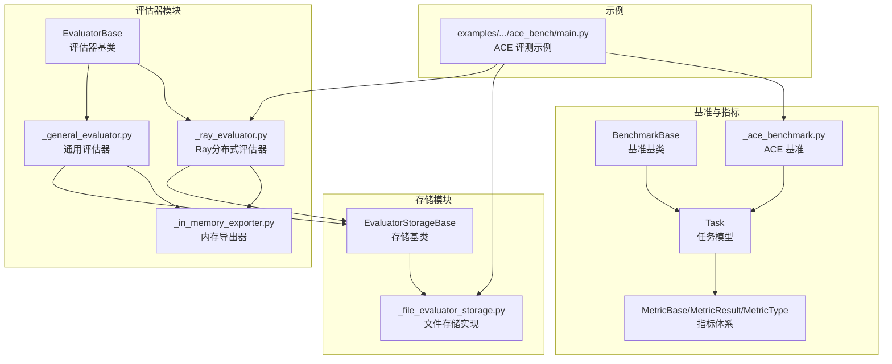
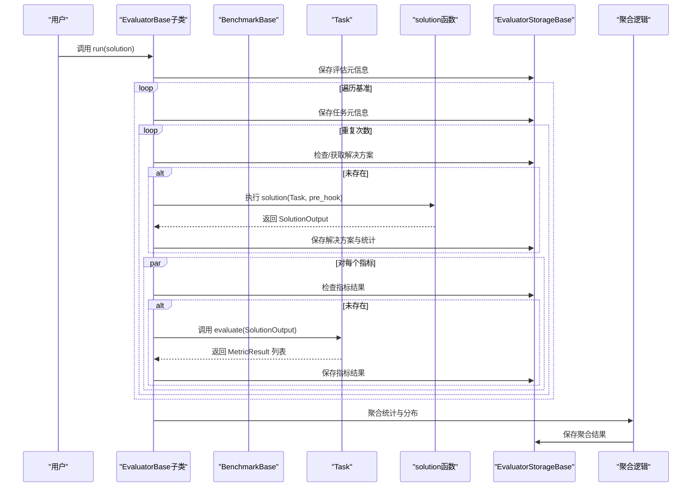
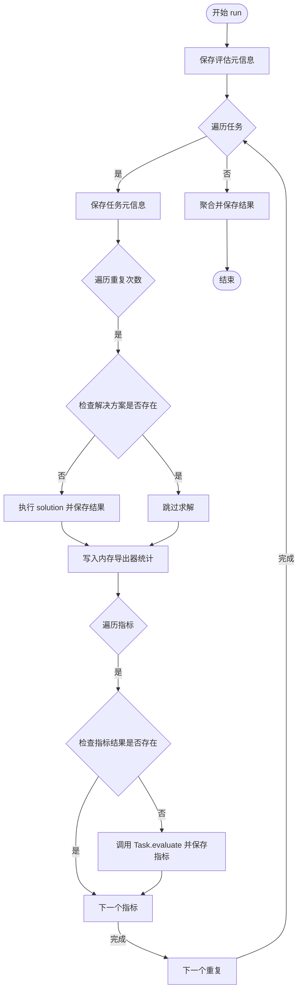
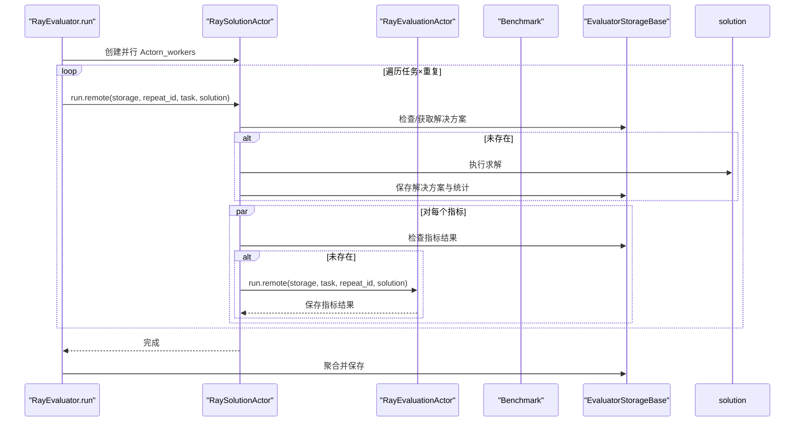
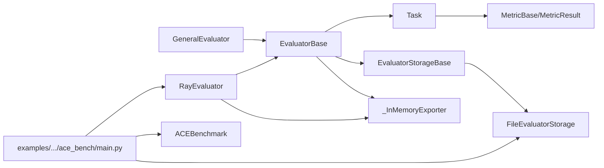

# 评估器架构

<cite>
**本文引用的文件**
- [evaluate/__init__.py](file://src/agentscope/evaluate/__init__.py)
- [evaluate/_evaluator/__init__.py](file://src/agentscope/evaluate/_evaluator/__init__.py)
- [evaluate/_evaluator/_evaluator_base.py](file://src/agentscope/evaluate/_evaluator/_evaluator_base.py)
- [evaluate/_evaluator/_general_evaluator.py](file://src/agentscope/evaluate/_evaluator/_general_evaluator.py)
- [evaluate/_evaluator/_ray_evaluator.py](file://src/agentscope/evaluate/_evaluator/_ray_evaluator.py)
- [evaluate/_evaluator/_in_memory_exporter.py](file://src/agentscope/evaluate/_evaluator/_in_memory_exporter.py)
- [evaluate/_evaluator_storage/__init__.py](file://src/agentscope/evaluate/_evaluator_storage/__init__.py)
- [evaluate/_evaluator_storage/_evaluator_storage_base.py](file://src/agentscope/evaluate/_evaluator_storage/_evaluator_storage_base.py)
- [evaluate/_evaluator_storage/_file_evaluator_storage.py](file://src/agentscope/evaluate/_evaluator_storage/_file_evaluator_storage.py)
- [evaluate/_benchmark_base.py](file://src/agentscope/evaluate/_benchmark_base.py)
- [evaluate/_metric_base.py](file://src/agentscope/evaluate/_metric_base.py)
- [evaluate/_task.py](file://src/agentscope/evaluate/_task.py)
- [evaluate/_ace_benchmark/__init__.py](file://src/agentscope/evaluate/_ace_benchmark/__init__.py)
- [evaluate/_ace_benchmark/_ace_benchmark.py](file://src/agentscope/evaluate/_ace_benchmark/_ace_benchmark.py)
- [examples/evaluation/ace_bench/main.py](file://examples/evaluation/ace_bench/main.py)
</cite>

## 目录
1. [引言](#引言)
2. [项目结构](#项目结构)
3. [核心组件](#核心组件)
4. [架构总览](#架构总览)
5. [详细组件分析](#详细组件分析)
6. [依赖分析](#依赖分析)
7. [性能考虑](#性能考虑)
8. [故障排除指南](#故障排除指南)
9. [结论](#结论)
10. [附录：API 参考与最佳实践](#附录api-参考与最佳实践)

## 引言
本技术文档系统性解析 AgentScope 的评估器架构，覆盖评估流程管理、任务调度、结果收集与聚合；详解通用评估器与 Ray 分布式评估器的实现原理（含并发控制、批处理思想）；说明内存导出器在 OpenTelemetry 链路中的作用与性能优化；并给出配置选项、使用示例、性能分析方法与故障排除建议。目标是帮助开发者快速理解并高效使用评估器体系。

## 项目结构
评估器相关代码集中在 evaluate 子模块中，按“抽象接口—具体实现—存储—基准与指标—示例”的层次组织。顶层导出统一入口，便于外部按需导入。

图示来源
- [evaluate/_evaluator/_evaluator_base.py:18-305](file://src/agentscope/evaluate/_evaluator/_evaluator_base.py#L18-L305)
- [evaluate/_evaluator/_general_evaluator.py:14-179](file://src/agentscope/evaluate/_evaluator/_general_evaluator.py#L14-L179)
- [evaluate/_evaluator/_ray_evaluator.py:14-268](file://src/agentscope/evaluate/_evaluator/_ray_evaluator.py#L14-L268)
- [evaluate/_evaluator/_in_memory_exporter.py:14-107](file://src/agentscope/evaluate/_evaluator/_in_memory_exporter.py#L14-L107)
- [evaluate/_evaluator_storage/_evaluator_storage_base.py:13-255](file://src/agentscope/evaluate/_evaluator_storage/_evaluator_storage_base.py#L13-L255)
- [evaluate/_evaluator_storage/_file_evaluator_storage.py:16-461](file://src/agentscope/evaluate/_evaluator_storage/_file_evaluator_storage.py#L16-L461)
- [evaluate/_benchmark_base.py:9-44](file://src/agentscope/evaluate/_benchmark_base.py#L9-L44)
- [evaluate/_task.py:11-54](file://src/agentscope/evaluate/_task.py#L11-L54)
- [evaluate/_metric_base.py:14-102](file://src/agentscope/evaluate/_metric_base.py#L14-L102)
- [evaluate/_ace_benchmark/_ace_benchmark.py:19-241](file://src/agentscope/evaluate/_ace_benchmark/_ace_benchmark.py#L19-L241)
- [examples/evaluation/ace_bench/main.py:86-131](file://examples/evaluation/ace_bench/main.py#L86-L131)

章节来源
- [evaluate/__init__.py:4-44](file://src/agentscope/evaluate/__init__.py#L4-L44)
- [evaluate/_evaluator/__init__.py:4-12](file://src/agentscope/evaluate/_evaluator/__init__.py#L4-L12)

## 核心组件
- 评估器基类：统一评估生命周期（元信息保存、任务元信息保存、运行、聚合），屏蔽具体执行细节。
- 通用评估器：面向本地调试与单机串行/有限并发，内置内存导出器统计资源消耗。
- Ray 分布式评估器：基于 Actor 的并行执行，支持多 worker 并发与远程任务调度。
- 存储层：抽象存储接口与文件系统实现，支持解决方案、指标结果、统计、元信息持久化与断点续跑。
- 基准与任务：基准迭代器、任务输入/真值/指标集合、评估调用链。
- 指标体系：指标类型枚举与结果封装，支持分类与数值两类指标的聚合。

章节来源
- [evaluate/_evaluator/_evaluator_base.py:18-305](file://src/agentscope/evaluate/_evaluator/_evaluator_base.py#L18-L305)
- [evaluate/_evaluator/_general_evaluator.py:14-179](file://src/agentscope/evaluate/_evaluator/_general_evaluator.py#L14-L179)
- [evaluate/_evaluator/_ray_evaluator.py:14-268](file://src/agentscope/evaluate/_evaluator/_ray_evaluator.py#L14-L268)
- [evaluate/_evaluator_storage/_evaluator_storage_base.py:13-255](file://src/agentscope/evaluate/_evaluator_storage/_evaluator_storage_base.py#L13-L255)
- [evaluate/_evaluator_storage/_file_evaluator_storage.py:16-461](file://src/agentscope/evaluate/_evaluator_storage/_file_evaluator_storage.py#L16-L461)
- [evaluate/_benchmark_base.py:9-44](file://src/agentscope/evaluate/_benchmark_base.py#L9-L44)
- [evaluate/_task.py:11-54](file://src/agentscope/evaluate/_task.py#L11-L54)
- [evaluate/_metric_base.py:14-102](file://src/agentscope/evaluate/_metric_base.py#L14-L102)

## 架构总览
评估器采用“基类统一流程 + 具体执行器 + 存储抽象 + 基准/任务/指标”的分层设计。执行流程从基准迭代任务，逐个重复运行，先求解再评估，最后进行聚合统计与落盘。

图示来源
- [evaluate/_evaluator/_evaluator_base.py:96-305](file://src/agentscope/evaluate/_evaluator/_evaluator_base.py#L96-L305)
- [evaluate/_evaluator/_general_evaluator.py:124-179](file://src/agentscope/evaluate/_evaluator/_general_evaluator.py#L124-L179)
- [evaluate/_evaluator/_ray_evaluator.py:222-268](file://src/agentscope/evaluate/_evaluator/_ray_evaluator.py#L222-L268)
- [evaluate/_task.py:38-54](file://src/agentscope/evaluate/_task.py#L38-L54)

## 详细组件分析

### 评估器基类（EvaluatorBase）
- 设计理念
  - 统一生命周期：保存评估/任务元信息、遍历任务与重复次数、检查/保存中间结果、最终聚合。
  - 解耦执行：将“求解”和“评估”委托给上层传入的 solution 函数与 Task.evaluate。
  - 可扩展：通过继承实现不同执行策略（本地/分布式）。
- 关键流程
  - 运行：保存元信息 → 遍历任务 → 遍历重复 → 求解/评估 → 聚合。
  - 聚合：按重复维度统计完成/未完成任务、指标分布、资源统计（LLM 调用次数、Token 使用、工具调用、Embedding 等）。
- 数据流
  - 输入：benchmark（可迭代）、n_repeat、storage、solution 协程。
  - 输出：落盘的评估元信息、任务元信息、解决方案、指标结果、聚合结果。

章节来源
- [evaluate/_evaluator/_evaluator_base.py:18-305](file://src/agentscope/evaluate/_evaluator/_evaluator_base.py#L18-L305)

### 通用评估器（GeneralEvaluator）
- 实现要点
  - 顺序执行：逐任务、逐重复地调用 solution，并对每个指标逐一评估。
  - 内存导出器：在每次任务求解期间注入 OpenTelemetry 上下文，使用内存导出器统计 LLM/工具/Embedding/Agent 调用与 Token 使用，结束后写入存储。
  - 断点续跑：通过 storage 的存在性检查避免重复计算。
- 并发与批处理
  - 默认串行，可通过 n_workers 参数在上层组合使用（例如批量提交多个任务到队列）。
  - 本实现不直接使用异步并发池，但具备扩展空间（如在 run_solution 中引入 asyncio.Semaphore 控制并发）。
- 性能优化
  - 复用 tracer_provider，避免重复创建。
  - 将导出器统计写入存储后立即清理，降低内存占用。

图示来源
- [evaluate/_evaluator/_general_evaluator.py:124-179](file://src/agentscope/evaluate/_evaluator/_general_evaluator.py#L124-L179)
- [evaluate/_evaluator/_in_memory_exporter.py:14-107](file://src/agentscope/evaluate/_evaluator/_in_memory_exporter.py#L14-L107)

章节来源
- [evaluate/_evaluator/_general_evaluator.py:14-179](file://src/agentscope/evaluate/_evaluator/_general_evaluator.py#L14-L179)

### Ray 分布式评估器（RayEvaluator）
- 架构设计
  - Actor 模型：RaySolutionActor 负责求解，RayEvaluationActor 负责评估。
  - 并发控制：通过 ray.remote 的 options(max_concurrency=...) 控制单 Actor 内部并发度；外部通过创建多个 Actor 并行调度。
  - 导出器：每个 Actor 内置内存导出器，完成后将统计写入存储。
- 任务分发
  - 顶层评估器创建若干 RaySolutionActor，将所有 (task, repeat_id) 组合提交为远程任务，使用 asyncio.gather 收敛。
- 结果聚合
  - 聚合逻辑与基类一致，最终落盘。

图示来源
- [evaluate/_evaluator/_ray_evaluator.py:189-268](file://src/agentscope/evaluate/_evaluator/_ray_evaluator.py#L189-L268)

章节来源
- [evaluate/_evaluator/_ray_evaluator.py:14-268](file://src/agentscope/evaluate/_evaluator/_ray_evaluator.py#L14-L268)

### 内存导出器（_InMemoryExporter）
- 作用
  - 在 OpenTelemetry 链路中拦截 Span，按任务与重复维度统计 LLM 调用次数与 Token 使用、Agent 调用次数、工具调用次数、Embedding 调用次数。
- 数据结构
  - 以嵌套字典形式记录每任务/每重复的统计，键包括 llm/tool/embedding/agent/chat_usage。
- 性能优化
  - 仅在存在任务/重复上下文时处理，避免无关开销。
  - 使用默认字典减少键检查成本。

章节来源
- [evaluate/_evaluator/_in_memory_exporter.py:14-107](file://src/agentscope/evaluate/_evaluator/_in_memory_exporter.py#L14-L107)

### 存储层（EvaluatorStorageBase 与 FileEvaluatorStorage）
- 抽象职责
  - 提供解决方案、指标结果、聚合结果、元信息、统计的读写接口，以及存在性检查。
- 文件存储实现
  - 目录结构清晰：评估元信息、任务元信息、各重复下的解决方案与指标目录、聚合结果文件。
  - 支持断点续跑：存在性检查避免重复计算。
  - 日志钩子：将代理打印内容写入独立日志文件，便于复盘。
- 错误处理
  - JSON 解析异常包装为更明确的异常类型，便于定位问题。

章节来源
- [evaluate/_evaluator_storage/_evaluator_storage_base.py:13-255](file://src/agentscope/evaluate/_evaluator_storage/_evaluator_storage_base.py#L13-L255)
- [evaluate/_evaluator_storage/_file_evaluator_storage.py:16-461](file://src/agentscope/evaluate/_evaluator_storage/_file_evaluator_storage.py#L16-L461)

### 基准与任务（BenchmarkBase、Task）
- 基准
  - 提供迭代器、长度与索引访问能力，用于统一遍历任务集合。
- 任务
  - 包含唯一标识、输入、真值、指标列表、标签与元数据。
  - 评估流程：遍历指标，调用指标对象生成 MetricResult 列表。

章节来源
- [evaluate/_benchmark_base.py:9-44](file://src/agentscope/evaluate/_benchmark_base.py#L9-L44)
- [evaluate/_task.py:11-54](file://src/agentscope/evaluate/_task.py#L11-L54)

### 指标体系（MetricBase、MetricResult、MetricType）
- 指标类型
  - 分类（CATEGORY）与数值（NUMERICAL），决定聚合方式与展示。
- 指标结果
  - 包含名称、结果、时间戳、消息与元数据，便于扩展。
- 聚合
  - 分类：统计各类别占比；数值：统计均值、最大、最小。

章节来源
- [evaluate/_metric_base.py:14-102](file://src/agentscope/evaluate/_metric_base.py#L14-L102)

### ACE 基准示例（ACEBenchmark）
- 数据来源
  - 自动下载中文数据集与对应真值文件，合并为统一任务列表。
- 任务构造
  - 将工具函数与模式 Schema 注入 Task.metadata，指标使用 ACEAccuracy 与 ACEProcessAccuracy。
- 使用示例
  - 示例脚本展示了如何创建 ReActAgent、注册工具、执行并封装为 SolutionOutput，随后交由评估器执行。

章节来源
- [evaluate/_ace_benchmark/_ace_benchmark.py:19-241](file://src/agentscope/evaluate/_ace_benchmark/_ace_benchmark.py#L19-L241)
- [examples/evaluation/ace_bench/main.py:86-131](file://examples/evaluation/ace_bench/main.py#L86-L131)

## 依赖分析
- 组件耦合
  - 评估器基类与具体实现之间为继承关系，低耦合高内聚。
  - 通用/分布式评估器均依赖存储抽象，保证结果持久化与断点续跑能力。
  - 任务与指标解耦，便于替换与扩展。
- 外部依赖
  - Ray（可选）：RayEvaluator 依赖 ray.remote 与 Actor 模型。
  - OpenTelemetry：内存导出器依赖 Span 上下文与属性，用于统计资源消耗。
  - 文件系统：FileEvaluatorStorage 依赖文件读写与目录结构。

图示来源
- [evaluate/_evaluator/_general_evaluator.py:14-179](file://src/agentscope/evaluate/_evaluator/_general_evaluator.py#L14-L179)
- [evaluate/_evaluator/_ray_evaluator.py:189-268](file://src/agentscope/evaluate/_evaluator/_ray_evaluator.py#L189-L268)
- [evaluate/_evaluator/_evaluator_base.py:18-305](file://src/agentscope/evaluate/_evaluator/_evaluator_base.py#L18-L305)
- [evaluate/_evaluator_storage/_evaluator_storage_base.py:13-255](file://src/agentscope/evaluate/_evaluator_storage/_evaluator_storage_base.py#L13-L255)
- [evaluate/_evaluator_storage/_file_evaluator_storage.py:16-461](file://src/agentscope/evaluate/_evaluator_storage/_file_evaluator_storage.py#L16-L461)
- [evaluate/_task.py:11-54](file://src/agentscope/evaluate/_task.py#L11-L54)
- [evaluate/_metric_base.py:14-102](file://src/agentscope/evaluate/_metric_base.py#L14-L102)
- [evaluate/_ace_benchmark/_ace_benchmark.py:19-241](file://src/agentscope/evaluate/_ace_benchmark/_ace_benchmark.py#L19-L241)
- [examples/evaluation/ace_bench/main.py:86-131](file://examples/evaluation/ace_bench/main.py#L86-L131)

## 性能考虑
- 并发与吞吐
  - RayEvaluator 通过 Actor 并行与 max_concurrency 控制单 Actor 内部并发，适合高吞吐场景。
  - GeneralEvaluator 默认串行，便于调试；如需提升吞吐，可在上层批量提交任务或引入信号量限制并发。
- I/O 与落盘
  - FileEvaluatorStorage 采用 JSON 文件落盘，建议在高重复次数场景下关注磁盘 IO；必要时可考虑压缩或异步写入。
- 统计开销
  - 内存导出器仅在存在任务/重复上下文时处理，避免无效统计；建议在生产环境开启必要的 Span 过滤。
- 资源统计
  - 聚合阶段对 llm/tool/embedding/agent/chat_usage 进行汇总，注意大基准下的内存占用与序列化成本。

## 故障排除指南
- Ray 未安装
  - 现象：使用 RayEvaluator 报错提示未安装。
  - 处理：安装 Ray 后重试。
- JSON 解析失败
  - 现象：读取存储文件时报 JSONDecodeError。
  - 处理：检查文件完整性与编码，确认写入是否成功。
- 缺少评估/解决方案文件
  - 现象：查询指标或解决方案不存在。
  - 处理：确认 solution 是否正确返回 SolutionOutput，或删除对应文件触发重新计算。
- 聚合结果缺失
  - 现象：聚合阶段找不到聚合结果。
  - 处理：确认所有任务与指标均已完整执行并保存。

章节来源
- [evaluate/_evaluator/_ray_evaluator.py:14-36](file://src/agentscope/evaluate/_evaluator/_ray_evaluator.py#L14-L36)
- [evaluate/_evaluator_storage/_file_evaluator_storage.py:194-204](file://src/agentscope/evaluate/_evaluator_storage/_file_evaluator_storage.py#L194-L204)
- [evaluate/_evaluator/_evaluator_base.py:96-305](file://src/agentscope/evaluate/_evaluator/_evaluator_base.py#L96-L305)

## 结论
AgentScope 评估器架构以基类统一流程为核心，结合通用与分布式两种执行器满足不同场景需求；通过存储抽象与内存导出器实现断点续跑与资源统计；指标体系与基准/任务模型解耦，便于扩展与定制。推荐在开发调试阶段使用通用评估器，在大规模评测场景使用 Ray 分布式评估器，并配合文件存储实现断点续跑与结果归档。

## 附录：API 参考与最佳实践

### API 参考（节选）
- 评估器基类
  - 方法：run(solution)、aggregate()、_save_evaluation_meta()、_save_task_meta(task)
  - 关键参数：name、benchmark、n_repeat、storage
- 通用评估器
  - 构造：n_workers 控制并发
  - 方法：run_evaluation(task, repeat_id, solution_output)、run_solution(...)
- Ray 分布式评估器
  - 构造：n_workers 控制 Actor 数量与内部并发
  - 方法：run(solution)
- 存储接口
  - 保存/读取：save_solution_result、get_solution_result、save_evaluation_result、get_evaluation_result、save_aggregation_result、save_evaluation_meta、save_task_meta、save_solution_stats、get_solution_stats、evaluation_result_exists、solution_result_exists、aggregation_result_exists、get_agent_pre_print_hook
- 基准与任务
  - BenchmarkBase：__iter__()、__len__()、__getitem__(index)
  - Task：evaluate(solution) 返回指标结果列表
- 指标体系
  - MetricType：CATEGORY、NUMERICAL
  - MetricResult：name、result、created_at、message、metadata
  - MetricBase：__call__(*args, **kwargs) -> MetricResult

章节来源
- [evaluate/_evaluator/_evaluator_base.py:18-305](file://src/agentscope/evaluate/_evaluator/_evaluator_base.py#L18-L305)
- [evaluate/_evaluator/_general_evaluator.py:14-179](file://src/agentscope/evaluate/_evaluator/_general_evaluator.py#L14-L179)
- [evaluate/_evaluator/_ray_evaluator.py:189-268](file://src/agentscope/evaluate/_evaluator/_ray_evaluator.py#L189-L268)
- [evaluate/_evaluator_storage/_evaluator_storage_base.py:13-255](file://src/agentscope/evaluate/_evaluator_storage/_evaluator_storage_base.py#L13-L255)
- [evaluate/_benchmark_base.py:9-44](file://src/agentscope/evaluate/_benchmark_base.py#L9-L44)
- [evaluate/_task.py:11-54](file://src/agentscope/evaluate/_task.py#L11-L54)
- [evaluate/_metric_base.py:14-102](file://src/agentscope/evaluate/_metric_base.py#L14-L102)

### 最佳实践
- 选择评估器
  - 开发调试：优先使用通用评估器，便于观察中间状态与日志。
  - 大规模评测：使用 RayEvaluator，并根据机器核数与资源合理设置 n_workers。
- 并发控制
  - 在通用评估器中，如需并发，可在上层批量提交任务并使用信号量限制并发度。
- 断点续跑
  - 使用 FileEvaluatorStorage，确保重复执行不会重复计算已完成的任务/指标。
- 资源统计
  - 保持内存导出器启用，以便在聚合阶段获得准确的 Token 使用与调用统计。
- 指标设计
  - 分类指标必须提供候选类别；数值指标用于量化评分，便于统计均值/极值。
- 基准扩展
  - 新增基准时，遵循 BenchmarkBase 接口，将数据映射为 Task，包含输入、真值、指标与元数据。