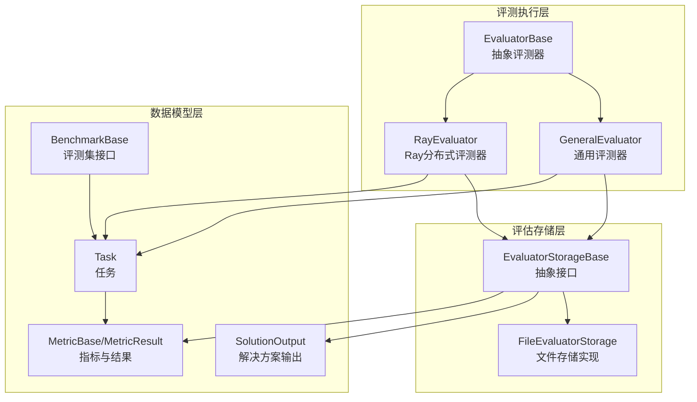
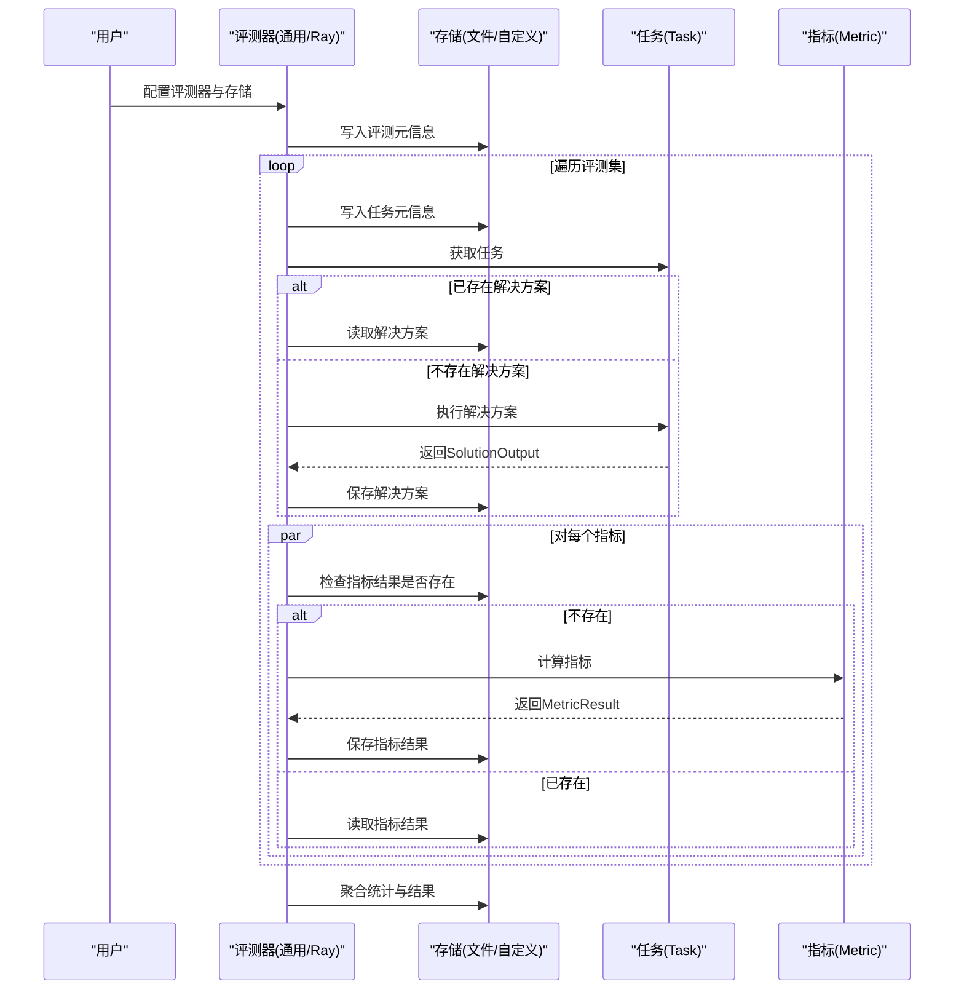
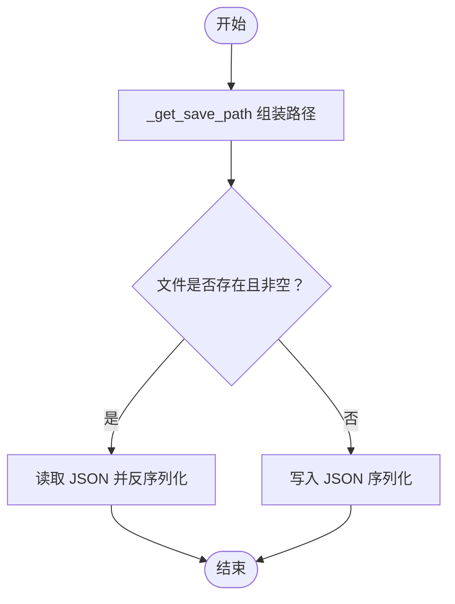
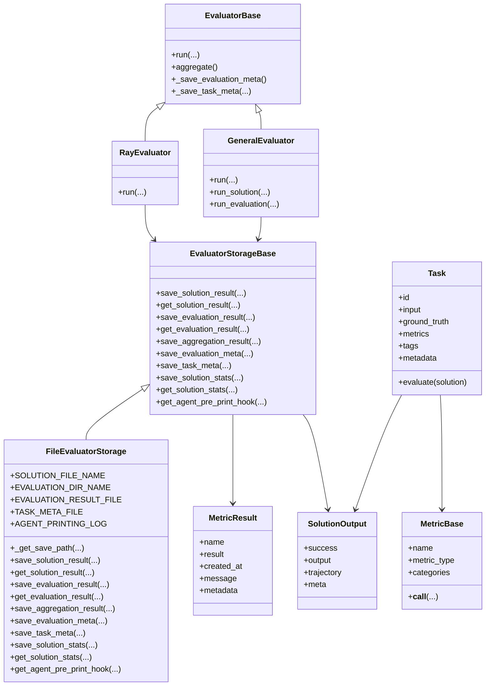
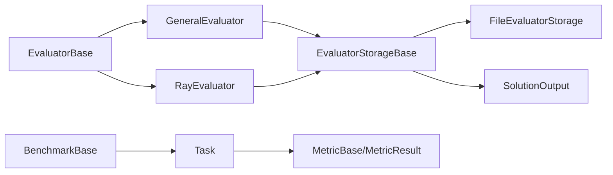

# 评估存储系统

<cite>
**本文引用的文件**
- [src/agentscope/evaluate/_evaluator_storage/__init__.py](file://src/agentscope/evaluate/_evaluator_storage/__init__.py)
- [src/agentscope/evaluate/_evaluator_storage/_evaluator_storage_base.py](file://src/agentscope/evaluate/_evaluator_storage/_evaluator_storage_base.py)
- [src/agentscope/evaluate/_evaluator_storage/_file_evaluator_storage.py](file://src/agentscope/evaluate/_evaluator_storage/_file_evaluator_storage.py)
- [src/agentscope/evaluate/_evaluator/__init__.py](file://src/agentscope/evaluate/_evaluator/__init__.py)
- [src/agentscope/evaluate/_evaluator/_evaluator_base.py](file://src/agentscope/evaluate/_evaluator/_evaluator_base.py)
- [src/agentscope/evaluate/_evaluator/_general_evaluator.py](file://src/agentscope/evaluate/_evaluator/_general_evaluator.py)
- [src/agentscope/evaluate/_evaluator/_ray_evaluator.py](file://src/agentscope/evaluate/_evaluator/_ray_evaluator.py)
- [src/agentscope/evaluate/_solution.py](file://src/agentscope/evaluate/_solution.py)
- [src/agentscope/evaluate/_metric_base.py](file://src/agentscope/evaluate/_metric_base.py)
- [src/agentscope/evaluate/_task.py](file://src/agentscope/evaluate/_task.py)
- [src/agentscope/evaluate/_benchmark_base.py](file://src/agentscope/evaluate/_benchmark_base.py)
- [src/agentscope/evaluate/_ace_benchmark/_ace_benchmark.py](file://src/agentscope/evaluate/_ace_benchmark/_ace_benchmark.py)
- [src/agentscope/evaluate/_ace_benchmark/_ace_metric.py](file://src/agentscope/evaluate/_ace_benchmark/_ace_metric.py)
</cite>

## 目录
1. [简介](#简介)
2. [项目结构](#项目结构)
3. [核心组件](#核心组件)
4. [架构总览](#架构总览)
5. [详细组件分析](#详细组件分析)
6. [依赖分析](#依赖分析)
7. [性能考虑](#性能考虑)
8. [故障排查指南](#故障排查指南)
9. [结论](#结论)
10. [附录：API 参考与最佳实践](#附录api-参考与最佳实践)

## 简介
本文件面向 AgentScope 的评估存储系统，聚焦以下目标：
- 解释评估存储基类的设计理念：接口抽象、数据模型、访问模式
- 深入阐述文件型评估存储的实现机制：文件组织、序列化、持久化策略
- 说明扩展性设计：自定义存储后端、接口适配器、数据迁移方案
- 解释评估结果的数据结构：任务信息、解决方案输出、指标结果的组织方式
- 提供配置选项：文件路径、编码格式、压缩策略等
- 给出使用示例、查询方法与性能优化建议
- 提供完整 API 参考与最佳实践

## 项目结构
评估存储系统位于 evaluate 子模块中，围绕“评测基类 → 评测器 → 存储实现”的分层设计展开，并通过任务、指标、解决方案等数据模型支撑完整的评测生命周期。

图表来源
- [src/agentscope/evaluate/_evaluator_storage/_evaluator_storage_base.py:13-255](file://src/agentscope/evaluate/_evaluator_storage/_evaluator_storage_base.py#L13-L255)
- [src/agentscope/evaluate/_evaluator_storage/_file_evaluator_storage.py:16-461](file://src/agentscope/evaluate/_evaluator_storage/_file_evaluator_storage.py#L16-L461)
- [src/agentscope/evaluate/_evaluator/_evaluator_base.py:18-305](file://src/agentscope/evaluate/_evaluator/_evaluator_base.py#L18-L305)
- [src/agentscope/evaluate/_evaluator/_general_evaluator.py:14-179](file://src/agentscope/evaluate/_evaluator/_general_evaluator.py#L14-L179)
- [src/agentscope/evaluate/_evaluator/_ray_evaluator.py:189-268](file://src/agentscope/evaluate/_evaluator/_ray_evaluator.py#L189-L268)
- [src/agentscope/evaluate/_task.py:11-54](file://src/agentscope/evaluate/_task.py#L11-L54)
- [src/agentscope/evaluate/_solution.py:16-37](file://src/agentscope/evaluate/_solution.py#L16-L37)
- [src/agentscope/evaluate/_metric_base.py:14-102](file://src/agentscope/evaluate/_metric_base.py#L14-L102)
- [src/agentscope/evaluate/_benchmark_base.py:9-44](file://src/agentscope/evaluate/_benchmark_base.py#L9-L44)

章节来源
- [src/agentscope/evaluate/_evaluator_storage/__init__.py:1-11](file://src/agentscope/evaluate/_evaluator_storage/__init__.py#L1-L11)
- [src/agentscope/evaluate/_evaluator/__init__.py:1-13](file://src/agentscope/evaluate/_evaluator/__init__.py#L1-L13)

## 核心组件
- 评估存储基类（EvaluatorStorageBase）：定义统一的存取接口，屏蔽具体后端差异，支持保存/读取解决方案、指标结果、聚合结果、元信息、统计信息等。
- 文件型评估存储（FileEvaluatorStorage）：基于文件系统实现，采用目录树结构组织数据，以 JSON 序列化持久化，提供断点续跑能力。
- 评测器基类（EvaluatorBase）：封装评测流程，负责元信息写入、任务元信息写入、结果聚合、调用存储接口。
- 通用评测器（GeneralEvaluator）：串行/单进程执行，便于调试；支持 OpenTelemetry 袋量上下文注入与统计导出。
- Ray 分布式评测器（RayEvaluator）：基于 Ray 的 Actor 并行执行，提升大规模评测吞吐。
- 数据模型：Task（任务）、SolutionOutput（解决方案输出）、MetricBase/MetricResult（指标与结果），以及 BenchmarkBase（评测集接口）。

章节来源
- [src/agentscope/evaluate/_evaluator_storage/_evaluator_storage_base.py:13-255](file://src/agentscope/evaluate/_evaluator_storage/_evaluator_storage_base.py#L13-L255)
- [src/agentscope/evaluate/_evaluator_storage/_file_evaluator_storage.py:16-461](file://src/agentscope/evaluate/_evaluator_storage/_file_evaluator_storage.py#L16-L461)
- [src/agentscope/evaluate/_evaluator/_evaluator_base.py:18-305](file://src/agentscope/evaluate/_evaluator/_evaluator_base.py#L18-L305)
- [src/agentscope/evaluate/_evaluator/_general_evaluator.py:14-179](file://src/agentscope/evaluate/_evaluator/_general_evaluator.py#L14-L179)
- [src/agentscope/evaluate/_evaluator/_ray_evaluator.py:189-268](file://src/agentscope/evaluate/_evaluator/_ray_evaluator.py#L189-L268)
- [src/agentscope/evaluate/_task.py:11-54](file://src/agentscope/evaluate/_task.py#L11-L54)
- [src/agentscope/evaluate/_solution.py:16-37](file://src/agentscope/evaluate/_solution.py#L16-L37)
- [src/agentscope/evaluate/_metric_base.py:14-102](file://src/agentscope/evaluate/_metric_base.py#L14-L102)
- [src/agentscope/evaluate/_benchmark_base.py:9-44](file://src/agentscope/evaluate/_benchmark_base.py#L9-L44)

## 架构总览
评估存储系统采用“接口抽象 + 具体实现 + 执行器编排”的架构。评测器在运行时通过统一的存储接口进行数据读写，既可使用文件存储实现，也可替换为其他后端（如数据库、对象存储）。

图表来源
- [src/agentscope/evaluate/_evaluator/_general_evaluator.py:43-179](file://src/agentscope/evaluate/_evaluator/_general_evaluator.py#L43-L179)
- [src/agentscope/evaluate/_evaluator/_ray_evaluator.py:222-268](file://src/agentscope/evaluate/_evaluator/_ray_evaluator.py#L222-L268)
- [src/agentscope/evaluate/_evaluator/_evaluator_base.py:96-305](file://src/agentscope/evaluate/_evaluator/_evaluator_base.py#L96-L305)
- [src/agentscope/evaluate/_evaluator_storage/_evaluator_storage_base.py:17-255](file://src/agentscope/evaluate/_evaluator_storage/_evaluator_storage_base.py#L17-L255)

## 详细组件分析

### 评估存储基类（EvaluatorStorageBase）
- 设计理念
  - 接口抽象：统一保存/读取解决方案、指标结果、聚合结果、元信息、统计信息等操作，屏蔽后端细节。
  - 访问模式：按 task_id + repeat_id 维度组织数据；指标结果按 metric_name 命名文件；聚合结果独立存放。
  - 可扩展性：通过继承实现不同后端（文件、数据库、云存储），保持调用方一致。
- 关键方法
  - 解决方案：保存/读取、存在性检查
  - 指标：保存/读取、存在性检查
  - 聚合：保存/存在性检查
  - 元信息：评测元信息、任务元信息
  - 统计：保存/读取
  - 钩子：代理打印钩子，用于记录代理输出

章节来源
- [src/agentscope/evaluate/_evaluator_storage/_evaluator_storage_base.py:13-255](file://src/agentscope/evaluate/_evaluator_storage/_evaluator_storage_base.py#L13-L255)

### 文件型评估存储（FileEvaluatorStorage）
- 文件组织结构
  - 顶层目录：evaluation_result.json、evaluation_meta.json、task_meta.json
  - 按 repeat_id 组织：{repeat_id}/{task_id}/solution.json
  - 指标结果：{repeat_id}/{task_id}/evaluation/{metric_name}.json
  - 统计与日志：{repeat_id}/{task_id}/stats.json、{repeat_id}/{task_id}/logging.txt
- 实现要点
  - 路径生成：统一的_get_save_path，自动创建目录
  - 序列化：统一使用 JSON，UTF-8 编码，缩进格式化
  - 错误处理：JSON 解析异常、文件不存在异常明确抛出
  - 断点续跑：通过 solution_result_exists / evaluation_result_exists 判断是否跳过已执行步骤
  - 代理打印：get_agent_pre_print_hook 将消息块写入 logging.txt，仅保存最后一条消息
- 性能与可靠性
  - 顺序写入，避免并发冲突；若需并发，建议上层加锁或使用独立 repeat_id
  - 大文件建议配合外部压缩工具或在上层做增量归档

图表来源
- [src/agentscope/evaluate/_evaluator_storage/_file_evaluator_storage.py:44-70](file://src/agentscope/evaluate/_evaluator_storage/_file_evaluator_storage.py#L44-L70)
- [src/agentscope/evaluate/_evaluator_storage/_file_evaluator_storage.py:158-204](file://src/agentscope/evaluate/_evaluator_storage/_file_evaluator_storage.py#L158-L204)
- [src/agentscope/evaluate/_evaluator_storage/_file_evaluator_storage.py:228-256](file://src/agentscope/evaluate/_evaluator_storage/_file_evaluator_storage.py#L228-L256)

章节来源
- [src/agentscope/evaluate/_evaluator_storage/_file_evaluator_storage.py:16-461](file://src/agentscope/evaluate/_evaluator_storage/_file_evaluator_storage.py#L16-L461)

### 评测器基类（EvaluatorBase）
- 职责
  - 初始化：名称、评测集、重复次数、存储实例
  - 元信息：保存评测元信息（名称、时间、评测集概要、schema 版本）
  - 任务元信息：保存任务元信息（去除 metadata 后的字段）
  - 聚合：遍历所有任务与重复，统计完成/未完成、指标分布、token 使用等，生成聚合结果并保存
- 关键流程
  - 逐任务、逐重复执行
  - 优先从存储读取已存在的解决方案，否则调用 solution(...) 执行并保存
  - 对每个指标检查是否存在，不存在则计算并保存
  - 最终调用 aggregate() 进行统计与汇总

章节来源
- [src/agentscope/evaluate/_evaluator/_evaluator_base.py:18-305](file://src/agentscope/evaluate/_evaluator/_evaluator_base.py#L18-L305)

### 通用评测器（GeneralEvaluator）
- 特点
  - 单线程/易调试，适合小规模或开发阶段
  - 支持 OpenTelemetry 袋量上下文（baggage）注入，便于追踪
  - 使用 InMemoryExporter 统计 LLM/工具/嵌入等使用情况
- 流程
  - run() 中保存评测元信息与任务元信息
  - 遍历评测集与重复次数，先尝试读取解决方案，再执行并保存
  - 对每个指标检查并计算，最后聚合

章节来源
- [src/agentscope/evaluate/_evaluator/_general_evaluator.py:14-179](file://src/agentscope/evaluate/_evaluator/_general_evaluator.py#L14-L179)

### Ray 分布式评测器（RayEvaluator）
- 特点
  - 基于 Ray Actor 并行执行，显著提升吞吐
  - SolutionActor 负责执行解决方案与统计，EvaluationActor 负责指标计算
  - 支持 max_concurrency 控制并发度
- 流程
  - 创建 SolutionActor，保存评测与任务元信息
  - 并发提交任务到 Actor，等待全部完成
  - 聚合结果

章节来源
- [src/agentscope/evaluate/_evaluator/_ray_evaluator.py:189-268](file://src/agentscope/evaluate/_evaluator/_ray_evaluator.py#L189-L268)

### 数据模型与评测流程
- 任务（Task）
  - 字段：id、input、ground_truth、metrics、tags、metadata
  - evaluate(solution)：依次调用各指标计算，返回 MetricResult 列表
- 解决方案输出（SolutionOutput）
  - 字段：success、output、trajectory、meta
  - trajectory 包含工具调用、工具结果与文本块
- 指标（MetricBase/MetricResult）
  - MetricType：CATEGORY 或 NUMERICAL
  - MetricResult：name、result、created_at、message、metadata
- 评测集（BenchmarkBase）
  - 抽象迭代器与长度接口，由具体评测集实现

图表来源
- [src/agentscope/evaluate/_evaluator_storage/_evaluator_storage_base.py:13-255](file://src/agentscope/evaluate/_evaluator_storage/_evaluator_storage_base.py#L13-L255)
- [src/agentscope/evaluate/_evaluator_storage/_file_evaluator_storage.py:16-461](file://src/agentscope/evaluate/_evaluator_storage/_file_evaluator_storage.py#L16-L461)
- [src/agentscope/evaluate/_evaluator/_evaluator_base.py:18-305](file://src/agentscope/evaluate/_evaluator/_evaluator_base.py#L18-L305)
- [src/agentscope/evaluate/_evaluator/_general_evaluator.py:14-179](file://src/agentscope/evaluate/_evaluator/_general_evaluator.py#L14-L179)
- [src/agentscope/evaluate/_evaluator/_ray_evaluator.py:189-268](file://src/agentscope/evaluate/_evaluator/_ray_evaluator.py#L189-L268)
- [src/agentscope/evaluate/_task.py:11-54](file://src/agentscope/evaluate/_task.py#L11-L54)
- [src/agentscope/evaluate/_solution.py:16-37](file://src/agentscope/evaluate/_solution.py#L16-L37)
- [src/agentscope/evaluate/_metric_base.py:14-102](file://src/agentscope/evaluate/_metric_base.py#L14-L102)

## 依赖分析
- 存储接口与实现
  - EvaluatorStorageBase 是所有存储实现的契约，FileEvaluatorStorage 是默认文件实现
- 评测器与存储
  - EvaluatorBase 作为抽象，被 GeneralEvaluator 与 RayEvaluator 继承
  - 两者均通过 storage.* 方法与存储交互
- 数据模型耦合
  - Task 依赖 MetricBase/MetricResult
  - 评测器通过存储读写 SolutionOutput 与 MetricResult
- 评测集
  - BenchmarkBase 定义了评测集的迭代与索引接口，ACEBenchmark 是一个具体实现

图表来源
- [src/agentscope/evaluate/_evaluator_storage/_evaluator_storage_base.py:13-255](file://src/agentscope/evaluate/_evaluator_storage/_evaluator_storage_base.py#L13-L255)
- [src/agentscope/evaluate/_evaluator_storage/_file_evaluator_storage.py:16-461](file://src/agentscope/evaluate/_evaluator_storage/_file_evaluator_storage.py#L16-L461)
- [src/agentscope/evaluate/_evaluator/_evaluator_base.py:18-305](file://src/agentscope/evaluate/_evaluator/_evaluator_base.py#L18-L305)
- [src/agentscope/evaluate/_evaluator/_general_evaluator.py:14-179](file://src/agentscope/evaluate/_evaluator/_general_evaluator.py#L14-L179)
- [src/agentscope/evaluate/_evaluator/_ray_evaluator.py:189-268](file://src/agentscope/evaluate/_evaluator/_ray_evaluator.py#L189-L268)
- [src/agentscope/evaluate/_benchmark_base.py:9-44](file://src/agentscope/evaluate/_benchmark_base.py#L9-L44)
- [src/agentscope/evaluate/_task.py:11-54](file://src/agentscope/evaluate/_task.py#L11-L54)
- [src/agentscope/evaluate/_solution.py:16-37](file://src/agentscope/evaluate/_solution.py#L16-L37)
- [src/agentscope/evaluate/_metric_base.py:14-102](file://src/agentscope/evaluate/_metric_base.py#L14-L102)

章节来源
- [src/agentscope/evaluate/_benchmark_base.py:9-44](file://src/agentscope/evaluate/_benchmark_base.py#L9-L44)
- [src/agentscope/evaluate/_ace_benchmark/_ace_benchmark.py:19-241](file://src/agentscope/evaluate/_ace_benchmark/_ace_benchmark.py#L19-L241)

## 性能考虑
- 文件存储
  - 顺序写入，避免频繁随机 IO；大文件建议外部压缩或分片归档
  - 路径拼接与目录创建在每次写入前执行，建议批量写入或合并操作
- 并行评测
  - RayEvaluator 通过 Actor 并行显著提升吞吐；注意控制 n_workers 与磁盘 IO 能力匹配
  - 使用 InMemoryExporter 统计资源消耗，避免过多中间对象驻留内存
- 读取优化
  - 通过 solution_result_exists / evaluation_result_exists 做幂等判断，减少重复计算
  - 聚合阶段按 repeat → task → metric 三层循环，注意缓存中间结果

[本节为通用性能建议，不直接分析具体文件]

## 故障排查指南
- JSON 解析错误
  - 现象：读取 solution.json 或 stats.json 抛出 JSONDecodeError
  - 排查：确认文件编码为 UTF-8，内容为合法 JSON；检查写入是否中断
- 文件缺失
  - 现象：get_solution_result 或 get_solution_stats 抛出 FileNotFoundError
  - 排查：确认存储目录结构正确；检查是否已执行保存步骤
- 指标结果未生成
  - 现象：evaluation_result_exists 返回 False
  - 排查：确认评测器已调用 task.evaluate 并保存指标结果
- Ray 相关
  - 现象：导入 RayEvaluator 抛出 ImportError
  - 排查：安装 ray；或改用 GeneralEvaluator

章节来源
- [src/agentscope/evaluate/_evaluator_storage/_file_evaluator_storage.py:194-203](file://src/agentscope/evaluate/_evaluator_storage/_file_evaluator_storage.py#L194-L203)
- [src/agentscope/evaluate/_evaluator_storage/_file_evaluator_storage.py:389-397](file://src/agentscope/evaluate/_evaluator_storage/_file_evaluator_storage.py#L389-L397)
- [src/agentscope/evaluate/_evaluator/_ray_evaluator.py:14-23](file://src/agentscope/evaluate/_evaluator/_ray_evaluator.py#L14-L23)

## 结论
评估存储系统通过清晰的接口抽象与文件实现，提供了可扩展、可断点续跑、可并行化的评测数据管理能力。结合通用与分布式评测器，能够覆盖从小规模调试到大规模生产的多种场景。通过合理的目录结构与 JSON 序列化策略，系统具备良好的可维护性与可移植性。

[本节为总结性内容，不直接分析具体文件]

## 附录：API 参考与最佳实践

### 评估存储接口（EvaluatorStorageBase）
- 解决方案
  - save_solution_result(task_id, repeat_id, output)
  - get_solution_result(task_id, repeat_id)
  - solution_result_exists(task_id, repeat_id)
- 指标结果
  - save_evaluation_result(task_id, repeat_id, evaluation)
  - get_evaluation_result(task_id, repeat_id, metric_name)
  - evaluation_result_exists(task_id, repeat_id, metric_name)
- 聚合与元信息
  - save_aggregation_result(aggregation_result)
  - aggregation_result_exists()
  - save_evaluation_meta(meta_info)
  - save_task_meta(task_id, meta_info)
- 统计与钩子
  - save_solution_stats(task_id, repeat_id, stats)
  - get_solution_stats(task_id, repeat_id)
  - get_agent_pre_print_hook(task_id, repeat_id)

章节来源
- [src/agentscope/evaluate/_evaluator_storage/_evaluator_storage_base.py:17-255](file://src/agentscope/evaluate/_evaluator_storage/_evaluator_storage_base.py#L17-L255)

### 文件存储实现（FileEvaluatorStorage）
- 关键常量
  - SOLUTION_FILE_NAME、SOLUTION_STATS_FILE_NAME、EVALUATION_DIR_NAME、EVALUATION_RESULT_FILE、EVALUATION_META_FILE、TASK_META_FILE、AGENT_PRINTING_LOG
- 路径与序列化
  - _get_save_path 统一路径生成
  - 采用 UTF-8 编码与缩进格式化 JSON
- 错误处理
  - JSONDecodeError、FileNotFoundError 明确抛出
- 代理打印钩子
  - 仅保存最后一条消息，按消息类型拼接文本

章节来源
- [src/agentscope/evaluate/_evaluator_storage/_file_evaluator_storage.py:16-461](file://src/agentscope/evaluate/_evaluator_storage/_file_evaluator_storage.py#L16-L461)

### 评测器 API
- EvaluatorBase
  - run(solution)：异步评测入口
  - aggregate()：聚合统计与结果
  - _save_evaluation_meta()、_save_task_meta(task)
- GeneralEvaluator
  - run(solution)：通用评测入口
  - run_solution(repeat_id, task, solution)：执行/读取解决方案
  - run_evaluation(task, repeat_id, solution_output)：评测指标
- RayEvaluator
  - run(solution)：Ray 并行评测入口
  - 内部 Actor：RaySolutionActor、RayEvaluationActor

章节来源
- [src/agentscope/evaluate/_evaluator/_evaluator_base.py:18-305](file://src/agentscope/evaluate/_evaluator/_evaluator_base.py#L18-L305)
- [src/agentscope/evaluate/_evaluator/_general_evaluator.py:14-179](file://src/agentscope/evaluate/_evaluator/_general_evaluator.py#L14-L179)
- [src/agentscope/evaluate/_evaluator/_ray_evaluator.py:189-268](file://src/agentscope/evaluate/_evaluator/_ray_evaluator.py#L189-L268)

### 数据模型 API
- Task
  - evaluate(solution)：返回指标结果列表
- SolutionOutput
  - success、output、trajectory、meta
- MetricBase/MetricResult
  - MetricType：CATEGORY、NUMERICAL
  - MetricResult：name、result、created_at、message、metadata

章节来源
- [src/agentscope/evaluate/_task.py:11-54](file://src/agentscope/evaluate/_task.py#L11-L54)
- [src/agentscope/evaluate/_solution.py:16-37](file://src/agentscope/evaluate/_solution.py#L16-L37)
- [src/agentscope/evaluate/_metric_base.py:14-102](file://src/agentscope/evaluate/_metric_base.py#L14-L102)

### 配置与使用示例（步骤说明）
- 配置项
  - 存储根目录：FileEvaluatorStorage(save_dir)
  - 评测名称与重复次数：EvaluatorBase(name, benchmark, n_repeat, storage)
  - Ray 并行度：RayEvaluator(n_workers)
- 使用步骤
  - 准备评测集（实现 BenchmarkBase 或使用 ACEBenchmark）
  - 选择评测器（GeneralEvaluator 或 RayEvaluator）
  - 提供解决方案函数（接收 Task 与预打印钩子，返回 SolutionOutput）
  - 运行评测器 run(solution)，完成后调用 aggregate() 生成聚合结果
- 查询方法
  - 读取评测元信息：aggregation_result_exists() + 读取 evaluation_result.json
  - 读取任务元信息：task_meta.json
  - 读取指标结果：{repeat_id}/{task_id}/evaluation/{metric_name}.json
  - 读取统计：{repeat_id}/{task_id}/stats.json
  - 读取解决方案：{repeat_id}/{task_id}/solution.json
- 性能优化建议
  - 使用断点续跑：solution_result_exists / evaluation_result_exists
  - 并行评测：RayEvaluator，合理设置 n_workers
  - 大文件归档：对历史结果进行压缩与分片

章节来源
- [src/agentscope/evaluate/_evaluator_storage/_file_evaluator_storage.py:206-256](file://src/agentscope/evaluate/_evaluator_storage/_file_evaluator_storage.py#L206-L256)
- [src/agentscope/evaluate/_evaluator/_general_evaluator.py:160-179](file://src/agentscope/evaluate/_evaluator/_general_evaluator.py#L160-L179)
- [src/agentscope/evaluate/_evaluator/_ray_evaluator.py:222-268](file://src/agentscope/evaluate/_evaluator/_ray_evaluator.py#L222-L268)

### 扩展性设计与迁移方案
- 自定义存储后端
  - 继承 EvaluatorStorageBase，实现所有抽象方法
  - 注意与现有文件命名/目录结构的兼容性，或在评测器侧做适配
- 接口适配器
  - 若已有数据库/对象存储，可在存储层内部转换为统一接口语义
- 数据迁移
  - 从文件存储迁移到新后端：读取 evaluation_result.json、task_meta.json、各任务/指标文件，写入新后端
  - 迁移后验证：通过 aggregation_result_exists 与 get_* 接口核对一致性

章节来源
- [src/agentscope/evaluate/_evaluator_storage/_evaluator_storage_base.py:17-255](file://src/agentscope/evaluate/_evaluator_storage/_evaluator_storage_base.py#L17-L255)
- [src/agentscope/evaluate/_evaluator_storage/_file_evaluator_storage.py:258-328](file://src/agentscope/evaluate/_evaluator_storage/_file_evaluator_storage.py#L258-L328)

### 评测集示例（ACEBenchmark）
- 功能概述
  - 自动下载与校验数据，加载多语言数据集
  - 将数据项转换为 Task，内置指标（准确率、过程准确率）
- 使用建议
  - 指标选择：根据任务类型选择合适的 MetricBase 实现
  - 工具集成：通过 Task.metadata 注入工具函数，供评测器使用

章节来源
- [src/agentscope/evaluate/_ace_benchmark/_ace_benchmark.py:19-241](file://src/agentscope/evaluate/_ace_benchmark/_ace_benchmark.py#L19-L241)
- [src/agentscope/evaluate/_ace_benchmark/_ace_metric.py:8-132](file://src/agentscope/evaluate/_ace_benchmark/_ace_metric.py#L8-L132)