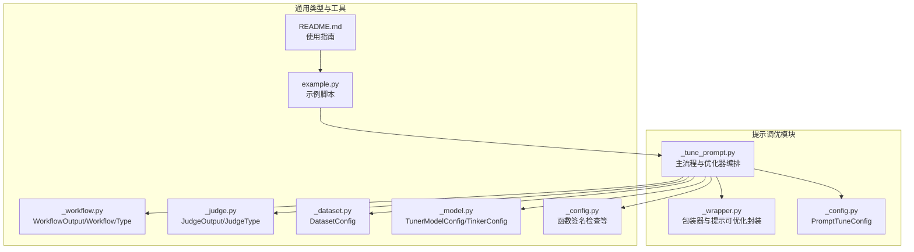
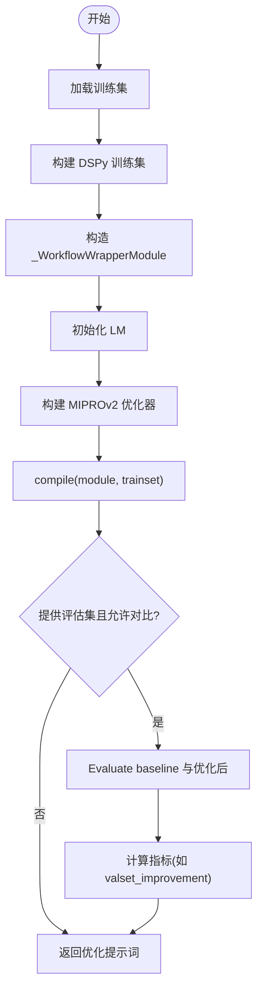
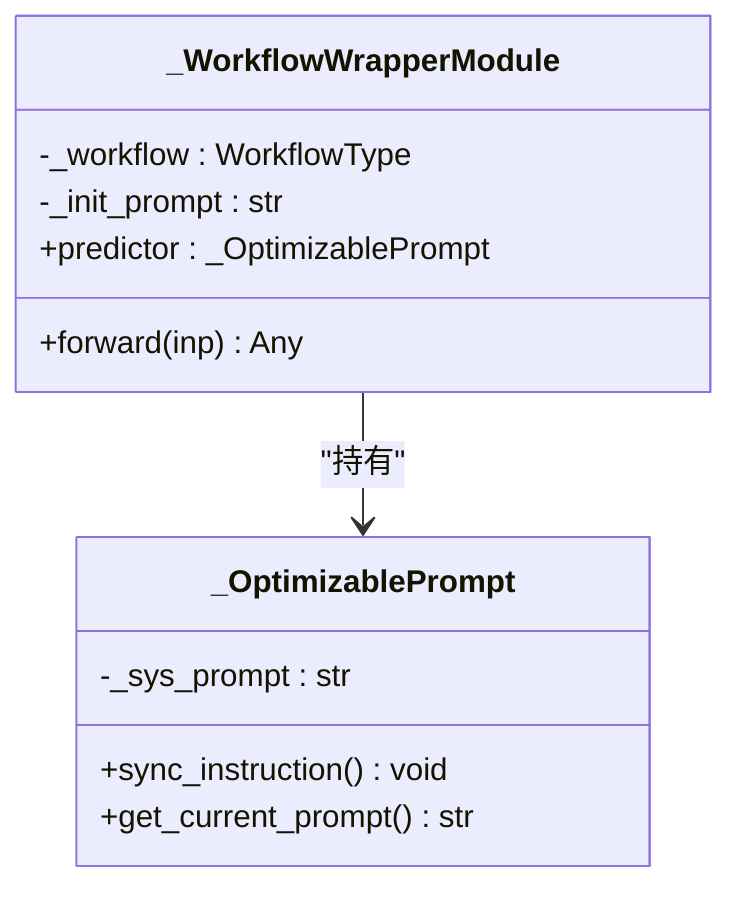
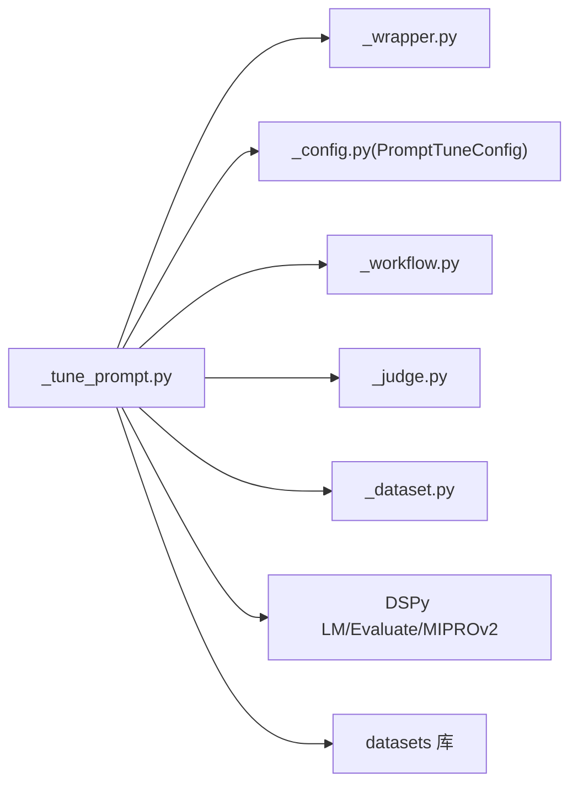

# 提示调优

<cite>
**本文引用的文件列表**
- [tuner/prompt_tune/_tune_prompt.py](file://src/agentscope/tuner/prompt_tune/_tune_prompt.py)
- [tuner/prompt_tune/_wrapper.py](file://src/agentscope/tuner/prompt_tune/_wrapper.py)
- [tuner/prompt_tune/_config.py](file://src/agentscope/tuner/prompt_tune/_config.py)
- [tuner/__init__.py](file://src/agentscope/tuner/__init__.py)
- [tuner/_config.py](file://src/agentscope/tuner/_config.py)
- [tuner/_workflow.py](file://src/agentscope/tuner/_workflow.py)
- [tuner/_judge.py](file://src/agentscope/tuner/_judge.py)
- [tuner/_dataset.py](file://src/agentscope/tuner/_dataset.py)
- [tuner/_model.py](file://src/agentscope/tuner/_model.py)
- [examples/tuner/prompt_tuning/example.py](file://examples/tuner/prompt_tuning/example.py)
- [examples/tuner/prompt_tuning/README.md](file://examples/tuner/prompt_tuning/README.md)
</cite>

## 目录
1. [简介](#简介)
2. [项目结构](#项目结构)
3. [核心组件](#核心组件)
4. [架构总览](#架构总览)
5. [详细组件分析](#详细组件分析)
6. [依赖关系分析](#依赖关系分析)
7. [性能与资源考量](#性能与资源考量)
8. [故障排查指南](#故障排查指南)
9. [结论](#结论)
10. [附录：使用示例与最佳实践](#附录使用示例与最佳实践)

## 简介
本技术文档聚焦于 AgentScope 的“提示调优”能力，系统性解析 tune_prompt 函数的实现机制，涵盖参数空间与优化算法、收敛与评估流程、提示词配置体系（模板变量、约束与格式）、调优包装器的工作原理（模型适配、结果转换、错误处理），以及配置项与实施策略（搜索空间设置、优化目标、评估频率、初始参数、学习率、早停）。文末提供可复用的调优示例、效果对比方法与最佳实践建议。

## 项目结构
提示调优功能位于 tuner 子模块中，核心文件如下：
- 提示调优入口与主流程：tuner/prompt_tune/_tune_prompt.py
- 调优包装器：tuner/prompt_tune/_wrapper.py
- 配置类：tuner/prompt_tune/_config.py
- 导出入口：tuner/prompt_tune/__init__.py
- 通用类型与校验：tuner/_workflow.py、tuner/_judge.py、tuner/_dataset.py、tuner/_model.py
- 入口导出聚合：tuner/__init__.py
- 示例与说明：examples/tuner/prompt_tuning/example.py、examples/tuner/prompt_tuning/README.md



图表来源
- [tuner/prompt_tune/_tune_prompt.py:102-253](file://src/agentscope/tuner/prompt_tune/_tune_prompt.py#L102-L253)
- [tuner/prompt_tune/_wrapper.py:59-114](file://src/agentscope/tuner/prompt_tune/_wrapper.py#L59-L114)
- [tuner/prompt_tune/_config.py:8-49](file://src/agentscope/tuner/prompt_tune/_config.py#L8-L49)
- [tuner/_workflow.py:7-31](file://src/agentscope/tuner/_workflow.py#L7-L31)
- [tuner/_judge.py:7-21](file://src/agentscope/tuner/_judge.py#L7-L21)
- [tuner/_dataset.py:8-37](file://src/agentscope/tuner/_dataset.py#L8-L37)
- [tuner/_model.py:8-77](file://src/agentscope/tuner/_model.py#L8-L77)
- [tuner/_config.py:184-268](file://src/agentscope/tuner/_config.py#L184-L268)
- [examples/tuner/prompt_tuning/example.py:1-124](file://examples/tuner/prompt_tuning/example.py#L1-L124)
- [examples/tuner/prompt_tuning/README.md:1-349](file://examples/tuner/prompt_tuning/README.md#L1-L349)

章节来源
- [tuner/prompt_tune/_tune_prompt.py:102-253](file://src/agentscope/tuner/prompt_tune/_tune_prompt.py#L102-L253)
- [tuner/prompt_tune/_wrapper.py:59-114](file://src/agentscope/tuner/prompt_tune/_wrapper.py#L59-L114)
- [tuner/prompt_tune/_config.py:8-49](file://src/agentscope/tuner/prompt_tune/_config.py#L8-L49)
- [tuner/_workflow.py:7-31](file://src/agentscope/tuner/_workflow.py#L7-L31)
- [tuner/_judge.py:7-21](file://src/agentscope/tuner/_judge.py#L7-L21)
- [tuner/_dataset.py:8-37](file://src/agentscope/tuner/_dataset.py#L8-L37)
- [tuner/_model.py:8-77](file://src/agentscope/tuner/_model.py#L8-L77)
- [tuner/_config.py:184-268](file://src/agentscope/tuner/_config.py#L184-L268)
- [examples/tuner/prompt_tuning/example.py:1-124](file://examples/tuner/prompt_tuning/example.py#L1-L124)
- [examples/tuner/prompt_tuning/README.md:1-349](file://examples/tuner/prompt_tuning/README.md#L1-L349)

## 核心组件
- tune_prompt 主流程：负责加载训练/评估数据、构建 DSPy 训练集、构造优化器、执行编译优化、可选评估与指标计算，并返回优化后的系统提示词与指标字典。
- 包装器模块 _WorkflowWrapperModule：将 AgentScope 的异步工作流包装为 DSPy 可优化模块，使系统提示词成为可学习的签名参数。
- 提示可优化封装 _OptimizablePrompt：将系统提示词暴露为 DSPy 的签名指令，支持在优化过程中读取/同步当前提示。
- 配置 PromptTuneConfig：集中管理优化器的模型名、优化强度、评估显示与线程数、是否进行前后性能对比等。
- 类型与校验：WorkflowOutput/WorkflowType、JudgeOutput/JudgeType、DatasetConfig、函数签名检查工具等。

章节来源
- [tuner/prompt_tune/_tune_prompt.py:102-253](file://src/agentscope/tuner/prompt_tune/_tune_prompt.py#L102-L253)
- [tuner/prompt_tune/_wrapper.py:59-114](file://src/agentscope/tuner/prompt_tune/_wrapper.py#L59-L114)
- [tuner/prompt_tune/_config.py:8-49](file://src/agentscope/tuner/prompt_tune/_config.py#L8-L49)
- [tuner/_workflow.py:7-31](file://src/agentscope/tuner/_workflow.py#L7-L31)
- [tuner/_judge.py:7-21](file://src/agentscope/tuner/_judge.py#L7-L21)
- [tuner/_dataset.py:8-37](file://src/agentscope/tuner/_dataset.py#L8-L37)
- [tuner/_config.py:184-268](file://src/agentscope/tuner/_config.py#L184-L268)

## 架构总览
下图展示从输入任务到优化完成的关键交互路径，包括数据加载、工作流执行、评分与优化器编排。

```mermaid
sequenceDiagram
participant U as "用户"
participant TP as "tune_prompt"
participant DS as "数据加载"
participant WM as "_WorkflowWrapperModule"
participant LM as "DSPy LM"
participant OPT as "MIPROv2 优化器"
participant EVAL as "Evaluate 评估"
U->>TP : "传入 workflow / judge / 数据集 / 配置"
TP->>DS : "加载训练集/评估集"
TP->>WM : "构造包装器模块"
TP->>LM : "初始化教师模型"
TP->>OPT : "构建 MIPROv2 优化器"
TP->>OPT : "compile(module, trainset)"
OPT-->>TP : "返回优化后的 module"
alt 提供评估集且开启对比
TP->>EVAL : "构造 Evaluate(devset, metric)"
TP->>EVAL : "baseline 评估(可选)"
TP->>EVAL : "优化后评估"
EVAL-->>TP : "返回分数与指标"
end
TP-->>U : "返回优化提示词与指标"
```

图表来源
- [tuner/prompt_tune/_tune_prompt.py:102-253](file://src/agentscope/tuner/prompt_tune/_tune_prompt.py#L102-L253)
- [tuner/prompt_tune/_wrapper.py:59-114](file://src/agentscope/tuner/prompt_tune/_wrapper.py#L59-L114)

## 详细组件分析

### 组件一：tune_prompt 主流程与优化器编排
- 参数空间与输入约束
  - 工作流函数必须包含 task 与 system_prompt 两个必需参数；JudgeType 必须包含 task 与 response。
  - 使用函数签名检查工具确保参数合法，避免 *args/**kwargs。
- 数据加载与格式识别
  - 支持本地文件与远程数据集；根据扩展名自动识别格式（json/jsonl/csv/tsv/parquet/txt）。
  - 将数据集转换为 DSPy Example 列表并注入输入字段。
- 优化器与收敛
  - 使用 DSPy 的 MIPROv2 作为优化器，metric 由 judge_func 包装为同步函数。
  - auto 参数映射 PromptTuneConfig.optimization_level，控制优化强度。
  - 教师模型与提示/任务模型均指向同一 LM 实例。
- 评估与指标
  - 可选评估集；若开启 compare_performance，则先评估 baseline 再评估优化结果，并计算相对提升百分比。
  - 返回优化后的系统提示词字符串与指标字典（如 valset_improvement）。



图表来源
- [tuner/prompt_tune/_tune_prompt.py:102-253](file://src/agentscope/tuner/prompt_tune/_tune_prompt.py#L102-L253)

章节来源
- [tuner/prompt_tune/_tune_prompt.py:102-253](file://src/agentscope/tuner/prompt_tune/_tune_prompt.py#L102-L253)
- [tuner/_config.py:184-268](file://src/agentscope/tuner/_config.py#L184-L268)

### 组件二：调优包装器与提示可优化封装
- _WorkflowWrapperModule
  - 将 AgentScope 异步工作流包装为 DSPy Module，forward 中同步当前提示词并调用工作流。
  - 若工作流输出包含 reward，会发出警告提示应使用独立 judge 函数。
- _OptimizablePrompt
  - 将系统提示词暴露为 DSPy 的签名指令，支持在优化过程中读取/同步当前提示。
  - forward 不直接调用，仅用于桥接系统提示词与 DSPy 的可学习签名。



图表来源
- [tuner/prompt_tune/_wrapper.py:14-114](file://src/agentscope/tuner/prompt_tune/_wrapper.py#L14-L114)

章节来源
- [tuner/prompt_tune/_wrapper.py:59-114](file://src/agentscope/tuner/prompt_tune/_wrapper.py#L59-L114)

### 组件三：提示词配置系统
- PromptTuneConfig
  - 关键配置项：lm_model_name、optimization_level、eval_display_progress、eval_display_table、eval_num_threads、compare_performance。
  - 默认值与描述见配置类字段定义。
- 模板变量与格式要求
  - 系统提示词通过 _OptimizablePrompt 暴露为 DSPy 签名指令，可在优化过程中被修改。
  - 建议在提示词中明确任务目标、推理步骤、输出格式（如数学题的最终答案需置于特定标记内）。

章节来源
- [tuner/prompt_tune/_config.py:8-49](file://src/agentscope/tuner/prompt_tune/_config.py#L8-L49)
- [tuner/prompt_tune/_wrapper.py:14-57](file://src/agentscope/tuner/prompt_tune/_wrapper.py#L14-L57)

### 组件四：类型与接口契约
- WorkflowOutput/WorkflowType
  - 输出包含 response（用于 judge 输入）与可选 reward/metrics。
- JudgeOutput/JudgeType
  - 输入为 task 与 response；输出为 reward 与可选 metrics。
- DatasetConfig
  - 支持 path/name/split/epochs/steps 等字段，提供预览能力。
- 函数签名检查
  - 严格限制参数种类，禁止 *args/**kwargs，确保与优化器兼容。

章节来源
- [tuner/_workflow.py:7-31](file://src/agentscope/tuner/_workflow.py#L7-L31)
- [tuner/_judge.py:7-21](file://src/agentscope/tuner/_judge.py#L7-L21)
- [tuner/_dataset.py:8-37](file://src/agentscope/tuner/_dataset.py#L8-L37)
- [tuner/_config.py:184-268](file://src/agentscope/tuner/_config.py#L184-L268)

## 依赖关系分析
- 外部依赖
  - DSPy：MIPROv2 优化器、LM、Evaluate、Example。
  - datasets：数据集加载与格式识别。
  - AgentScope 内部：ReActAgent、DashScopeChatModel、OpenAIChatFormatter、Msg 等。
- 内部耦合
  - tune_prompt 依赖包装器模块、JudgeType、DatasetConfig、PromptTuneConfig。
  - 包装器模块依赖 WorkflowType 与 WorkflowOutput。
  - 函数签名检查工具统一校验工作流与 judge 的参数合法性。



图表来源
- [tuner/prompt_tune/_tune_prompt.py:102-253](file://src/agentscope/tuner/prompt_tune/_tune_prompt.py#L102-L253)
- [tuner/prompt_tune/_wrapper.py:59-114](file://src/agentscope/tuner/prompt_tune/_wrapper.py#L59-L114)
- [tuner/prompt_tune/_config.py:8-49](file://src/agentscope/tuner/prompt_tune/_config.py#L8-L49)
- [tuner/_workflow.py:7-31](file://src/agentscope/tuner/_workflow.py#L7-L31)
- [tuner/_judge.py:7-21](file://src/agentscope/tuner/_judge.py#L7-L21)
- [tuner/_dataset.py:8-37](file://src/agentscope/tuner/_dataset.py#L8-L37)

章节来源
- [tuner/prompt_tune/_tune_prompt.py:102-253](file://src/agentscope/tuner/prompt_tune/_tune_prompt.py#L102-L253)
- [tuner/prompt_tune/_wrapper.py:59-114](file://src/agentscope/tuner/prompt_tune/_wrapper.py#L59-L114)
- [tuner/prompt_tune/_config.py:8-49](file://src/agentscope/tuner/prompt_tune/_config.py#L8-L49)
- [tuner/_workflow.py:7-31](file://src/agentscope/tuner/_workflow.py#L7-L31)
- [tuner/_judge.py:7-21](file://src/agentscope/tuner/_judge.py#L7-L21)
- [tuner/_dataset.py:8-37](file://src/agentscope/tuner/_dataset.py#L8-L37)

## 性能与资源考量
- 计算成本
  - 仅依赖 API 调用，无需 GPU 训练，适合快速迭代与资源受限场景。
- 并行与吞吐
  - 评估阶段支持多线程（eval_num_threads），可根据硬件与 API 限流策略调整。
- 优化强度
  - optimization_level 控制 MIPROv2 的搜索强度，轻/中/重分别对应不同的探索与收敛策略。
- 数据规模
  - 训练集与评估集大小直接影响评估耗时；建议在评估集上进行小规模抽样以平衡成本与稳定性。

[本节为通用性能讨论，不直接分析具体文件]

## 故障排查指南
- 函数签名错误
  - 工作流或 judge 函数若包含不允许的参数形式（*args/**kwargs），将触发签名检查异常。
- 数据集加载失败
  - 扩展名不被识别或路径不存在会导致加载失败；请确认数据格式与路径。
- 评估阶段报错
  - 若 compare_performance 开启但 baseline 评估失败，需检查 judge 函数与工作流输出一致性。
- 提示词为空或非字符串
  - 优化后提示词必须为字符串；若断言失败，请检查包装器与工作流输出。

章节来源
- [tuner/_config.py:218-268](file://src/agentscope/tuner/_config.py#L218-L268)
- [tuner/prompt_tune/_tune_prompt.py:141-156](file://src/agentscope/tuner/prompt_tune/_tune_prompt.py#L141-L156)
- [tuner/prompt_tune/_wrapper.py:105-112](file://src/agentscope/tuner/prompt_tune/_wrapper.py#L105-L112)

## 结论
AgentScope 的提示调优通过将系统提示词暴露为可学习的 DSPy 签名参数，结合 MIPROv2 优化器与外部 judge 评分，在不修改模型权重的前提下显著提升任务表现。其配置简洁、流程清晰、易于集成，适用于快速原型与资源受限场景。建议在实际应用中结合评估集与对比策略，逐步调整优化强度与评估参数，以获得稳定且可复现的效果。

[本节为总结性内容，不直接分析具体文件]

## 附录：使用示例与最佳实践

### 调优示例（数学问题求解）
- 示例脚本展示了如何使用 ReActAgent 在 GSM8K 子集上进行提示调优，包含工作流函数、judge 函数与调用流程。
- 示例还演示了如何通过 DatasetConfig 指定训练/评估数据集，以及通过 PromptTuneConfig 调整优化强度与评估行为。

章节来源
- [examples/tuner/prompt_tuning/example.py:1-124](file://examples/tuner/prompt_tuning/example.py#L1-L124)
- [examples/tuner/prompt_tuning/README.md:1-349](file://examples/tuner/prompt_tuning/README.md#L1-L349)

### 最佳实践
- 初始参数选择
  - 初始提示词应明确任务目标、推理步骤与输出格式；建议在示例基础上进行少量微调。
- 优化强度与评估频率
  - 轻度优化适合快速验证；中/重度优化可进一步提升性能，但耗时增加。
  - 评估阶段可适当降低显示表格行数与线程数以平衡成本。
- 早停与收敛
  - 由于使用 MIPROv2，收敛由优化器内部策略决定；可通过调整 optimization_level 间接影响收敛速度与质量。
- 错误处理
  - 确保工作流输出仅包含 response，reward 交由 judge 函数处理；避免在工作流中混用 reward 字段。
  - 对数据集格式进行预检查，优先使用受支持的扩展名。

[本节为通用实践建议，不直接分析具体文件]