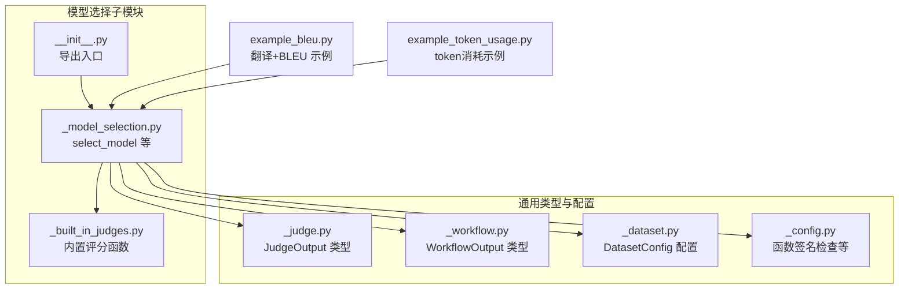
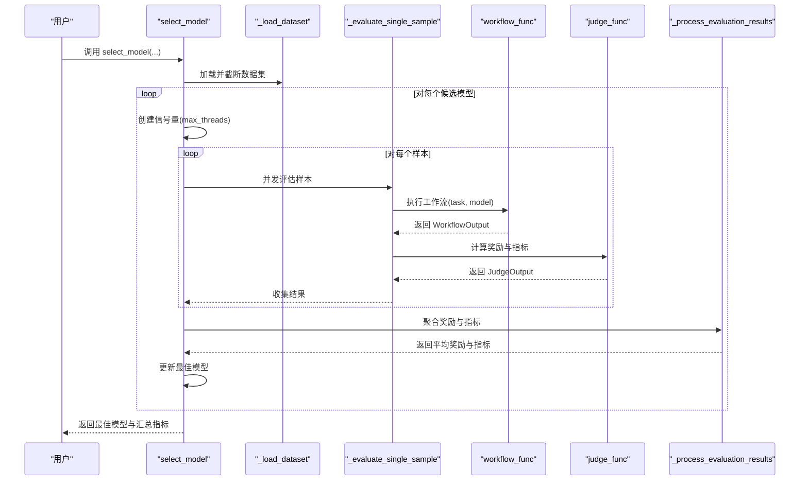
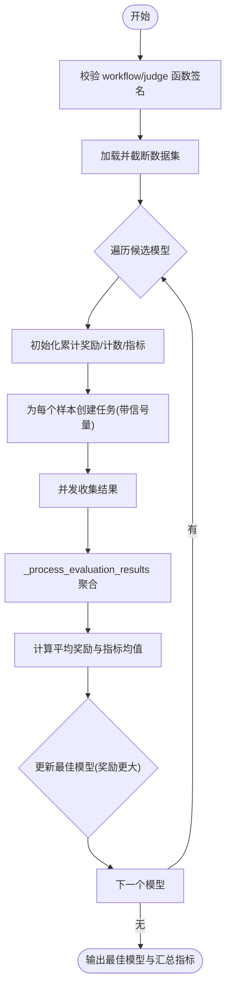
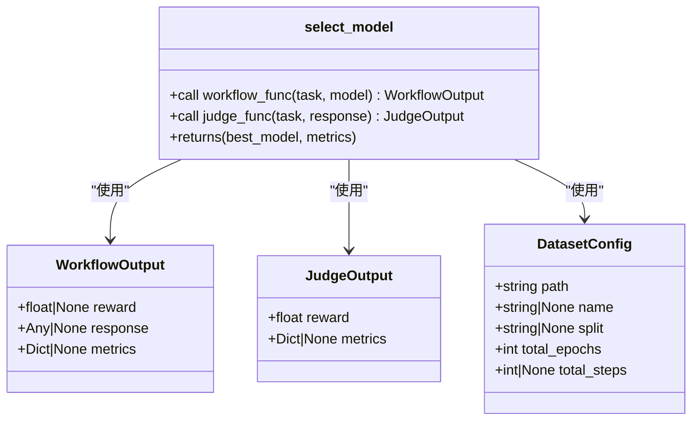
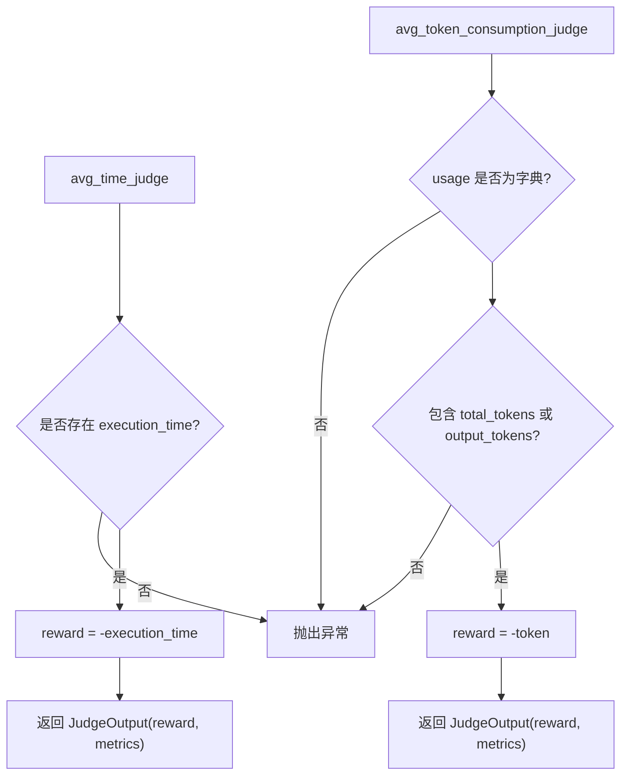
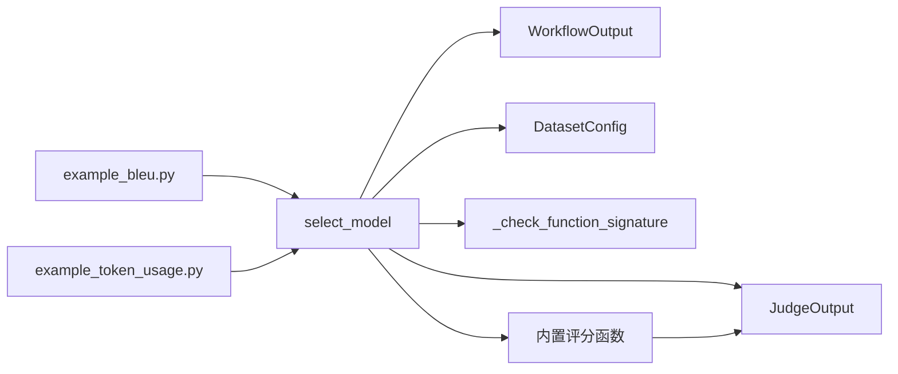

# 模型选择

<cite>
**本文引用的文件**
- [src/agentscope/tuner/model_selection/_model_selection.py](file://src/agentscope/tuner/model_selection/_model_selection.py)
- [src/agentscope/tuner/model_selection/_built_in_judges.py](file://src/agentscope/tuner/model_selection/_built_in_judges.py)
- [src/agentscope/tuner/model_selection/__init__.py](file://src/agentscope/tuner/model_selection/__init__.py)
- [src/agentscope/tuner/_judge.py](file://src/agentscope/tuner/_judge.py)
- [src/agentscope/tuner/_workflow.py](file://src/agentscope/tuner/_workflow.py)
- [src/agentscope/tuner/_dataset.py](file://src/agentscope/tuner/_dataset.py)
- [src/agentscope/tuner/_config.py](file://src/agentscope/tuner/_config.py)
- [examples/tuner/model_selection/example_bleu.py](file://examples/tuner/model_selection/example_bleu.py)
- [examples/tuner/model_selection/example_token_usage.py](file://examples/tuner/model_selection/example_token_usage.py)
- [examples/tuner/model_selection/README.md](file://examples/tuner/model_selection/README.md)
</cite>

## 目录
1. [简介](#简介)
2. [项目结构](#项目结构)
3. [核心组件](#核心组件)
4. [架构总览](#架构总览)
5. [详细组件分析](#详细组件分析)
6. [依赖分析](#依赖分析)
7. [性能考量](#性能考量)
8. [故障排查指南](#故障排查指南)
9. [结论](#结论)
10. [附录](#附录)

## 简介
本技术文档围绕 AgentScope 的模型选择功能展开，重点解释 select_model 函数的实现机制，包括模型评估流程、并发控制、结果聚合与排序逻辑；同时梳理内置评估指标（如执行时间、token 消耗）与可扩展的自定义评分函数（如 BLEU）的设计思路，并给出配置项说明、最佳实践与使用示例，帮助读者在多模型候选场景下高效完成模型筛选与决策。

## 项目结构
与模型选择直接相关的模块位于 tuner/model_selection 子包，配合通用的评测接口（JudgeOutput）、工作流输出（WorkflowOutput）、数据集配置（DatasetConfig）以及签名检查工具（_config 中的函数签名校验）共同构成完整的评估流水线。

图示来源
- [src/agentscope/tuner/model_selection/_model_selection.py:75-241](file://src/agentscope/tuner/model_selection/_model_selection.py#L75-L241)
- [src/agentscope/tuner/model_selection/_built_in_judges.py:8-112](file://src/agentscope/tuner/model_selection/_built_in_judges.py#L8-L112)
- [src/agentscope/tuner/model_selection/__init__.py:1-8](file://src/agentscope/tuner/model_selection/__init__.py#L1-L8)
- [src/agentscope/tuner/_judge.py:7-18](file://src/agentscope/tuner/_judge.py#L7-L18)
- [src/agentscope/tuner/_workflow.py:7-29](file://src/agentscope/tuner/_workflow.py#L7-L29)
- [src/agentscope/tuner/_dataset.py:8-37](file://src/agentscope/tuner/_dataset.py#L8-L37)
- [src/agentscope/tuner/_config.py:184-268](file://src/agentscope/tuner/_config.py#L184-L268)
- [examples/tuner/model_selection/example_bleu.py:152-183](file://examples/tuner/model_selection/example_bleu.py#L152-L183)
- [examples/tuner/model_selection/example_token_usage.py:77-107](file://examples/tuner/model_selection/example_token_usage.py#L77-L107)

章节来源
- [src/agentscope/tuner/model_selection/_model_selection.py:75-241](file://src/agentscope/tuner/model_selection/_model_selection.py#L75-L241)
- [src/agentscope/tuner/model_selection/_built_in_judges.py:8-112](file://src/agentscope/tuner/model_selection/_built_in_judges.py#L8-L112)
- [src/agentscope/tuner/model_selection/__init__.py:1-8](file://src/agentscope/tuner/model_selection/__init__.py#L1-L8)
- [src/agentscope/tuner/_judge.py:7-18](file://src/agentscope/tuner/_judge.py#L7-L18)
- [src/agentscope/tuner/_workflow.py:7-29](file://src/agentscope/tuner/_workflow.py#L7-L29)
- [src/agentscope/tuner/_dataset.py:8-37](file://src/agentscope/tuner/_dataset.py#L8-L37)
- [src/agentscope/tuner/_config.py:184-268](file://src/agentscope/tuner/_config.py#L184-L268)
- [examples/tuner/model_selection/example_bleu.py:152-183](file://examples/tuner/model_selection/example_bleu.py#L152-L183)
- [examples/tuner/model_selection/example_token_usage.py:77-107](file://examples/tuner/model_selection/example_token_usage.py#L77-L107)

## 核心组件
- select_model：主入口，负责加载数据集、并发执行工作流、调用评分函数、聚合指标并返回最佳模型及汇总指标。
- 内置评分函数：avg_time_judge、avg_token_consumption_judge，分别基于执行时延与 token 消耗进行评分（越小越好，转换为越大越优的奖励）。
- 自定义评分函数：示例中使用 BLEU 作为翻译质量指标，返回奖励与额外指标字典。
- 类型与配置：JudgeOutput、WorkflowOutput、DatasetConfig、函数签名检查工具，确保输入输出规范与兼容性。

章节来源
- [src/agentscope/tuner/model_selection/_model_selection.py:75-241](file://src/agentscope/tuner/model_selection/_model_selection.py#L75-L241)
- [src/agentscope/tuner/model_selection/_built_in_judges.py:8-112](file://src/agentscope/tuner/model_selection/_built_in_judges.py#L8-L112)
- [src/agentscope/tuner/_judge.py:7-18](file://src/agentscope/tuner/_judge.py#L7-L18)
- [src/agentscope/tuner/_workflow.py:7-29](file://src/agentscope/tuner/_workflow.py#L7-L29)
- [src/agentscope/tuner/_dataset.py:8-37](file://src/agentscope/tuner/_dataset.py#L8-L37)
- [src/agentscope/tuner/_config.py:184-268](file://src/agentscope/tuner/_config.py#L184-L268)

## 架构总览
下图展示从数据集到最佳模型选择的端到端流程：数据集加载、样本并发评估、工作流执行、评分函数计算、指标聚合与排序、最终结果输出。

图示来源
- [src/agentscope/tuner/model_selection/_model_selection.py:75-241](file://src/agentscope/tuner/model_selection/_model_selection.py#L75-L241)
- [src/agentscope/tuner/model_selection/_model_selection.py:304-404](file://src/agentscope/tuner/model_selection/_model_selection.py#L304-L404)
- [src/agentscope/tuner/model_selection/_model_selection.py:243-301](file://src/agentscope/tuner/model_selection/_model_selection.py#L243-L301)

## 详细组件分析

### select_model 实现机制
- 输入参数与约束
  - workflow_func：异步工作流函数，接收 task 与 model，返回 WorkflowOutput。
  - judge_func：异步评分函数，接收 task 与 response（复合对象），返回 JudgeOutput。
  - train_dataset：DatasetConfig，支持 path、name、split、total_epochs、total_steps 等字段。
  - candidate_models：候选模型序列，至少两个。
  - max_threads：并发采样上限，默认 2。
- 数据集加载
  - 使用 datasets.load_dataset 加载 split，并按 total_steps 截断。
- 并发评估
  - 使用 asyncio.Semaphore 控制最大并发数。
  - 对每个样本创建任务，使用 asyncio.gather 并行收集结果。
- 结果处理
  - _process_evaluation_results 聚合奖励与指标，计算每模型平均奖励与各指标均值。
- 排序与返回
  - 以平均奖励为排序依据，取最大者作为最佳模型，并返回其汇总指标字典。

图示来源
- [src/agentscope/tuner/model_selection/_model_selection.py:75-241](file://src/agentscope/tuner/model_selection/_model_selection.py#L75-L241)
- [src/agentscope/tuner/model_selection/_model_selection.py:243-301](file://src/agentscope/tuner/model_selection/_model_selection.py#L243-L301)

章节来源
- [src/agentscope/tuner/model_selection/_model_selection.py:75-241](file://src/agentscope/tuner/model_selection/_model_selection.py#L75-L241)
- [src/agentscope/tuner/model_selection/_model_selection.py:243-301](file://src/agentscope/tuner/model_selection/_model_selection.py#L243-L301)

### 工作流与评分接口
- WorkflowOutput：包含 response 与 metrics 字段，供 judge_func 使用。
- JudgeOutput：包含 reward 与 metrics 字段，reward 数值越大表示性能越好。
- 函数签名检查：通过 _check_function_signature 约束 workflow_func 与 judge_func 的参数集合，避免运行期错误。

图示来源
- [src/agentscope/tuner/_workflow.py:7-29](file://src/agentscope/tuner/_workflow.py#L7-L29)
- [src/agentscope/tuner/_judge.py:7-18](file://src/agentscope/tuner/_judge.py#L7-L18)
- [src/agentscope/tuner/_dataset.py:8-37](file://src/agentscope/tuner/_dataset.py#L8-L37)
- [src/agentscope/tuner/model_selection/_model_selection.py:75-110](file://src/agentscope/tuner/model_selection/_model_selection.py#L75-L110)

章节来源
- [src/agentscope/tuner/_workflow.py:7-29](file://src/agentscope/tuner/_workflow.py#L7-L29)
- [src/agentscope/tuner/_judge.py:7-18](file://src/agentscope/tuner/_judge.py#L7-L18)
- [src/agentscope/tuner/_dataset.py:8-37](file://src/agentscope/tuner/_dataset.py#L8-L37)
- [src/agentscope/tuner/_config.py:184-268](file://src/agentscope/tuner/_config.py#L184-L268)

### 内置评估指标与评分函数
- avg_time_judge
  - 输入：response.metrics 必须包含 execution_time。
  - 行为：将执行时间取负作为奖励，使“更短时间”对应“更高奖励”。
  - 输出：JudgeOutput(reward=-execution_time, metrics={"avg_time_seconds": 原值})。
- avg_token_consumption_judge
  - 输入：response.metrics.usage 必须包含 total_tokens 或 output_tokens。
  - 行为：将 token 消耗取负作为奖励，使“更低消耗”对应“更高奖励”。
  - 输出：JudgeOutput(reward=-token, metrics={"token_consumed": 原值})。

图示来源
- [src/agentscope/tuner/model_selection/_built_in_judges.py:8-112](file://src/agentscope/tuner/model_selection/_built_in_judges.py#L8-L112)

章节来源
- [src/agentscope/tuner/model_selection/_built_in_judges.py:8-112](file://src/agentscope/tuner/model_selection/_built_in_judges.py#L8-L112)

### 自定义评分函数（以 BLEU 为例）
- 输入：task 与 response（包含 response 与 metrics）。
- 处理：从 response 提取预测文本，从 task 提取参考译文，计算 BLEU 分数。
- 输出：JudgeOutput(reward=BLEU分数, metrics={"bleu","brevity_penalty","ratio"})。
- 示例脚本展示了如何组织数据集路径、工作流与评分函数，并调用 select_model 完成模型选择。

章节来源
- [examples/tuner/model_selection/example_bleu.py:94-150](file://examples/tuner/model_selection/example_bleu.py#L94-L150)
- [examples/tuner/model_selection/example_bleu.py:152-183](file://examples/tuner/model_selection/example_bleu.py#L152-L183)
- [examples/tuner/model_selection/README.md:149-182](file://examples/tuner/model_selection/README.md#L149-L182)

### 评估流程与并发控制
- 并发采样：通过 asyncio.Semaphore 控制最大并发数，避免资源争用。
- 异常处理：对单样本评估失败进行跳过记录日志，不影响整体统计。
- 指标聚合：对每个样本的 metrics 进行累加，最后按样本数量取均值，生成 *_avg 指标名。

章节来源
- [src/agentscope/tuner/model_selection/_model_selection.py:150-205](file://src/agentscope/tuner/model_selection/_model_selection.py#L150-L205)
- [src/agentscope/tuner/model_selection/_model_selection.py:243-301](file://src/agentscope/tuner/model_selection/_model_selection.py#L243-L301)

## 依赖分析
- 组件耦合
  - select_model 依赖 WorkflowOutput/JudgeOutput 类型、DatasetConfig 配置、函数签名检查工具。
  - 评分函数独立于具体模型，仅依赖 WorkflowOutput.metrics 与 task。
- 外部依赖
  - datasets 库用于加载数据集。
  - opentelemetry 用于追踪与导出指标（通过 InMemoryExporter）。
  - 可选：sacrebleu 用于 BLEU 评分。
- 导出接口
  - model_selection 包导出 select_model 与内置评分函数，便于外部直接使用。

图示来源
- [src/agentscope/tuner/model_selection/_model_selection.py:75-110](file://src/agentscope/tuner/model_selection/_model_selection.py#L75-L110)
- [src/agentscope/tuner/model_selection/_built_in_judges.py:8-112](file://src/agentscope/tuner/model_selection/_built_in_judges.py#L8-L112)
- [src/agentscope/tuner/_judge.py:7-18](file://src/agentscope/tuner/_judge.py#L7-L18)
- [src/agentscope/tuner/_workflow.py:7-29](file://src/agentscope/tuner/_workflow.py#L7-L29)
- [src/agentscope/tuner/_dataset.py:8-37](file://src/agentscope/tuner/_dataset.py#L8-L37)
- [src/agentscope/tuner/_config.py:184-268](file://src/agentscope/tuner/_config.py#L184-L268)
- [examples/tuner/model_selection/example_bleu.py:152-183](file://examples/tuner/model_selection/example_bleu.py#L152-L183)
- [examples/tuner/model_selection/example_token_usage.py:77-107](file://examples/tuner/model_selection/example_token_usage.py#L77-L107)

章节来源
- [src/agentscope/tuner/model_selection/__init__.py:1-8](file://src/agentscope/tuner/model_selection/__init__.py#L1-L8)
- [src/agentscope/tuner/_config.py:184-268](file://src/agentscope/tuner/_config.py#L184-L268)

## 性能考量
- 并发度控制：max_threads 限制同时评估的样本数，建议根据硬件与 API 速率限制合理设置。
- 指标开销：execution_time、input_tokens、output_tokens、total_tokens 等指标由工作流与追踪导出器自动采集，注意网络与模型调用延迟的影响。
- 数据集规模：total_steps 可限制评估样本总数，平衡准确度与耗时。
- 评分稳定性：当样本量较小时，平均奖励可能波动较大，建议增加样本或重复实验以提高统计稳健性。

## 故障排查指南
- 缺少必要参数
  - workflow_func/judge_func 参数不匹配：检查是否包含必需参数，避免出现 *args/**kwargs。
- 数据集加载失败
  - 未安装 datasets 库或路径/split 错误：根据提示安装依赖并确认 DatasetConfig 配置。
- 评分函数异常
  - avg_time_judge：缺少 execution_time；avg_token_consumption_judge：usage 缺失或格式不符。
- 单样本评估失败
  - 日志会记录警告并跳过该样本，检查工作流与评分函数的健壮性与输入格式。

章节来源
- [src/agentscope/tuner/_config.py:184-268](file://src/agentscope/tuner/_config.py#L184-L268)
- [src/agentscope/tuner/model_selection/_model_selection.py:51-72](file://src/agentscope/tuner/model_selection/_model_selection.py#L51-L72)
- [src/agentscope/tuner/model_selection/_built_in_judges.py:33-43](file://src/agentscope/tuner/model_selection/_built_in_judges.py#L33-L43)
- [src/agentscope/tuner/model_selection/_built_in_judges.py:79-101](file://src/agentscope/tuner/model_selection/_built_in_judges.py#L79-L101)

## 结论
select_model 提供了统一的模型选择框架：通过工作流抽象与评分函数解耦，结合并发评估与指标聚合，能够稳定地在多候选模型中选出最优者。内置的时延与 token 消耗评分满足效率导向场景，同时支持自定义评分函数（如 BLEU）覆盖质量导向场景。配合合理的数据集配置与并发度设置，可在不同资源约束下实现高效、可靠的模型筛选。

## 附录

### 配置选项与使用要点
- DatasetConfig
  - path/name/split：指定数据集来源与切分。
  - total_epochs/total_steps：控制评估轮数与样本总量。
- select_model
  - workflow_func：异步工作流，接收 task 与 model。
  - judge_func：异步评分函数，返回 JudgeOutput。
  - candidate_models：至少两个候选模型。
  - max_threads：并发采样上限。
- 内置评分函数
  - avg_time_judge：基于 execution_time 的效率评分。
  - avg_token_consumption_judge：基于 usage 的成本评分。

章节来源
- [src/agentscope/tuner/_dataset.py:8-37](file://src/agentscope/tuner/_dataset.py#L8-L37)
- [src/agentscope/tuner/model_selection/_model_selection.py:75-110](file://src/agentscope/tuner/model_selection/_model_selection.py#L75-L110)
- [src/agentscope/tuner/model_selection/_built_in_judges.py:8-112](file://src/agentscope/tuner/model_selection/_built_in_judges.py#L8-L112)

### 最佳实践
- 数据准备
  - 明确任务目标与参考标准，构建结构化数据集（如 JSON/Parquet），包含问题与参考答案。
  - 使用 DatasetConfig.preview 预览样本，确保字段一致。
- 评估策略
  - 先用小规模 total_steps 快速筛选，再扩大样本验证稳定性。
  - 合理设置 max_threads，避免 API 限流或资源瓶颈。
- 结果解读
  - 关注平均奖励与 *_avg 指标，结合业务目标权衡质量与效率。
  - 若存在显著差异，可进一步做分层分析或 A/B 对照实验。

### 使用示例与性能对比案例
- 翻译任务 + BLEU 评分
  - 示例脚本展示了如何定义工作流、评分函数与数据集配置，并调用 select_model 完成模型选择。
- token 消耗最小化
  - 示例脚本使用内置 avg_token_consumption_judge，演示在相同任务上选择更省 token 的模型。

章节来源
- [examples/tuner/model_selection/example_bleu.py:152-183](file://examples/tuner/model_selection/example_bleu.py#L152-L183)
- [examples/tuner/model_selection/example_token_usage.py:77-107](file://examples/tuner/model_selection/example_token_usage.py#L77-L107)
- [examples/tuner/model_selection/README.md:238-264](file://examples/tuner/model_selection/README.md#L238-L264)