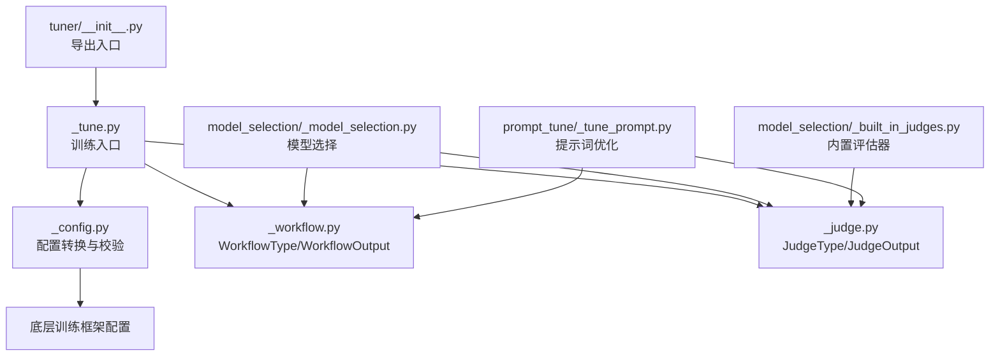
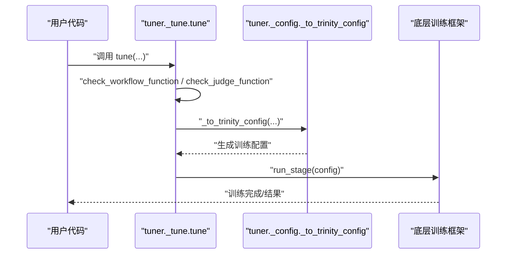
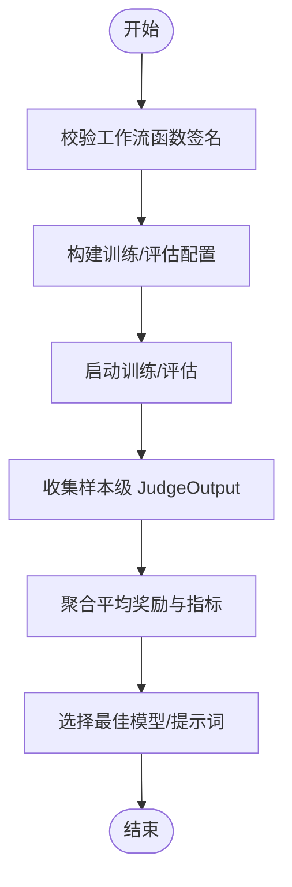
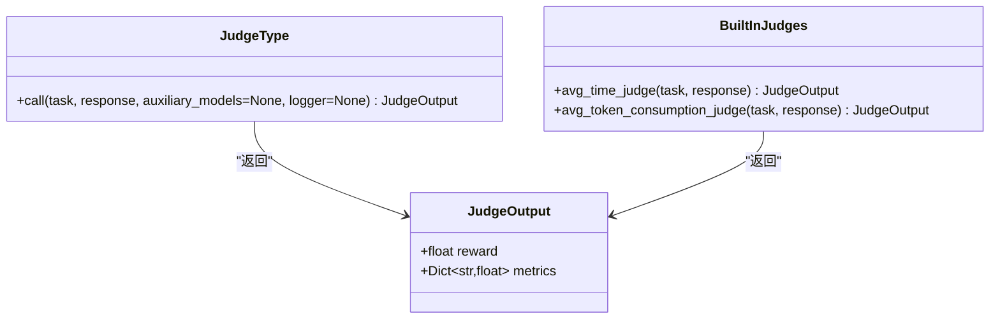
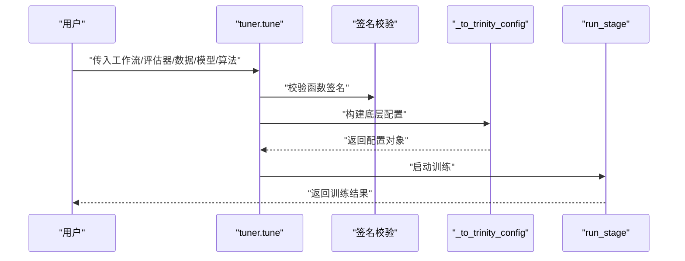
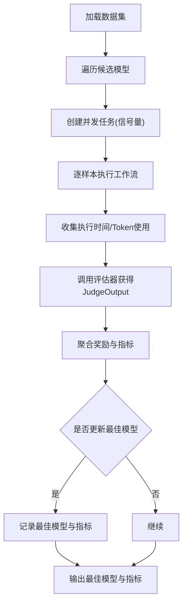
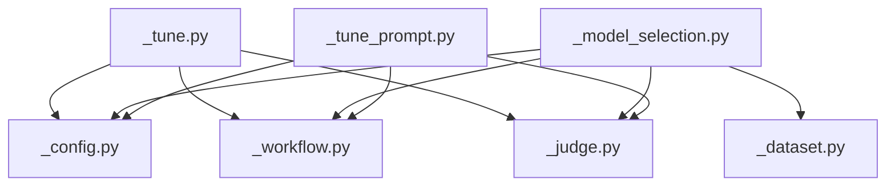

# 调优工作流

<cite>
**本文引用的文件**
- [src/agentscope/tuner/__init__.py](file://src/agentscope/tuner/__init__.py)
- [src/agentscope/tuner/_tune.py](file://src/agentscope/tuner/_tune.py)
- [src/agentscope/tuner/_config.py](file://src/agentscope/tuner/_config.py)
- [src/agentscope/tuner/_workflow.py](file://src/agentscope/tuner/_workflow.py)
- [src/agentscope/tuner/_judge.py](file://src/agentscope/tuner/_judge.py)
- [src/agentscope/tuner/model_selection/_model_selection.py](file://src/agentscope/tuner/model_selection/_model_selection.py)
- [src/agentscope/tuner/model_selection/_built_in_judges.py](file://src/agentscope/tuner/model_selection/_built_in_judges.py)
- [src/agentscope/tuner/prompt_tune/_tune_prompt.py](file://src/agentscope/tuner/prompt_tune/_tune_prompt.py)
- [examples/tuner/model_tuning/main.py](file://examples/tuner/model_tuning/main.py)
- [examples/tuner/prompt_tuning/example.py](file://examples/tuner/prompt_tuning/example.py)
- [examples/tuner/model_selection/README.md](file://examples/tuner/model_selection/README.md)
- [examples/tuner/model_tuning/README.md](file://examples/tuner/model_tuning/README.md)
- [tests/tuner_test.py](file://tests/tuner_test.py)
</cite>

## 目录
1. [简介](#简介)
2. [项目结构](#项目结构)
3. [核心组件](#核心组件)
4. [架构总览](#架构总览)
5. [详细组件分析](#详细组件分析)
6. [依赖分析](#依赖分析)
7. [性能考量](#性能考量)
8. [故障排查指南](#故障排查指南)
9. [结论](#结论)
10. [附录](#附录)

## 简介
本技术文档围绕 AgentScope 的“调优工作流”子系统，系统化阐述以下内容：
- 工作流类型与执行模式：工作流函数签名、输出结构、输入参数约束；以及在模型选择场景中对并发/串行执行的策略与抽象。
- 配置系统：训练/评估数据集、算法配置、模型配置、辅助模型、监控类型等如何被转换并注入到底层训练框架。
- 评估器配置：JudgeType 类型、JudgeOutput 结构、评估函数接口校验与内置评估器（如耗时、token 消耗）。
- 执行流程：从入口函数到配置转换、到训练框架启动、再到结果聚合与指标统计的全链路。
- 设计模式：可扩展性（支持多模型、多评估器）、错误恢复（异常样本跳过、日志记录）、性能监控（OpenTelemetry、token 统计）。
- 实战示例：完整的工作流配置、自定义评估器实现、批量调优案例。

## 项目结构
AgentScope 的调优模块位于 src/agentscope/tuner 下，主要由以下层次构成：
- 入口与导出：对外暴露 tune、select_model、tune_prompt 等能力，并统一导出类型与工具函数。
- 核心执行：tune 将用户提供的工作流与评估器、数据集、算法、模型等配置转换为底层训练框架所需的配置并启动训练。
- 配置转换：_config 提供将高层配置映射到底层训练框架配置的能力，并进行函数签名检查。
- 数据与算法：DatasetConfig、AlgorithmConfig 等配置对象用于描述数据集与算法超参。
- 评估器：JudgeType/JudgeOutput 定义评估器接口与输出；内置 judge 函数用于常见指标（如耗时、token 消耗）。
- 模型选择：select_model 支持候选模型的批量评估与最佳模型选择，内置 judge 适配与并发控制。
- 提示词调优：tune_prompt 基于 DSPy 的 MIPROv2 对系统提示词进行优化，并可选地进行基准对比。



图表来源
- [src/agentscope/tuner/__init__.py:15-31](file://src/agentscope/tuner/__init__.py#L15-L31)
- [src/agentscope/tuner/_tune.py:16-97](file://src/agentscope/tuner/_tune.py#L16-L97)
- [src/agentscope/tuner/_config.py:20-122](file://src/agentscope/tuner/_config.py#L20-L122)
- [src/agentscope/tuner/_workflow.py:7-55](file://src/agentscope/tuner/_workflow.py#L7-L55)
- [src/agentscope/tuner/_judge.py:7-40](file://src/agentscope/tuner/_judge.py#L7-L40)
- [src/agentscope/tuner/model_selection/_model_selection.py:75-241](file://src/agentscope/tuner/model_selection/_model_selection.py#L75-L241)
- [src/agentscope/tuner/model_selection/_built_in_judges.py:8-112](file://src/agentscope/tuner/model_selection/_built_in_judges.py#L8-L112)
- [src/agentscope/tuner/prompt_tune/_tune_prompt.py:102-254](file://src/agentscope/tuner/prompt_tune/_tune_prompt.py#L102-L254)

章节来源
- [src/agentscope/tuner/__init__.py:15-31](file://src/agentscope/tuner/__init__.py#L15-L31)
- [src/agentscope/tuner/_tune.py:16-97](file://src/agentscope/tuner/_tune.py#L16-L97)

## 核心组件
- 工作流类型与输出
  - WorkflowType：异步函数类型，接收 task、model（主模型）、可选 auxiliary_models、logger，返回 WorkflowOutput。
  - WorkflowOutput：包含 reward（直接奖励）、response（评估器输入）、metrics（额外指标）。
- 评估器类型与输出
  - JudgeType：异步函数类型，接收 task、response（来自工作流输出的 response 字段）、可选 auxiliary_models、logger，返回 JudgeOutput。
  - JudgeOutput：包含 reward（标量奖励）、metrics（可选指标字典）。
- 配置与校验
  - check_workflow_function / check_judge_function：基于签名检查确保函数参数符合要求（不允许 *args/**kwargs，仅允许指定的必需/可选参数）。
- 训练入口
  - tune：负责校验函数签名、构建配置、启动训练框架；支持 DLC Ray 集群的自动部署与清理。
- 模型选择
  - select_model：对候选模型进行批量评估，使用信号量控制并发，聚合平均奖励与指标，返回最佳模型及指标。
- 提示词优化
  - tune_prompt：基于 DSPy 的 MIPROv2 对系统提示词进行优化，支持加载本地或远程数据集、可选基线对比与评估。

章节来源
- [src/agentscope/tuner/_workflow.py:7-55](file://src/agentscope/tuner/_workflow.py#L7-L55)
- [src/agentscope/tuner/_judge.py:7-40](file://src/agentscope/tuner/_judge.py#L7-L40)
- [src/agentscope/tuner/_config.py:184-268](file://src/agentscope/tuner/_config.py#L184-L268)
- [src/agentscope/tuner/_tune.py:16-97](file://src/agentscope/tuner/_tune.py#L16-L97)
- [src/agentscope/tuner/model_selection/_model_selection.py:75-241](file://src/agentscope/tuner/model_selection/_model_selection.py#L75-L241)
- [src/agentscope/tuner/prompt_tune/_tune_prompt.py:102-254](file://src/agentscope/tuner/prompt_tune/_tune_prompt.py#L102-L254)

## 架构总览
下图展示了从用户代码到训练框架的整体调用链：用户通过 tune 或 select_model 提交工作流与评估器，系统完成函数签名校验、配置转换，最终委托底层训练框架执行。



图表来源
- [src/agentscope/tuner/_tune.py:61-96](file://src/agentscope/tuner/_tune.py#L61-L96)
- [src/agentscope/tuner/_config.py:20-122](file://src/agentscope/tuner/_config.py#L20-L122)

## 详细组件分析

### 工作流类型与执行模式
- 工作流函数签名
  - 必需参数：task、model
  - 可选参数：auxiliary_models、logger
  - 不允许 *args、**kwargs
- 执行模式
  - 在模型选择场景中，select_model 以并发方式对每个样本调用工作流函数，使用信号量限制最大并发度，保证资源可控。
  - 在批量评估中，对每个候选模型独立评估，聚合平均奖励与指标，最终选择最佳模型。
- 输出结构
  - WorkflowOutput.response 作为 JudgeType 的输入；可附加 metrics 供评估器使用。



图表来源
- [src/agentscope/tuner/_config.py:184-268](file://src/agentscope/tuner/_config.py#L184-L268)
- [src/agentscope/tuner/model_selection/_model_selection.py:150-241](file://src/agentscope/tuner/model_selection/_model_selection.py#L150-L241)

章节来源
- [src/agentscope/tuner/_workflow.py:7-55](file://src/agentscope/tuner/_workflow.py#L7-L55)
- [src/agentscope/tuner/_config.py:184-268](file://src/agentscope/tuner/_config.py#L184-L268)
- [src/agentscope/tuner/model_selection/_model_selection.py:150-241](file://src/agentscope/tuner/model_selection/_model_selection.py#L150-L241)

### 评估器配置与内置评估器
- JudgeType/JudgeOutput
  - 评估器函数签名：task、response（来自工作流输出的 response 字段）、可选 auxiliary_models、logger
  - 返回 JudgeOutput，包含 reward 与可选 metrics
- 内置评估器
  - avg_time_judge：以负耗时作为奖励，越短越好；同时保留原始耗时指标。
  - avg_token_consumption_judge：以负 token 消耗作为奖励，越低越好；支持 total_tokens 或 output_tokens。
- 函数签名校验
  - check_judge_function 与 check_workflow_function 使用统一的签名检查逻辑，确保参数合法。



图表来源
- [src/agentscope/tuner/_judge.py:7-40](file://src/agentscope/tuner/_judge.py#L7-L40)
- [src/agentscope/tuner/model_selection/_built_in_judges.py:8-112](file://src/agentscope/tuner/model_selection/_built_in_judges.py#L8-L112)

章节来源
- [src/agentscope/tuner/_judge.py:7-40](file://src/agentscope/tuner/_judge.py#L7-L40)
- [src/agentscope/tuner/model_selection/_built_in_judges.py:8-112](file://src/agentscope/tuner/model_selection/_built_in_judges.py#L8-L112)
- [src/agentscope/tuner/_config.py:201-216](file://src/agentscope/tuner/_config.py#L201-L216)

### 训练入口与配置转换
- 入口函数 tune
  - 参数覆盖：workflow_func、judge_func、train_dataset、eval_dataset、model、auxiliary_models、algorithm、project_name、experiment_name、monitor_type、config_path
  - 校验：check_workflow_function、check_judge_function（若提供）
  - 配置转换：_to_trinity_config 将高层配置映射到底层训练框架配置，设置任务集、模型、算法、监控等
  - 启动：run_stage 执行训练；支持 DLC Ray 集群自动部署与清理
- 配置转换 _to_trinity_config
  - 设置项目名、实验名、监控类型
  - 注入默认工作流名称与参数（workflow_func、judge_func）
  - 处理主模型与辅助模型配置
  - 处理训练/评估数据集
  - 应用算法配置（算法类型、批大小、学习率、保存间隔、评估间隔等）



图表来源
- [src/agentscope/tuner/_tune.py:16-97](file://src/agentscope/tuner/_tune.py#L16-L97)
- [src/agentscope/tuner/_config.py:20-122](file://src/agentscope/tuner/_config.py#L20-L122)

章节来源
- [src/agentscope/tuner/_tune.py:16-97](file://src/agentscope/tuner/_tune.py#L16-L97)
- [src/agentscope/tuner/_config.py:20-122](file://src/agentscope/tuner/_config.py#L20-L122)

### 模型选择与批量评估
- 选择流程
  - 输入：workflow_func、judge_func、train_dataset、candidate_models、max_threads
  - 加载数据集并按 total_steps 限制样本数
  - 为每个候选模型创建并发任务，使用信号量控制并发度
  - 对每个样本调用 _evaluate_single_sample：执行工作流、收集执行时间与 token 使用、调用评估器得到 JudgeOutput
  - 聚合每个模型的总奖励、样本数与指标，计算平均奖励，选择最佳模型
- 指标聚合
  - 跳过 None 与异常样本
  - 仅对 JudgeOutput 类型样本计入样本数
  - 指标累加后按样本数平均



图表来源
- [src/agentscope/tuner/model_selection/_model_selection.py:75-241](file://src/agentscope/tuner/model_selection/_model_selection.py#L75-L241)
- [src/agentscope/tuner/model_selection/_model_selection.py:243-302](file://src/agentscope/tuner/model_selection/_model_selection.py#L243-L302)

章节来源
- [src/agentscope/tuner/model_selection/_model_selection.py:75-241](file://src/agentscope/tuner/model_selection/_model_selection.py#L75-L241)
- [src/agentscope/tuner/model_selection/_model_selection.py:243-302](file://src/agentscope/tuner/model_selection/_model_selection.py#L243-L302)

### 提示词优化（Prompt Tuning）
- 功能概述
  - 基于 DSPy 的 MIPROv2 对系统提示词进行优化
  - 支持本地文件或远程数据集加载
  - 可选基线对比与评估，输出优化后的提示词与指标
- 关键步骤
  - 校验工作流与评估器函数签名
  - 构建工作流包装模块
  - 初始化 LM、优化器（MIPROv2），编译得到优化后的预测器
  - 可选评估基线与优化结果，计算相对提升百分比

```mermaid
sequenceDiagram
participant U as "用户"
participant PT as "prompt_tune.tune_prompt"
participant DS as "数据集加载"
participant Wrap as "_WorkflowWrapperModule"
participant Opt as "DSPy MIPROv2"
participant Eval as "Evaluate"
U->>PT : "传入工作流/评估器/数据/配置"
PT->>DS : "加载训练/评估数据集"
PT->>Wrap : "封装工作流模块"
PT->>Opt : "初始化LM与优化器"
Opt-->>PT : "编译得到优化模块"
PT->>Eval : "可选基线与优化结果评估"
Eval-->>U : "返回优化提示词与指标"
```

图表来源
- [src/agentscope/tuner/prompt_tune/_tune_prompt.py:102-254](file://src/agentscope/tuner/prompt_tune/_tune_prompt.py#L102-L254)

章节来源
- [src/agentscope/tuner/prompt_tune/_tune_prompt.py:102-254](file://src/agentscope/tuner/prompt_tune/_tune_prompt.py#L102-L254)

### 示例与实战
- 模型微调示例
  - 展示了如何定义工作流函数、评估器函数、数据集与算法配置，并通过 tune 启动训练
- 提示词优化示例
  - 展示了如何使用 tune_prompt 对系统提示词进行优化，并可选地进行评估对比
- 模型选择指南
  - 提供了模型选择的三要素与整体流程说明

章节来源
- [examples/tuner/model_tuning/main.py:19-149](file://examples/tuner/model_tuning/main.py#L19-L149)
- [examples/tuner/prompt_tuning/example.py:24-124](file://examples/tuner/prompt_tuning/example.py#L24-L124)
- [examples/tuner/model_selection/README.md:1-28](file://examples/tuner/model_selection/README.md#L1-L28)
- [examples/tuner/model_tuning/README.md:1-111](file://examples/tuner/model_tuning/README.md#L1-L111)

## 依赖分析
- 组件耦合
  - tuner._tune 依赖 _config 进行配置转换，依赖 check_* 函数进行函数签名校验
  - model_selection._model_selection 依赖 _workflow、_judge、_dataset、_config 等模块
  - prompt_tune._tune_prompt 依赖 _workflow、_judge、_config、_wrapper 等模块
- 外部依赖
  - 训练框架：Trinity-RFT（通过 run_stage 启动）
  - 数据加载：datasets（用于模型选择与提示词优化的数据集加载）
  - 优化器：DSPy（MIPROv2）
  - 监控：OpenTelemetry（用于追踪与指标采集）



图表来源
- [src/agentscope/tuner/_tune.py:1-14](file://src/agentscope/tuner/_tune.py#L1-L14)
- [src/agentscope/tuner/model_selection/_model_selection.py:1-17](file://src/agentscope/tuner/model_selection/_model_selection.py#L1-L17)
- [src/agentscope/tuner/prompt_tune/_tune_prompt.py:1-18](file://src/agentscope/tuner/prompt_tune/_tune_prompt.py#L1-L18)

章节来源
- [src/agentscope/tuner/_tune.py:1-14](file://src/agentscope/tuner/_tune.py#L1-L14)
- [src/agentscope/tuner/model_selection/_model_selection.py:1-17](file://src/agentscope/tuner/model_selection/_model_selection.py#L1-L17)
- [src/agentscope/tuner/prompt_tune/_tune_prompt.py:1-18](file://src/agentscope/tuner/prompt_tune/_tune_prompt.py#L1-L18)

## 性能考量
- 并发控制
  - 模型选择中使用 asyncio.Semaphore 控制最大并发度，避免资源争用
- 指标采集
  - 自动采集执行时间与 token 使用（input_tokens、output_tokens、total_tokens），便于进一步优化
- 资源管理
  - 支持 DLC Ray 集群自动部署与清理，便于大规模分布式训练
- 可观测性
  - 通过 OpenTelemetry 追踪采样，结合内存导出器收集 chat_usage，辅助定位性能瓶颈

## 故障排查指南
- 函数签名不匹配
  - 现象：抛出缺失必需参数或包含不允许参数的错误
  - 排查：确认函数签名仅包含 task、model（可选 auxiliary_models、logger），且不使用 *args/**kwargs
- 数据集加载失败
  - 现象：导入 datasets 失败或路径/格式不正确
  - 排查：安装 datasets 包；确认路径存在且格式受支持（json/jsonl/csv/tsv/parquet/txt）
- 训练框架未安装
  - 现象：导入 Trinity-RFT 失败
  - 排查：安装 trinity-rft；或根据环境变量 USE_ALIYUN_PAI_DLC 控制是否启用 DLC 集群
- 样本评估异常
  - 现象：部分样本返回 None 或抛出异常
  - 处理：系统会跳过异常样本并记录警告；可在日志中查看具体样本索引与错误信息

章节来源
- [src/agentscope/tuner/_config.py:218-268](file://src/agentscope/tuner/_config.py#L218-L268)
- [src/agentscope/tuner/model_selection/_model_selection.py:266-273](file://src/agentscope/tuner/model_selection/_model_selection.py#L266-L273)
- [src/agentscope/tuner/_tune.py:64-68](file://src/agentscope/tuner/_tune.py#L64-L68)

## 结论
AgentScope 的调优工作流通过清晰的类型定义、严格的函数签名校验、灵活的配置转换与可观测的执行流程，为模型微调、模型选择与提示词优化提供了统一的工程化范式。其并发控制与指标采集能力有助于在复杂场景中稳定高效地完成大规模调优任务。

## 附录
- 完整工作流配置示例
  - 参考：[examples/tuner/model_tuning/main.py:104-149](file://examples/tuner/model_tuning/main.py#L104-L149)
- 自定义评估器实现
  - 参考：[examples/tuner/model_tuning/main.py:61-102](file://examples/tuner/model_tuning/main.py#L61-L102)
- 批量调优案例
  - 参考：[examples/tuner/prompt_tuning/example.py:96-124](file://examples/tuner/prompt_tuning/example.py#L96-L124)
- 函数签名校验测试
  - 参考：[tests/tuner_test.py:89-98](file://tests/tuner_test.py#L89-L98)