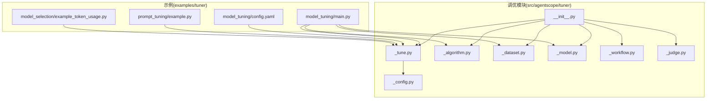
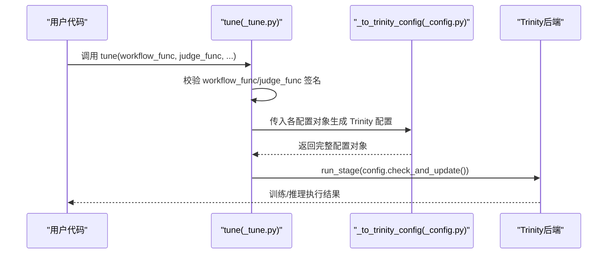
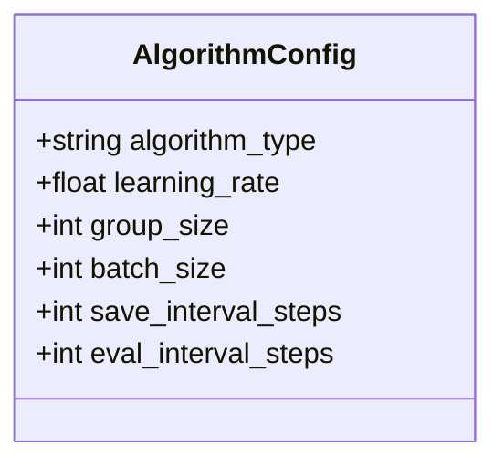
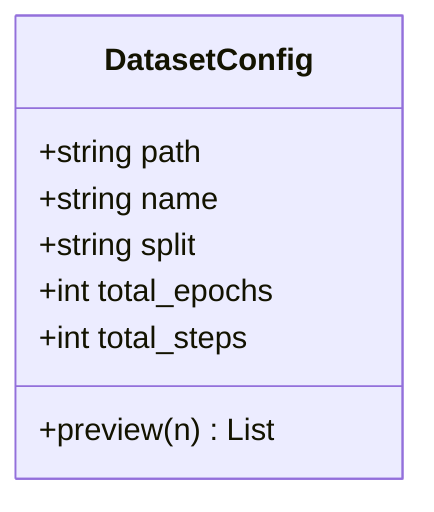
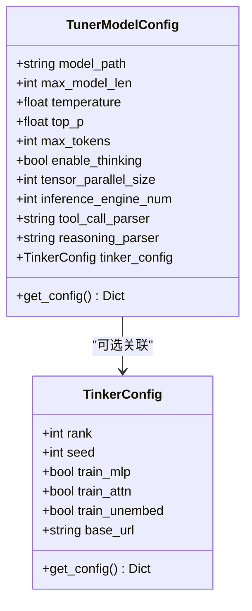
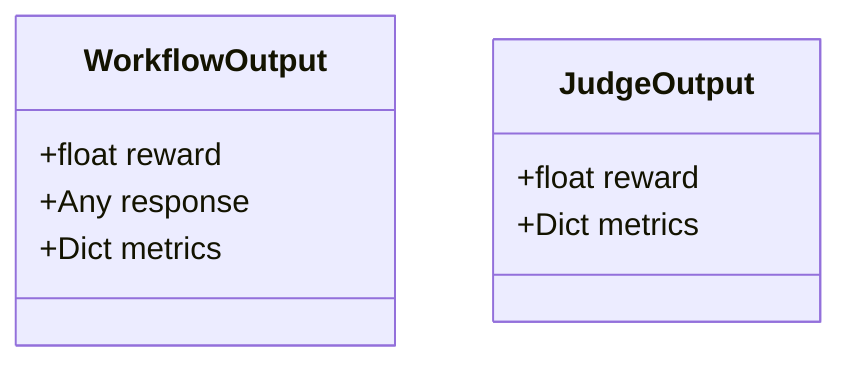
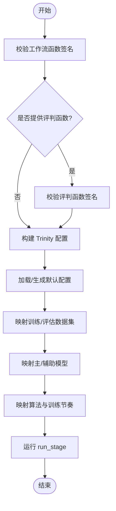
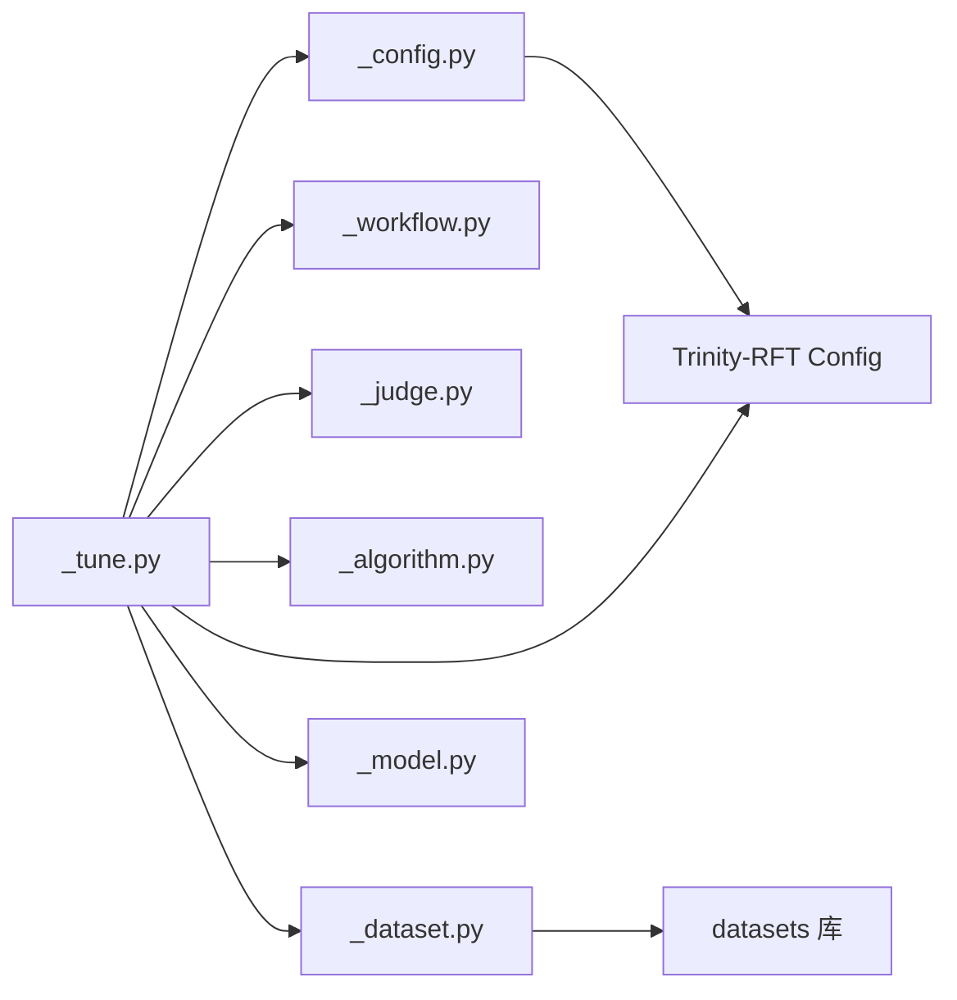

# 调优算法

<cite>
**本文引用的文件**
- [tuner/__init__.py](file://src/agentscope/tuner/__init__.py)
- [tuner/_tune.py](file://src/agentscope/tuner/_tune.py)
- [tuner/_config.py](file://src/agentscope/tuner/_config.py)
- [tuner/_algorithm.py](file://src/agentscope/tuner/_algorithm.py)
- [tuner/_dataset.py](file://src/agentscope/tuner/_dataset.py)
- [tuner/_model.py](file://src/agentscope/tuner/_model.py)
- [tuner/_workflow.py](file://src/agentscope/tuner/_workflow.py)
- [tuner/_judge.py](file://src/agentscope/tuner/_judge.py)
- [examples/tuner/model_tuning/main.py](file://examples/tuner/model_tuning/main.py)
- [examples/tuner/model_tuning/config.yaml](file://examples/tuner/model_tuning/config.yaml)
- [examples/tuner/prompt_tuning/example.py](file://examples/tuner/prompt_tuning/example.py)
- [examples/tuner/model_selection/example_token_usage.py](file://examples/tuner/model_selection/example_token_usage.py)
</cite>

## 目录
1. [简介](#简介)
2. [项目结构](#项目结构)
3. [核心组件](#核心组件)
4. [架构总览](#架构总览)
5. [详细组件分析](#详细组件分析)
6. [依赖分析](#依赖分析)
7. [性能考虑](#性能考虑)
8. [故障排查指南](#故障排查指南)
9. [结论](#结论)
10. [附录](#附录)

## 简介
本技术文档聚焦于 AgentScope 的调优算法模块，系统性阐述算法配置、数据集配置、模型配置与工作流/评判接口，并结合示例展示如何进行端到端的训练与提示词优化。文档同时给出算法选择指南与最佳实践，帮助用户在不同场景下高效完成模型与提示词的调优。

## 项目结构
调优模块位于 src/agentscope/tuner 下，对外通过入口模块导出统一 API；训练主流程封装在 _tune.py 中，配置转换逻辑在 _config.py 中，核心配置类分布在 _algorithm.py、_dataset.py、_model.py、_workflow.py、_judge.py 中。示例位于 examples/tuner 下，覆盖模型微调、提示词优化与模型选择等典型用法。

图表来源
- [tuner/__init__.py](file://src/agentscope/tuner/__init__.py)
- [tuner/_tune.py](file://src/agentscope/tuner/_tune.py)
- [tuner/_config.py](file://src/agentscope/tuner/_config.py)
- [tuner/_algorithm.py](file://src/agentscope/tuner/_algorithm.py)
- [tuner/_dataset.py](file://src/agentscope/tuner/_dataset.py)
- [tuner/_model.py](file://src/agentscope/tuner/_model.py)
- [tuner/_workflow.py](file://src/agentscope/tuner/_workflow.py)
- [tuner/_judge.py](file://src/agentscope/tuner/_judge.py)
- [examples/tuner/model_tuning/main.py](file://examples/tuner/model_tuning/main.py)
- [examples/tuner/model_tuning/config.yaml](file://examples/tuner/model_tuning/config.yaml)
- [examples/tuner/prompt_tuning/example.py](file://examples/tuner/prompt_tuning/example.py)
- [examples/tuner/model_selection/example_token_usage.py](file://examples/tuner/model_selection/example_token_usage.py)

章节来源
- [tuner/__init__.py](file://src/agentscope/tuner/__init__.py)
- [tuner/_tune.py](file://src/agentscope/tuner/_tune.py)

## 核心组件
- 算法配置 AlgorithmConfig：定义算法类型、学习率、组大小、批大小、保存间隔与评估间隔等关键超参。
- 数据集配置 DatasetConfig：支持 Hugging Face 风格的数据集加载与预览，可指定路径、名称、划分、总轮次与总步数。
- 模型配置 TunerModelConfig 与 TinkerConfig：描述模型路径、最大长度、采样参数、推理引擎数量、张量并行度以及可选的 Tinker 微调配置。
- 工作流与评判接口：WorkflowType 与 JudgeType 定义异步函数签名，WorkflowOutput/JudgeOutput 统一输出结构。
- 主流程 tune：校验函数签名、构建 Trinity-RFT 配置并启动训练或推理流程。

章节来源
- [tuner/_algorithm.py](file://src/agentscope/tuner/_algorithm.py)
- [tuner/_dataset.py](file://src/agentscope/tuner/_dataset.py)
- [tuner/_model.py](file://src/agentscope/tuner/_model.py)
- [tuner/_workflow.py](file://src/agentscope/tuner/_workflow.py)
- [tuner/_judge.py](file://src/agentscope/tuner/_judge.py)
- [tuner/_tune.py](file://src/agentscope/tuner/_tune.py)

## 架构总览
调优流程从 tune 入口开始，先对工作流与评判函数进行签名检查，随后将 AgentScope 配置转换为 Trinity-RFT 可识别的配置对象，再由 Trinity 后端执行训练/推理。数据集与模型配置分别映射到任务集与推理模型配置，算法配置映射到优化器与训练节奏。

图表来源
- [tuner/_tune.py](file://src/agentscope/tuner/_tune.py)
- [tuner/_config.py](file://src/agentscope/tuner/_config.py)

## 详细组件分析

### 算法配置 AlgorithmConfig
- 字段说明
  - algorithm_type：算法类型字符串，推荐使用 multi_step_grpo。
  - learning_rate：学习率。
  - group_size：需要组回放（如 GRPO）时的组规模。
  - batch_size：每步训练样本数。
  - save_interval_steps：保存模型检查点的步长间隔。
  - eval_interval_steps：评估模型的步长间隔。
- 设计要点
  - 使用 Pydantic BaseModel 提供类型安全与默认值管理。
  - 与 Trinity-RFT 的算法字段保持一致映射，便于无缝对接。

图表来源
- [tuner/_algorithm.py](file://src/agentscope/tuner/_algorithm.py)

章节来源
- [tuner/_algorithm.py](file://src/agentscope/tuner/_algorithm.py)

### 数据集配置 DatasetConfig
- 字段说明
  - path：数据集路径（支持 Hugging Face 风格）。
  - name：数据集子集名称。
  - split：使用的划分（如 train）。
  - total_epochs：总训练轮次。
  - total_steps：总训练步数（优先于 total_epochs）。
- 功能特性
  - preview(n)：使用 datasets.load_dataset 流式加载并打印前 n 条样本，便于快速验证数据格式。
- 注意事项
  - 若未安装 datasets 库，preview 将抛出导入异常。

图表来源
- [tuner/_dataset.py](file://src/agentscope/tuner/_dataset.py)

章节来源
- [tuner/_dataset.py](file://src/agentscope/tuner/_dataset.py)

### 模型配置 TunerModelConfig 与 TinkerConfig
- TunerModelConfig
  - model_path/max_model_len：模型路径与上下文/生成总长度。
  - temperature/top_p/max_tokens：采样策略与最大生成长度。
  - enable_thinking：是否启用特定系列模型的思考能力（如 Qwen3）。
  - tensor_parallel_size/inference_engine_num：张量并行与推理引擎数量。
  - tool_call_parser/reasoning_parser：解析器选择（默认适配 Qwen3）。
  - tinker_config：可选的 Tinker 微调配置。
  - get_config()：输出 Trinity-RFT 推理模型所需字典。
- TinkerConfig
  - rank、seed、train_mlp/train_attn/train_unembed、base_url。
  - get_config()：输出 Tinker 微调配置字典。

图表来源
- [tuner/_model.py](file://src/agentscope/tuner/_model.py)

章节来源
- [tuner/_model.py](file://src/agentscope/tuner/_model.py)

### 工作流与评判接口
- WorkflowType：异步工作流函数类型，接收 task、model、可选 auxiliary_models 与 logger，返回 WorkflowOutput。
- JudgeType：异步评判函数类型，接收 task、response、可选 auxiliary_models 与 logger，返回 JudgeOutput。
- WorkflowOutput/JudgeOutput：统一承载 reward、response 与 metrics 字段，便于后续奖励信号与指标上报。

图表来源
- [tuner/_workflow.py](file://src/agentscope/tuner/_workflow.py)
- [tuner/_judge.py](file://src/agentscope/tuner/_judge.py)

章节来源
- [tuner/_workflow.py](file://src/agentscope/tuner/_workflow.py)
- [tuner/_judge.py](file://src/agentscope/tuner/_judge.py)

### 主流程 tune 与配置转换
- 函数签名检查
  - check_workflow_function：要求存在 task、model 参数，允许 auxiliary_models、logger。
  - check_judge_function：要求存在 task、response 参数，允许 auxiliary_models、logger。
- 配置转换
  - _to_trinity_config：将 DatasetConfig、TunerModelConfig、AlgorithmConfig 映射到 Trinity-RFT 的 Config 结构，填充任务集、推理模型、辅助模型、算法参数与训练节奏。
- 运行控制
  - 支持通过 config_path 指定 YAML 配置文件，若未提供则使用内置模板。
  - 支持在特定环境变量触发时自动搭建/清理 Ray 集群（用于 DLC 场景）。

图表来源
- [tuner/_tune.py](file://src/agentscope/tuner/_tune.py)
- [tuner/_config.py](file://src/agentscope/tuner/_config.py)

章节来源
- [tuner/_tune.py](file://src/agentscope/tuner/_tune.py)
- [tuner/_config.py](file://src/agentscope/tuner/_config.py)

### 算法实现原理与调优策略
- 当前 AgentScope 调优模块通过与 Trinity-RFT 对接实现具体算法执行，算法类型由 AlgorithmConfig.algorithm_type 指定。模块本身不直接实现贝叶斯优化、网格搜索或随机搜索等算法细节，而是将配置传递给 Trinity-RFT 执行器以完成训练/推理。
- 因此，关于贝叶斯优化、网格搜索、随机搜索的具体实现细节不在本仓库中直接体现，建议参考 Trinity-RFT 文档获取更详细的算法说明与参数映射关系。

章节来源
- [tuner/_algorithm.py](file://src/agentscope/tuner/_algorithm.py)
- [tuner/_config.py](file://src/agentscope/tuner/_config.py)

### 算法选择指南
- 算法类型选择
  - multi_step_grpo：适用于多步推理场景，适合复杂任务与长上下文需求。
  - 其他类型请参考 Trinity-RFT 支持列表与任务特性匹配。
- 超参建议
  - learning_rate：从较小值开始（如 1e-6），根据收敛情况逐步调整。
  - group_size：在需要组回放的算法中，按资源与稳定性平衡选择（如 8）。
  - batch_size：结合显存与吞吐，逐步扩大至稳定收敛。
  - save_interval_steps/eval_interval_steps：根据实验成本与监控频率设定。
- 适用场景
  - 复杂推理任务（如数学问题求解）：优先 multi_step_grpo。
  - 快速原型与小规模实验：可降低 group_size 与 batch_size，缩短训练周期。

章节来源
- [tuner/_algorithm.py](file://src/agentscope/tuner/_algorithm.py)

### 算法配置示例
- 模型微调示例
  - 示例展示了如何配置 DatasetConfig、TunerModelConfig、AlgorithmConfig 并调用 tune 完成训练。
  - 参考路径：[examples/tuner/model_tuning/main.py](file://examples/tuner/model_tuning/main.py)
- YAML 配置示例
  - 提供了完整的 Trinity-RFT YAML 配置模板，涵盖项目名、模型、集群、缓冲区、同步器、训练器与监控等关键字段。
  - 参考路径：[examples/tuner/model_tuning/config.yaml](file://examples/tuner/model_tuning/config.yaml)
- 提示词优化示例
  - 展示了如何使用 tune_prompt 对系统提示进行优化，配合工作流与评判函数完成端到端流程。
  - 参考路径：[examples/tuner/prompt_tuning/example.py](file://examples/tuner/prompt_tuning/example.py)
- 模型选择示例
  - 展示了基于 token 消耗的模型选择流程，便于在多个候选模型中挑选性价比最优者。
  - 参考路径：[examples/tuner/model_selection/example_token_usage.py](file://examples/tuner/model_selection/example_token_usage.py)

章节来源
- [examples/tuner/model_tuning/main.py](file://examples/tuner/model_tuning/main.py)
- [examples/tuner/model_tuning/config.yaml](file://examples/tuner/model_tuning/config.yaml)
- [examples/tuner/prompt_tuning/example.py](file://examples/tuner/prompt_tuning/example.py)
- [examples/tuner/model_selection/example_token_usage.py](file://examples/tuner/model_selection/example_token_usage.py)

### 自定义算法实现
- 当前模块通过与 Trinity-RFT 的配置映射完成算法执行，未在本仓库内直接实现新的优化算法。若需扩展，请参考以下思路：
  - 在外部实现自定义算法（如贝叶斯优化、网格搜索、随机搜索），并通过 tune 的配置参数将新算法的超参映射到 AlgorithmConfig。
  - 通过自定义工作流与评判函数，将新算法的探索过程与奖励信号注入到现有框架中。
  - 建议结合 DatasetConfig 与 TunerModelConfig 的参数空间设计，确保自定义算法与数据/模型配置协同工作。

章节来源
- [tuner/_algorithm.py](file://src/agentscope/tuner/_algorithm.py)
- [tuner/_config.py](file://src/agentscope/tuner/_config.py)

### 性能基准测试结果
- 本仓库未包含具体的性能基准测试结果。建议在实际任务中：
  - 使用 DatasetConfig.preview 验证数据质量与格式。
  - 通过 AlgorithmConfig 的 eval_interval_steps 与 save_interval_steps 控制评估与保存频率。
  - 在示例工程中对比不同算法类型与超参组合的收敛速度与最终指标，形成任务特定的基准。

章节来源
- [tuner/_dataset.py](file://src/agentscope/tuner/_dataset.py)
- [tuner/_algorithm.py](file://src/agentscope/tuner/_algorithm.py)

## 依赖分析
- 内部依赖
  - tuner/__init__.py 导出 tune、各类配置类与工具函数，作为统一入口。
  - _tune.py 依赖 _config.py 的配置转换逻辑，以及 _workflow.py、_judge.py 的类型定义。
  - _config.py 依赖 Trinity-RFT 的 Config 结构，负责将 AgentScope 配置映射到 Trinity-RFT。
- 外部依赖
  - datasets：用于 DatasetConfig.preview 的数据加载。
  - trinity-rft：用于训练/推理执行与配置管理。
  - 示例依赖第三方模型服务（如 DashScope/OpenAI）与奖励函数库（如 Trinity-RFT 的数学奖励函数）。

图表来源
- [tuner/_tune.py](file://src/agentscope/tuner/_tune.py)
- [tuner/_config.py](file://src/agentscope/tuner/_config.py)
- [tuner/_dataset.py](file://src/agentscope/tuner/_dataset.py)

章节来源
- [tuner/__init__.py](file://src/agentscope/tuner/__init__.py)
- [tuner/_tune.py](file://src/agentscope/tuner/_tune.py)
- [tuner/_config.py](file://src/agentscope/tuner/_config.py)

## 性能考虑
- 数据加载
  - 使用 streaming=True 加载数据，避免一次性占用内存；通过 preview 快速验证数据结构。
- 模型与推理
  - 合理设置 tensor_parallel_size 与 inference_engine_num，平衡吞吐与延迟。
  - 控制 max_model_len 与 max_tokens，防止 OOM。
- 训练节奏
  - 通过 group_size、batch_size、save_interval_steps、eval_interval_steps 调整资源占用与可观测性。
- 监控与日志
  - 选择合适的 monitor_type（如 TensorBoard/W&B/MLflow/SwanLab），结合 eval_interval_steps 实时跟踪指标。

章节来源
- [tuner/_dataset.py](file://src/agentscope/tuner/_dataset.py)
- [tuner/_model.py](file://src/agentscope/tuner/_model.py)
- [tuner/_algorithm.py](file://src/agentscope/tuner/_algorithm.py)
- [tuner/_config.py](file://src/agentscope/tuner/_config.py)

## 故障排查指南
- 缺少依赖
  - 未安装 datasets：在调用 DatasetConfig.preview 时会抛出 ImportError，按提示安装即可。
  - 未安装 trinity-rft：在调用 tune 时会抛出 ImportError，按提示安装。
- 函数签名错误
  - 工作流或评判函数包含 *args/**kwargs：将被拒绝，需移除。
  - 缺少必需参数 task 或 model/response：将触发签名校验失败。
- 配置冲突
  - total_steps 与 total_epochs：total_steps 优先。
  - 环境变量 USE_ALIYUN_PAI_DLC：开启时会自动搭建/清理 Ray 集群，若失败请检查网络与权限。

章节来源
- [tuner/_config.py](file://src/agentscope/tuner/_config.py)
- [tuner/_tune.py](file://src/agentscope/tuner/_tune.py)
- [tuner/_dataset.py](file://src/agentscope/tuner/_dataset.py)

## 结论
AgentScope 的调优模块通过清晰的配置体系与严格的函数签名检查，将用户的工作流与评判逻辑与 Trinity-RFT 的训练/推理后端有效衔接。借助 AlgorithmConfig、DatasetConfig、TunerModelConfig 等配置类，用户可在多种任务场景中快速完成模型与提示词的调优。对于更复杂的算法实现，建议结合外部优化策略与本模块的配置映射能力，形成任务特定的最佳实践。

## 附录
- 相关入口与导出
  - tuner/__init__.py 汇总导出 tune、各类配置类与工具函数，便于直接从 agentscope.tuner 引入。
- 示例索引
  - 模型微调：examples/tuner/model_tuning/main.py、config.yaml
  - 提示词优化：examples/tuner/prompt_tuning/example.py
  - 模型选择：examples/tuner/model_selection/example_token_usage.py

章节来源
- [tuner/__init__.py](file://src/agentscope/tuner/__init__.py)
- [examples/tuner/model_tuning/main.py](file://examples/tuner/model_tuning/main.py)
- [examples/tuner/model_tuning/config.yaml](file://examples/tuner/model_tuning/config.yaml)
- [examples/tuner/prompt_tuning/example.py](file://examples/tuner/prompt_tuning/example.py)
- [examples/tuner/model_selection/example_token_usage.py](file://examples/tuner/model_selection/example_token_usage.py)