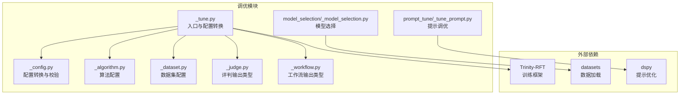
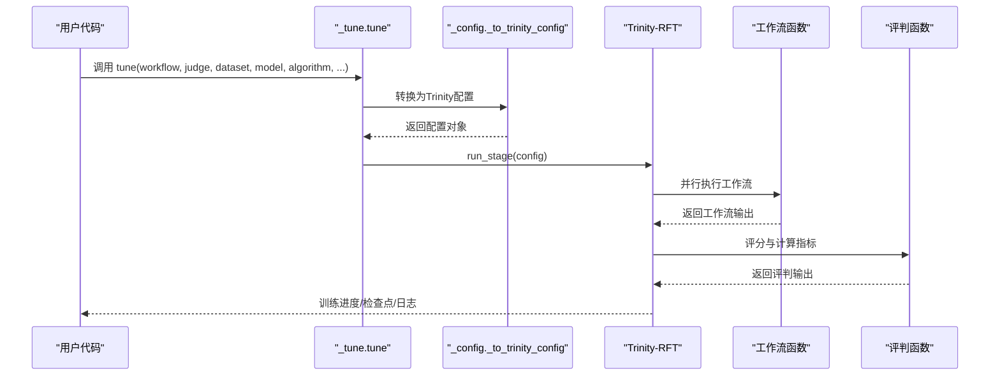
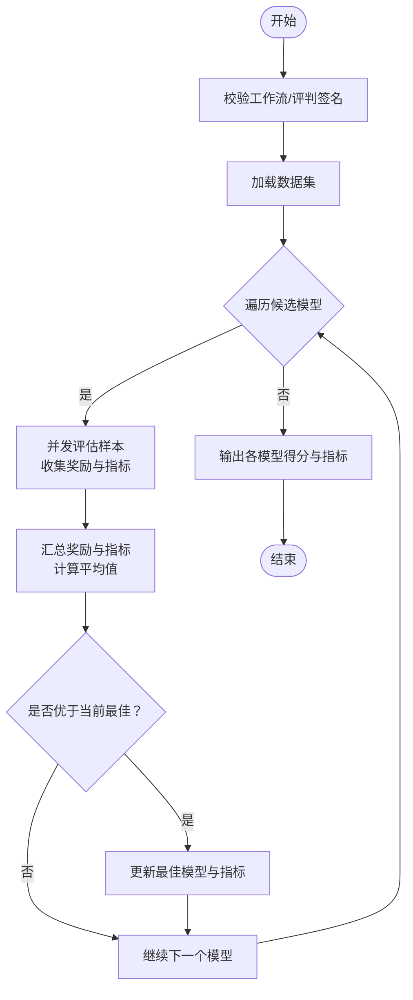
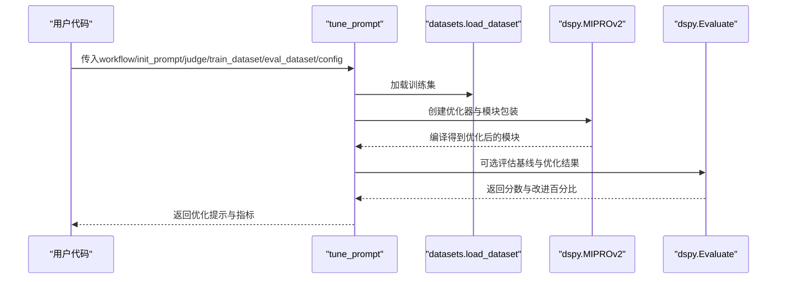
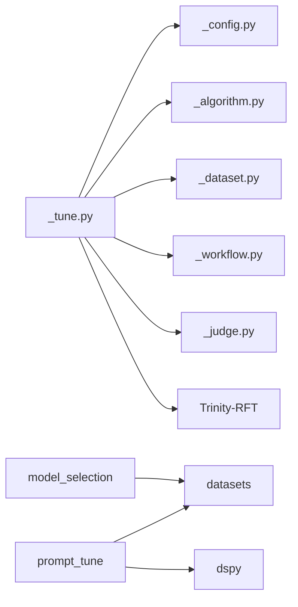

# 调优系统

<cite>
**本文引用的文件**
- [src/agentscope/tuner/__init__.py](file://src/agentscope/tuner/__init__.py)
- [src/agentscope/tuner/_tune.py](file://src/agentscope/tuner/_tune.py)
- [src/agentscope/tuner/_config.py](file://src/agentscope/tuner/_config.py)
- [src/agentscope/tuner/_algorithm.py](file://src/agentscope/tuner/_algorithm.py)
- [src/agentscope/tuner/_dataset.py](file://src/agentscope/tuner/_dataset.py)
- [src/agentscope/tuner/_judge.py](file://src/agentscope/tuner/_judge.py)
- [src/agentscope/tuner/_workflow.py](file://src/agentscope/tuner/_workflow.py)
- [src/agentscope/tuner/model_selection/_model_selection.py](file://src/agentscope/tuner/model_selection/_model_selection.py)
- [src/agentscope/tuner/prompt_tune/_tune_prompt.py](file://src/agentscope/tuner/prompt_tune/_tune_prompt.py)
- [examples/tuner/model_selection/example_bleu.py](file://examples/tuner/model_selection/example_bleu.py)
- [examples/tuner/model_selection/example_token_usage.py](file://examples/tuner/model_selection/example_token_usage.py)
- [examples/tuner/model_tuning/main.py](file://examples/tuner/model_tuning/main.py)
- [examples/tuner/prompt_tuning/example.py](file://examples/tuner/prompt_tuning/example.py)
</cite>

## 目录
1. [简介](#简介)
2. [项目结构](#项目结构)
3. [核心组件](#核心组件)
4. [架构总览](#架构总览)
5. [详细组件分析](#详细组件分析)
6. [依赖分析](#依赖分析)
7. [性能考量](#性能考量)
8. [故障排查指南](#故障排查指南)
9. [结论](#结论)
10. [附录：配置与API参考](#附录配置与api参考)

## 简介
本技术文档面向AgentScope调优系统，聚焦以下目标：
- 深入解释模型选择的实现机制：评估指标设计、比较算法、结果分析
- 详解提示调优的工作原理：参数空间探索、优化算法、收敛判断
- 综述调优算法实现：贝叶斯优化、网格搜索、随机搜索的集成现状与扩展路径
- 设计调优工作流：实验管理、结果存储、可视化支持
- 提供配置选项：算法选择、超参数设置、资源限制
- 给出具体调优示例、性能提升案例、最佳实践与策略建议
- 提供完整API参考与调优策略建议

## 项目结构
调优系统位于src/agentscope/tuner目录下，围绕“工作流函数”“评判函数”“数据集配置”“算法配置”“模型配置”等核心概念组织，并通过Trinity-RFT作为底层训练框架执行强化学习（RL）与监督微调（SFT）等训练流程。

图表来源
- [src/agentscope/tuner/_tune.py:1-97](file://src/agentscope/tuner/_tune.py#L1-L97)
- [src/agentscope/tuner/_config.py:20-121](file://src/agentscope/tuner/_config.py#L20-L121)
- [src/agentscope/tuner/_algorithm.py:7-43](file://src/agentscope/tuner/_algorithm.py#L7-L43)
- [src/agentscope/tuner/_dataset.py:8-37](file://src/agentscope/tuner/_dataset.py#L8-L37)
- [src/agentscope/tuner/_judge.py:7-18](file://src/agentscope/tuner/_judge.py#L7-L18)
- [src/agentscope/tuner/_workflow.py:7-29](file://src/agentscope/tuner/_workflow.py#L7-L29)
- [src/agentscope/tuner/model_selection/_model_selection.py:51-73](file://src/agentscope/tuner/model_selection/_model_selection.py#L51-L73)
- [src/agentscope/tuner/prompt_tune/_tune_prompt.py:134-182](file://src/agentscope/tuner/prompt_tune/_tune_prompt.py#L134-L182)

章节来源
- [src/agentscope/tuner/__init__.py:1-31](file://src/agentscope/tuner/__init__.py#L1-L31)

## 核心组件
- 工作流函数（WorkflowType）：异步函数，接收任务与模型，返回工作流输出（含响应与可选奖励/指标）
- 评判函数（JudgeType）：异步函数，接收任务与响应，返回评判输出（含奖励与可选指标）
- 数据集配置（DatasetConfig）：兼容Hugging Face格式的数据集路径、子集名、切分、轮次与步数
- 算法配置（AlgorithmConfig）：指定算法类型（如多步GRPO）、学习率、组大小、批大小、保存与评估间隔
- 模型配置（TunerModelConfig/TinkerConfig）：模型路径、上下文长度、最大生成长度、推理并行度、可选Tinker参数
- 入口函数（tune）：将上述配置转换为Trinity-RFT可识别的配置并启动训练；支持远程Ray集群与监控器类型
- 模型选择（select_model）：在候选模型集合上进行并行评测，基于平均奖励选择最优模型，并聚合指标
- 提示调优（tune_prompt）：基于DSPy的MIPROv2对系统提示进行自动优化，并可选对比验证集性能

章节来源
- [src/agentscope/tuner/_workflow.py:7-29](file://src/agentscope/tuner/_workflow.py#L7-L29)
- [src/agentscope/tuner/_judge.py:7-18](file://src/agentscope/tuner/_judge.py#L7-L18)
- [src/agentscope/tuner/_dataset.py:8-37](file://src/agentscope/tuner/_dataset.py#L8-L37)
- [src/agentscope/tuner/_algorithm.py:7-43](file://src/agentscope/tuner/_algorithm.py#L7-L43)
- [src/agentscope/tuner/_tune.py:16-97](file://src/agentscope/tuner/_tune.py#L16-L97)
- [src/agentscope/tuner/model_selection/_model_selection.py:75-241](file://src/agentscope/tuner/model_selection/_model_selection.py#L75-L241)
- [src/agentscope/tuner/prompt_tune/_tune_prompt.py:102-254](file://src/agentscope/tuner/prompt_tune/_tune_prompt.py#L102-L254)

## 架构总览
调优系统以“配置驱动 + 异步执行 + 外部框架集成”的方式工作。入口函数将用户提供的工作流、评判、数据集、算法与模型配置统一转换为Trinity-RFT配置，随后由Trinity-RFT负责分布式/并行执行、采样、回放与训练。

图表来源
- [src/agentscope/tuner/_tune.py:61-96](file://src/agentscope/tuner/_tune.py#L61-L96)
- [src/agentscope/tuner/_config.py:20-121](file://src/agentscope/tuner/_config.py#L20-L121)

## 详细组件分析

### 模型选择组件（select_model）
- 功能概述：在候选模型集合中评估每个模型在给定数据集上的表现，按平均奖励排序并返回最佳模型及聚合指标
- 关键特性：
  - 异步并发评估：使用信号量控制最大并发线程数
  - 指标聚合：累计样本级奖励与指标，最终计算平均值
  - 可观测性：记录每模型的平均奖励与详细指标
  - 错误处理：跳过失败样本，记录警告信息
- 数据流与算法流程：

图表来源
- [src/agentscope/tuner/model_selection/_model_selection.py:75-241](file://src/agentscope/tuner/model_selection/_model_selection.py#L75-L241)

章节来源
- [src/agentscope/tuner/model_selection/_model_selection.py:75-241](file://src/agentscope/tuner/model_selection/_model_selection.py#L75-L241)

### 提示调优组件（tune_prompt）
- 功能概述：使用DSPy的MIPROv2对系统提示进行自动优化，支持训练集优化与可选验证集对比
- 关键特性：
  - 自动格式推断：根据文件扩展名自动识别JSON/CSV/Parquet/文本等格式
  - 同步包装：将异步评判函数包装为同步接口供DSPy优化器使用
  - 性能对比：可选对比基线与优化后模型在验证集上的分数差异
- 优化流程序列图：

图表来源
- [src/agentscope/tuner/prompt_tune/_tune_prompt.py:102-254](file://src/agentscope/tuner/prompt_tune/_tune_prompt.py#L102-L254)

章节来源
- [src/agentscope/tuner/prompt_tune/_tune_prompt.py:102-254](file://src/agentscope/tuner/prompt_tune/_tune_prompt.py#L102-L254)

### 调优入口与配置转换（tune + _to_trinity_config）
- 入口函数（tune）职责：
  - 校验工作流/评判函数签名
  - 将配置转换为Trinity-RFT可识别的配置对象
  - 支持远程DLC Ray集群与多种监控器类型
  - 启动训练阶段并清理资源
- 配置转换（_to_trinity_config）职责：
  - 设置项目名、实验名、监控类型
  - 注入训练/评估数据集、工作流参数
  - 映射模型配置与辅助模型
  - 映射算法超参到Trinity配置字段

章节来源
- [src/agentscope/tuner/_tune.py:16-97](file://src/agentscope/tuner/_tune.py#L16-L97)
- [src/agentscope/tuner/_config.py:20-182](file://src/agentscope/tuner/_config.py#L20-L182)

### 类型与配置定义
- WorkflowOutput/JudgeOutput：标准化工作流与评判输出，便于Trinity-RFT与外部工具消费
- DatasetConfig：统一数据集加载参数
- AlgorithmConfig：统一算法超参
- 模型配置：TunerModelConfig与可选TinkerConfig

章节来源
- [src/agentscope/tuner/_workflow.py:7-29](file://src/agentscope/tuner/_workflow.py#L7-L29)
- [src/agentscope/tuner/_judge.py:7-18](file://src/agentscope/tuner/_judge.py#L7-L18)
- [src/agentscope/tuner/_dataset.py:8-37](file://src/agentscope/tuner/_dataset.py#L8-L37)
- [src/agentscope/tuner/_algorithm.py:7-43](file://src/agentscope/tuner/_algorithm.py#L7-L43)

## 依赖分析
- 内部依赖：
  - _tune依赖_config完成配置转换，依赖_algorithm/DatasetConfig/Workflow/Judge进行参数注入
  - model_selection依赖datasets加载数据集，依赖_in_memory_exporter收集token用量等指标
  - prompt_tune依赖datasets与dspy进行优化与评估
- 外部依赖：
  - Trinity-RFT：作为训练框架，负责分布式执行、采样与训练
  - datasets：用于加载本地或远程数据集
  - dspy：用于提示优化（MIPROv2）

图表来源
- [src/agentscope/tuner/_tune.py:61-96](file://src/agentscope/tuner/_tune.py#L61-L96)
- [src/agentscope/tuner/_config.py:20-121](file://src/agentscope/tuner/_config.py#L20-L121)
- [src/agentscope/tuner/model_selection/_model_selection.py:51-73](file://src/agentscope/tuner/model_selection/_model_selection.py#L51-L73)
- [src/agentscope/tuner/prompt_tune/_tune_prompt.py:134-182](file://src/agentscope/tuner/prompt_tune/_tune_prompt.py#L134-L182)

章节来源
- [src/agentscope/tuner/_tune.py:61-96](file://src/agentscope/tuner/_tune.py#L61-L96)
- [src/agentscope/tuner/_config.py:20-121](file://src/agentscope/tuner/_config.py#L20-L121)

## 性能考量
- 并发与吞吐：
  - 模型选择支持通过max_threads控制并发评估，避免IO与LLM调用成为瓶颈
  - 提示调优在评估阶段可通过eval_num_threads提升吞吐
- 指标采集：
  - 模型选择自动聚合token用量、输入/输出/总计tokens与执行时间，便于成本与延迟权衡
- 算法与超参：
  - 算法配置中的group_size/batch_size/save_interval_steps/eval_interval_steps影响训练稳定性与效率
- 分布式与资源：
  - 支持DLC Ray集群，适合大规模并行训练；监控器类型可选TensorBoard/W&B/MFlow/SwanLab

## 故障排查指南
- 常见问题与定位：
  - 函数签名不匹配：确保工作流/评判函数仅接受允许的关键字参数，避免*args/**kwargs
  - 缺少依赖：未安装Trinity-RFT时会抛出导入异常；未安装datasets/dspy会触发相应导入错误
  - 数据集加载失败：确认路径、name、split正确；必要时使用preview预览数据结构
  - 评测异常：模型选择会跳过失败样本并记录警告，检查网络与模型可用性
- 建议措施：
  - 使用较小total_steps快速验证流程
  - 在本地先运行示例，再逐步扩大规模
  - 开启更详细的日志级别以便追踪

章节来源
- [src/agentscope/tuner/_config.py:218-268](file://src/agentscope/tuner/_config.py#L218-L268)
- [src/agentscope/tuner/model_selection/_model_selection.py:172-179](file://src/agentscope/tuner/model_selection/_model_selection.py#L172-L179)

## 结论
AgentScope调优系统通过清晰的类型约束与配置转换，将用户自定义的工作流与评判函数无缝接入Trinity-RFT训练框架。模型选择与提示调优分别覆盖“模型层面”和“提示层面”的优化需求，配合丰富的指标采集与并发控制，能够有效支撑从基准评测到生产部署的调优闭环。

## 附录：配置与API参考

### API清单与关键参数
- tune
  - 参数要点：workflow_func、judge_func、train_dataset、eval_dataset、model、auxiliary_models、algorithm、project_name、experiment_name、monitor_type、config_path
  - 行为：校验函数签名、转换为Trinity配置、可选DLC集群、启动训练阶段
  - 参考：[入口函数定义:16-97](file://src/agentscope/tuner/_tune.py#L16-L97)
- select_model
  - 参数要点：workflow_func、judge_func、train_dataset、candidate_models、max_threads
  - 行为：并发评估、聚合指标、返回最佳模型与指标
  - 参考：[模型选择实现:75-241](file://src/agentscope/tuner/model_selection/_model_selection.py#L75-L241)
- tune_prompt
  - 参数要点：workflow、init_system_prompt、judge_func、train_dataset、eval_dataset、config
  - 行为：MIPROv2优化、可选验证集对比
  - 参考：[提示调优实现:102-254](file://src/agentscope/tuner/prompt_tune/_tune_prompt.py#L102-L254)

章节来源
- [src/agentscope/tuner/_tune.py:16-97](file://src/agentscope/tuner/_tune.py#L16-L97)
- [src/agentscope/tuner/model_selection/_model_selection.py:75-241](file://src/agentscope/tuner/model_selection/_model_selection.py#L75-L241)
- [src/agentscope/tuner/prompt_tune/_tune_prompt.py:102-254](file://src/agentscope/tuner/prompt_tune/_tune_prompt.py#L102-L254)

### 配置类与字段说明
- DatasetConfig
  - 字段：path、name、split、total_epochs、total_steps
  - 参考：[数据集配置:8-37](file://src/agentscope/tuner/_dataset.py#L8-L37)
- AlgorithmConfig
  - 字段：algorithm_type、learning_rate、group_size、batch_size、save_interval_steps、eval_interval_steps
  - 参考：[算法配置:7-43](file://src/agentscope/tuner/_algorithm.py#L7-L43)
- WorkflowOutput/JudgeOutput
  - 字段：reward、response、metrics
  - 参考：[工作流输出:7-29](file://src/agentscope/tuner/_workflow.py#L7-L29)、[评判输出:7-18](file://src/agentscope/tuner/_judge.py#L7-L18)

章节来源
- [src/agentscope/tuner/_dataset.py:8-37](file://src/agentscope/tuner/_dataset.py#L8-L37)
- [src/agentscope/tuner/_algorithm.py:7-43](file://src/agentscope/tuner/_algorithm.py#L7-L43)
- [src/agentscope/tuner/_workflow.py:7-29](file://src/agentscope/tuner/_workflow.py#L7-L29)
- [src/agentscope/tuner/_judge.py:7-18](file://src/agentscope/tuner/_judge.py#L7-L18)

### 示例与最佳实践
- 模型选择（BLEU/Token消耗）
  - 使用select_model在候选模型间进行公平对比，结合avg_time_judge/avg_token_consumption_judge等内置评判
  - 参考：[BLEU示例:152-183](file://examples/tuner/model_selection/example_bleu.py#L152-L183)、[Token消耗示例:77-107](file://examples/tuner/model_selection/example_token_usage.py#L77-L107)
- 模型调优（ReAct + GSM8K）
  - 使用tune与AlgorithmConfig进行强化学习/监督微调，结合Trinity-RFT的奖励函数
  - 参考：[调优主流程示例:104-149](file://examples/tuner/model_tuning/main.py#L104-L149)
- 提示调优（系统提示优化）
  - 使用tune_prompt与PromptTuneConfig，支持不同优化强度与评估对比
  - 参考：[提示调优示例:96-124](file://examples/tuner/prompt_tuning/example.py#L96-L124)

章节来源
- [examples/tuner/model_selection/example_bleu.py:152-183](file://examples/tuner/model_selection/example_bleu.py#L152-L183)
- [examples/tuner/model_selection/example_token_usage.py:77-107](file://examples/tuner/model_selection/example_token_usage.py#L77-L107)
- [examples/tuner/model_tuning/main.py:104-149](file://examples/tuner/model_tuning/main.py#L104-L149)
- [examples/tuner/prompt_tuning/example.py:96-124](file://examples/tuner/prompt_tuning/example.py#L96-L124)

### 调优策略建议
- 模型选择
  - 优先使用代表性任务子集进行快速筛选，再在全量数据上精调
  - 指标组合：在准确率/奖励之外关注延迟与成本（token用量、执行时间）
- 提示调优
  - 初始提示应具备明确指令与上下文；逐步放宽自由度观察收益
  - 使用验证集对比优化前后性能，避免过拟合
- 训练策略
  - 合理设置group_size与batch_size，平衡内存占用与收敛速度
  - 定期保存检查点并启用评估间隔，及时止损与早停