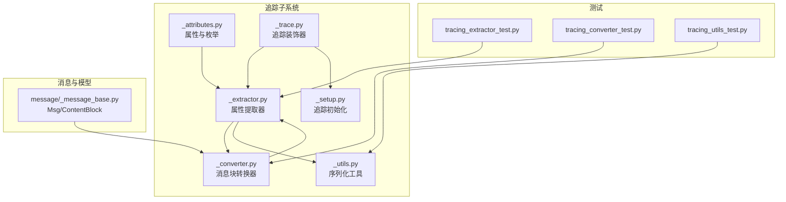
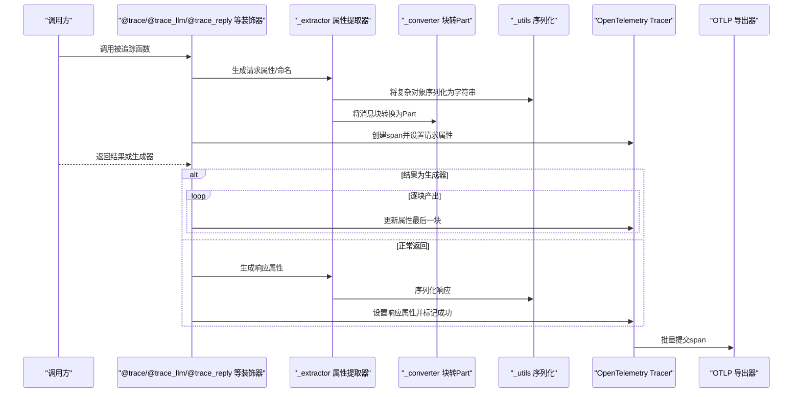
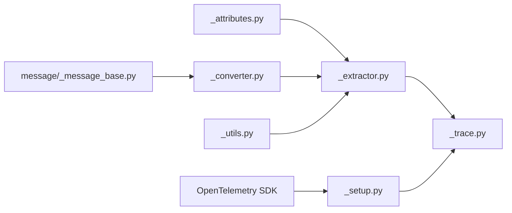

# 属性提取器

<cite>
**本文引用的文件**   
- [src/agentscope/tracing/_attributes.py](file://src/agentscope/tracing/_attributes.py)
- [src/agentscope/tracing/_extractor.py](file://src/agentscope/tracing/_extractor.py)
- [src/agentscope/tracing/_converter.py](file://src/agentscope/tracing/_converter.py)
- [src/agentscope/tracing/_utils.py](file://src/agentscope/tracing/_utils.py)
- [src/agentscope/tracing/_trace.py](file://src/agentscope/tracing/_trace.py)
- [src/agentscope/tracing/_setup.py](file://src/agentscope/tracing/_setup.py)
- [src/agentscope/message/_message_base.py](file://src/agentscope/message/_message_base.py)
- [tests/tracing_extractor_test.py](file://tests/tracing_extractor_test.py)
- [tests/tracing_converter_test.py](file://tests/tracing_converter_test.py)
- [tests/tracing_utils_test.py](file://tests/tracing_utils_test.py)
</cite>

## 目录
1. [引言](#引言)
2. [项目结构](#项目结构)
3. [核心组件](#核心组件)
4. [架构总览](#架构总览)
5. [详细组件分析](#详细组件分析)
6. [依赖分析](#依赖分析)
7. [性能考量](#性能考量)
8. [故障排查指南](#故障排查指南)
9. [结论](#结论)
10. [附录](#附录)

## 引言
本文件面向AgentScope的属性提取器系统，聚焦于SpanAttributes枚举设计、各类请求/响应属性提取函数的实现机制、命名规范与最佳实践，并提供可操作的使用示例与调试技巧。目标读者既包括需要快速上手的工程师，也包括希望深入理解实现细节的高级用户。

## 项目结构
与属性提取器直接相关的核心文件如下：
- 属性定义与枚举：_attributes.py
- 请求/响应属性提取器：_extractor.py
- 消息块到标准Part的转换器：_converter.py
- 序列化工具（统一转字符串）：_utils.py
- 装饰器与追踪流程控制：_trace.py
- 追踪初始化与Tracer获取：_setup.py
- 消息对象（Msg）与内容块（ContentBlock）：message/_message_base.py
- 单元测试：tests/tracing_extractor_test.py、tests/tracing_converter_test.py、tests/tracing_utils_test.py

图表来源
- [src/agentscope/tracing/_attributes.py:1-184](file://src/agentscope/tracing/_attributes.py#L1-L184)
- [src/agentscope/tracing/_extractor.py:1-893](file://src/agentscope/tracing/_extractor.py#L1-L893)
- [src/agentscope/tracing/_converter.py:1-126](file://src/agentscope/tracing/_converter.py#L1-L126)
- [src/agentscope/tracing/_utils.py:1-79](file://src/agentscope/tracing/_utils.py#L1-L79)
- [src/agentscope/tracing/_trace.py:1-647](file://src/agentscope/tracing/_trace.py#L1-L647)
- [src/agentscope/tracing/_setup.py:1-50](file://src/agentscope/tracing/_setup.py#L1-L50)
- [src/agentscope/message/_message_base.py:1-242](file://src/agentscope/message/_message_base.py#L1-L242)
- [tests/tracing_extractor_test.py:1-562](file://tests/tracing_extractor_test.py#L1-L562)
- [tests/tracing_converter_test.py:1-426](file://tests/tracing_converter_test.py#L1-L426)
- [tests/tracing_utils_test.py:1-233](file://tests/tracing_utils_test.py#L1-L233)

章节来源
- [src/agentscope/tracing/_attributes.py:1-184](file://src/agentscope/tracing/_attributes.py#L1-L184)
- [src/agentscope/tracing/_extractor.py:1-893](file://src/agentscope/tracing/_extractor.py#L1-L893)
- [src/agentscope/tracing/_converter.py:1-126](file://src/agentscope/tracing/_converter.py#L1-L126)
- [src/agentscope/tracing/_utils.py:1-79](file://src/agentscope/tracing/_utils.py#L1-L79)
- [src/agentscope/tracing/_trace.py:1-647](file://src/agentscope/tracing/_trace.py#L1-L647)
- [src/agentscope/tracing/_setup.py:1-50](file://src/agentscope/tracing/_setup.py#L1-L50)
- [src/agentscope/message/_message_base.py:1-242](file://src/agentscope/message/_message_base.py#L1-L242)
- [tests/tracing_extractor_test.py:1-562](file://tests/tracing_extractor_test.py#L1-L562)
- [tests/tracing_converter_test.py:1-426](file://tests/tracing_converter_test.py#L1-L426)
- [tests/tracing_utils_test.py:1-233](file://tests/tracing_utils_test.py#L1-L233)

## 核心组件
- SpanAttributes：集中定义通用GenAI属性键、AgentScope扩展属性键、操作名值与提供商名值。覆盖对话、请求参数、响应、用量、消息、智能体、工具、嵌入等维度。
- 提取器函数族：按组件类型划分，分别负责LLM请求/响应、智能体请求/响应、工具请求/响应、格式化器请求/响应、通用函数请求/响应、嵌入请求/响应的属性提取与命名。
- 转换器：将内部消息块（文本、思考、工具调用/结果、图像/音频/视频）转换为OpenTelemetry GenAI标准Part格式。
- 序列化工具：将任意对象安全地序列化为JSON字符串，确保属性值均为可序列化字符串。
- 追踪装饰器：统一入口，支持同步/异步函数、生成器/异步生成器，自动设置span状态、异常记录与结束时机。
- 初始化：通过setup_tracing配置OTLP导出端点，_get_tracer获取Tracer实例。

章节来源
- [src/agentscope/tracing/_attributes.py:8-184](file://src/agentscope/tracing/_attributes.py#L8-L184)
- [src/agentscope/tracing/_extractor.py:52-893](file://src/agentscope/tracing/_extractor.py#L52-L893)
- [src/agentscope/tracing/_converter.py:57-126](file://src/agentscope/tracing/_converter.py#L57-L126)
- [src/agentscope/tracing/_utils.py:60-79](file://src/agentscope/tracing/_utils.py#L60-L79)
- [src/agentscope/tracing/_trace.py:192-400](file://src/agentscope/tracing/_trace.py#L192-L400)
- [src/agentscope/tracing/_setup.py:11-50](file://src/agentscope/tracing/_setup.py#L11-L50)

## 架构总览
下图展示从调用入口到属性提取、序列化、转换与最终span提交的整体流程。

图表来源
- [src/agentscope/tracing/_trace.py:192-400](file://src/agentscope/tracing/_trace.py#L192-L400)
- [src/agentscope/tracing/_extractor.py:52-893](file://src/agentscope/tracing/_extractor.py#L52-L893)
- [src/agentscope/tracing/_converter.py:57-126](file://src/agentscope/tracing/_converter.py#L57-L126)
- [src/agentscope/tracing/_utils.py:60-79](file://src/agentscope/tracing/_utils.py#L60-L79)
- [src/agentscope/tracing/_setup.py:11-50](file://src/agentscope/tracing/_setup.py#L11-L50)

## 详细组件分析

### SpanAttributes 设计与命名规范
- 通用属性键：继承自GenAI语义约定，涵盖conversation_id、operation_name、provider_name、请求参数（temperature/top_p/top_k/max_tokens等）、响应（finish_reasons）、用量（input/output_tokens）、消息（input/output）、智能体（id/name/description/system_instructions）、工具（call_id/name/description/arguments/result/definitions）、嵌入（dimension_count）。
- AgentScope扩展属性键：format.target、format.count、function.name、function.input、function.output，用于跨组件的统一追踪。
- 操作名值：format、invoke_generic_function、chat、invoke_agent、execute_tool、embeddings。
- 提供商名值：dashscope、ollama、deepseek、openai、anthropic、gcp_gemini、moonshot、azure_ai_openai、aws_bedrock。
- 命名规范与约束：
  - 键名采用全小写加点分隔的命名空间前缀，避免冲突。
  - 值类型统一为字符串（通过序列化），确保跨后端一致性。
  - 属性作用域：通用属性适用于所有组件；AgentScope扩展属性用于增强跨组件可见性与可检索性。

章节来源
- [src/agentscope/tracing/_attributes.py:8-184](file://src/agentscope/tracing/_attributes.py#L8-L184)

### 通用函数属性提取
- 请求属性：operation_name（通用函数）、function.name、function.input（args/kwargs）。
- 响应属性：function.output（最后一次产出或返回值）。
- span命名：format "{operation} {function_name}"。

章节来源
- [src/agentscope/tracing/_extractor.py:734-788](file://src/agentscope/tracing/_extractor.py#L734-L788)
- [src/agentscope/tracing/_extractor.py:790-809](file://src/agentscope/tracing/_extractor.py#L790-L809)

### LLM请求属性提取
- 请求属性：operation_name（chat）、provider_name（根据模型类名或OpenAI兼容base_url推断）、model_name、generation参数（temperature/top_p/top_k/max_tokens/presence_penalty/frequency_penalty/stop_sequences/seed）、tool_definitions（扁平化）、function.input。
- 输出消息提取：将ChatResponse内容块转换为标准Part列表，role固定为assistant，finish_reason默认“stop”，异常时兜底为错误消息。
- 响应属性：response_id、finish_reasons、input/output_tokens、output_messages、function.output。
- span命名：format "{operation} {model}"。

章节来源
- [src/agentscope/tracing/_extractor.py:198-268](file://src/agentscope/tracing/_extractor.py#L198-L268)
- [src/agentscope/tracing/_extractor.py:289-391](file://src/agentscope/tracing/_extractor.py#L289-L391)
- [src/agentscope/tracing/_extractor.py:270-287](file://src/agentscope/tracing/_extractor.py#L270-L287)

### 智能体请求属性提取
- 请求属性：operation_name（invoke_agent）、agent_id/name/description、input_messages（由Msg/列表Msg转换为标准Part）、function.input。
- 输出消息提取：将Msg对象转换为标准Part列表，role来自Msg.role，name来自Msg.name，finish_reason默认“stop”。
- 响应属性：output_messages、function.output。
- span命名：format "{operation} {agent_name}"。

章节来源
- [src/agentscope/tracing/_extractor.py:447-504](file://src/agentscope/tracing/_extractor.py#L447-L504)
- [src/agentscope/tracing/_extractor.py:394-445](file://src/agentscope/tracing/_extractor.py#L394-L445)
- [src/agentscope/tracing/_extractor.py:526-549](file://src/agentscope/tracing/_extractor.py#L526-L549)
- [src/agentscope/tracing/_extractor.py:507-524](file://src/agentscope/tracing/_extractor.py#L507-L524)

### 工具请求属性提取
- 请求属性：operation_name（execute_tool）、tool_call_id/name、tool_description（从Toolkit.tools解析）、tool.call.arguments（序列化）、function.input。
- 响应属性：tool.call.result、function.output。
- span命名：format "{operation} {tool_name}"。

章节来源
- [src/agentscope/tracing/_extractor.py:552-606](file://src/agentscope/tracing/_extractor.py#L552-L606)
- [src/agentscope/tracing/_extractor.py:628-652](file://src/agentscope/tracing/_extractor.py#L628-L652)
- [src/agentscope/tracing/_extractor.py:609-626](file://src/agentscope/tracing/_extractor.py#L609-L626)

### 格式化器请求属性提取
- 请求属性：operation_name（format）、format.target（由格式化器类名映射至提供商名）、function.input。
- 响应属性：function.output；若响应为列表，则追加format.count（列表长度）。
- span命名：format "{operation} {provider}"。

章节来源
- [src/agentscope/tracing/_extractor.py:655-688](file://src/agentscope/tracing/_extractor.py#L655-L688)
- [src/agentscope/tracing/_extractor.py:710-732](file://src/agentscope/tracing/_extractor.py#L710-L732)
- [src/agentscope/tracing/_extractor.py:691-708](file://src/agentscope/tracing/_extractor.py#L691-L708)

### 嵌入请求属性提取
- 请求属性：operation_name（embeddings）、model_name、dimension_count、function.input。
- 响应属性：function.output。
- span命名：format "{operation} {model}"。

章节来源
- [src/agentscope/tracing/_extractor.py:811-852](file://src/agentscope/tracing/_extractor.py#L811-L852)
- [src/agentscope/tracing/_extractor.py:874-892](file://src/agentscope/tracing/_extractor.py#L874-L892)
- [src/agentscope/tracing/_extractor.py:855-872](file://src/agentscope/tracing/_extractor.py#L855-L872)

### 消息块到Part的标准转换
- 支持类型：text、thinking、tool_use、tool_result、image、audio、video。
- 映射规则：text→text，thinking→reasoning，tool_use→tool_call，tool_result→tool_call_response，媒体块→uri/blob（含默认媒体类型）。
- 容错：缺失字段填充空串或默认值；非法类型返回None。

章节来源
- [src/agentscope/tracing/_converter.py:57-126](file://src/agentscope/tracing/_converter.py#L57-L126)

### 序列化与容错
- _to_serializable：递归处理基本类型、集合、字典、Msg/Pydantic/Dataclass、日期时间、timedelta、枚举等，无法序列化的回退为字符串。
- _serialize_to_str：优先使用json.dumps；失败则先to_serializable再dumps，确保属性值为合法字符串。

章节来源
- [src/agentscope/tracing/_utils.py:15-79](file://src/agentscope/tracing/_utils.py#L15-L79)

### 追踪装饰器与流式输出
- 通用装饰器：支持同步/异步函数、生成器/异步生成器；在finally阶段根据operation_name选择对应响应属性提取器，设置最后产出为响应属性并标记成功。
- 错误处理：捕获异常，记录异常信息，设置ERROR状态并结束span。
- 初始化：setup_tracing配置OTLP导出端点；_get_tracer获取Tracer。

章节来源
- [src/agentscope/tracing/_trace.py:192-400](file://src/agentscope/tracing/_trace.py#L192-L400)
- [src/agentscope/tracing/_trace.py:107-190](file://src/agentscope/tracing/_trace.py#L107-L190)
- [src/agentscope/tracing/_setup.py:11-50](file://src/agentscope/tracing/_setup.py#L11-L50)

### 使用示例与调试技巧
- 示例参考：教程中提供了@trace_llm、@trace_reply、@trace_format、@trace的使用说明与示例代码片段路径。
- 调试建议：
  - 在本地启用追踪后，检查OTLP导出端点是否可达。
  - 关注function.input/function.output是否为空，通常表示序列化失败或未正确传参。
  - 对于工具调用，确认tool_definitions是否被正确扁平化，tool.description是否可从Toolkit.tools解析。
  - 对于LLM输出，若finish_reasons异常，检查ChatResponse结构与content块转换逻辑。

章节来源
- [tests/tracing_extractor_test.py:1-562](file://tests/tracing_extractor_test.py#L1-L562)
- [tests/tracing_converter_test.py:1-426](file://tests/tracing_converter_test.py#L1-L426)
- [tests/tracing_utils_test.py:1-233](file://tests/tracing_utils_test.py#L1-L233)

## 依赖分析
- 组件耦合：
  - _extractor依赖_attributes、_converter、_utils，形成“属性定义—转换—序列化”的链路。
  - _trace依赖_extractors与_setup，负责生命周期管理与生成器包装。
  - _converter依赖message模块的消息块类型，确保与Msg内容结构一致。
- 外部依赖：
  - OpenTelemetry SDK（TracerProvider、BatchSpanProcessor、OTLPSpanExporter）。
  - AgentScope内部类型（ChatModelBase、EmbeddingModelBase、Msg、ToolUseBlock等）。

图表来源
- [src/agentscope/tracing/_attributes.py:1-184](file://src/agentscope/tracing/_attributes.py#L1-L184)
- [src/agentscope/tracing/_extractor.py:1-893](file://src/agentscope/tracing/_extractor.py#L1-L893)
- [src/agentscope/tracing/_converter.py:1-126](file://src/agentscope/tracing/_converter.py#L1-L126)
- [src/agentscope/tracing/_utils.py:1-79](file://src/agentscope/tracing/_utils.py#L1-L79)
- [src/agentscope/tracing/_trace.py:1-647](file://src/agentscope/tracing/_trace.py#L1-L647)
- [src/agentscope/tracing/_setup.py:1-50](file://src/agentscope/tracing/_setup.py#L1-L50)
- [src/agentscope/message/_message_base.py:1-242](file://src/agentscope/message/_message_base.py#L1-L242)

章节来源
- [src/agentscope/tracing/_extractor.py:1-893](file://src/agentscope/tracing/_extractor.py#L1-L893)
- [src/agentscope/tracing/_trace.py:1-647](file://src/agentscope/tracing/_trace.py#L1-L647)
- [src/agentscope/tracing/_setup.py:1-50](file://src/agentscope/tracing/_setup.py#L1-L50)

## 性能考量
- 序列化成本：对复杂对象进行序列化会带来CPU与内存开销。建议：
  - 仅在必要时序列化完整输入/输出；对超长内容可截断或采样。
  - 避免在热路径频繁构造大型嵌套结构。
- 转换成本：消息块到Part的转换为线性遍历，注意块数量与媒体数据大小。
- 生成器追踪：对流式输出，尽量减少每块的属性设置频率，合并到最终块统一设置。
- 导出批处理：使用BatchSpanProcessor提升吞吐，合理设置批量大小与超时。

## 故障排查指南
- 常见问题与定位：
  - 属性为空：检查function.input/function.output是否被正确设置；确认序列化是否抛出TypeError。
  - 工具定义缺失：当tools为None/空或tool_choice为“none”时，tool_definitions不会被追踪。
  - LLM输出异常：ChatResponse非预期结构时，输出消息可能为兜底错误格式；检查content块类型。
  - 工具描述缺失：Toolkit.tools中缺少对应工具或json_schema结构不匹配时，tool.description为默认值。
- 排查步骤：
  - 在测试中复用现有单元测试用例，验证各提取器行为。
  - 使用最小可复现样例，逐步缩小范围。
  - 检查TracerProvider是否已正确初始化与添加span处理器。

章节来源
- [tests/tracing_extractor_test.py:131-160](file://tests/tracing_extractor_test.py#L131-L160)
- [tests/tracing_extractor_test.py:218-221](file://tests/tracing_extractor_test.py#L218-L221)
- [tests/tracing_converter_test.py:1-426](file://tests/tracing_converter_test.py#L1-L426)
- [tests/tracing_utils_test.py:1-233](file://tests/tracing_utils_test.py#L1-L233)

## 结论
AgentScope属性提取器系统通过标准化的属性键、完备的组件提取器、健壮的序列化与转换机制，实现了对LLM、智能体、工具、格式化器与通用函数的统一追踪。遵循本文的命名规范与最佳实践，可在保证数据完整性的同时，兼顾性能与可观测性。

## 附录
- 使用示例与教程参考路径：
  - [docs/tutorial/zh_CN/src/task_tracing.py:104-187](file://docs/tutorial/zh_CN/src/task_tracing.py#L104-L187)
- 相关接口导出：
  - [src/agentscope/tracing/__init__.py:1-23](file://src/agentscope/tracing/__init__.py#L1-L23)