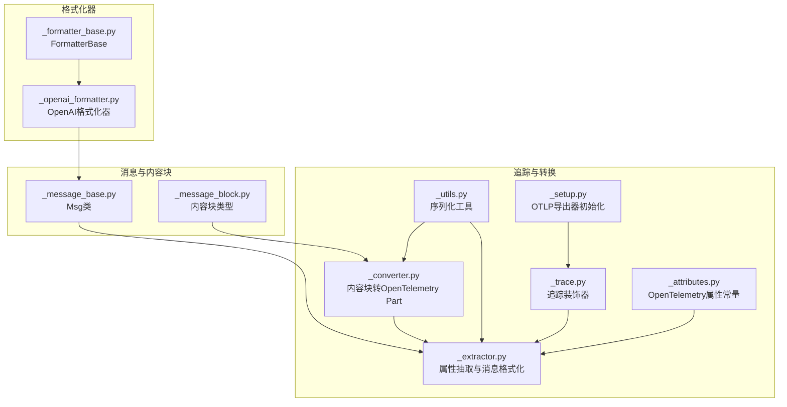
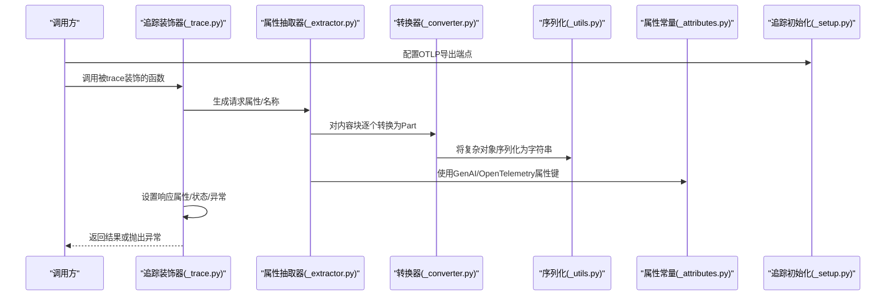
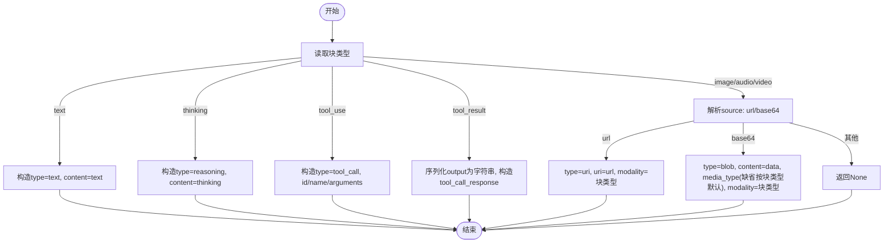
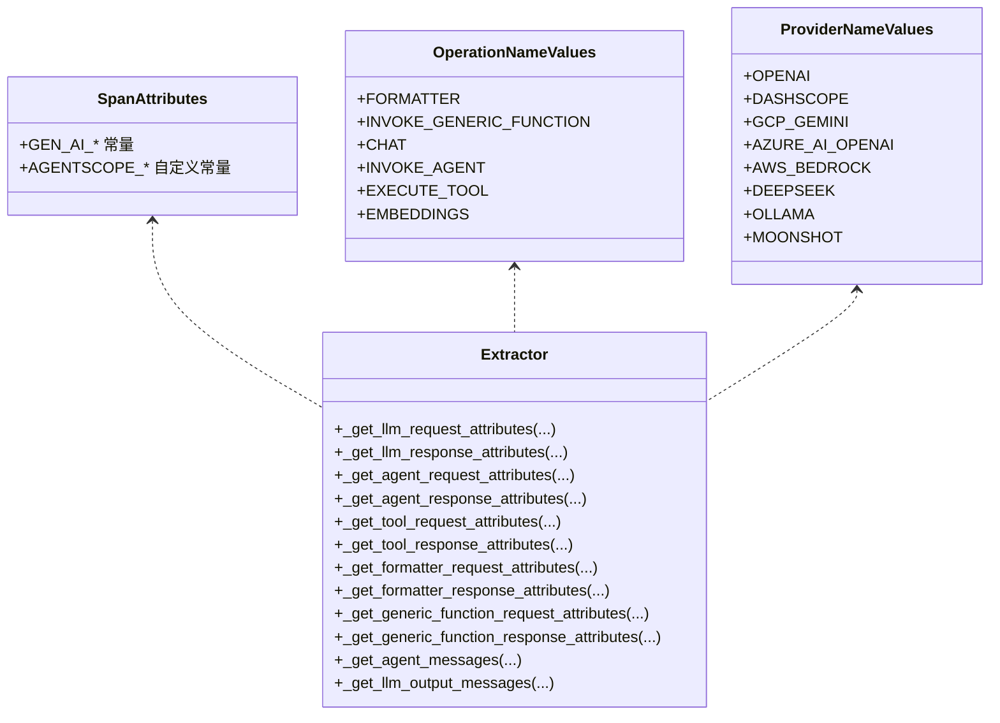
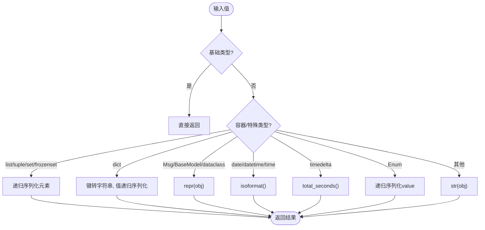
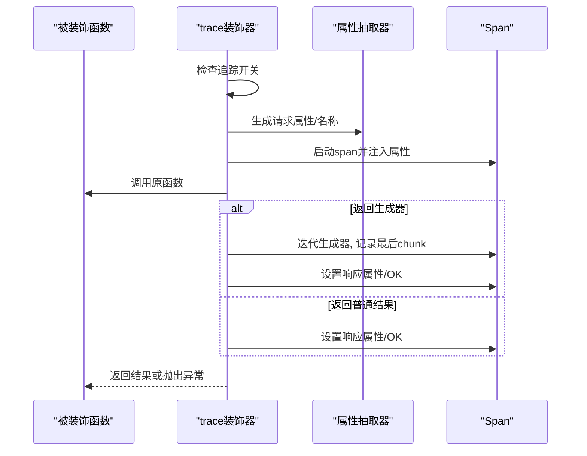
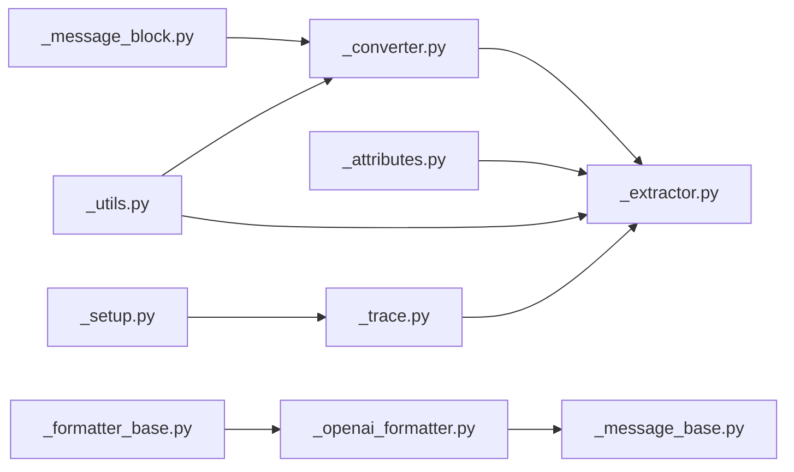

# 数据转换器

<cite>
**本文引用的文件**
- [src/agentscope/tracing/_converter.py](file://src/agentscope/tracing/_converter.py)
- [src/agentscope/tracing/_extractor.py](file://src/agentscope/tracing/_extractor.py)
- [src/agentscope/tracing/_utils.py](file://src/agentscope/tracing/_utils.py)
- [src/agentscope/tracing/_trace.py](file://src/agentscope/tracing/_trace.py)
- [src/agentscope/tracing/_attributes.py](file://src/agentscope/tracing/_attributes.py)
- [src/agentscope/tracing/_setup.py](file://src/agentscope/tracing/_setup.py)
- [src/agentscope/message/_message_base.py](file://src/agentscope/message/_message_base.py)
- [src/agentscope/message/_message_block.py](file://src/agentscope/message/_message_block.py)
- [src/agentscope/formatter/_formatter_base.py](file://src/agentscope/formatter/_formatter_base.py)
- [src/agentscope/formatter/_openai_formatter.py](file://src/agentscope/formatter/_openai_formatter.py)
- [tests/tracing_converter_test.py](file://tests/tracing_converter_test.py)
</cite>

## 目录
1. [引言](#引言)
2. [项目结构](#项目结构)
3. [核心组件](#核心组件)
4. [架构总览](#架构总览)
5. [详细组件分析](#详细组件分析)
6. [依赖分析](#依赖分析)
7. [性能考虑](#性能考虑)
8. [故障排除指南](#故障排除指南)
9. [结论](#结论)
10. [附录](#附录)

## 引言
本文件面向AgentScope的数据转换与追踪体系，聚焦“内容块到OpenTelemetry GenAI格式”的转换机制，涵盖以下主题：
- 原始数据（消息与内容块）到OpenTelemetry GenAI部分（part）的转换规则
- 序列化与类型转换策略
- 字段映射与嵌套对象处理
- 转换过程中的数据完整性保障（必填字段校验、可选字段处理、默认值）
- 扩展机制（自定义转换规则、插件化与配置化思路）
- 性能优化、内存效率与错误恢复策略
- 具体转换示例、调试方法与故障排除

## 项目结构
与数据转换直接相关的核心目录与文件如下：
- tracing：追踪与转换入口、属性抽取、工具函数
- message：消息与内容块模型
- formatter：格式化器（OpenAI等），用于将消息转换为目标平台格式（如OpenAI API）

图表来源
- [src/agentscope/tracing/_converter.py:1-126](file://src/agentscope/tracing/_converter.py#L1-L126)
- [src/agentscope/tracing/_extractor.py:1-800](file://src/agentscope/tracing/_extractor.py#L1-L800)
- [src/agentscope/tracing/_utils.py:1-79](file://src/agentscope/tracing/_utils.py#L1-L79)
- [src/agentscope/tracing/_trace.py:1-647](file://src/agentscope/tracing/_trace.py#L1-L647)
- [src/agentscope/tracing/_attributes.py:1-184](file://src/agentscope/tracing/_attributes.py#L1-L184)
- [src/agentscope/tracing/_setup.py:1-50](file://src/agentscope/tracing/_setup.py#L1-L50)
- [src/agentscope/message/_message_base.py:1-242](file://src/agentscope/message/_message_base.py#L1-L242)
- [src/agentscope/message/_message_block.py:1-129](file://src/agentscope/message/_message_block.py#L1-L129)
- [src/agentscope/formatter/_formatter_base.py:1-130](file://src/agentscope/formatter/_formatter_base.py#L1-L130)
- [src/agentscope/formatter/_openai_formatter.py:1-541](file://src/agentscope/formatter/_openai_formatter.py#L1-L541)

章节来源
- [src/agentscope/tracing/_converter.py:1-126](file://src/agentscope/tracing/_converter.py#L1-L126)
- [src/agentscope/tracing/_extractor.py:1-800](file://src/agentscope/tracing/_extractor.py#L1-L800)
- [src/agentscope/tracing/_utils.py:1-79](file://src/agentscope/tracing/_utils.py#L1-L79)
- [src/agentscope/tracing/_trace.py:1-647](file://src/agentscope/tracing/_trace.py#L1-L647)
- [src/agentscope/tracing/_attributes.py:1-184](file://src/agentscope/tracing/_attributes.py#L1-L184)
- [src/agentscope/tracing/_setup.py:1-50](file://src/agentscope/tracing/_setup.py#L1-L50)
- [src/agentscope/message/_message_base.py:1-242](file://src/agentscope/message/_message_base.py#L1-L242)
- [src/agentscope/message/_message_block.py:1-129](file://src/agentscope/message/_message_block.py#L1-L129)
- [src/agentscope/formatter/_formatter_base.py:1-130](file://src/agentscope/formatter/_formatter_base.py#L1-L130)
- [src/agentscope/formatter/_openai_formatter.py:1-541](file://src/agentscope/formatter/_openai_formatter.py#L1-L541)

## 核心组件
- 内容块到OpenTelemetry Part转换器：负责将文本、思考、工具调用/结果、图像/音频/视频等AgentScope内容块映射为OpenTelemetry GenAI标准part。
- 属性抽取器：从消息、工具调用、格式化器、通用函数等上下文抽取OpenTelemetry属性，并进行序列化。
- 序列化工具：统一将任意对象安全地序列化为JSON字符串，确保跨组件传输一致性。
- 追踪装饰器：对Agent回复、LLM调用、工具执行、格式化器、通用函数等进行OpenTelemetry追踪。
- 消息与内容块模型：Msg与各类内容块（文本、思考、工具、媒体）的结构定义。
- OpenAI格式化器：将消息转换为OpenAI API所需格式（含多模态与工具调用），并支持截断与令牌计数。

章节来源
- [src/agentscope/tracing/_converter.py:57-126](file://src/agentscope/tracing/_converter.py#L57-L126)
- [src/agentscope/tracing/_extractor.py:198-391](file://src/agentscope/tracing/_extractor.py#L198-L391)
- [src/agentscope/tracing/_utils.py:60-79](file://src/agentscope/tracing/_utils.py#L60-L79)
- [src/agentscope/tracing/_trace.py:192-318](file://src/agentscope/tracing/_trace.py#L192-L318)
- [src/agentscope/message/_message_base.py:21-242](file://src/agentscope/message/_message_base.py#L21-L242)
- [src/agentscope/message/_message_block.py:9-129](file://src/agentscope/message/_message_block.py#L9-L129)
- [src/agentscope/formatter/_openai_formatter.py:168-372](file://src/agentscope/formatter/_openai_formatter.py#L168-L372)

## 架构总览
下图展示从消息到OpenTelemetry追踪的关键路径：消息经由属性抽取器转换为标准化输入/输出消息列表，再通过转换器将内容块映射为OpenTelemetry GenAI Part；序列化工具保证属性值的可传输性；追踪装饰器在各组件调用点埋点并设置状态与异常记录。

图表来源
- [src/agentscope/tracing/_trace.py:192-318](file://src/agentscope/tracing/_trace.py#L192-L318)
- [src/agentscope/tracing/_extractor.py:289-391](file://src/agentscope/tracing/_extractor.py#L289-L391)
- [src/agentscope/tracing/_converter.py:57-126](file://src/agentscope/tracing/_converter.py#L57-L126)
- [src/agentscope/tracing/_utils.py:60-79](file://src/agentscope/tracing/_utils.py#L60-L79)
- [src/agentscope/tracing/_attributes.py:8-184](file://src/agentscope/tracing/_attributes.py#L8-L184)
- [src/agentscope/tracing/_setup.py:11-50](file://src/agentscope/tracing/_setup.py#L11-L50)

## 详细组件分析

### 组件一：内容块到OpenTelemetry Part转换器
职责与规则：
- 文本块：映射为text类型part，内容取自text字段，缺失时为空字符串。
- 思考块：映射为reasoning类型part，内容取自thinking字段，缺失时为空字符串。
- 工具调用块：映射为tool_call类型part，包含id、name、arguments（input）。
- 工具结果块：映射为tool_call_response类型part，id与响应内容response；当output为非字符串时，先序列化为字符串。
- 媒体块（图像/音频/视频）：根据source类型选择uri或blob两种形式；base64时自动补默认媒体类型（image/audio/video分别有默认值）。

图表来源
- [src/agentscope/tracing/_converter.py:57-126](file://src/agentscope/tracing/_converter.py#L57-L126)

章节来源
- [src/agentscope/tracing/_converter.py:11-126](file://src/agentscope/tracing/_converter.py#L11-L126)
- [tests/tracing_converter_test.py:20-426](file://tests/tracing_converter_test.py#L20-L426)

### 组件二：属性抽取与消息格式化
职责与规则：
- LLM请求属性：操作名、提供商、模型名、温度、top_p/top_k、最大token、惩罚项、停止序列、种子、工具定义（扁平化）、自定义输入。
- LLM响应属性：响应ID、完成原因、用量（输入/输出token）、输出消息（parts列表）。
- Agent请求/响应属性：代理ID/名称/描述、输入消息（Msg列表）、输出消息。
- 工具请求/响应属性：操作名、工具调用ID、名称、描述、参数、结果。
- 格式化器请求/响应属性：操作名、目标平台（format target）、自定义输入、格式化数量（列表长度）。
- 通用函数请求/响应属性：操作名、函数名、自定义输入。
- 消息格式化：将Msg或Msg列表转换为OpenTelemetry GenAI消息格式（role/parts/finish_reason），其中parts来自转换器。

图表来源
- [src/agentscope/tracing/_attributes.py:8-184](file://src/agentscope/tracing/_attributes.py#L8-L184)
- [src/agentscope/tracing/_extractor.py:198-391](file://src/agentscope/tracing/_extractor.py#L198-L391)

章节来源
- [src/agentscope/tracing/_extractor.py:198-391](file://src/agentscope/tracing/_extractor.py#L198-L391)
- [src/agentscope/tracing/_attributes.py:8-184](file://src/agentscope/tracing/_attributes.py#L8-L184)

### 组件三：序列化工具
职责与规则：
- 将任意对象转换为可JSON序列化的结构（递归处理容器、枚举、日期时间、dataclass/pydantic等），无法序列化时回退为字符串表示。
- 提供统一的字符串序列化接口，确保属性值稳定可传输。

图表来源
- [src/agentscope/tracing/_utils.py:15-79](file://src/agentscope/tracing/_utils.py#L15-L79)

章节来源
- [src/agentscope/tracing/_utils.py:15-79](file://src/agentscope/tracing/_utils.py#L15-L79)

### 组件四：追踪装饰器
职责与规则：
- 支持同步/异步函数，自动判断是否启用追踪（基于全局配置）。
- 包装生成器/异步生成器，捕获最后一个chunk作为响应属性，异常时记录并设置ERROR状态。
- 针对不同组件（Agent、LLM、工具、格式化器、通用函数）设置不同的span名称与属性抽取逻辑。

图表来源
- [src/agentscope/tracing/_trace.py:192-318](file://src/agentscope/tracing/_trace.py#L192-L318)
- [src/agentscope/tracing/_extractor.py:447-550](file://src/agentscope/tracing/_extractor.py#L447-L550)

章节来源
- [src/agentscope/tracing/_trace.py:192-318](file://src/agentscope/tracing/_trace.py#L192-L318)
- [src/agentscope/tracing/_extractor.py:447-550](file://src/agentscope/tracing/_extractor.py#L447-L550)

### 组件五：消息与内容块模型
职责与规则：
- Msg：封装消息的名称、角色、内容（字符串或内容块列表）、元数据、时间戳、调用ID等。
- 内容块：文本、思考、工具调用/结果、图像/音频/视频等，均采用TypedDict定义，便于静态检查与运行时校验。
- 工具结果到字符串转换：将多模态结果转换为文本说明，并返回本地路径或URL清单，便于后续处理。

章节来源
- [src/agentscope/message/_message_base.py:21-242](file://src/agentscope/message/_message_base.py#L21-L242)
- [src/agentscope/message/_message_block.py:9-129](file://src/agentscope/message/_message_block.py#L9-L129)
- [src/agentscope/formatter/_formatter_base.py:37-130](file://src/agentscope/formatter/_formatter_base.py#L37-L130)

### 组件六：OpenAI格式化器（对比参考）
职责与规则（用于理解“目标格式”差异）：
- 将消息转换为OpenAI API所需的格式（role、name、content、tool_calls等）。
- 多模态处理：图像（URL或base64）、音频（限制格式与来源）。
- 工具调用/结果：将工具调用序列化为JSON字符串，工具结果转换为文本说明并可选提升图片至用户消息。
- 截断与令牌计数：支持基于令牌计数的截断策略。

章节来源
- [src/agentscope/formatter/_openai_formatter.py:168-372](file://src/agentscope/formatter/_openai_formatter.py#L168-L372)
- [src/agentscope/formatter/_formatter_base.py:11-130](file://src/agentscope/formatter/_formatter_base.py#L11-L130)

## 依赖分析
- 转换器依赖消息内容块类型与序列化工具，用于将复杂对象安全序列化。
- 属性抽取器依赖转换器与序列化工具，负责将消息与调用上下文转换为OpenTelemetry属性。
- 追踪装饰器依赖属性抽取器与序列化工具，贯穿各组件生命周期。
- OpenAI格式化器独立于追踪链路，但与消息模型紧密耦合，用于生成目标平台格式。

图表来源
- [src/agentscope/message/_message_block.py:9-129](file://src/agentscope/message/_message_block.py#L9-L129)
- [src/agentscope/tracing/_converter.py:1-126](file://src/agentscope/tracing/_converter.py#L1-L126)
- [src/agentscope/tracing/_utils.py:1-79](file://src/agentscope/tracing/_utils.py#L1-L79)
- [src/agentscope/tracing/_extractor.py:1-800](file://src/agentscope/tracing/_extractor.py#L1-L800)
- [src/agentscope/tracing/_attributes.py:1-184](file://src/agentscope/tracing/_attributes.py#L1-L184)
- [src/agentscope/tracing/_trace.py:1-647](file://src/agentscope/tracing/_trace.py#L1-L647)
- [src/agentscope/tracing/_setup.py:1-50](file://src/agentscope/tracing/_setup.py#L1-L50)
- [src/agentscope/message/_message_base.py:1-242](file://src/agentscope/message/_message_base.py#L1-L242)
- [src/agentscope/formatter/_openai_formatter.py:1-541](file://src/agentscope/formatter/_openai_formatter.py#L1-L541)
- [src/agentscope/formatter/_formatter_base.py:1-130](file://src/agentscope/formatter/_formatter_base.py#L1-L130)

章节来源
- [src/agentscope/tracing/_converter.py:1-126](file://src/agentscope/tracing/_converter.py#L1-L126)
- [src/agentscope/tracing/_extractor.py:1-800](file://src/agentscope/tracing/_extractor.py#L1-L800)
- [src/agentscope/tracing/_utils.py:1-79](file://src/agentscope/tracing/_utils.py#L1-L79)
- [src/agentscope/tracing/_trace.py:1-647](file://src/agentscope/tracing/_trace.py#L1-L647)
- [src/agentscope/tracing/_attributes.py:1-184](file://src/agentscope/tracing/_attributes.py#L1-L184)
- [src/agentscope/tracing/_setup.py:1-50](file://src/agentscope/tracing/_setup.py#L1-L50)
- [src/agentscope/message/_message_base.py:1-242](file://src/agentscope/message/_message_base.py#L1-L242)
- [src/agentscope/message/_message_block.py:1-129](file://src/agentscope/message/_message_block.py#L1-L129)
- [src/agentscope/formatter/_formatter_base.py:1-130](file://src/agentscope/formatter/_formatter_base.py#L1-L130)
- [src/agentscope/formatter/_openai_formatter.py:1-541](file://src/agentscope/formatter/_openai_formatter.py#L1-L541)

## 性能考虑
- 序列化成本控制：优先使用基础类型，避免大对象频繁序列化；必要时缓存序列化结果（需结合业务场景）。
- 生成器追踪：对异步生成器仅记录最后一个chunk作为输出属性，减少中间状态写入开销。
- 媒体数据处理：base64数据在转换为OpenTelemetry blob时会携带完整内容，建议在上游尽量使用URL以降低带宽与序列化成本。
- 属性抽取最小化：仅注入必要属性，避免冗余字段导致的网络与存储压力。
- 批量导出：OTLP批处理器已在追踪初始化中配置，确保批量发送以降低网络开销。

## 故障排除指南
常见问题与定位方法：
- 转换后部分缺失：检查内容块类型与source字段是否符合预期；参考单元测试覆盖的边界情况（缺失字段、空字符串、无效类型）。
- 序列化失败或异常：确认输入对象是否可JSON化，必要时检查自定义类的可序列化性；序列化工具会回退为字符串表示。
- 追踪未生效：确认已调用追踪初始化并正确配置端点；检查追踪开关状态。
- 工具调用/结果映射异常：核对工具定义扁平化逻辑与工具选择模式；注意“none”模式不追踪工具定义。
- OpenAI格式化错误：检查图像/音频来源与格式限制，确保URL或base64满足要求。

章节来源
- [tests/tracing_converter_test.py:20-426](file://tests/tracing_converter_test.py#L20-L426)
- [src/agentscope/tracing/_utils.py:60-79](file://src/agentscope/tracing/_utils.py#L60-L79)
- [src/agentscope/tracing/_setup.py:11-50](file://src/agentscope/tracing/_setup.py#L11-L50)
- [src/agentscope/tracing/_extractor.py:136-196](file://src/agentscope/tracing/_extractor.py#L136-L196)

## 结论
AgentScope的数据转换器以“内容块到OpenTelemetry Part”的映射为核心，配合属性抽取、序列化与追踪装饰器，实现了从消息到可观测数据的完整闭环。其设计强调：
- 明确的字段映射与默认值策略，确保数据完整性
- 可扩展的序列化机制，兼容复杂对象
- 针对生成器与异常的稳健追踪
- 与OpenAI等目标格式的差异化处理能力

在实际工程中，建议结合令牌计数与批量导出策略优化性能，并通过单元测试覆盖关键边界条件。

## 附录
- 转换示例路径（不展示代码内容，仅给出路径）：
  - 文本块转换示例：[tests/tracing_converter_test.py:20-45](file://tests/tracing_converter_test.py#L20-L45)
  - 思考块转换示例：[tests/tracing_converter_test.py:46-64](file://tests/tracing_converter_test.py#L46-L64)
  - 工具调用/结果转换示例：[tests/tracing_converter_test.py:65-184](file://tests/tracing_converter_test.py#L65-L184)
  - 图像/音频/视频转换示例：[tests/tracing_converter_test.py:185-414](file://tests/tracing_converter_test.py#L185-L414)
- 调试方法：
  - 在属性抽取处打印关键属性字典，核对字段映射
  - 使用单元测试覆盖边界条件，逐步缩小问题范围
  - 检查序列化前后对象形态，定位不可序列化字段
- 最佳实践：
  - 保持内容块结构简洁，避免深层嵌套
  - 对媒体数据优先使用URL，减少base64传输
  - 合理设置追踪开关与导出端点，避免生产环境性能影响
  - 对工具定义进行扁平化与最小化，提升可观测性与稳定性