# 追踪系统

<cite>
**本文引用的文件**
- [src/agentscope/tracing/__init__.py](file://src/agentscope/tracing/__init__.py)
- [src/agentscope/tracing/_setup.py](file://src/agentscope/tracing/_setup.py)
- [src/agentscope/tracing/_trace.py](file://src/agentscope/tracing/_trace.py)
- [src/agentscope/tracing/_extractor.py](file://src/agentscope/tracing/_extractor.py)
- [src/agentscope/tracing/_attributes.py](file://src/agentscope/tracing/_attributes.py)
- [src/agentscope/tracing/_converter.py](file://src/agentscope/tracing/_converter.py)
- [src/agentscope/tracing/_utils.py](file://src/agentscope/tracing/_utils.py)
- [src/agentscope/_run_config.py](file://src/agentscope/_run_config.py)
- [tests/tracing_test.py](file://tests/tracing_test.py)
- [tests/tracing_extractor_test.py](file://tests/tracing_extractor_test.py)
- [tests/tracing_converter_test.py](file://tests/tracing_converter_test.py)
- [tests/tracing_utils_test.py](file://tests/tracing_utils_test.py)
</cite>

## 目录
1. [简介](#简介)
2. [项目结构](#项目结构)
3. [核心组件](#核心组件)
4. [架构总览](#架构总览)
5. [详细组件分析](#详细组件分析)
6. [依赖分析](#依赖分析)
7. [性能考虑](#性能考虑)
8. [故障排查指南](#故障排查指南)
9. [结论](#结论)
10. [附录](#附录)

## 简介
本文件为 AgentScope 追踪系统的技术文档，围绕 OpenTelemetry 集成与扩展，系统性阐述追踪配置、采样策略、属性管理、属性提取器、数据转换、集成方式与使用示例。文档面向不同技术背景的读者，既提供高层概览，也给出代码级细节与可视化图示，帮助快速理解并正确使用 AgentScope 的追踪能力。

## 项目结构
AgentScope 的追踪子系统位于 tracing 包内，主要由以下模块组成：
- 导出入口：对外暴露追踪装饰器与初始化函数
- 初始化与提供者：负责 OTLP 导出器与 TracerProvider 的装配
- 装饰器层：对 LLM、Agent、Formatter、Toolkit、Embedding 以及通用函数进行自动追踪
- 属性提取器：从各组件中抽取 OpenTelemetry GenAI 规范所需的属性
- 数据转换器：将消息块转换为标准化的 OpenTelemetry Part 结构
- 工具模块：统一的对象序列化与可序列化转换逻辑
- 配置接口：通过运行时配置控制追踪开关与会话标识

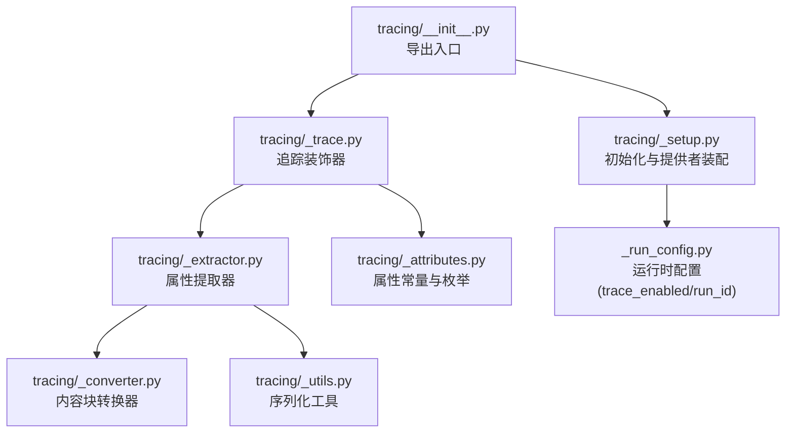

图表来源
- [src/agentscope/tracing/__init__.py:1-23](file://src/agentscope/tracing/__init__.py#L1-L23)
- [src/agentscope/tracing/_setup.py:1-50](file://src/agentscope/tracing/_setup.py#L1-L50)
- [src/agentscope/tracing/_trace.py:1-647](file://src/agentscope/tracing/_trace.py#L1-L647)
- [src/agentscope/tracing/_extractor.py:1-800](file://src/agentscope/tracing/_extractor.py#L1-L800)
- [src/agentscope/tracing/_converter.py:1-126](file://src/agentscope/tracing/_converter.py#L1-L126)
- [src/agentscope/tracing/_utils.py:1-79](file://src/agentscope/tracing/_utils.py#L1-L79)
- [src/agentscope/_run_config.py:66-73](file://src/agentscope/_run_config.py#L66-L73)

章节来源
- [src/agentscope/tracing/__init__.py:1-23](file://src/agentscope/tracing/__init__.py#L1-L23)
- [src/agentscope/tracing/_setup.py:1-50](file://src/agentscope/tracing/_setup.py#L1-L50)
- [src/agentscope/tracing/_trace.py:1-647](file://src/agentscope/tracing/_trace.py#L1-L647)
- [src/agentscope/tracing/_extractor.py:1-800](file://src/agentscope/tracing/_extractor.py#L1-L800)
- [src/agentscope/tracing/_converter.py:1-126](file://src/agentscope/tracing/_converter.py#L1-L126)
- [src/agentscope/tracing/_utils.py:1-79](file://src/agentscope/tracing/_utils.py#L1-L79)
- [src/agentscope/_run_config.py:66-73](file://src/agentscope/_run_config.py#L66-L73)

## 核心组件
- 追踪初始化与导出
  - 通过 endpoint 指定 OTLP 导出目标，自动装配 BatchSpanProcessor 与 TracerProvider；若外部已存在 Provider，则仅追加处理器
  - 提供获取 Tracer 的便捷方法，命名空间为 "agentscope"，版本号来自包版本
- 追踪装饰器
  - 通用装饰器：支持同步/异步函数、生成器/异步生成器，自动记录请求参数、响应结果与异常
  - LLM 调用：自动识别流式与非流式返回，流式场景按块回填响应属性
  - Agent 回复：抽取输入消息、输出消息与 Agent 元信息
  - Formatter 格式化：抽取格式目标（Provider）与格式计数
  - Toolkit 工具执行：抽取工具名、参数、描述与结果
  - Embedding 嵌入：抽取维度等属性
- 属性提取器
  - 统一抽取 OpenTelemetry GenAI 规范所需属性，并兼容 AgentScope 扩展属性
  - 提供 Span 名称生成、消息序列化、工具定义扁平化、Provider 名称映射等能力
- 数据转换器
  - 将文本、思考、工具调用/结果、图像/音频/视频等消息块转换为 OpenTelemetry Part 格式
- 序列化工具
  - 将复杂对象安全地转为可序列化形式，再以 JSON 字符串存储，确保属性值均为字符串
- 运行时配置
  - trace_enabled 控制是否启用追踪
  - run_id 作为 GenAI 会话标识注入所有 Span

章节来源
- [src/agentscope/tracing/_setup.py:11-50](file://src/agentscope/tracing/_setup.py#L11-L50)
- [src/agentscope/tracing/_trace.py:69-78](file://src/agentscope/tracing/_trace.py#L69-L78)
- [src/agentscope/tracing/_trace.py:192-319](file://src/agentscope/tracing/_trace.py#L192-L319)
- [src/agentscope/tracing/_trace.py:322-433](file://src/agentscope/tracing/_trace.py#L322-L433)
- [src/agentscope/tracing/_trace.py:436-493](file://src/agentscope/tracing/_trace.py#L436-L493)
- [src/agentscope/tracing/_trace.py:496-564](file://src/agentscope/tracing/_trace.py#L496-L564)
- [src/agentscope/tracing/_trace.py:567-646](file://src/agentscope/tracing/_trace.py#L567-L646)
- [src/agentscope/tracing/_extractor.py:52-134](file://src/agentscope/tracing/_extractor.py#L52-L134)
- [src/agentscope/tracing/_extractor.py:198-267](file://src/agentscope/tracing/_extractor.py#L198-L267)
- [src/agentscope/tracing/_extractor.py:447-549](file://src/agentscope/tracing/_extractor.py#L447-L549)
- [src/agentscope/tracing/_extractor.py:552-652](file://src/agentscope/tracing/_extractor.py#L552-L652)
- [src/agentscope/tracing/_extractor.py:655-731](file://src/agentscope/tracing/_extractor.py#L655-L731)
- [src/agentscope/tracing/_extractor.py:734-787](file://src/agentscope/tracing/_extractor.py#L734-L787)
- [src/agentscope/tracing/_extractor.py:789-800](file://src/agentscope/tracing/_extractor.py#L789-L800)
- [src/agentscope/tracing/_converter.py:57-126](file://src/agentscope/tracing/_converter.py#L57-L126)
- [src/agentscope/tracing/_utils.py:15-79](file://src/agentscope/tracing/_utils.py#L15-L79)
- [src/agentscope/_run_config.py:66-73](file://src/agentscope/_run_config.py#L66-L73)

## 架构总览
下图展示了从应用调用到 OpenTelemetry 后端的数据流：装饰器捕获函数调用，提取器生成属性，转换器规范消息块，最终通过 OTLP 导出至后端。

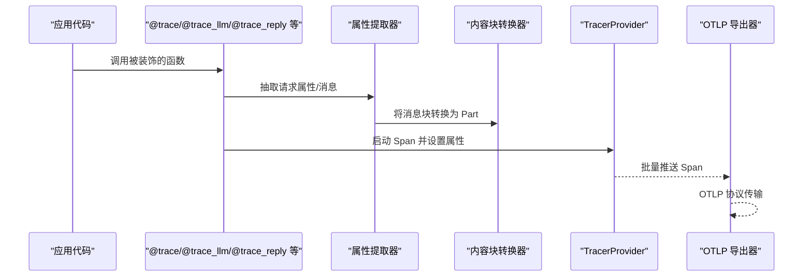

图表来源
- [src/agentscope/tracing/_trace.py:192-319](file://src/agentscope/tracing/_trace.py#L192-L319)
- [src/agentscope/tracing/_extractor.py:198-267](file://src/agentscope/tracing/_extractor.py#L198-L267)
- [src/agentscope/tracing/_converter.py:57-126](file://src/agentscope/tracing/_converter.py#L57-L126)
- [src/agentscope/tracing/_setup.py:26-38](file://src/agentscope/tracing/_setup.py#L26-L38)

## 详细组件分析

### 初始化与导出（_setup.py）
- 功能要点
  - 通过 endpoint 创建 OTLPSpanExporter，并包装为 BatchSpanProcessor
  - 若外部已设置 TracerProvider，则直接追加处理器；否则创建新的 Provider 并设置为全局
  - 提供获取 Tracer 的方法，命名空间为 "agentscope"，版本号来自包版本
- 关键行为
  - 惰性导入 OpenTelemetry 依赖，避免不必要的启动开销
  - 与运行时配置解耦，便于在应用初始化阶段统一装配

章节来源
- [src/agentscope/tracing/_setup.py:11-50](file://src/agentscope/tracing/_setup.py#L11-L50)

### 通用追踪装饰器（_trace.py）
- 功能要点
  - 支持同步/异步函数与生成器/异步生成器
  - 自动设置 Span 成功状态或错误状态，并记录异常
  - 对流式 LLM/工具执行，逐块回填响应属性
- 流程图（通用装饰器）
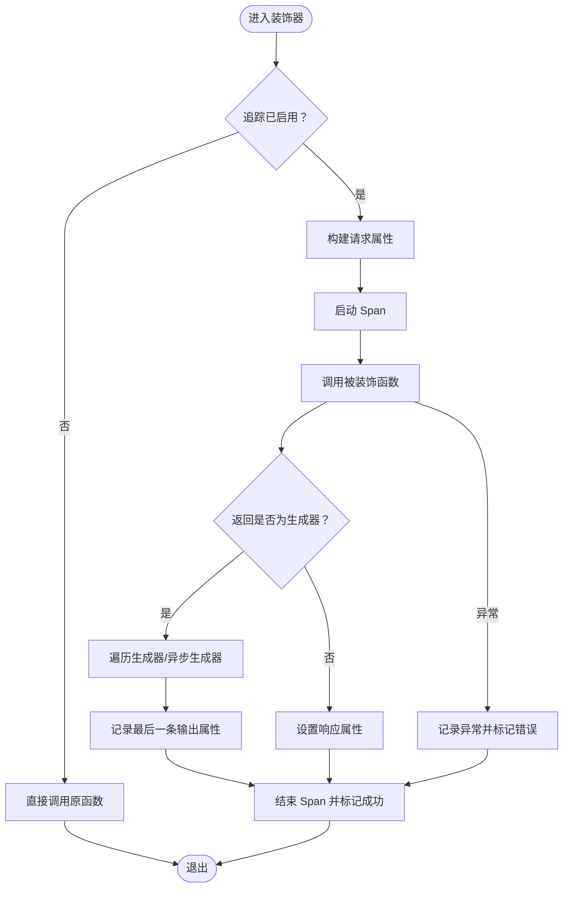

图表来源
- [src/agentscope/tracing/_trace.py:192-319](file://src/agentscope/tracing/_trace.py#L192-L319)
- [src/agentscope/tracing/_trace.py:107-190](file://src/agentscope/tracing/_trace.py#L107-L190)

章节来源
- [src/agentscope/tracing/_trace.py:69-105](file://src/agentscope/tracing/_trace.py#L69-L105)
- [src/agentscope/tracing/_trace.py:107-190](file://src/agentscope/tracing/_trace.py#L107-L190)
- [src/agentscope/tracing/_trace.py:192-319](file://src/agentscope/tracing/_trace.py#L192-L319)

### LLM 追踪（trace_llm）
- 功能要点
  - 自动识别 ChatModelBase 实例，抽取 Provider、模型名、生成参数
  - 支持流式与非流式返回；流式场景按块回填响应属性
  - 记录输入/输出消息、Token 使用、FinishReason 等
- 序列图（LLM 调用）
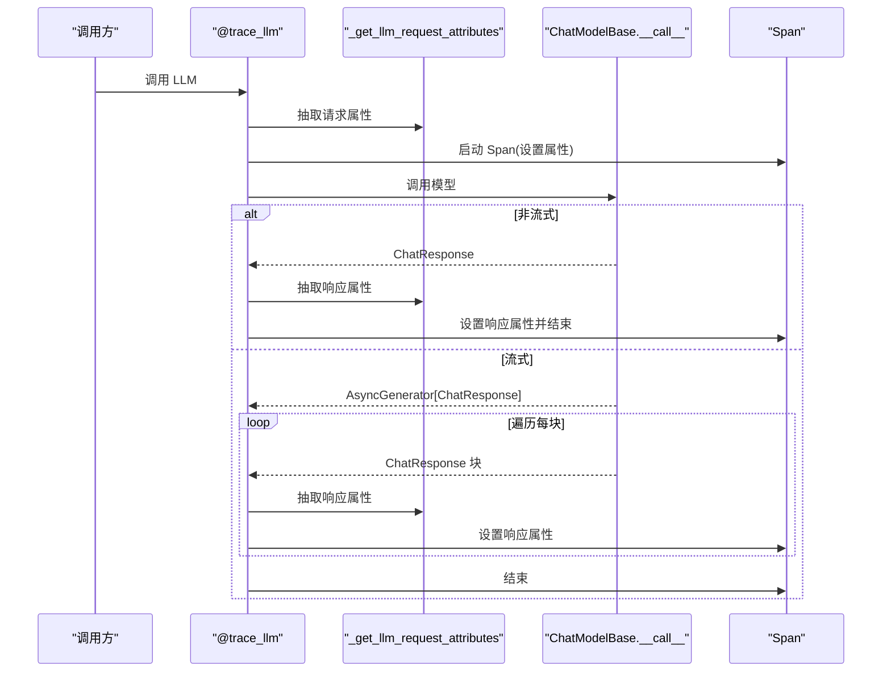

图表来源
- [src/agentscope/tracing/_trace.py:567-646](file://src/agentscope/tracing/_trace.py#L567-L646)
- [src/agentscope/tracing/_extractor.py:198-267](file://src/agentscope/tracing/_extractor.py#L198-L267)
- [src/agentscope/tracing/_extractor.py:346-391](file://src/agentscope/tracing/_extractor.py#L346-L391)

章节来源
- [src/agentscope/tracing/_trace.py:567-646](file://src/agentscope/tracing/_trace.py#L567-L646)
- [src/agentscope/tracing/_extractor.py:198-267](file://src/agentscope/tracing/_extractor.py#L198-L267)
- [src/agentscope/tracing/_extractor.py:289-391](file://src/agentscope/tracing/_extractor.py#L289-L391)

### Agent 追踪（trace_reply）
- 功能要点
  - 从 AgentBase 实例抽取 Agent ID、Name、Description
  - 将 Msg/列表消息转换为 OpenTelemetry 规范的消息数组
  - 记录输入/输出消息与函数输入/输出
- 序列图（Agent 回复）
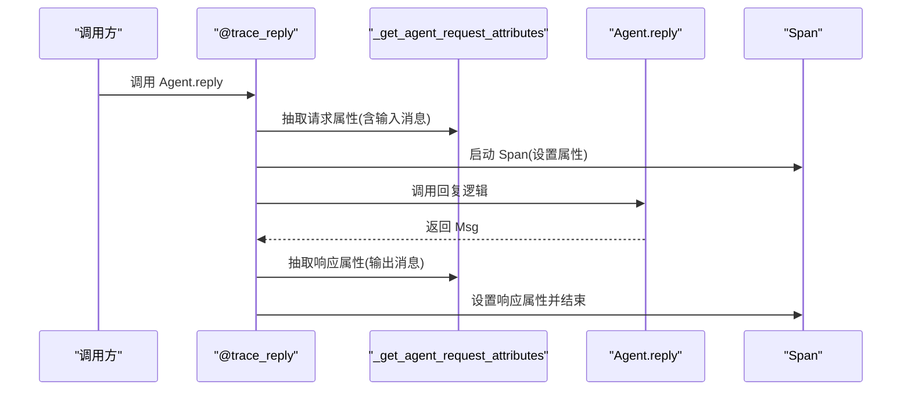

图表来源
- [src/agentscope/tracing/_trace.py:367-433](file://src/agentscope/tracing/_trace.py#L367-L433)
- [src/agentscope/tracing/_extractor.py:447-549](file://src/agentscope/tracing/_extractor.py#L447-L549)

章节来源
- [src/agentscope/tracing/_trace.py:367-433](file://src/agentscope/tracing/_trace.py#L367-L433)
- [src/agentscope/tracing/_extractor.py:447-549](file://src/agentscope/tracing/_extractor.py#L447-L549)

### Formatter 追踪（trace_format）
- 功能要点
  - 抽取格式目标（Provider）与格式计数
  - 记录函数输入/输出，支持列表格式化结果
- 序列图（Formatter 格式化）
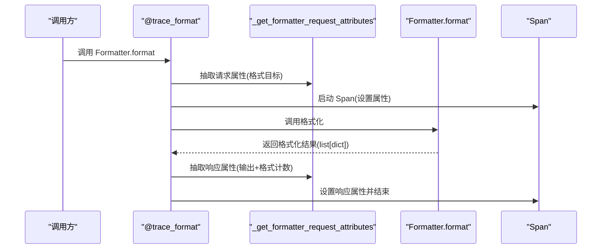

图表来源
- [src/agentscope/tracing/_trace.py:496-564](file://src/agentscope/tracing/_trace.py#L496-L564)
- [src/agentscope/tracing/_extractor.py:655-731](file://src/agentscope/tracing/_extractor.py#L655-L731)

章节来源
- [src/agentscope/tracing/_trace.py:496-564](file://src/agentscope/tracing/_trace.py#L496-L564)
- [src/agentscope/tracing/_extractor.py:655-731](file://src/agentscope/tracing/_extractor.py#L655-L731)

### Toolkit 追踪（trace_toolkit）
- 功能要点
  - 抽取工具调用 ID、名称、参数与描述
  - 记录工具调用结果与函数输入/输出
- 序列图（工具执行）
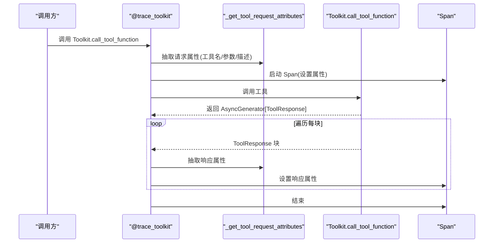

图表来源
- [src/agentscope/tracing/_trace.py:322-364](file://src/agentscope/tracing/_trace.py#L322-L364)
- [src/agentscope/tracing/_extractor.py:552-652](file://src/agentscope/tracing/_extractor.py#L552-L652)

章节来源
- [src/agentscope/tracing/_trace.py:322-364](file://src/agentscope/tracing/_trace.py#L322-L364)
- [src/agentscope/tracing/_extractor.py:552-652](file://src/agentscope/tracing/_extractor.py#L552-L652)

### Embedding 追踪（trace_embedding）
- 功能要点
  - 抽取嵌入模型名与维度等属性
  - 记录函数输入/输出
- 序列图（Embedding 调用）
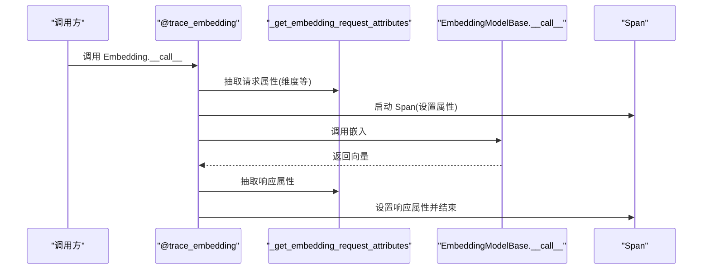

图表来源
- [src/agentscope/tracing/_trace.py:436-493](file://src/agentscope/tracing/_trace.py#L436-L493)
- [src/agentscope/tracing/_extractor.py:789-800](file://src/agentscope/tracing/_extractor.py#L789-L800)

章节来源
- [src/agentscope/tracing/_trace.py:436-493](file://src/agentscope/tracing/_trace.py#L436-L493)
- [src/agentscope/tracing/_extractor.py:789-800](file://src/agentscope/tracing/_extractor.py#L789-L800)

### 属性提取器（_extractor.py）
- 功能要点
  - Provider 映射：根据类名或 base_url 片段识别 Provider
  - 工具定义扁平化：将嵌套工具定义转换为 OpenTelemetry GenAI 扁平格式
  - 消息序列化：将 Msg/列表消息转换为 OpenTelemetry 规范的消息数组
  - 通用属性：统一抽取操作名、函数名、输入/输出等
- 类图（关键类型）
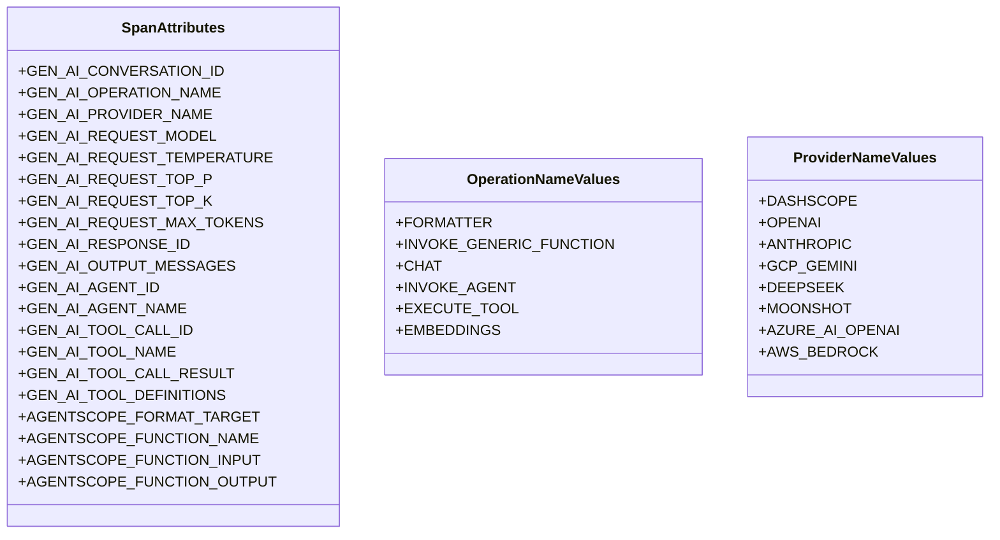

图表来源
- [src/agentscope/tracing/_attributes.py:8-184](file://src/agentscope/tracing/_attributes.py#L8-L184)

章节来源
- [src/agentscope/tracing/_extractor.py:52-134](file://src/agentscope/tracing/_extractor.py#L52-L134)
- [src/agentscope/tracing/_extractor.py:136-196](file://src/agentscope/tracing/_extractor.py#L136-L196)
- [src/agentscope/tracing/_extractor.py:198-267](file://src/agentscope/tracing/_extractor.py#L198-L267)
- [src/agentscope/tracing/_extractor.py:394-444](file://src/agentscope/tracing/_extractor.py#L394-L444)
- [src/agentscope/tracing/_extractor.py:447-549](file://src/agentscope/tracing/_extractor.py#L447-L549)
- [src/agentscope/tracing/_extractor.py:552-652](file://src/agentscope/tracing/_extractor.py#L552-L652)
- [src/agentscope/tracing/_extractor.py:655-731](file://src/agentscope/tracing/_extractor.py#L655-L731)
- [src/agentscope/tracing/_extractor.py:734-800](file://src/agentscope/tracing/_extractor.py#L734-L800)
- [src/agentscope/tracing/_attributes.py:8-184](file://src/agentscope/tracing/_attributes.py#L8-L184)

### 数据转换器（_converter.py）
- 功能要点
  - 文本/思考：映射为 text/reasoning
  - 工具调用/结果：映射为 tool_call/tool_call_response
  - 媒体资源：支持 url/base64，输出 uri/blob 并带媒体类型
- 流程图（内容块转换）
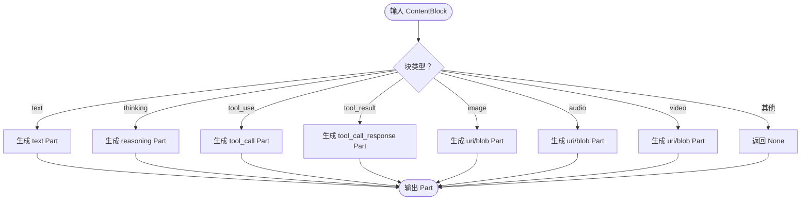

图表来源
- [src/agentscope/tracing/_converter.py:57-126](file://src/agentscope/tracing/_converter.py#L57-L126)

章节来源
- [src/agentscope/tracing/_converter.py:57-126](file://src/agentscope/tracing/_converter.py#L57-L126)

### 序列化工具（_utils.py）
- 功能要点
  - 将复杂对象转换为可序列化形式（递归处理列表/字典/集合/枚举/日期时间等）
  - 统一以 JSON 字符串存储，保证属性值均为字符串
- 流程图（可序列化转换）
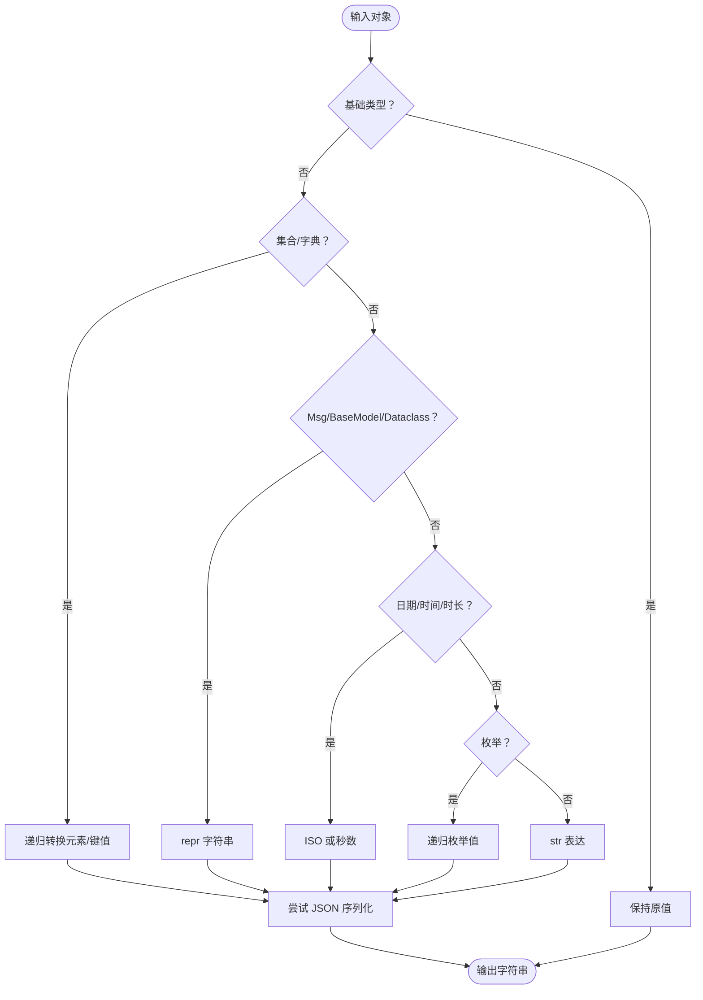

图表来源
- [src/agentscope/tracing/_utils.py:15-79](file://src/agentscope/tracing/_utils.py#L15-L79)

章节来源
- [src/agentscope/tracing/_utils.py:15-79](file://src/agentscope/tracing/_utils.py#L15-L79)

## 依赖分析
- 组件耦合
  - 装饰器层依赖属性提取器与工具模块，形成清晰的职责边界
  - 初始化模块与运行时配置解耦，便于在应用生命周期早期装配
- 外部依赖
  - OpenTelemetry SDK（TracerProvider、BatchSpanProcessor、OTLPSpanExporter）
  - AgentScope 内部类型（AgentBase、ChatModelBase、FormatterBase、EmbeddingModelBase、Msg、ToolUseBlock 等）

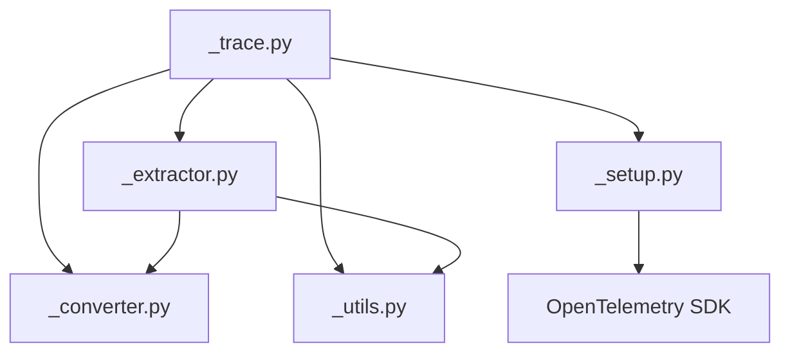

图表来源
- [src/agentscope/tracing/_trace.py:1-647](file://src/agentscope/tracing/_trace.py#L1-L647)
- [src/agentscope/tracing/_setup.py:1-50](file://src/agentscope/tracing/_setup.py#L1-L50)

章节来源
- [src/agentscope/tracing/_trace.py:1-647](file://src/agentscope/tracing/_trace.py#L1-L647)
- [src/agentscope/tracing/_setup.py:1-50](file://src/agentscope/tracing/_setup.py#L1-L50)

## 性能考虑
- 采样策略
  - 当前实现未内置采样器，采用默认采样策略；如需降低开销，可在上游 OTel Provider 中配置 Sampler 或通过后端策略控制
- 导出批处理
  - 使用 BatchSpanProcessor 批量导出，减少网络往返；可根据吞吐量调整批量大小与超时
- 序列化成本
  - 属性值统一序列化为字符串，避免复杂对象带来的序列化开销；对于大消息/工具结果，建议限制字段长度或进行裁剪
- 异步与流式
  - 流式 LLM/工具执行按块回填属性，避免一次性累积大量数据；注意生成器异常处理与提前结束

## 故障排查指南
- 追踪未生效
  - 检查运行时配置 trace_enabled 是否为 True
  - 确认已调用初始化函数并传入 tracing_url
- Provider 未设置
  - 若外部已设置 TracerProvider，确保已追加 BatchSpanProcessor
- 属性缺失或异常
  - 检查属性提取器映射（Provider 名称、工具定义扁平化）
  - 确认消息块类型与字段完整（text、tool_use、tool_result、image/audio/video）
- 序列化失败
  - 复杂对象将降级为字符串表示；如需保留结构，建议在业务侧预处理

章节来源
- [src/agentscope/_run_config.py:66-73](file://src/agentscope/_run_config.py#L66-L73)
- [src/agentscope/tracing/_setup.py:26-38](file://src/agentscope/tracing/_setup.py#L26-L38)
- [src/agentscope/tracing/_extractor.py:136-196](file://src/agentscope/tracing/_extractor.py#L136-L196)
- [src/agentscope/tracing/_converter.py:57-126](file://src/agentscope/tracing/_converter.py#L57-L126)
- [src/agentscope/tracing/_utils.py:60-79](file://src/agentscope/tracing/_utils.py#L60-L79)

## 结论
AgentScope 追踪系统通过装饰器与属性提取器，将 AgentScope 组件的调用与输出标准化为 OpenTelemetry GenAI 规范，结合 OTLP 导出器实现跨平台可观测性。其设计强调易用性与扩展性，既可满足通用函数追踪，也能覆盖 LLM、Agent、Formatter、Toolkit、Embedding 等关键路径。配合运行时配置与测试用例，用户可快速落地并验证追踪效果。

## 附录

### 追踪配置选项
- 追踪开关
  - trace_enabled：布尔值，控制是否启用追踪
- 会话标识
  - run_id：字符串，作为 GenAI 会话标识注入所有 Span
- 导出配置
  - endpoint：OTLP 导出目标 URL
  - 批处理参数：BatchSpanProcessor 的批量大小与超时（由上游 Provider 控制）

章节来源
- [src/agentscope/_run_config.py:66-73](file://src/agentscope/_run_config.py#L66-L73)
- [src/agentscope/tracing/_setup.py:11-28](file://src/agentscope/tracing/_setup.py#L11-L28)

### 使用示例与最佳实践
- 基础使用
  - 在应用初始化时设置 tracing_url，随后在关键函数上使用 @trace 装饰器
  - 对 LLM/Agent/Formatter/Toolkit/Embedding 分别使用对应装饰器
- 最佳实践
  - 为每个被追踪函数提供明确的 name，便于查询与聚合
  - 对大消息/工具结果进行必要的字段裁剪，避免属性值过大
  - 在生产环境优先使用流式 LLM/工具执行，以便更细粒度地观测中间结果
  - 通过 Provider 映射与工具定义扁平化，确保跨模型/工具的一致性

章节来源
- [tests/tracing_test.py:37-128](file://tests/tracing_test.py#L37-L128)
- [tests/tracing_test.py:129-202](file://tests/tracing_test.py#L129-L202)
- [tests/tracing_test.py:203-240](file://tests/tracing_test.py#L203-L240)
- [tests/tracing_test.py:241-263](file://tests/tracing_test.py#L241-L263)
- [tests/tracing_test.py:264-354](file://tests/tracing_test.py#L264-L354)
- [tests/tracing_test.py:355-378](file://tests/tracing_test.py#L355-L378)

### API 参考
- 初始化
  - setup_tracing(endpoint: str) -> None
- 装饰器
  - trace(name: str | None = None) -> Callable
  - trace_llm(func) -> Callable
  - trace_reply(func) -> Callable
  - trace_format(func) -> Callable
  - trace_toolkit(func) -> Callable
  - trace_embedding(func) -> Callable
- 属性与枚举
  - SpanAttributes：GenAI 与 AgentScope 扩展属性键
  - OperationNameValues：操作名枚举
  - ProviderNameValues：Provider 名称枚举
- 工具函数
  - _get_tracer() -> Tracer
  - _to_serializable(obj) -> Any
  - _serialize_to_str(value) -> str

章节来源
- [src/agentscope/tracing/__init__.py:4-22](file://src/agentscope/tracing/__init__.py#L4-L22)
- [src/agentscope/tracing/_setup.py:41-49](file://src/agentscope/tracing/_setup.py#L41-L49)
- [src/agentscope/tracing/_trace.py:69-78](file://src/agentscope/tracing/_trace.py#L69-L78)
- [src/agentscope/tracing/_attributes.py:8-184](file://src/agentscope/tracing/_attributes.py#L8-L184)
- [src/agentscope/tracing/_utils.py:15-79](file://src/agentscope/tracing/_utils.py#L15-L79)