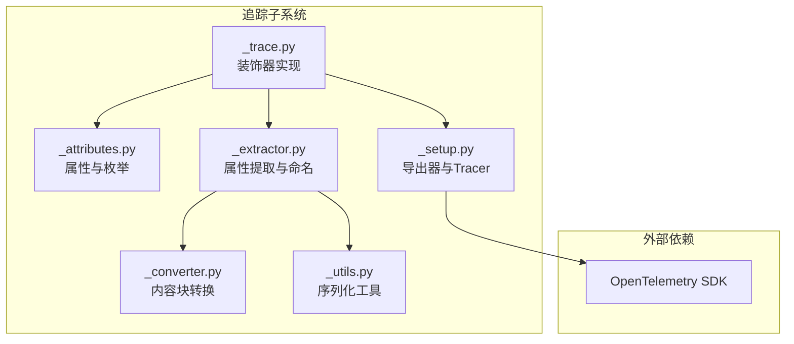
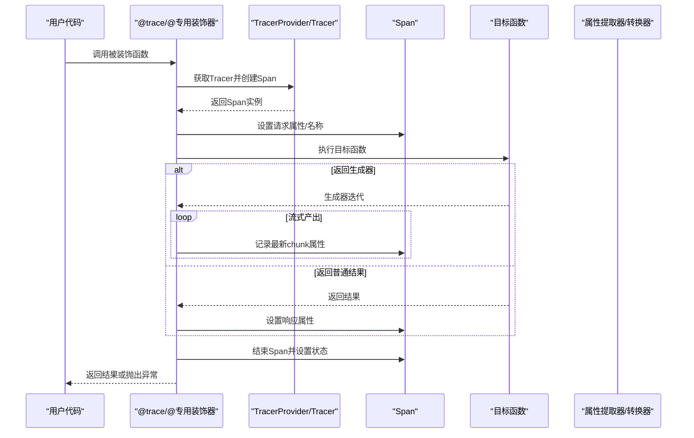
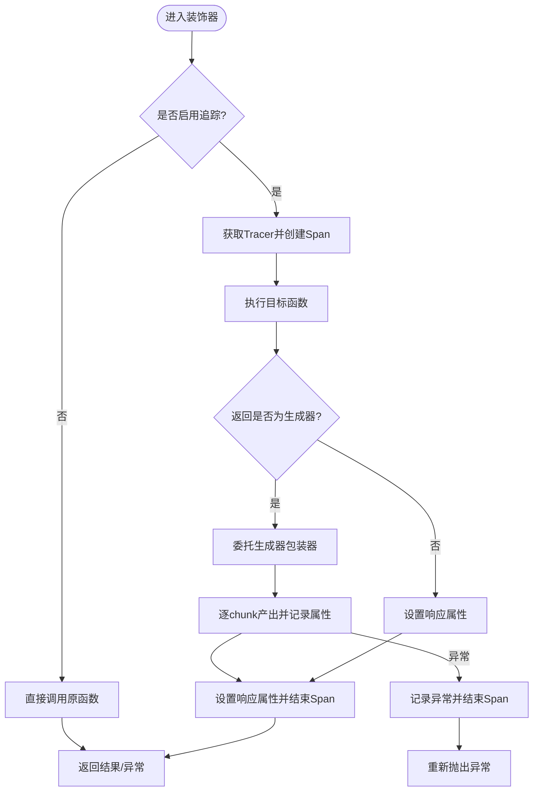
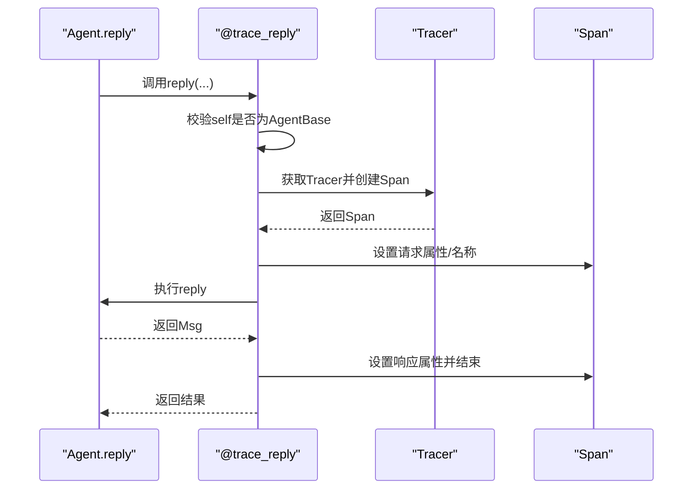
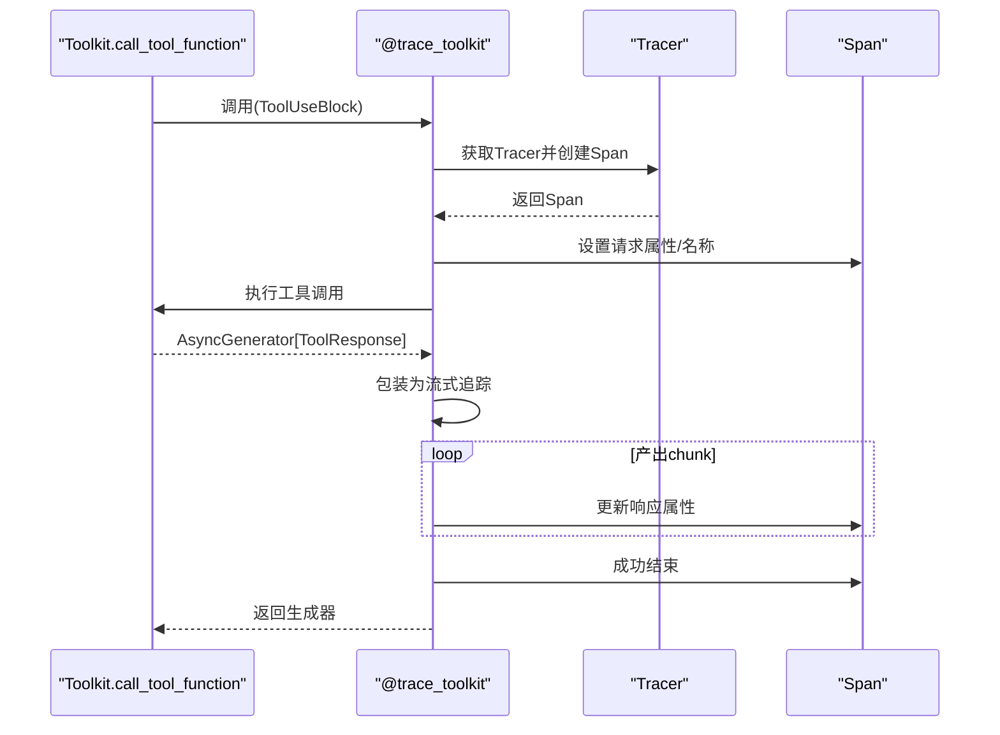
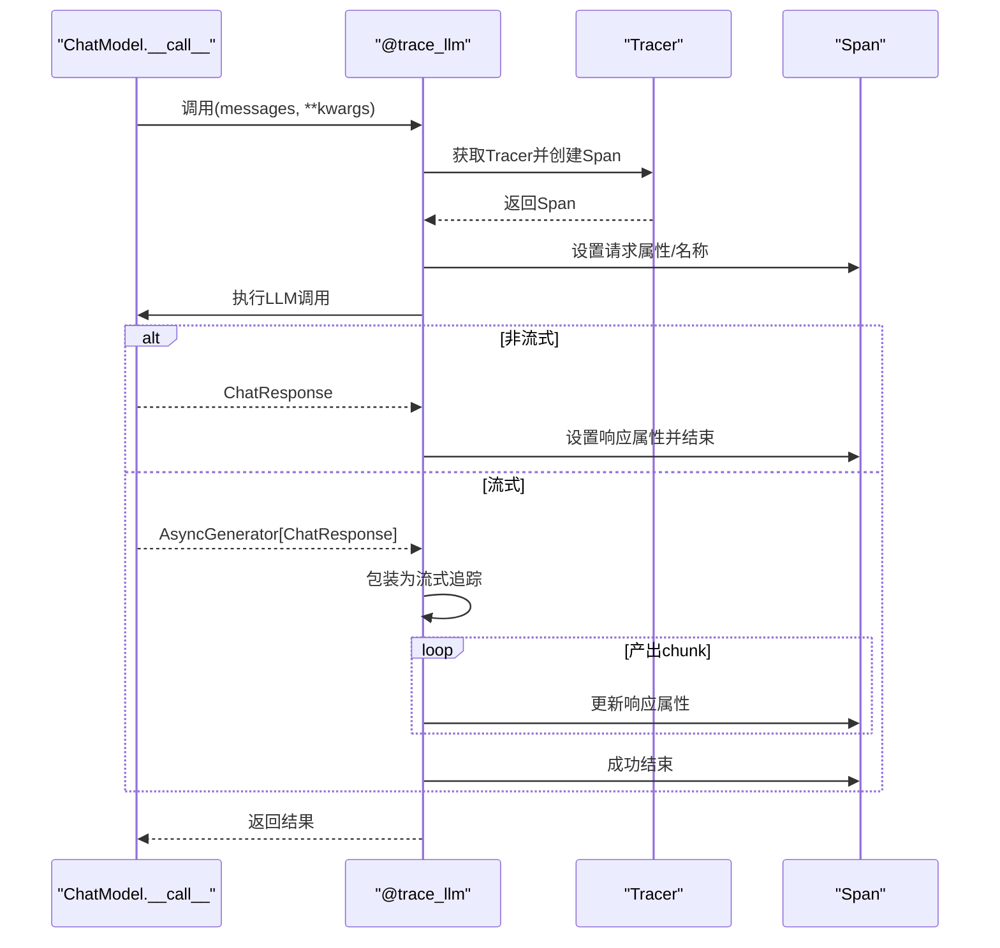
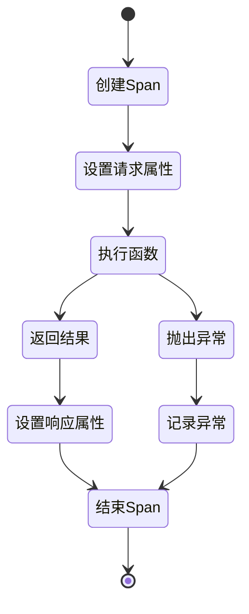
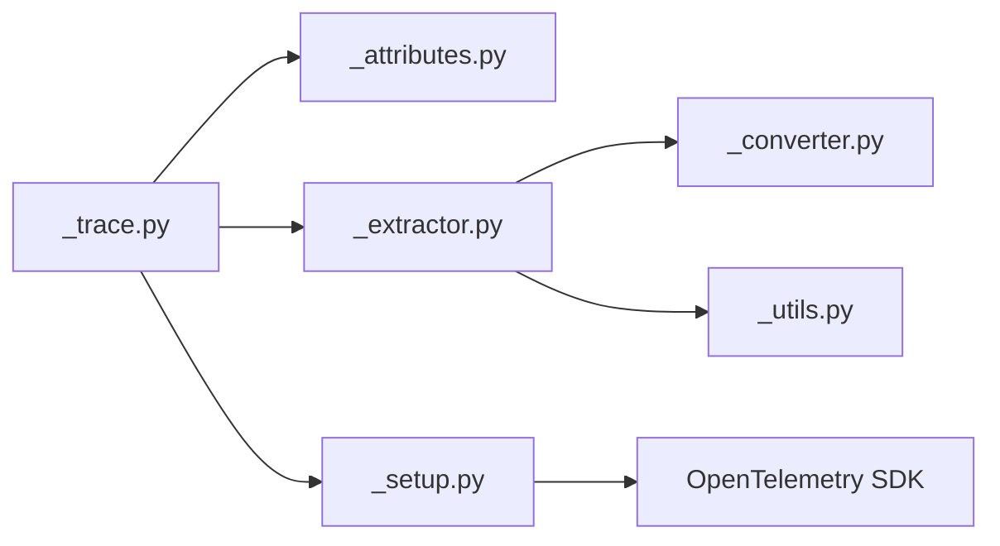

# 追踪装饰器

<cite>
**本文引用的文件**
- [tracing/__init__.py](file://src/agentscope/tracing/__init__.py)
- [tracing/_trace.py](file://src/agentscope/tracing/_trace.py)
- [tracing/_attributes.py](file://src/agentscope/tracing/_attributes.py)
- [tracing/_extractor.py](file://src/agentscope/tracing/_extractor.py)
- [tracing/_converter.py](file://src/agentscope/tracing/_converter.py)
- [tracing/_utils.py](file://src/agentscope/tracing/_utils.py)
- [tracing/_setup.py](file://src/agentscope/tracing/_setup.py)
- [__init__.py](file://src/agentscope/__init__.py)
- [task_tracing.py](file://docs/tutorial/zh_CN/src/task_tracing.py)
- [tracing_test.py](file://tests/tracing_test.py)
</cite>

## 目录
1. [简介](#简介)
2. [项目结构](#项目结构)
3. [核心组件](#核心组件)
4. [架构总览](#架构总览)
5. [详细组件分析](#详细组件分析)
6. [依赖关系分析](#依赖关系分析)
7. [性能考量](#性能考量)
8. [故障排查指南](#故障排查指南)
9. [结论](#结论)
10. [附录](#附录)

## 简介
本技术文档围绕 AgentScope 的追踪装饰器系统展开，重点解释 trace 装饰器的实现原理与工作机制，覆盖同步/异步函数包装、生成器支持、异常处理；并系统介绍专用追踪装饰器：trace_reply（智能体回复）、trace_toolkit（工具调用）、trace_llm（大模型调用）、trace_embedding（嵌入向量）、trace_format（格式化器）。文档还阐述装饰器生命周期管理（span 创建、属性设置、状态更新、异常记录），高级特性（流式输出追踪、异步生成器处理、批量操作支持），以及最佳实践（性能优化、内存管理、错误处理策略），并提供完整的 API 参考与使用示例。

## 项目结构
AgentScope 的追踪子系统位于 tracing 包内，核心文件如下：
- 导出入口：tracing/__init__.py
- 装饰器实现：tracing/_trace.py
- 属性与枚举：tracing/_attributes.py
- 属性提取与命名：tracing/_extractor.py
- 内容块转换：tracing/_converter.py
- 工具函数（序列化等）：tracing/_utils.py
- 初始化与导出器设置：tracing/_setup.py
- 全局配置与初始化入口：src/agentscope/__init__.py
- 教程与示例：docs/tutorial/zh_CN/src/task_tracing.py
- 单元测试：tests/tracing_test.py

**图表来源**
- [tracing/_trace.py:1-647](file://src/agentscope/tracing/_trace.py#L1-L647)
- [tracing/_attributes.py:1-184](file://src/agentscope/tracing/_attributes.py#L1-L184)
- [tracing/_extractor.py:1-800](file://src/agentscope/tracing/_extractor.py#L1-L800)
- [tracing/_converter.py:1-126](file://src/agentscope/tracing/_converter.py#L1-L126)
- [tracing/_utils.py:1-79](file://src/agentscope/tracing/_utils.py#L1-L79)
- [tracing/_setup.py:1-50](file://src/agentscope/tracing/_setup.py#L1-L50)

**章节来源**
- [tracing/__init__.py:1-23](file://src/agentscope/tracing/__init__.py#L1-L23)
- [tracing/_trace.py:1-647](file://src/agentscope/tracing/_trace.py#L1-L647)
- [tracing/_attributes.py:1-184](file://src/agentscope/tracing/_attributes.py#L1-L184)
- [tracing/_extractor.py:1-800](file://src/agentscope/tracing/_extractor.py#L1-L800)
- [tracing/_converter.py:1-126](file://src/agentscope/tracing/_converter.py#L1-L126)
- [tracing/_utils.py:1-79](file://src/agentscope/tracing/_utils.py#L1-L79)
- [tracing/_setup.py:1-50](file://src/agentscope/tracing/_setup.py#L1-L50)
- [__init__.py:72-157](file://src/agentscope/__init__.py#L72-L157)
- [task_tracing.py:1-214](file://docs/tutorial/zh_CN/src/task_tracing.py#L1-L214)
- [tracing_test.py:1-382](file://tests/tracing_test.py#L1-L382)

## 核心组件
- 通用装饰器 trace：支持同步/异步函数与生成器，自动识别并追踪输入输出，统一异常处理。
- 专用装饰器：
  - trace_reply：追踪 AgentBase.reply 的调用，提取消息与智能体元信息。
  - trace_toolkit：追踪 Toolkit.call_tool_function 的工具调用流。
  - trace_llm：追踪 ChatModelBase.__call__ 的 LLM 调用，支持流式与非流式响应。
  - trace_embedding：追踪 EmbeddingModelBase.__call__ 的嵌入调用。
  - trace_format：追踪 FormatterBase.format 的格式化流程。
- 属性体系：SpanAttributes、OperationNameValues、ProviderNameValues 定义标准属性键与取值。
- 属性提取器：按组件类型抽取请求/响应属性，生成 span 名称。
- 内容块转换器：将内部内容块转换为 OpenTelemetry GenAI 规范的 parts。
- 序列化工具：安全地将复杂对象序列化为字符串，保证属性可写入。
- Tracer 设置：基于 OTLP/HTTP 的导出器配置与 TracerProvider 注册。

**章节来源**
- [tracing/__init__.py:4-22](file://src/agentscope/tracing/__init__.py#L4-L22)
- [tracing/_trace.py:192-646](file://src/agentscope/tracing/_trace.py#L192-L646)
- [tracing/_attributes.py:8-184](file://src/agentscope/tracing/_attributes.py#L8-L184)
- [tracing/_extractor.py:52-800](file://src/agentscope/tracing/_extractor.py#L52-L800)
- [tracing/_converter.py:57-126](file://src/agentscope/tracing/_converter.py#L57-L126)
- [tracing/_utils.py:60-79](file://src/agentscope/tracing/_utils.py#L60-L79)
- [tracing/_setup.py:11-49](file://src/agentscope/tracing/_setup.py#L11-L49)

## 架构总览
追踪系统以 OpenTelemetry 为核心，通过装饰器在运行时注入 span 生命周期管理，自动采集请求参数、响应结果与异常信息，并将其标准化为 GenAI 规范属性，最终由导出器批量发送至远端收集器或本地 Studio。

**图表来源**
- [tracing/_trace.py:192-318](file://src/agentscope/tracing/_trace.py#L192-L318)
- [tracing/_trace.py:322-433](file://src/agentscope/tracing/_trace.py#L322-L433)
- [tracing/_trace.py:436-493](file://src/agentscope/tracing/_trace.py#L436-L493)
- [tracing/_trace.py:496-564](file://src/agentscope/tracing/_trace.py#L496-L564)
- [tracing/_trace.py:567-646](file://src/agentscope/tracing/_trace.py#L567-L646)
- [tracing/_extractor.py:198-391](file://src/agentscope/tracing/_extractor.py#L198-L391)
- [tracing/_extractor.py:447-549](file://src/agentscope/tracing/_extractor.py#L447-L549)
- [tracing/_extractor.py:552-652](file://src/agentscope/tracing/_extractor.py#L552-L652)
- [tracing/_extractor.py:655-731](file://src/agentscope/tracing/_extractor.py#L655-L731)
- [tracing/_extractor.py:734-787](file://src/agentscope/tracing/_extractor.py#L734-L787)
- [tracing/_converter.py:57-126](file://src/agentscope/tracing/_converter.py#L57-L126)
- [tracing/_setup.py:11-49](file://src/agentscope/tracing/_setup.py#L11-L49)

## 详细组件分析

### 通用装饰器 trace
- 功能概述
  - 支持同步与异步函数；若返回 Generator/AsyncGenerator，则作为流式输出进行追踪。
  - 统一设置请求属性（函数名、参数）、生成 span 名称、在 finally 中设置响应属性并结束 span。
  - 异常捕获后记录异常并结束 span，保持原始异常链。
- 关键流程
  - 检查全局开关 trace_enabled；未启用则直接调用原函数。
  - 使用 _get_tracer 获取 Tracer 并创建 span，end_on_exit=False 以便后续异步生成器处理。
  - 对生成器返回值，分别委托 _trace_async_generator_wrapper 或 _trace_sync_generator_wrapper。
  - 对普通返回值，设置响应属性并成功结束 span。
- 生成器追踪
  - 同步生成器：遍历每个 chunk，记录最后一次产出作为最终响应属性。
  - 异步生成器：使用异步迭代器库逐个产出，异常时记录异常并结束 span。
- 异常处理
  - 捕获所有异常，设置 ERROR 状态、记录异常与堆栈，然后重新抛出。

**图表来源**
- [tracing/_trace.py:192-318](file://src/agentscope/tracing/_trace.py#L192-L318)
- [tracing/_trace.py:107-132](file://src/agentscope/tracing/_trace.py#L107-L132)
- [tracing/_trace.py:134-190](file://src/agentscope/tracing/_trace.py#L134-L190)
- [tracing/_trace.py:80-105](file://src/agentscope/tracing/_trace.py#L80-L105)

**章节来源**
- [tracing/_trace.py:192-318](file://src/agentscope/tracing/_trace.py#L192-L318)
- [tracing/_trace.py:107-190](file://src/agentscope/tracing/_trace.py#L107-L190)
- [tracing/_trace.py:80-105](file://src/agentscope/tracing/_trace.py#L80-L105)

### 专用装饰器：trace_reply（智能体回复）
- 适用对象：AgentBase.reply 异步方法。
- 行为要点
  - 校验第一个参数必须为 AgentBase 实例，否则跳过追踪并警告。
  - 提取请求属性（输入消息、智能体元信息），生成 span 名称。
  - 执行 reply 并设置响应属性（输出消息），成功结束 span。
  - 异常时记录异常并结束 span。

**图表来源**
- [tracing/_trace.py:367-433](file://src/agentscope/tracing/_trace.py#L367-L433)
- [tracing/_extractor.py:447-549](file://src/agentscope/tracing/_extractor.py#L447-L549)

**章节来源**
- [tracing/_trace.py:367-433](file://src/agentscope/tracing/_trace.py#L367-L433)
- [tracing/_extractor.py:447-549](file://src/agentscope/tracing/_extractor.py#L447-L549)

### 专用装饰器：trace_toolkit（工具调用）
- 适用对象：Toolkit.call_tool_function，返回 AsyncGenerator[ToolResponse]。
- 行为要点
  - 提取工具调用请求属性（工具名、参数、描述等）。
  - 严格校验返回类型为 AsyncGenerator，否则不包裹。
  - 使用 _trace_async_generator_wrapper 进行流式追踪，异常时记录并结束 span。

**图表来源**
- [tracing/_trace.py:322-364](file://src/agentscope/tracing/_trace.py#L322-L364)
- [tracing/_extractor.py:552-652](file://src/agentscope/tracing/_extractor.py#L552-L652)
- [tracing/_trace.py:134-190](file://src/agentscope/tracing/_trace.py#L134-L190)

**章节来源**
- [tracing/_trace.py:322-364](file://src/agentscope/tracing/_trace.py#L322-L364)
- [tracing/_extractor.py:552-652](file://src/agentscope/tracing/_extractor.py#L552-L652)

### 专用装饰器：trace_llm（大模型调用）
- 适用对象：ChatModelBase.__call__，返回 ChatResponse 或 AsyncGenerator[ChatResponse]。
- 行为要点
  - 提取 LLM 请求属性（模型名、温度、top_p/top_k、max_tokens、工具定义等）。
  - 非流式：设置响应属性（id、finish_reason、usage、output_messages）。
  - 流式：委托 _trace_async_generator_wrapper，逐 chunk 更新响应属性。
  - 异常时记录异常并结束 span。

**图表来源**
- [tracing/_trace.py:567-646](file://src/agentscope/tracing/_trace.py#L567-L646)
- [tracing/_extractor.py:198-391](file://src/agentscope/tracing/_extractor.py#L198-L391)
- [tracing/_converter.py:57-126](file://src/agentscope/tracing/_converter.py#L57-L126)

**章节来源**
- [tracing/_trace.py:567-646](file://src/agentscope/tracing/_trace.py#L567-L646)
- [tracing/_extractor.py:198-391](file://src/agentscope/tracing/_extractor.py#L198-L391)
- [tracing/_converter.py:57-126](file://src/agentscope/tracing/_converter.py#L57-L126)

### 专用装饰器：trace_embedding（嵌入向量）
- 适用对象：EmbeddingModelBase.__call__，返回嵌入向量列表。
- 行为要点
  - 提取嵌入请求属性（维度、模型等）。
  - 设置响应属性（嵌入维度计数等），成功结束 span。
  - 异常时记录异常并结束 span。

**章节来源**
- [tracing/_trace.py:436-493](file://src/agentscope/tracing/_trace.py#L436-L493)
- [tracing/_extractor.py:1-800](file://src/agentscope/tracing/_extractor.py#L1-L800)

### 专用装饰器：trace_format（格式化器）
- 适用对象：FormatterBase.format，返回格式化后的消息列表。
- 行为要点
  - 提取格式化请求属性（目标平台、输入等）。
  - 设置响应属性（输出与格式化条目数量），成功结束 span。
  - 异常时记录异常并结束 span。

**章节来源**
- [tracing/_trace.py:496-564](file://src/agentscope/tracing/_trace.py#L496-L564)
- [tracing/_extractor.py:655-731](file://src/agentscope/tracing/_extractor.py#L655-L731)

### 装饰器生命周期管理
- span 创建：根据组件类型与请求参数动态生成 span 名称与属性。
- 属性设置：请求属性来自 _get_*_request_attributes，响应属性来自 _get_*_response_attributes。
- 状态更新：成功时设置 OK 状态并结束；异常时设置 ERROR 状态并记录异常。
- 异常记录：record_exception 保留异常栈信息，便于诊断。

**图表来源**
- [tracing/_trace.py:80-105](file://src/agentscope/tracing/_trace.py#L80-L105)
- [tracing/_trace.py:192-318](file://src/agentscope/tracing/_trace.py#L192-L318)
- [tracing/_trace.py:322-433](file://src/agentscope/tracing/_trace.py#L322-L433)
- [tracing/_trace.py:436-564](file://src/agentscope/tracing/_trace.py#L436-L564)
- [tracing/_trace.py:567-646](file://src/agentscope/tracing/_trace.py#L567-L646)

**章节来源**
- [tracing/_trace.py:80-105](file://src/agentscope/tracing/_trace.py#L80-L105)
- [tracing/_trace.py:192-646](file://src/agentscope/tracing/_trace.py#L192-L646)

### 高级特性
- 流式输出追踪
  - 异步生成器：使用异步迭代器逐 chunk 产出，实时更新响应属性，最后统一设置最终响应。
  - 同步生成器：同上，但使用同步迭代。
- 异步生成器处理
  - 严格要求返回类型为 AsyncGenerator，确保可包装。
- 批量操作支持
  - 通过生成器模式实现“批量”流式产出，适合长文本、分片响应等场景。

**章节来源**
- [tracing/_trace.py:134-190](file://src/agentscope/tracing/_trace.py#L134-L190)
- [tracing/_trace.py:107-132](file://src/agentscope/tracing/_trace.py#L107-L132)
- [tracing/_trace.py:322-364](file://src/agentscope/tracing/_trace.py#L322-L364)

### 最佳实践
- 性能优化
  - 尽量避免在生成器中进行高开销的序列化操作；必要时延迟或合并序列化。
  - 控制生成器 chunk 大小，平衡延迟与内存占用。
- 内存管理
  - 仅保存必要的中间状态；在 finally 中及时释放资源并结束 span。
- 错误处理策略
  - 明确区分业务异常与系统异常，确保异常路径也能正确记录属性并结束 span。
  - 对于工具调用与 LLM 流式输出，确保异常发生时仍能记录已产出的最后 chunk。

**章节来源**
- [tracing/_trace.py:80-105](file://src/agentscope/tracing/_trace.py#L80-L105)
- [tracing/_trace.py:134-190](file://src/agentscope/tracing/_trace.py#L134-L190)
- [tracing/_utils.py:60-79](file://src/agentscope/tracing/_utils.py#L60-L79)

## 依赖关系分析
- 组件耦合
  - 装饰器实现依赖属性提取器与转换器，形成清晰的职责分离。
  - TracerProvider 与导出器通过 _setup.py 注入，解耦具体后端。
- 外部依赖
  - OpenTelemetry SDK：提供 Tracer、Span、StatusCode、Exporter 等能力。
- 循环依赖
  - 通过 TYPE_CHECKING 与字符串类型注解避免循环导入。

**图表来源**
- [tracing/_trace.py:24-46](file://src/agentscope/tracing/_trace.py#L24-L46)
- [tracing/_extractor.py:11-17](file://src/agentscope/tracing/_extractor.py#L11-L17)
- [tracing/_converter.py:4-8](file://src/agentscope/tracing/_converter.py#L4-L8)
- [tracing/_utils.py:1-12](file://src/agentscope/tracing/_utils.py#L1-L12)
- [tracing/_setup.py:18-38](file://src/agentscope/tracing/_setup.py#L18-L38)

**章节来源**
- [tracing/_trace.py:24-46](file://src/agentscope/tracing/_trace.py#L24-L46)
- [tracing/_extractor.py:11-17](file://src/agentscope/tracing/_extractor.py#L11-L17)
- [tracing/_converter.py:4-8](file://src/agentscope/tracing/_converter.py#L4-L8)
- [tracing/_utils.py:1-12](file://src/agentscope/tracing/_utils.py#L1-L12)
- [tracing/_setup.py:18-38](file://src/agentscope/tracing/_setup.py#L18-L38)

## 性能考量
- 序列化成本：复杂对象序列化可能带来额外开销，建议仅序列化必要字段。
- 生成器开销：异步生成器迭代引入少量调度成本，通常可忽略。
- 导出器批处理：BatchSpanProcessor 默认批量发送，减少网络往返。
- 运行时开关：通过全局 trace_enabled 快速关闭追踪以降低影响。

[本节为通用指导，无需特定文件分析]

## 故障排查指南
- 追踪未生效
  - 检查是否调用 init 并传入 tracing_url 或 studio_url，确保 _config.trace_enabled 为 True。
- 装饰器未生效
  - 确认装饰器作用对象与类型匹配（如 trace_toolkit 要求返回 AsyncGenerator）。
- 属性缺失
  - 检查属性提取逻辑是否覆盖目标组件类型；必要时扩展 _get_*_request_attributes/_get_*_response_attributes。
- 异常未记录
  - 确保异常在装饰器内部被捕获并调用 _set_span_error_status。
- 流式输出异常
  - 确保返回类型为 AsyncGenerator；异常时应记录异常并结束 span。

**章节来源**
- [__init__.py:72-157](file://src/agentscope/__init__.py#L72-L157)
- [tracing/_trace.py:80-105](file://src/agentscope/tracing/_trace.py#L80-L105)
- [tracing/_trace.py:322-364](file://src/agentscope/tracing/_trace.py#L322-L364)
- [tracing/_trace.py:567-646](file://src/agentscope/tracing/_trace.py#L567-L646)
- [tracing_test.py:37-382](file://tests/tracing_test.py#L37-L382)

## 结论
AgentScope 的追踪装饰器系统以 OpenTelemetry 为基础，提供了统一、可扩展的追踪能力。通过通用装饰器与专用装饰器的组合，能够覆盖智能体、工具、LLM、嵌入与格式化器等关键路径；借助生成器包装与属性提取器，实现了对流式输出与复杂对象的可靠追踪。配合批量导出与运行时开关，可在保证可观测性的同时兼顾性能与稳定性。

[本节为总结，无需特定文件分析]

## 附录

### API 参考
- 装饰器导出
  - setup_tracing(endpoint: str)：配置 OTLP 导出器与 TracerProvider。
  - trace(name: str | None = None)：通用装饰器，支持同步/异步与生成器。
  - trace_reply：装饰 AgentBase.reply。
  - trace_toolkit：装饰 Toolkit.call_tool_function。
  - trace_llm：装饰 ChatModelBase.__call__。
  - trace_embedding：装饰 EmbeddingModelBase.__call__。
  - trace_format：装饰 FormatterBase.format。
- 属性与枚举
  - SpanAttributes：标准与扩展属性键。
  - OperationNameValues：操作名称取值。
  - ProviderNameValues：提供商名称取值。
- 工具函数
  - _serialize_to_str：安全序列化为字符串。
  - _convert_block_to_part：内容块转 OpenTelemetry parts。

**章节来源**
- [tracing/__init__.py:4-22](file://src/agentscope/tracing/__init__.py#L4-L22)
- [tracing/_setup.py:11-49](file://src/agentscope/tracing/_setup.py#L11-L49)
- [tracing/_trace.py:192-646](file://src/agentscope/tracing/_trace.py#L192-L646)
- [tracing/_attributes.py:8-184](file://src/agentscope/tracing/_attributes.py#L8-L184)
- [tracing/_utils.py:60-79](file://src/agentscope/tracing/_utils.py#L60-L79)
- [tracing/_converter.py:57-126](file://src/agentscope/tracing/_converter.py#L57-L126)

### 使用示例
- 连接追踪后端
  - 通过 agentscope.init(tracing_url=...) 或 agentscope.init(studio_url=...) 启用追踪。
- 追踪 LLM
  - 在 ChatModelBase.__call__ 上使用 @trace_llm。
- 追踪智能体
  - 在 AgentBase.reply 上使用 @trace_reply。
- 追踪格式化器
  - 在 FormatterBase.format 上使用 @trace_format。
- 一般函数追踪
  - 使用 @trace(name="...") 包裹任意函数，支持同步/异步与生成器。

**章节来源**
- [task_tracing.py:35-102](file://docs/tutorial/zh_CN/src/task_tracing.py#L35-L102)
- [task_tracing.py:123-212](file://docs/tutorial/zh_CN/src/task_tracing.py#L123-L212)
- [tracing_test.py:37-382](file://tests/tracing_test.py#L37-L382)