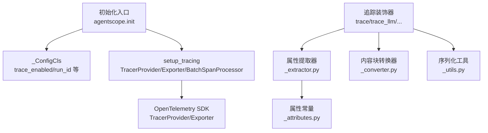
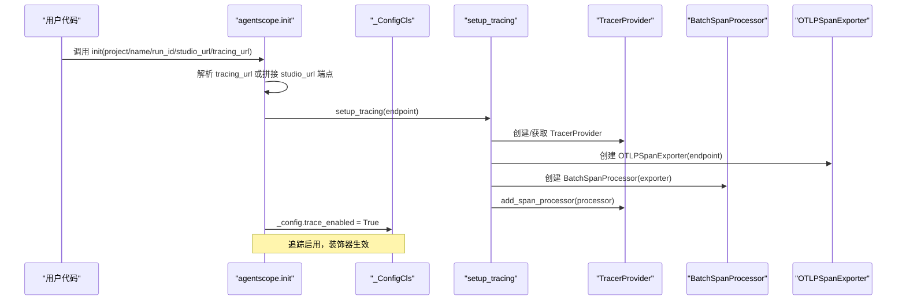
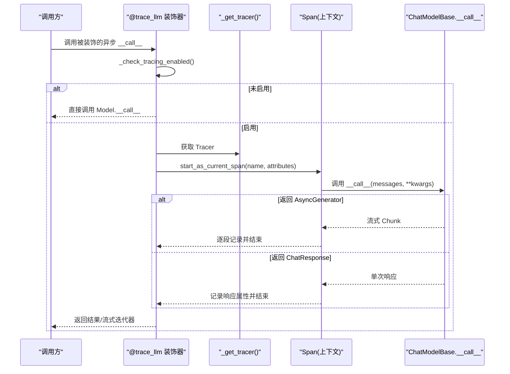
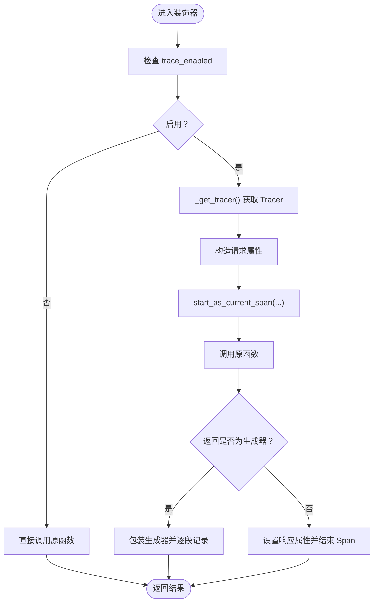
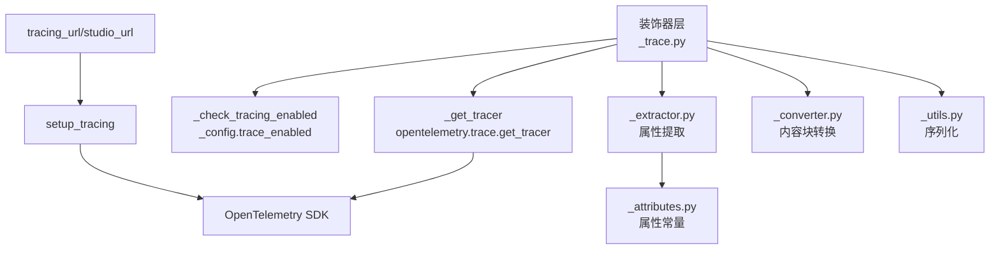

# 追踪配置

<cite>
**本文引用的文件**   
- [src/agentscope/__init__.py](file://src/agentscope/__init__.py)
- [src/agentscope/_run_config.py](file://src/agentscope/_run_config.py)
- [src/agentscope/tracing/__init__.py](file://src/agentscope/tracing/__init__.py)
- [src/agentscope/tracing/_setup.py](file://src/agentscope/tracing/_setup.py)
- [src/agentscope/tracing/_trace.py](file://src/agentscope/tracing/_trace.py)
- [src/agentscope/tracing/_attributes.py](file://src/agentscope/tracing/_attributes.py)
- [src/agentscope/tracing/_extractor.py](file://src/agentscope/tracing/_extractor.py)
- [src/agentscope/tracing/_utils.py](file://src/agentscope/tracing/_utils.py)
- [src/agentscope/tracing/_converter.py](file://src/agentscope/tracing/_converter.py)
- [docs/tutorial/zh_CN/src/task_tracing.py](file://docs/tutorial/zh_CN/src/task_tracing.py)
- [tests/tracing_test.py](file://tests/tracing_test.py)
</cite>

## 目录
1. [简介](#简介)
2. [项目结构](#项目结构)
3. [核心组件](#核心组件)
4. [架构总览](#架构总览)
5. [详细组件分析](#详细组件分析)
6. [依赖分析](#依赖分析)
7. [性能考虑](#性能考虑)
8. [故障排除指南](#故障排除指南)
9. [结论](#结论)
10. [附录](#附录)

## 简介
本文件面向 AgentScope 的追踪配置系统，聚焦于 OpenTelemetry 集成、追踪初始化流程、启用状态检查、全局导出配置、追踪器获取机制与错误处理策略。文档同时提供开发与生产环境的配置示例、配置验证方法、故障排除与性能优化建议，帮助读者快速、安全地在 AgentScope 应用中启用与管理分布式追踪。

## 项目结构
追踪相关代码主要位于 tracing 包内，配合全局配置对象与初始化入口，形成“配置—初始化—装饰器追踪”的完整链路。关键文件与职责如下：
- 初始化入口与全局配置：在初始化阶段根据 studio_url 或 tracing_url 设置追踪端点，并调用 setup_tracing 完成 OpenTelemetry Provider 与 Exporter 的装配；同时将 trace_enabled 置为 True。
- 追踪装饰器：提供 trace、trace_llm、trace_reply、trace_format、trace_toolkit、trace_embedding 等装饰器，统一在进入与退出时创建/结束 Span，并记录输入输出与异常。
- 属性与提取：定义 SpanAttributes、OperationNameValues、ProviderNameValues 等常量，以及针对 LLM、Agent、Tool、Formatter、Embedding 的请求/响应属性提取逻辑。
- 工具与转换：提供序列化工具与内容块到 OpenTelemetry GenAI Part 的转换器，确保跨类型对象可稳定序列化并符合规范。

图表来源
- [src/agentscope/__init__.py:72-157](file://src/agentscope/__init__.py#L72-L157)
- [src/agentscope/_run_config.py:65-73](file://src/agentscope/_run_config.py#L65-L73)
- [src/agentscope/tracing/_setup.py:11-39](file://src/agentscope/tracing/_setup.py#L11-L39)
- [src/agentscope/tracing/_trace.py:69-78](file://src/agentscope/tracing/_trace.py#L69-L78)
- [src/agentscope/tracing/_extractor.py:52-63](file://src/agentscope/tracing/_extractor.py#L52-L63)
- [src/agentscope/tracing/_converter.py:57-125](file://src/agentscope/tracing/_converter.py#L57-L125)
- [src/agentscope/tracing/_utils.py:60-79](file://src/agentscope/tracing/_utils.py#L60-L79)
- [src/agentscope/tracing/_attributes.py:8-184](file://src/agentscope/tracing/_attributes.py#L8-L184)

章节来源
- [src/agentscope/__init__.py:72-157](file://src/agentscope/__init__.py#L72-L157)
- [src/agentscope/_run_config.py:65-73](file://src/agentscope/_run_config.py#L65-L73)
- [src/agentscope/tracing/__init__.py:14-22](file://src/agentscope/tracing/__init__.py#L14-L22)

## 核心组件
- 初始化与端点配置
  - 初始化入口会根据 tracing_url 或 studio_url 推导 OTLP 导出端点，并调用 setup_tracing 完成 Provider 与 BatchSpanProcessor 的装配。
  - 若成功建立端点，trace_enabled 将被置为 True，作为后续装饰器启用的开关。
- 追踪装饰器
  - 通用装饰器 trace 支持同步/异步函数与生成器；特定领域装饰器 trace_llm、trace_reply、trace_format、trace_toolkit、trace_embedding 分别针对模型调用、智能体回复、格式化器、工具执行与嵌入调用进行增强。
  - 所有装饰器均通过 _check_tracing_enabled 判断是否启用，未启用则直接透传调用。
- 属性与提取
  - SpanAttributes、OperationNameValues、ProviderNameValues 提供标准化的 OpenTelemetry GenAI 属性键与取值。
  - _extractor 负责从具体组件（LLM、Agent、Tool、Formatter、Embedding）抽取请求/响应属性，保证跨 Provider 的一致性。
- 工具与转换
  - _utils 提供对象到 JSON 字符串的序列化工具，覆盖常见类型与不可序列化对象的回退策略。
  - _converter 将 AgentScope 的内容块转换为 OpenTelemetry GenAI 规范的 Part 结构，涵盖文本、思维、工具调用/结果、媒体等。

章节来源
- [src/agentscope/__init__.py:72-157](file://src/agentscope/__init__.py#L72-L157)
- [src/agentscope/tracing/_trace.py:69-78](file://src/agentscope/tracing/_trace.py#L69-L78)
- [src/agentscope/tracing/_attributes.py:8-184](file://src/agentscope/tracing/_attributes.py#L8-L184)
- [src/agentscope/tracing/_extractor.py:52-63](file://src/agentscope/tracing/_extractor.py#L52-L63)
- [src/agentscope/tracing/_utils.py:60-79](file://src/agentscope/tracing/_utils.py#L60-L79)
- [src/agentscope/tracing/_converter.py:57-125](file://src/agentscope/tracing/_converter.py#L57-L125)

## 架构总览
下图展示从初始化到装饰器追踪的整体流程，以及 OpenTelemetry Provider/Exporter 的装配位置。

图表来源
- [src/agentscope/__init__.py:72-157](file://src/agentscope/__init__.py#L72-L157)
- [src/agentscope/tracing/_setup.py:11-39](file://src/agentscope/tracing/_setup.py#L11-L39)

## 详细组件分析

### 初始化与端点配置
- 端点推导规则
  - 若显式提供 tracing_url，则直接使用。
  - 若仅提供 studio_url，则拼接为 “{studio_url}/v1/traces”。
  - 若两者皆为空，则不启用追踪。
- Provider/Exporter/Batch 处理器装配
  - 使用 OTLPSpanExporter(endpoint) 创建导出器；
  - 使用 BatchSpanProcessor 包装导出器；
  - 若外部已存在 TracerProvider，则仅追加处理器；否则新建 Provider 并设置。
- 启用标志
  - 成功建立端点后，将 _config.trace_enabled 设为 True，作为装饰器判断依据。

章节来源
- [src/agentscope/__init__.py:147-156](file://src/agentscope/__init__.py#L147-L156)
- [src/agentscope/tracing/_setup.py:11-39](file://src/agentscope/tracing/_setup.py#L11-L39)
- [src/agentscope/_run_config.py:65-73](file://src/agentscope/_run_config.py#L65-L73)

### 启用状态检查机制
- 运行时状态检测
  - 装饰器内部通过 _check_tracing_enabled 判断是否启用，该函数直接读取 _config.trace_enabled。
- 条件追踪开关
  - 未启用时，装饰器直接透传调用，不产生任何 OpenTelemetry 调用，避免性能开销。
  - 启用时，装饰器创建 Span，记录请求属性、响应属性与异常，最后结束 Span。

章节来源
- [src/agentscope/tracing/_trace.py:69-78](file://src/agentscope/tracing/_trace.py#L69-L78)

### 追踪器获取机制
- 单例与延迟初始化
  - _get_tracer 返回名为 “agentscope” 的 Tracer，版本号来自版本文件。
  - 通过 opentelemetry.trace.get_tracer 获取，遵循 OpenTelemetry 的单例语义。
- 错误处理策略
  - 对于异常，装饰器设置 Span 状态为 ERROR，并记录异常；随后抛出原始异常，保持调用方可见性。
  - 对于生成器/异步生成器，会在 finally 分支中根据最后一次产出设置响应属性并结束 Span。

章节来源
- [src/agentscope/tracing/_setup.py:41-49](file://src/agentscope/tracing/_setup.py#L41-L49)
- [src/agentscope/tracing/_trace.py:80-104](file://src/agentscope/tracing/_trace.py#L80-L104)
- [src/agentscope/tracing/_trace.py:107-190](file://src/agentscope/tracing/_trace.py#L107-L190)

### 装饰器工作流（以 trace_llm 为例）

图表来源
- [src/agentscope/tracing/_trace.py:567-646](file://src/agentscope/tracing/_trace.py#L567-L646)
- [src/agentscope/tracing/_extractor.py:198-267](file://src/agentscope/tracing/_extractor.py#L198-L267)
- [src/agentscope/tracing/_extractor.py:346-391](file://src/agentscope/tracing/_extractor.py#L346-L391)

### 属性提取与序列化
- 属性提取
  - 针对 LLM、Agent、Tool、Formatter、Embedding 的请求与响应分别提供提取函数，统一写入 OpenTelemetry GenAI 属性键。
- 序列化策略
  - _utils 提供 _serialize_to_str，将复杂对象序列化为字符串，覆盖基础类型、集合、字典、Msg/BaseModel/Dataclass、日期时间、枚举与不可序列化对象的回退策略。
- 内容块转换
  - _converter 将 AgentScope 的内容块转换为 OpenTelemetry GenAI 的 Part 结构，支持 text、thinking、tool_use/tool_result、image/audio/video 等。

章节来源
- [src/agentscope/tracing/_extractor.py:198-267](file://src/agentscope/tracing/_extractor.py#L198-L267)
- [src/agentscope/tracing/_extractor.py:346-391](file://src/agentscope/tracing/_extractor.py#L346-L391)
- [src/agentscope/tracing/_utils.py:60-79](file://src/agentscope/tracing/_utils.py#L60-L79)
- [src/agentscope/tracing/_converter.py:57-125](file://src/agentscope/tracing/_converter.py#L57-L125)

### 通用装饰器 trace 的算法流程

图表来源
- [src/agentscope/tracing/_trace.py:192-319](file://src/agentscope/tracing/_trace.py#L192-L319)
- [src/agentscope/tracing/_trace.py:107-190](file://src/agentscope/tracing/_trace.py#L107-L190)

## 依赖分析
- 组件耦合
  - 装饰器层依赖 _check_tracing_enabled 与 _get_tracer，二者分别来自全局配置与 OpenTelemetry SDK。
  - 属性提取层依赖 _attributes 常量与 _utils 序列化工具，确保属性键一致与对象可序列化。
  - 转换层依赖消息与工具类型，将内部结构映射为 OpenTelemetry 规范。
- 外部依赖
  - OpenTelemetry SDK：TracerProvider、BatchSpanProcessor、OTLPSpanExporter、StatusCode。
  - 第三方平台：通过 tracing_url 指向任意 OTLP 兼容后端（如 Arize Phoenix、Langfuse、阿里云云监控等）。

图表来源
- [src/agentscope/tracing/_trace.py:69-78](file://src/agentscope/tracing/_trace.py#L69-L78)
- [src/agentscope/tracing/_setup.py:41-49](file://src/agentscope/tracing/_setup.py#L41-L49)
- [src/agentscope/tracing/_extractor.py:52-63](file://src/agentscope/tracing/_extractor.py#L52-L63)
- [src/agentscope/tracing/_converter.py:57-125](file://src/agentscope/tracing/_converter.py#L57-L125)
- [src/agentscope/tracing/_utils.py:60-79](file://src/agentscope/tracing/_utils.py#L60-L79)
- [src/agentscope/tracing/_attributes.py:8-184](file://src/agentscope/tracing/_attributes.py#L8-L184)
- [src/agentscope/__init__.py:147-156](file://src/agentscope/__init__.py#L147-L156)

章节来源
- [src/agentscope/tracing/_trace.py:69-78](file://src/agentscope/tracing/_trace.py#L69-L78)
- [src/agentscope/tracing/_setup.py:41-49](file://src/agentscope/tracing/_setup.py#L41-L49)
- [src/agentscope/tracing/_extractor.py:52-63](file://src/agentscope/tracing/_extractor.py#L52-L63)
- [src/agentscope/tracing/_converter.py:57-125](file://src/agentscope/tracing/_converter.py#L57-L125)
- [src/agentscope/tracing/_utils.py:60-79](file://src/agentscope/tracing/_utils.py#L60-L79)
- [src/agentscope/tracing/_attributes.py:8-184](file://src/agentscope/tracing/_attributes.py#L8-L184)
- [src/agentscope/__init__.py:147-156](file://src/agentscope/__init__.py#L147-L156)

## 性能考虑
- 仅在启用时创建 Span：通过 _check_tracing_enabled 判定，未启用时装饰器直接透传，避免额外开销。
- 批量导出：使用 BatchSpanProcessor，减少网络往返与后端压力，适合高并发场景。
- 序列化成本控制：_utils 对不可序列化对象采用回退策略，避免异常导致的追踪失败；对复杂对象尽量精简字段。
- 生成器追踪：装饰器对生成器进行逐段记录，注意生成器体量较大时的内存与 CPU 开销，必要时在上游限制流大小或分片处理。
- Provider 复用：若外部已有 TracerProvider，装饰器仅追加处理器，避免重复初始化。

[本节为通用指导，无需列出章节来源]

## 故障排除指南
- 追踪未生效
  - 检查是否调用了 agentscope.init 并正确设置了 tracing_url 或 studio_url。
  - 确认 _config.trace_enabled 是否为 True。
  - 参考测试用例验证装饰器行为。
- 导出失败或无数据
  - 核对 tracing_url 是否指向 OTLP 兼容后端。
  - 检查网络连通性与认证头（如 Phoenix/Langfuse 需要相应环境变量）。
- 属性缺失或异常
  - 确保传入的组件实例具备必要的属性（如 ChatModelBase 的 model_name、AgentBase 的 id/name 等）。
  - 检查序列化工具是否能处理自定义对象，必要时简化输入或扩展序列化策略。
- 异常未记录
  - 装饰器在捕获异常后会设置 Span 状态为 ERROR 并记录异常，确认异常未被上层吞没。

章节来源
- [tests/tracing_test.py:33-381](file://tests/tracing_test.py#L33-L381)
- [src/agentscope/tracing/_trace.py:80-104](file://src/agentscope/tracing/_trace.py#L80-L104)

## 结论
AgentScope 的追踪配置以 OpenTelemetry 为核心，通过初始化阶段的端点配置与 Provider/Exporter 装配，结合装饰器层的统一追踪能力，实现了对 LLM、Agent、Formatter、Toolkit、Embedding 等关键路径的可观测性。启用状态检查与批量导出策略兼顾了性能与可观测性，配合完善的属性提取与序列化工具，能够满足开发与生产的多样化需求。

[本节为总结性内容，无需列出章节来源]

## 附录

### 配置示例

- 开发环境（本地 OTLP 收集器）
  - 使用本地 OTLP 端点，便于快速验证。
  - 示例：tracing_url = "http://localhost:4318"

- 生产环境（第三方平台）
  - Arize Phoenix：需设置 PHOENIX_API_KEY，并在环境变量中配置 OTLP 头。
  - Langfuse：需设置公私钥并生成 Basic 认证头，再通过 tracing_url 指向其 OTLP 端点。
  - 阿里云云监控：根据控制台提供的公网接入点拼接 tracing_url。

章节来源
- [docs/tutorial/zh_CN/src/task_tracing.py:42-102](file://docs/tutorial/zh_CN/src/task_tracing.py#L42-L102)

### 配置验证方法
- 功能验证
  - 使用测试用例中的装饰器覆盖同步/异步函数、生成器与异常场景，确认追踪与异常记录正常。
- 运行时验证
  - 在调用前打印 _config.trace_enabled，确认为 True。
  - 在装饰器包裹的函数中加入断点或日志，观察 Span 的创建与结束。
- 导出验证
  - 指向第三方平台后，确认平台侧能收到 OTLP 数据并显示对应 Trace。

章节来源
- [tests/tracing_test.py:33-381](file://tests/tracing_test.py#L33-L381)
- [src/agentscope/__init__.py:147-156](file://src/agentscope/__init__.py#L147-L156)