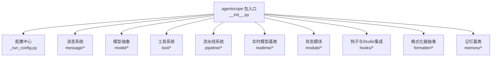
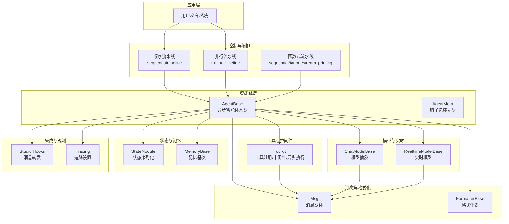
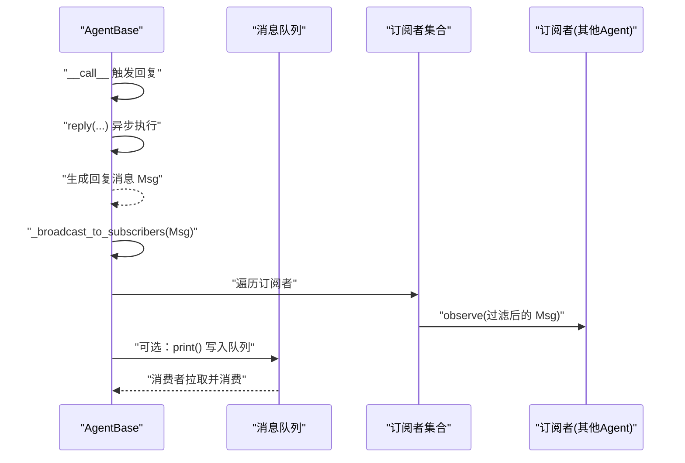
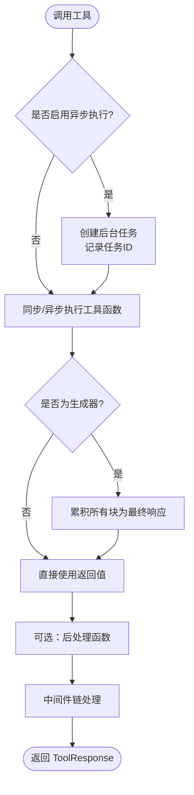
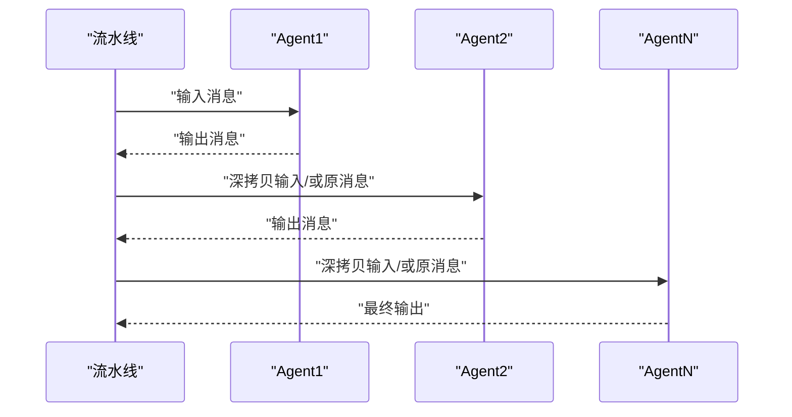
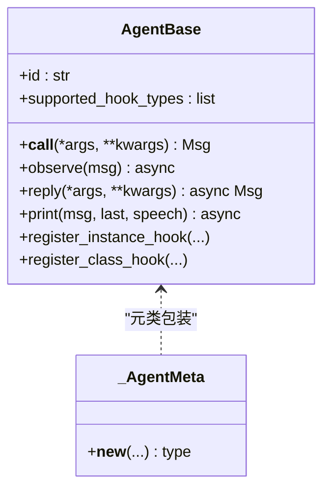
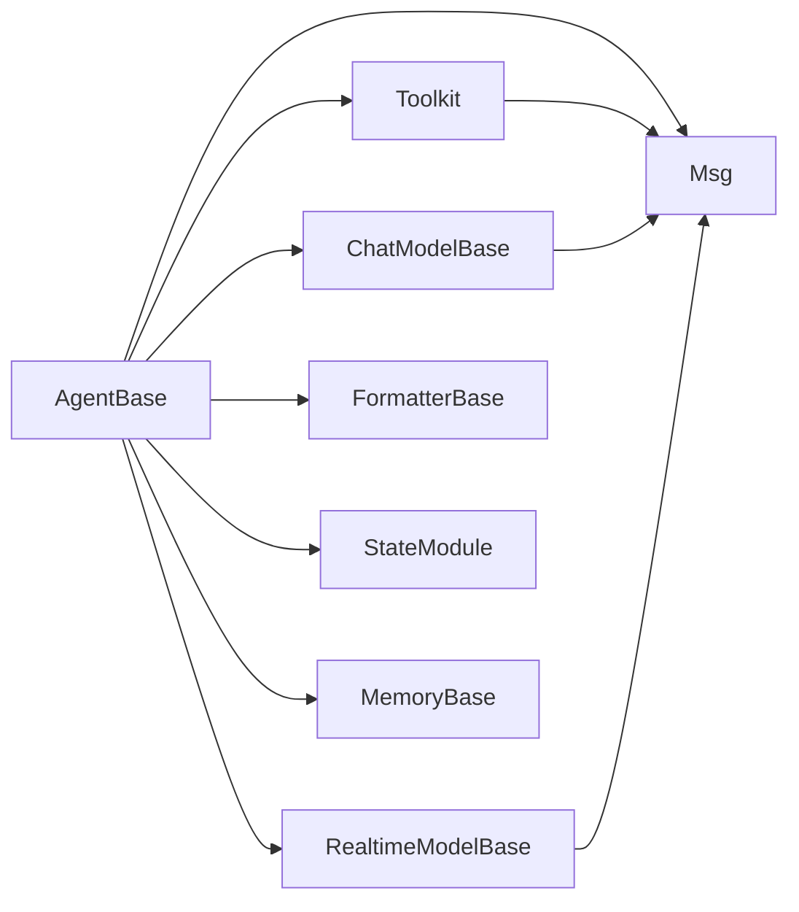

# 技术架构

<cite>
**本文引用的文件**
- [src/agentscope/__init__.py](file://src/agentscope/__init__.py)
- [src/agentscope/_run_config.py](file://src/agentscope/_run_config.py)
- [src/agentscope/agent/_agent_base.py](file://src/agentscope/agent/_agent_base.py)
- [src/agentscope/agent/_agent_meta.py](file://src/agentscope/agent/_agent_meta.py)
- [src/agentscope/message/_message_base.py](file://src/agentscope/message/_message_base.py)
- [src/agentscope/pipeline/_class.py](file://src/agentscope/pipeline/_class.py)
- [src/agentscope/pipeline/_functional.py](file://src/agentscope/pipeline/_functional.py)
- [src/agentscope/tool/_toolkit.py](file://src/agentscope/tool/_toolkit.py)
- [src/agentscope/module/_state_module.py](file://src/agentscope/module/_state_module.py)
- [src/agentscope/hooks/_studio_hooks.py](file://src/agentscope/hooks/_studio_hooks.py)
- [src/agentscope/model/_model_base.py](file://src/agentscope/model/_model_base.py)
- [src/agentscope/memory/_working_memory/_base.py](file://src/agentscope/memory/_working_memory/_base.py)
- [src/agentscope/formatter/_formatter_base.py](file://src/agentscope/formatter/_formatter_base.py)
- [src/agentscope/realtime/_base.py](file://src/agentscope/realtime/_base.py)
</cite>

## 目录
1. [引言](#引言)
2. [项目结构](#项目结构)
3. [核心组件](#核心组件)
4. [架构总览](#架构总览)
5. [详细组件分析](#详细组件分析)
6. [依赖分析](#依赖分析)
7. [性能考虑](#性能考虑)
8. [故障排查指南](#故障排查指南)
9. [结论](#结论)
10. [附录](#附录)

## 引言
本文件面向希望深入理解 AgentScope 技术架构的读者，系统阐述其整体设计、核心模块关系与数据流，重点解析异步优先的设计模式如何支撑高性能多智能体系统；同时详解模块化插件化扩展（工具系统、消息系统、流水线系统等）与事件驱动的消息通信机制，以及工厂模式、中间件模式、钩子机制等关键设计模式的应用，并给出架构图表与性能优化策略。

## 项目结构
AgentScope 采用按功能域分层的模块化组织方式，核心模块围绕“消息”“模型”“工具”“记忆”“流水线”“实时”“状态模块”等构建，顶层入口统一导出并提供初始化配置与日志追踪能力。

**图表来源**
- [src/agentscope/__init__.py:1-183](file://src/agentscope/__init__.py#L1-L183)
- [src/agentscope/_run_config.py:1-74](file://src/agentscope/_run_config.py#L1-L74)
- [src/agentscope/message/_message_base.py:1-242](file://src/agentscope/message/_message_base.py#L1-L242)
- [src/agentscope/model/_model_base.py:1-78](file://src/agentscope/model/_model_base.py#L1-L78)
- [src/agentscope/tool/_toolkit.py:1-800](file://src/agentscope/tool/_toolkit.py#L1-L800)
- [src/agentscope/pipeline/_class.py:1-91](file://src/agentscope/pipeline/_class.py#L1-L91)
- [src/agentscope/realtime/_base.py:1-174](file://src/agentscope/realtime/_base.py#L1-L174)
- [src/agentscope/module/_state_module.py:1-152](file://src/agentscope/module/_state_module.py#L1-L152)
- [src/agentscope/hooks/_studio_hooks.py:1-59](file://src/agentscope/hooks/_studio_hooks.py#L1-L59)
- [src/agentscope/formatter/_formatter_base.py:1-130](file://src/agentscope/formatter/_formatter_base.py#L1-L130)
- [src/agentscope/memory/_working_memory/_base.py:1-169](file://src/agentscope/memory/_working_memory/_base.py#L1-L169)

**章节来源**
- [src/agentscope/__init__.py:1-183](file://src/agentscope/__init__.py#L1-L183)

## 核心组件
- 入口与配置
  - 入口模块负责聚合导出各子模块、设置日志、可选连接 Studio 与追踪服务，并提供全局运行时上下文变量（运行标识、项目名、名称、时间戳、追踪开关）。
- 状态模块 StateModule
  - 提供嵌套状态序列化/反序列化能力，支持模块属性与自定义属性注册，便于复杂对象的持久化与恢复。
- 消息系统 Msg
  - 统一消息载体，支持文本、工具调用、工具结果、图像、音频、视频等多模态内容块，提供内容提取、序列化/反序列化与类型校验。
- 模型抽象 ChatModelBase
  - 定义统一的异步调用接口与流式响应规范，约束工具选择参数校验，确保不同模型实现的一致性。
- 工具系统 Toolkit
  - 支持函数/异步函数/生成器/异步生成器工具注册、组管理、动态 JSON Schema 构建、中间件链、后处理、异步后台执行与任务跟踪。
- 流水线系统
  - 提供顺序与并行（gather）流水线两类执行范式，支持消息收集与流式打印输出的统一消费。
- 实时模型基类 RealtimeModelBase
  - 基于 WebSocket 的实时模型抽象，定义输入/输出采样率、会话配置、事件解析与队列驱动的事件循环。
- 记忆基类 MemoryBase
  - 定义通用的记忆增删查改与标记管理接口，支持摘要压缩与状态序列化。
- 格式化器抽象 FormatterBase
  - 将消息转换为不同模型 API 所需的字典列表，兼容多模态工具结果转文本与本地文件路径映射。
- 钩子与 Studio 集成
  - 通过元类与实例方法包装，提供 pre/post 观察、回复、打印等钩子；提供 Studio 消息转发钩子以实现可视化与调试。

**章节来源**
- [src/agentscope/_run_config.py:1-74](file://src/agentscope/_run_config.py#L1-L74)
- [src/agentscope/module/_state_module.py:1-152](file://src/agentscope/module/_state_module.py#L1-L152)
- [src/agentscope/message/_message_base.py:1-242](file://src/agentscope/message/_message_base.py#L1-L242)
- [src/agentscope/model/_model_base.py:1-78](file://src/agentscope/model/_model_base.py#L1-L78)
- [src/agentscope/tool/_toolkit.py:1-800](file://src/agentscope/tool/_toolkit.py#L1-L800)
- [src/agentscope/pipeline/_class.py:1-91](file://src/agentscope/pipeline/_class.py#L1-L91)
- [src/agentscope/pipeline/_functional.py:1-193](file://src/agentscope/pipeline/_functional.py#L1-L193)
- [src/agentscope/realtime/_base.py:1-174](file://src/agentscope/realtime/_base.py#L1-L174)
- [src/agentscope/memory/_working_memory/_base.py:1-169](file://src/agentscope/memory/_working_memory/_base.py#L1-L169)
- [src/agentscope/formatter/_formatter_base.py:1-130](file://src/agentscope/formatter/_formatter_base.py#L1-L130)
- [src/agentscope/hooks/_studio_hooks.py:1-59](file://src/agentscope/hooks/_studio_hooks.py#L1-L59)

## 架构总览
AgentScope 采用“异步优先 + 事件驱动”的架构，围绕消息与工具两大核心抽象，通过流水线编排多个智能体，借助中间件与钩子实现横切关注点（日志、鉴权、缓存、追踪），并通过状态模块实现可恢复、可迁移的系统状态。

**图表来源**
- [src/agentscope/pipeline/_class.py:1-91](file://src/agentscope/pipeline/_class.py#L1-L91)
- [src/agentscope/pipeline/_functional.py:1-193](file://src/agentscope/pipeline/_functional.py#L1-L193)
- [src/agentscope/agent/_agent_base.py:1-775](file://src/agentscope/agent/_agent_base.py#L1-L775)
- [src/agentscope/agent/_agent_meta.py:159-192](file://src/agentscope/agent/_agent_meta.py#L159-L192)
- [src/agentscope/message/_message_base.py:1-242](file://src/agentscope/message/_message_base.py#L1-L242)
- [src/agentscope/tool/_toolkit.py:1-800](file://src/agentscope/tool/_toolkit.py#L1-L800)
- [src/agentscope/model/_model_base.py:1-78](file://src/agentscope/model/_model_base.py#L1-L78)
- [src/agentscope/realtime/_base.py:1-174](file://src/agentscope/realtime/_base.py#L1-L174)
- [src/agentscope/module/_state_module.py:1-152](file://src/agentscope/module/_state_module.py#L1-L152)
- [src/agentscope/memory/_working_memory/_base.py:1-169](file://src/agentscope/memory/_working_memory/_base.py#L1-L169)
- [src/agentscope/hooks/_studio_hooks.py:1-59](file://src/agentscope/hooks/_studio_hooks.py#L1-L59)

## 详细组件分析

### 异步优先与事件驱动：AgentBase 与消息传播
- 异步优先体现在智能体的回复、观察、打印均以协程形式实现，内部使用任务与队列进行并发控制与资源清理。
- 事件驱动的消息传播通过订阅者广播机制完成：智能体回复完成后剥离“思考”块并广播给订阅者，订阅者通过 observe 接收消息，形成松耦合的事件通道。
- 流式输出通过消息队列与生成器管道收集，支持在流水线中统一消费与回放。

**图表来源**
- [src/agentscope/agent/_agent_base.py:180-520](file://src/agentscope/agent/_agent_base.py#L180-L520)
- [src/agentscope/pipeline/_functional.py:107-193](file://src/agentscope/pipeline/_functional.py#L107-L193)

**章节来源**
- [src/agentscope/agent/_agent_base.py:180-520](file://src/agentscope/agent/_agent_base.py#L180-L520)
- [src/agentscope/pipeline/_functional.py:107-193](file://src/agentscope/pipeline/_functional.py#L107-L193)

### 工具系统：注册、中间件与异步执行
- 注册与 Schema：支持从函数/部分应用/MCP 工具函数自动解析 JSON Schema，支持预设参数剔除、扩展模型、重命名策略与异步执行标记。
- 中间件模式：通过装饰器动态拼装中间件链，保证外层追踪装饰器仍处于最外层，确保可观测性。
- 异步执行：对长耗时工具可在后台任务中执行，支持取消、中断与结果累积，便于在流式工具中统一产出。

**图表来源**
- [src/agentscope/tool/_toolkit.py:57-115](file://src/agentscope/tool/_toolkit.py#L57-L115)
- [src/agentscope/tool/_toolkit.py:685-800](file://src/agentscope/tool/_toolkit.py#L685-L800)
- [src/agentscope/tool/_toolkit.py:908-1536](file://src/agentscope/tool/_toolkit.py#L908-L1536)

**章节来源**
- [src/agentscope/tool/_toolkit.py:57-115](file://src/agentscope/tool/_toolkit.py#L57-L115)
- [src/agentscope/tool/_toolkit.py:685-800](file://src/agentscope/tool/_toolkit.py#L685-L800)
- [src/agentscope/tool/_toolkit.py:908-1536](file://src/agentscope/tool/_toolkit.py#L908-L1536)

### 流水线系统：顺序与并行编排
- 顺序流水线：前一智能体输出作为下一智能体输入，最终返回最后一个智能体的结果。
- 并行流水线：同一输入分发给多个智能体，可选择并发（gather）或串行执行，适合并行评估、多视角分析等场景。
- 流式消息收集：通过统一的生成器管道收集打印消息，支持语音伴随输出与异常透传。

**图表来源**
- [src/agentscope/pipeline/_functional.py:10-105](file://src/agentscope/pipeline/_functional.py#L10-L105)
- [src/agentscope/pipeline/_class.py:10-91](file://src/agentscope/pipeline/_class.py#L10-L91)

**章节来源**
- [src/agentscope/pipeline/_functional.py:10-105](file://src/agentscope/pipeline/_functional.py#L10-L105)
- [src/agentscope/pipeline/_class.py:10-91](file://src/agentscope/pipeline/_class.py#L10-L91)

### 钩子机制与工厂模式：元类与类/实例级钩子
- 元类包装：通过元类在类加载时对 reply/print/observe 等方法进行钩子包装，形成统一的前后置处理流程。
- 类/实例钩子：支持类级与实例级钩子注册、移除与清空，覆盖“预观察/后观察/预回复/后回复/预打印/后打印”等扩展点。
- 工厂模式：通过注册表（如工具组、技能模板）与动态 Schema 构建，实现“工厂式”的能力装配与组合。

**图表来源**
- [src/agentscope/agent/_agent_base.py:30-120](file://src/agentscope/agent/_agent_base.py#L30-L120)
- [src/agentscope/agent/_agent_meta.py:159-192](file://src/agentscope/agent/_agent_meta.py#L159-L192)

**章节来源**
- [src/agentscope/agent/_agent_base.py:30-120](file://src/agentscope/agent/_agent_base.py#L30-L120)
- [src/agentscope/agent/_agent_meta.py:159-192](file://src/agentscope/agent/_agent_meta.py#L159-L192)

### 模型与格式化器：统一接口与多模态兼容
- ChatModelBase：统一模型调用签名与流式响应，约束工具选择参数，确保跨厂商模型一致性。
- FormatterBase：将消息列表格式化为 API 所需字典数组，支持将多模态工具结果转文本并映射到本地文件路径，提升兼容性。

**章节来源**
- [src/agentscope/model/_model_base.py:1-78](file://src/agentscope/model/_model_base.py#L1-L78)
- [src/agentscope/formatter/_formatter_base.py:1-130](file://src/agentscope/formatter/_formatter_base.py#L1-L130)

### 实时模型与事件驱动：WebSocket 与事件循环
- RealtimeModelBase：封装 WebSocket 连接、会话配置、事件解析与接收循环，将模型事件推送到队列，供上层消费。
- 事件驱动：通过队列与异步任务解耦发送与接收，支持并发与背压控制。

**章节来源**
- [src/agentscope/realtime/_base.py:13-174](file://src/agentscope/realtime/_base.py#L13-L174)

### 状态模块与记忆：可恢复与可扩展
- StateModule：提供模块与属性的状态序列化/反序列化接口，支持自定义 JSON 转换函数，便于复杂对象持久化。
- MemoryBase：定义记忆增删查改与标记管理接口，支持摘要压缩与状态序列化，便于在多轮对话中保持上下文。

**章节来源**
- [src/agentscope/module/_state_module.py:1-152](file://src/agentscope/module/_state_module.py#L1-L152)
- [src/agentscope/memory/_working_memory/_base.py:1-169](file://src/agentscope/memory/_working_memory/_base.py#L1-L169)

## 依赖分析
- 松耦合设计：智能体仅依赖消息与工具接口，不直接耦合具体模型实现；流水线仅依赖智能体接口，支持顺序/并行两种范式。
- 可插拔扩展：工具系统通过注册表与中间件实现能力动态装配；格式化器与模型抽象隔离不同厂商 API 差异。
- 循环依赖规避：状态模块与消息模块相互独立，通过接口传递而非直接引用，避免循环导入。

**图表来源**
- [src/agentscope/agent/_agent_base.py:180-520](file://src/agentscope/agent/_agent_base.py#L180-L520)
- [src/agentscope/tool/_toolkit.py:1-800](file://src/agentscope/tool/_toolkit.py#L1-L800)
- [src/agentscope/model/_model_base.py:1-78](file://src/agentscope/model/_model_base.py#L1-L78)
- [src/agentscope/realtime/_base.py:1-174](file://src/agentscope/realtime/_base.py#L1-L174)
- [src/agentscope/formatter/_formatter_base.py:1-130](file://src/agentscope/formatter/_formatter_base.py#L1-L130)
- [src/agentscope/module/_state_module.py:1-152](file://src/agentscope/module/_state_module.py#L1-L152)
- [src/agentscope/memory/_working_memory/_base.py:1-169](file://src/agentscope/memory/_working_memory/_base.py#L1-L169)

**章节来源**
- [src/agentscope/agent/_agent_base.py:180-520](file://src/agentscope/agent/_agent_base.py#L180-L520)
- [src/agentscope/tool/_toolkit.py:1-800](file://src/agentscope/tool/_toolkit.py#L1-L800)
- [src/agentscope/model/_model_base.py:1-78](file://src/agentscope/model/_model_base.py#L1-L78)
- [src/agentscope/realtime/_base.py:1-174](file://src/agentscope/realtime/_base.py#L1-L174)
- [src/agentscope/formatter/_formatter_base.py:1-130](file://src/agentscope/formatter/_formatter_base.py#L1-L130)
- [src/agentscope/module/_state_module.py:1-152](file://src/agentscope/module/_state_module.py#L1-L152)
- [src/agentscope/memory/_working_memory/_base.py:1-169](file://src/agentscope/memory/_working_memory/_base.py#L1-L169)

## 性能考虑
- 异步优先与并发
  - 使用 asyncio.gather 实现并行执行，减少等待时间；在工具执行中支持后台任务与取消，避免阻塞主线程。
  - 消息队列与生成器管道用于流式输出，避免大块数据一次性堆积。
- 资源管理
  - 智能体打印音频时使用缓存与延迟关闭，避免资源泄漏；实时模型使用队列与任务分离接收与处理。
- 序列化与状态
  - StateModule 的状态序列化/反序列化支持自定义转换函数，降低序列化成本；记忆模块支持摘要压缩，减少上下文体积。
- 参数校验与容错
  - 模型工具选择参数严格校验，防止无效调用；工具执行捕获 MCP 错误与通用异常，返回结构化错误信息。

[本节为通用性能指导，无需特定文件引用]

## 故障排查指南
- 工具执行失败
  - 现象：工具返回错误或抛出异常。
  - 排查：检查工具 JSON Schema 与参数匹配；确认中间件链未拦截；查看后处理函数是否正确返回 ToolResponse。
- 实时模型连接问题
  - 现象：WebSocket 连接失败或事件解析异常。
  - 排查：确认 WebSocket URL 与头部配置；检查事件解析逻辑与队列推送；验证会话配置是否正确。
- 消息广播异常
  - 现象：订阅者未收到消息或消息被过滤。
  - 排查：确认订阅者列表与 MsgHub 名称；检查“思考”块剥离逻辑；验证 observe 方法实现。
- Studio 集成
  - 现象：Studio 未显示消息或转发失败。
  - 排查：确认初始化时已设置 Studio URL；检查网络与重试逻辑；查看日志警告信息。

**章节来源**
- [src/agentscope/tool/_toolkit.py:737-756](file://src/agentscope/tool/_toolkit.py#L737-L756)
- [src/agentscope/realtime/_base.py:134-174](file://src/agentscope/realtime/_base.py#L134-L174)
- [src/agentscope/agent/_agent_base.py:469-515](file://src/agentscope/agent/_agent_base.py#L469-L515)
- [src/agentscope/hooks/_studio_hooks.py:29-59](file://src/agentscope/hooks/_studio_hooks.py#L29-L59)

## 结论
AgentScope 通过“异步优先 + 事件驱动”的架构，结合模块化插件化设计与工厂/中间件/钩子等模式，实现了高内聚、低耦合且可扩展的多智能体系统。消息与工具作为核心抽象贯穿全栈，流水线提供灵活的编排能力，状态模块与记忆基类保障可恢复性与上下文管理，实时模型与格式化器抽象进一步增强系统对多模态与多厂商 API 的适配能力。该架构既满足高性能需求，又便于二次开发与生态扩展。

[本节为总结性内容，无需特定文件引用]

## 附录
- 初始化与追踪
  - 入口模块提供 init 函数，支持连接 Studio 与追踪服务，设置日志级别与路径，并通过全局配置中心管理运行上下文。
- Studio 钩子
  - 提供消息转发钩子，将打印消息推送到 Studio，具备重试与降级保护，避免影响主流程。

**章节来源**
- [src/agentscope/__init__.py:72-157](file://src/agentscope/__init__.py#L72-L157)
- [src/agentscope/hooks/_studio_hooks.py:12-59](file://src/agentscope/hooks/_studio_hooks.py#L12-L59)