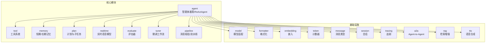
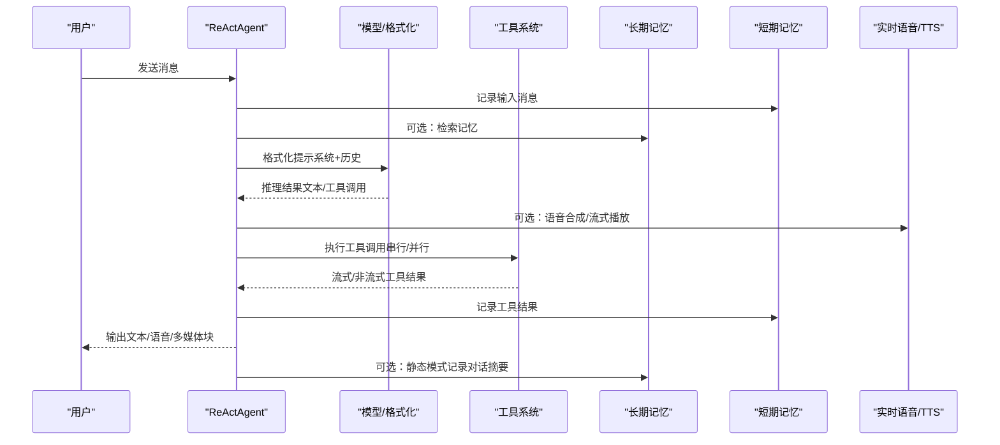
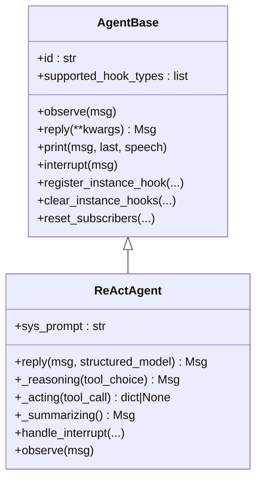
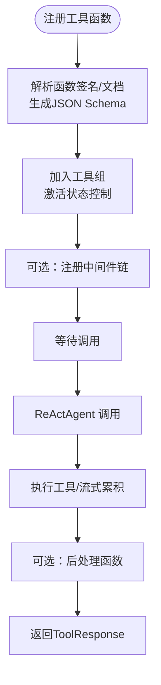
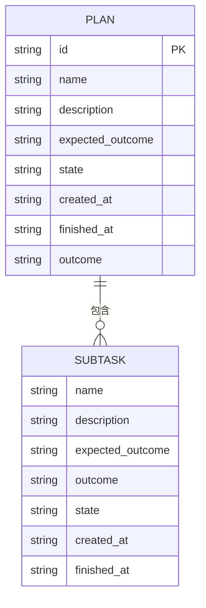
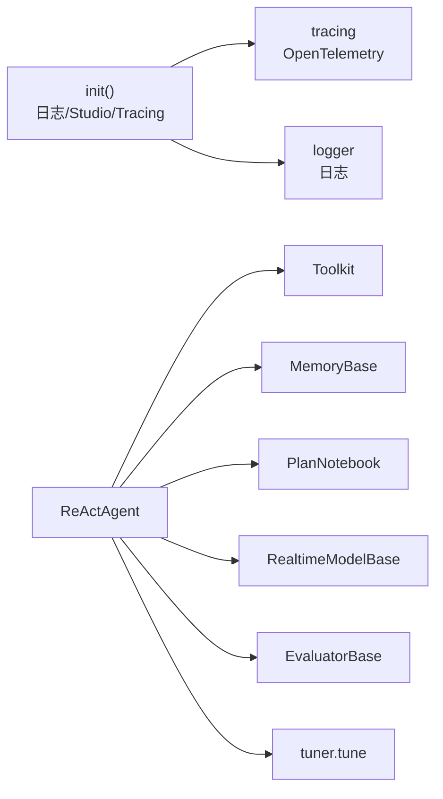

# 核心价值主张

<cite>
**本文引用的文件**
- [README.md](file://README.md)
- [src/agentscope/__init__.py](file://src/agentscope/__init__.py)
- [src/agentscope/agent/_agent_base.py](file://src/agentscope/agent/_agent_base.py)
- [src/agentscope/agent/_react_agent.py](file://src/agentscope/agent/_react_agent.py)
- [src/agentscope/tool/_toolkit.py](file://src/agentscope/tool/_toolkit.py)
- [src/agentscope/plan/_plan_model.py](file://src/agentscope/plan/_plan_model.py)
- [src/agentscope/memory/_long_term_memory/_mem0/_mem0_long_term_memory.py](file://src/agentscope/memory/_long_term_memory/_mem0/_mem0_long_term_memory.py)
- [src/agentscope/realtime/_base.py](file://src/agentscope/realtime/_base.py)
- [src/agentscope/evaluate/_evaluator/_evaluator_base.py](file://src/agentscope/evaluate/_evaluator/_evaluator_base.py)
- [src/agentscope/tuner/_tune.py](file://src/agentscope/tuner/_tune.py)
- [examples/agent/react_agent/main.py](file://examples/agent/react_agent/main.py)
- [examples/functionality/agent_skill/main.py](file://examples/functionality/agent_skill/main.py)
- [examples/workflows/multiagent_conversation/main.py](file://examples/workflows/multiagent_conversation/main.py)
- [examples/functionality/long_term_memory/reme/personal_memory_example.py](file://examples/functionality/long_term_memory/reme/personal_memory_example.py)
</cite>

## 目录
1. [引言](#引言)
2. [项目结构](#项目结构)
3. [核心组件](#核心组件)
4. [架构总览](#架构总览)
5. [详细组件分析](#详细组件分析)
6. [依赖分析](#依赖分析)
7. [性能考量](#性能考量)
8. [故障排查指南](#故障排查指南)
9. [结论](#结论)
10. [附录](#附录)

## 引言
本文件面向希望快速理解并采用 AgentScope 的开发者与产品团队，系统阐述 AgentScope 的核心价值主张：以“生产就绪、易于使用”为目标，围绕模型推理与工具使用能力构建智能体框架，避免对严格提示词与刚性编排的过度依赖。AgentScope 提供 ReAct 智能体、工具系统、技能、人机协作、记忆、规划、实时语音、评估与模型微调支持等关键能力，并通过统一的模块化抽象与生态集成，帮助用户在 5 分钟内上手，同时具备可扩展性与生产级可观测性与部署能力。

## 项目结构
AgentScope 采用按领域分层的模块化组织方式：
- agent：智能体基类与具体实现（如 ReActAgent），负责推理-行动循环、中断处理、钩子机制与打印输出。
- tool：工具系统，统一注册、管理与执行工具函数，支持中间件链、异步执行与流式结果。
- memory：短期与长期记忆，包含基于 mem0 的长程记忆与 ReMe 等增强方案。
- plan：计划与子任务建模，支持状态推进与 Markdown 导出。
- realtime：实时语音模型抽象，支持 WebSocket 会话与事件解析。
- evaluate：评估器基类与聚合逻辑，支撑评测流水线与指标统计。
- tuner：微调工作流入口，对接 Trinity-RFT 实现强化学习训练。
- pipeline：消息枢纽与流水线，支撑多智能体对话与广播。
- model/formatter/embedding/token：模型适配、格式化、嵌入与计数器，统一对外接口。
- 其他：消息类型、会话、追踪、A2A 协议、RAG、TTS 等。

图表来源
- [src/agentscope/agent/_agent_base.py:30-180](file://src/agentscope/agent/_agent_base.py#L30-L180)
- [src/agentscope/tool/_toolkit.py:117-185](file://src/agentscope/tool/_toolkit.py#L117-L185)
- [src/agentscope/memory/_long_term_memory/_mem0/_mem0_long_term_memory.py:72-120](file://src/agentscope/memory/_long_term_memory/_mem0/_mem0_long_term_memory.py#L72-L120)
- [src/agentscope/plan/_plan_model.py:104-147](file://src/agentscope/plan/_plan_model.py#L104-L147)
- [src/agentscope/realtime/_base.py:13-50](file://src/agentscope/realtime/_base.py#L13-L50)
- [src/agentscope/evaluate/_evaluator/_evaluator_base.py:18-47](file://src/agentscope/evaluate/_evaluator/_evaluator_base.py#L18-L47)
- [src/agentscope/tuner/_tune.py:16-29](file://src/agentscope/tuner/_tune.py#L16-L29)

章节来源
- [README.md:58-77](file://README.md#L58-L77)
- [src/agentscope/__init__.py:43-66](file://src/agentscope/__init__.py#L43-L66)

## 核心组件
- 智能体基类与 ReAct 实现：提供统一的观察-回复-打印生命周期、钩子机制、中断处理与订阅广播；ReActAgent 将推理与工具调用解耦，支持结构化输出、知识检索、计划提示注入与内存压缩。
- 工具系统：统一注册、Schema 生成、组激活控制、中间件链、异步执行与流式结果；支持 MCP 客户端与代理技能加载。
- 记忆体系：短期记忆（列表/Redis/SQLAlchemy/TableStore）与长期记忆（mem0/ReMe），支持检索与记录工具函数与直接方法。
- 规划模块：子任务与计划的数据模型，支持状态推进与 Markdown 输出。
- 实时语音：WebSocket 连接、会话配置、事件解析与队列驱动的消息循环。
- 评估与微调：评估器基类与聚合逻辑，微调工作流对接 Trinity-RFT。
- 多智能体编排：消息枢纽与流水线，支持顺序/并发/广播等模式。

章节来源
- [src/agentscope/agent/_agent_base.py:30-180](file://src/agentscope/agent/_agent_base.py#L30-L180)
- [src/agentscope/agent/_react_agent.py:98-200](file://src/agentscope/agent/_react_agent.py#L98-L200)
- [src/agentscope/tool/_toolkit.py:117-185](file://src/agentscope/tool/_toolkit.py#L117-L185)
- [src/agentscope/memory/_long_term_memory/_mem0/_mem0_long_term_memory.py:72-120](file://src/agentscope/memory/_long_term_memory/_mem0/_mem0_long_term_memory.py#L72-L120)
- [src/agentscope/plan/_plan_model.py:104-147](file://src/agentscope/plan/_plan_model.py#L104-L147)
- [src/agentscope/realtime/_base.py:13-50](file://src/agentscope/realtime/_base.py#L13-L50)
- [src/agentscope/evaluate/_evaluator/_evaluator_base.py:18-47](file://src/agentscope/evaluate/_evaluator/_evaluator_base.py#L18-L47)
- [src/agentscope/tuner/_tune.py:16-29](file://src/agentscope/tuner/_tune.py#L16-L29)

## 架构总览
AgentScope 的设计以“模型推理+工具使用”为核心，通过统一的抽象屏蔽底层差异，使智能体能够自然地进行思考、检索、工具调用与结构化输出，而非被严格的提示约束所限制。下图展示了典型 ReActAgent 的推理-行动循环与关键模块交互。

图表来源
- [src/agentscope/agent/_react_agent.py:376-537](file://src/agentscope/agent/_react_agent.py#L376-L537)
- [src/agentscope/tool/_toolkit.py:685-800](file://src/agentscope/tool/_toolkit.py#L685-L800)
- [src/agentscope/memory/_long_term_memory/_mem0/_mem0_long_term_memory.py:573-618](file://src/agentscope/memory/_long_term_memory/_mem0/_mem0_long_term_memory.py#L573-L618)
- [src/agentscope/realtime/_base.py:134-173](file://src/agentscope/realtime/_base.py#L134-L173)

## 详细组件分析

### 设计理念与价值主张
- 面向“日益代理化”的大模型：AgentScope 不试图用严格提示词或编排规则限制模型能力，而是通过工具系统与推理循环，让模型在可控范围内自由发挥。
- 生产就绪：提供统一日志、追踪、Studio 集成、OTel 支持与多种部署形态（本地/云/Serverless/K8s）。
- 易于使用：5 分钟上手 ReActAgent + 工具 + 技能 + 人机协作 + 记忆 + 规划 + 实时语音 + 评估 + 微调。

章节来源
- [README.md:58-71](file://README.md#L58-L71)
- [src/agentscope/__init__.py:72-157](file://src/agentscope/__init__.py#L72-L157)

### 智能体基类与 ReAct 实现
- 生命周期与钩子：支持 pre/post observe/reply/print 钩子，便于扩展与调试；打印支持文本、思考块与多媒体块，支持流式输出与音频播放。
- 中断与订阅：支持取消当前回复并保留上下文；通过订阅者广播消息，剥离思考块后共享给其他智能体。
- ReActAgent 特性：结构化输出、查询重写、知识检索、计划提示注入、长短期记忆联动、内存压缩、并行工具调用、实时语音集成。

图表来源
- [src/agentscope/agent/_agent_base.py:30-180](file://src/agentscope/agent/_agent_base.py#L30-L180)
- [src/agentscope/agent/_react_agent.py:98-200](file://src/agentscope/agent/_react_agent.py#L98-L200)

章节来源
- [src/agentscope/agent/_agent_base.py:185-275](file://src/agentscope/agent/_agent_base.py#L185-L275)
- [src/agentscope/agent/_react_agent.py:376-537](file://src/agentscope/agent/_react_agent.py#L376-L537)

### 工具系统（Toolkit）
- 统一注册与 Schema：自动从函数签名/文档提取 JSON Schema，支持组激活控制、动态扩展模型与后处理函数。
- 中间件链：运行时动态构建中间件链，支持异步生成器包装与流式结果累积。
- MCP 集成：支持从 MCP 客户端获取可调用函数，注册为本地工具；支持移除 MCP 客户端工具。
- 异步执行：实验性异步任务跟踪与结果缓存，支持任务状态查看/取消。

图表来源
- [src/agentscope/tool/_toolkit.py:274-365](file://src/agentscope/tool/_toolkit.py#L274-L365)
- [src/agentscope/tool/_toolkit.py:558-620](file://src/agentscope/tool/_toolkit.py#L558-L620)
- [src/agentscope/tool/_toolkit.py:685-800](file://src/agentscope/tool/_toolkit.py#L685-L800)

章节来源
- [src/agentscope/tool/_toolkit.py:117-185](file://src/agentscope/tool/_toolkit.py#L117-L185)
- [src/agentscope/tool/_toolkit.py:274-365](file://src/agentscope/tool/_toolkit.py#L274-L365)

### 记忆与规划
- 长期记忆（mem0）：提供记录/检索工具函数与直接方法，支持多策略回退记录与关系格式化；可与 ReActAgent 集成，支持 agent_control/static_control/both 模式。
- 计划模型：子任务与计划数据模型，支持状态推进与 Markdown 导出，便于可视化与审计。

图表来源
- [src/agentscope/plan/_plan_model.py:11-101](file://src/agentscope/plan/_plan_model.py#L11-L101)
- [src/agentscope/plan/_plan_model.py:104-201](file://src/agentscope/plan/_plan_model.py#L104-L201)

章节来源
- [src/agentscope/memory/_long_term_memory/_mem0/_mem0_long_term_memory.py:380-571](file://src/agentscope/memory/_long_term_memory/_mem0/_mem0_long_term_memory.py#L380-L571)
- [src/agentscope/plan/_plan_model.py:11-101](file://src/agentscope/plan/_plan_model.py#L11-L101)

### 实时语音与 TTS
- 实时模型抽象：WebSocket 连接、会话配置、事件解析与队列驱动的消息循环。
- 与 ReActAgent 集成：支持流式文本与语音块，可将模型生成的音频块推送到 TTS 模型进行合成或流式播放。

章节来源
- [src/agentscope/realtime/_base.py:13-173](file://src/agentscope/realtime/_base.py#L13-L173)
- [src/agentscope/agent/_react_agent.py:578-620](file://src/agentscope/agent/_react_agent.py#L578-L620)

### 评估与微调
- 评估器基类：定义评测流程、元信息保存与重复聚合统计，支持分类/数值指标分布与令牌用量汇总。
- 微调工作流：统一入口参数，校验工作流与评分函数，转换为 Trinity 配置并启动训练阶段，支持 DLC 集群管理。

章节来源
- [src/agentscope/evaluate/_evaluator/_evaluator_base.py:18-47](file://src/agentscope/evaluate/_evaluator/_evaluator_base.py#L18-L47)
- [src/agentscope/evaluate/_evaluator/_evaluator_base.py:96-304](file://src/agentscope/evaluate/_evaluator/_evaluator_base.py#L96-L304)
- [src/agentscope/tuner/_tune.py:16-29](file://src/agentscope/tuner/_tune.py#L16-L29)

### 多智能体编排与人机协作
- 消息枢纽与流水线：支持参与者管理、广播、顺序/并发流水线，便于构建多智能体对话与协作场景。
- 人机协作：支持实时中断与恢复，结合记忆保留，实现“人-机-智能体”协同。

章节来源
- [examples/workflows/multiagent_conversation/main.py:38-81](file://examples/workflows/multiagent_conversation/main.py#L38-L81)
- [src/agentscope/agent/_agent_base.py:448-467](file://src/agentscope/agent/_agent_base.py#L448-L467)

## 依赖分析
- 模块内聚与耦合：Agent 基类与 ReAct 实现高度内聚，通过工具系统与记忆模块解耦；评估与微调模块独立，便于替换实现。
- 外部依赖：Trinity-RFT（微调）、mem0（长期记忆）、websockets（实时语音）、OpenTelemetry（追踪）等，均通过条件导入与配置隔离。
- 可观测性：init 函数支持连接 Studio 与 OpenTelemetry，统一追踪与日志输出。

图表来源
- [src/agentscope/__init__.py:72-157](file://src/agentscope/__init__.py#L72-L157)
- [src/agentscope/agent/_react_agent.py:98-200](file://src/agentscope/agent/_react_agent.py#L98-L200)

章节来源
- [src/agentscope/__init__.py:72-157](file://src/agentscope/__init__.py#L72-L157)

## 性能考量
- 流式输出与队列：ReActAgent 支持消息队列与流式打印，避免阻塞事件循环；工具执行支持异步生成器累积，减少中间态开销。
- 内存压缩：当达到阈值时自动压缩旧对话，降低上下文窗口压力，提升长对话稳定性。
- 并行工具调用：可配置并行执行多个工具调用，缩短整体响应时间。
- 实时语音：WebSocket 事件循环与队列解耦，支持低延迟语音交互。

章节来源
- [src/agentscope/agent/_react_agent.py:107-172](file://src/agentscope/agent/_react_agent.py#L107-L172)
- [src/agentscope/agent/_react_agent.py:440-452](file://src/agentscope/agent/_react_agent.py#L440-L452)
- [src/agentscope/realtime/_base.py:134-173](file://src/agentscope/realtime/_base.py#L134-L173)

## 故障排查指南
- 日志与追踪：通过 init 设置日志级别与路径，连接 Studio 或自定义追踪端点，定位问题与性能瓶颈。
- 工具异常：工具执行可能抛出异常或 MCP 错误，工具系统会捕获并返回文本块；检查工具注册、Schema 与后处理函数。
- 中断与恢复：ReActAgent 支持中断并生成占位工具结果，确保后续流程稳定；确认订阅者广播是否剥离思考块。
- 长期记忆：mem0 记录存在多策略回退，若首次失败可尝试以 assistant 角色或禁用推理记录；检查标识符与向量存储配置。

章节来源
- [src/agentscope/__init__.py:72-157](file://src/agentscope/__init__.py#L72-L157)
- [src/agentscope/tool/_toolkit.py:737-755](file://src/agentscope/tool/_toolkit.py#L737-L755)
- [src/agentscope/agent/_agent_base.py:516-526](file://src/agentscope/agent/_agent_base.py#L516-L526)
- [src/agentscope/memory/_long_term_memory/_mem0/_mem0_long_term_memory.py:426-495](file://src/agentscope/memory/_long_term_memory/_mem0/_mem0_long_term_memory.py#L426-L495)

## 结论
AgentScope 的核心价值在于：以“模型推理+工具使用”为中心，提供生产就绪、易于使用且可扩展的智能体框架。它通过统一抽象屏蔽底层差异，让用户专注于业务逻辑与体验设计，而非繁琐的提示工程与编排细节。内置的 ReAct 智能体、工具系统、技能、人机协作、记忆、规划、实时语音、评估与微调支持，覆盖了从原型到生产的全链路需求。相比其他解决方案，AgentScope 在简单性、可扩展性与生产就绪特性方面具有明确优势，适合快速落地多智能体应用。

## 附录
- 快速上手示例：ReActAgent + 工具 + 技能 + 多智能体对话 + 长期记忆集成，均可在示例目录中找到对应样例与说明。
- 使用场景建议：
  - 问答助手：ReActAgent + 工具系统 + 记忆
  - 智能客服：ReActAgent + 人机协作 + 实时语音
  - 多智能体协作：消息枢纽 + 流水线 + 计划
  - 评测与微调：评估器 + 微调工作流

章节来源
- [examples/agent/react_agent/main.py:18-51](file://examples/agent/react_agent/main.py#L18-L51)
- [examples/functionality/agent_skill/main.py:19-80](file://examples/functionality/agent_skill/main.py#L19-L80)
- [examples/workflows/multiagent_conversation/main.py:38-81](file://examples/workflows/multiagent_conversation/main.py#L38-L81)
- [examples/functionality/long_term_memory/reme/personal_memory_example.py:245-296](file://examples/functionality/long_term_memory/reme/personal_memory_example.py#L245-L296)