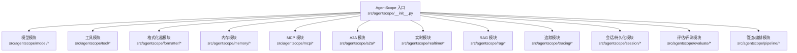
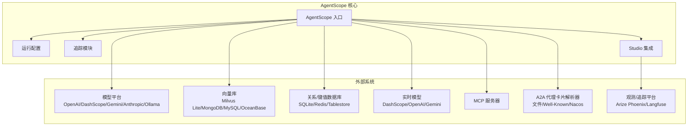
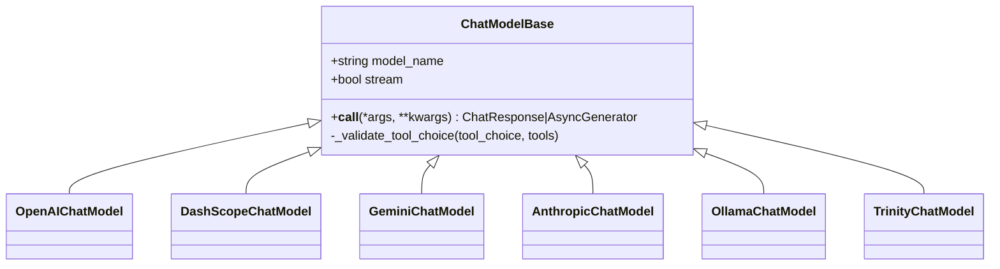
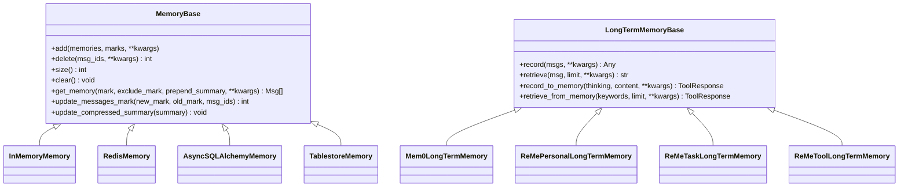
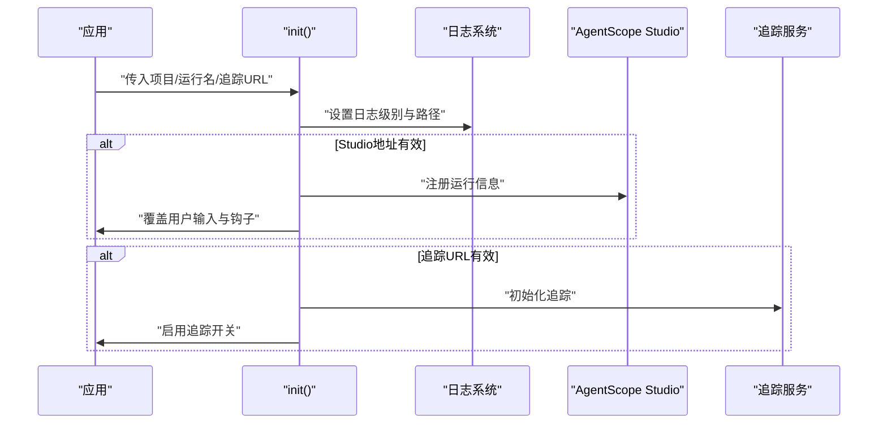
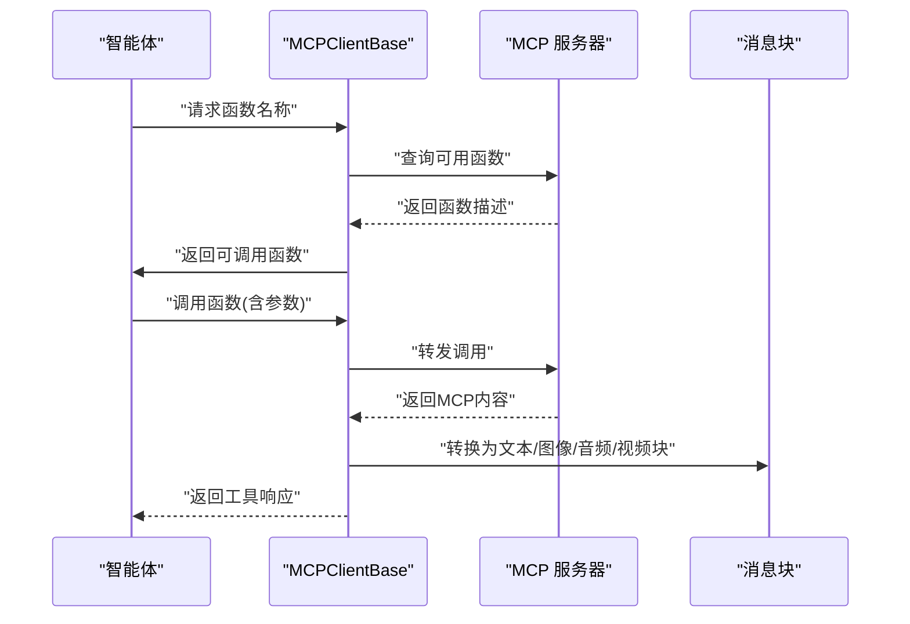
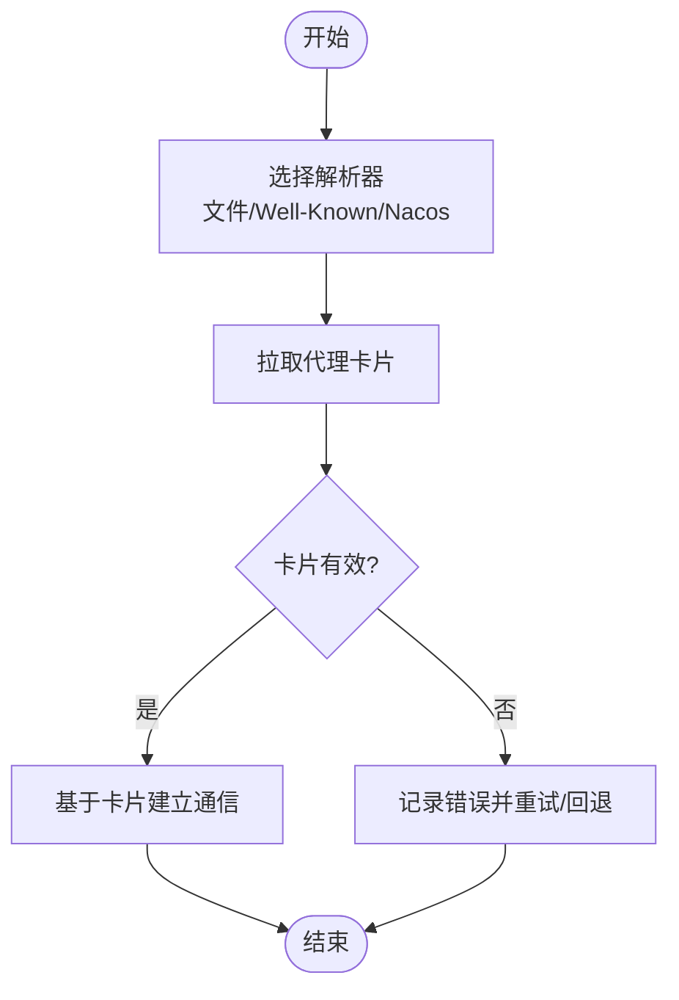
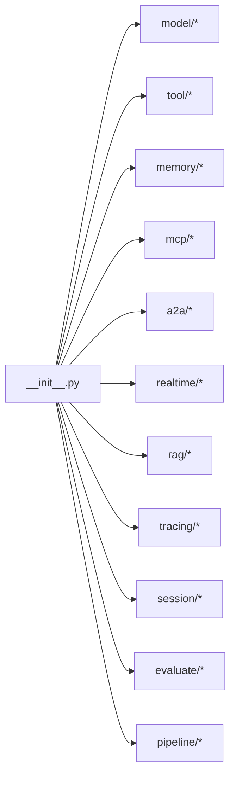

# 生态系统集成

<cite>
**本文引用的文件**
- [src/agentscope/__init__.py](file://src/agentscope/__init__.py)
- [src/agentscope/_run_config.py](file://src/agentscope/_run_config.py)
- [src/agentscope/model/__init__.py](file://src/agentscope/model/__init__.py)
- [src/agentscope/memory/__init__.py](file://src/agentscope/memory/__init__.py)
- [src/agentscope/mcp/__init__.py](file://src/agentscope/mcp/__init__.py)
- [src/agentscope/tool/__init__.py](file://src/agentscope/tool/__init__.py)
- [src/agentscope/formatter/__init__.py](file://src/agentscope/formatter/__init__.py)
- [src/agentscope/realtime/__init__.py](file://src/agentscope/realtime/__init__.py)
- [src/agentscope/a2a/__init__.py](file://src/agentscope/a2a/__init__.py)
- [src/agentscope/model/_model_base.py](file://src/agentscope/model/_model_base.py)
- [src/agentscope/memory/_working_memory/_base.py](file://src/agentscope/memory/_working_memory/_base.py)
- [src/agentscope/memory/_long_term_memory/_long_term_memory_base.py](file://src/agentscope/memory/_long_term_memory/_long_term_memory_base.py)
- [src/agentscope/mcp/_client_base.py](file://src/agentscope/mcp/_client_base.py)
- [src/agentscope/a2a/_base.py](file://src/agentscope/a2a/_base.py)
- [examples/functionality/long_term_memory/mem0/memory_example.py](file://examples/functionality/long_term_memory/mem0/memory_example.py)
- [examples/functionality/long_term_memory/reme/personal_memory_example.py](file://examples/functionality/long_term_memory/reme/personal_memory_example.py)
- [examples/functionality/long_term_memory/reme/task_memory_example.py](file://examples/functionality/long_term_memory/reme/task_memory_example.py)
- [examples/functionality/long_term_memory/reme/tool_memory_example.py](file://examples/functionality/long_term_memory/reme/tool_memory_example.py)
- [examples/functionality/short_term_memory/memory_compression/main.py](file://examples/functionality/short_term_memory/memory_compression/main.py)
- [examples/functionality/session_with_sqlite/sqlite_session.py](file://examples/functionality/session_with_sqlite/sqlite_session.py)
- [examples/functionality/vector_store/milvus_lite/main.py](file://examples/functionality/vector_store/milvus_lite/main.py)
- [examples/functionality/vector_store/mongodb/main.py](file://examples/functionality/vector_store/mongodb/main.py)
- [examples/functionality/vector_store/alibabacloud_mysql_vector/main.py](file://examples/functionality/vector_store/alibabacloud_mysql_vector/main.py)
- [examples/functionality/vector_store/oceanbase/main.py](file://examples/functionality/vector_store/oceanbase/main.py)
- [examples/functionality/rag/basic_usage.py](file://examples/functionality/rag/basic_usage.py)
- [examples/functionality/rag/react_agent_integration.py](file://examples/functionality/rag/react_agent_integration.py)
- [examples/functionality/rag/multimodal_rag.py](file://examples/functionality/rag/multimodal_rag.py)
- [examples/functionality/tts/main.py](file://examples/functionality/tts/main.py)
- [examples/functionality/structured_output/main.py](file://examples/functionality/structured_output/main.py)
- [examples/functionality/stream_printing_messages/single_agent.py](file://examples/functionality/stream_printing_messages/single_agent.py)
- [examples/functionality/stream_printing_messages/multi_agent.py](file://examples/functionality/stream_printing_messages/multi_agent.py)
- [examples/functionality/plan/main_agent_managed_plan.py](file://examples/functionality/plan/main_agent_managed_plan.py)
- [examples/functionality/plan/main_manual_plan.py](file://examples/functionality/plan/main_manual_plan.py)
- [examples/functionality/plan/_plan_model.py](file://examples/functionality/plan/_plan_model.py)
- [examples/functionality/plan/_in_memory_storage.py](file://examples/functionality/plan/_in_memory_storage.py)
- [examples/functionality/plan/_storage_base.py](file://examples/functionality/plan/_storage_base.py)
- [examples/functionality/plan/_plan_notebook.py](file://examples/functionality/plan/_plan_notebook.py)
- [examples/functionality/plan/_storage_base.py](file://examples/functionality/plan/_storage_base.py)
- [examples/functionality/plan/_plan_notebook.py](file://examples/functionality/plan/_plan_notebook.py)
- [examples/functionality/plan/_plan_model.py](file://examples/functionality/plan/_plan_model.py)
- [examples/functionality/plan/_in_memory_storage.py](file://examples/functionality/plan/_in_memory_storage.py)
- [examples/functionality/plan/_storage_base.py](file://examples/functionality/plan/_storage_base.py)
- [examples/functionality/plan/_plan_notebook.py](file://examples/functionality/plan/_plan_notebook.py)
- [examples/functionality/plan/_plan_model.py](file://examples/functionality/plan/_plan_model.py)
- [examples/functionality/plan/_in_memory_storage.py](file://examples/functionality/plan/_in_memory_storage.py)
- [examples/functionality/plan/_storage_base.py](file://examples/functionality/plan/_storage_base.py)
- [examples/functionality/plan/_plan_notebook.py](file://examples/functionality/plan/_plan_notebook.py)
- [examples/functionality/plan/_plan_model.py](file://examples/functionality/plan/_plan_model.py)
- [examples/functionality/plan/_in_memory_storage.py](file://examples/functionality/plan/_in_memory_storage.py)
- [examples/functionality/plan/_storage_base.py](file://examples/functionality/plan/_storage_base.py)
- [examples/functionality/plan/_plan_notebook.py](file://examples/functionality/plan/_plan_notebook.py)
- [examples/functionality/plan/_plan_model.py](file://examples/functionality/plan/_plan_model.py)
- [examples/functionality/plan/_in_memory_storage.py](file://examples/functionality/plan/_in_memory_storage.py)
- [examples/functionality/plan/_storage_base.py](file://examples/functionality/plan/_storage_base.py)
- [examples/functionality/plan/_plan_notebook.py](file://examples/functionality/plan/_plan_notebook.py)
- [examples/functionality/plan/_plan_model.py](file://examples/functionality/plan/_plan_model.py)
- [examples/functionality/plan/_in_memory_storage.py](file://examples/functionality/plan/_in_memory_storage.py)
- [examples/functionality/plan/_storage_base.py](file://examples/functionality/plan/_storage_base.py)
- [examples/functionality/plan/_plan_notebook.py](file://examples/functionality/plan/_plan_notebook.py)
- [examples/functionality/plan/_plan_model.py](file://examples/functionality/plan/_plan_model.py)
- [examples/functionality/plan/_in_memory_storage.py](file://examples/functionality/plan/_in_memory_storage......)
</cite>

## 目录
1. [引言](#引言)
2. [项目结构](#项目结构)
3. [核心组件](#核心组件)
4. [架构总览](#架构总览)
5. [详细组件分析](#详细组件分析)
6. [依赖分析](#依赖分析)
7. [性能考虑](#性能考虑)
8. [故障排查指南](#故障排查指南)
9. [结论](#结论)
10. [附录](#附录)

## 引言
本文件面向希望在AgentScope生态中进行系统化集成的工程师与架构师，围绕“工具集成、内存集成、可观测性集成”三大主题，系统阐述AgentScope如何与外部系统（模型平台、向量库、数据库、消息流、实时模型等）协同工作；同时深入解析MCP（Model Context Protocol）与A2A（Agent-to-Agent）协议的对接方式，帮助读者快速完成从概念到落地的全链路集成。

## 项目结构
AgentScope采用模块化分层设计：顶层通过入口模块统一导出子模块与初始化函数，各子系统（模型、工具、格式化器、内存、MCP、A2A、实时、RAG、追踪等）按职责划分清晰，便于独立扩展与替换。

图表来源
- [src/agentscope/__init__.py:1-183](file://src/agentscope/__init__.py#L1-L183)
- [src/agentscope/model/__init__.py:1-23](file://src/agentscope/model/__init__.py#L1-L23)
- [src/agentscope/tool/__init__.py:1-45](file://src/agentscope/tool/__init__.py#L1-L45)
- [src/agentscope/formatter/__init__.py:1-49](file://src/agentscope/formatter/__init__.py#L1-L49)
- [src/agentscope/memory/__init__.py:1-34](file://src/agentscope/memory/__init__.py#L1-L34)
- [src/agentscope/mcp/__init__.py:1-21](file://src/agentscope/mcp/__init__.py#L1-L21)
- [src/agentscope/a2a/__init__.py:1-15](file://src/agentscope/a2a/__init__.py#L1-L15)
- [src/agentscope/realtime/__init__.py:1-29](file://src/agentscope/realtime/__init__.py#L1-L29)

章节来源
- [src/agentscope/__init__.py:1-183](file://src/agentscope/__init__.py#L1-L183)

## 核心组件
- 初始化与运行时配置
  - 全局运行配置使用上下文变量保存运行标识、项目名、名称、创建时间与追踪开关，支持在初始化时注册到Studio并启用追踪。
  - 参考路径：[src/agentscope/__init__.py:72-157](file://src/agentscope/__init__.py#L72-L157)，[src/agentscope/_run_config.py:6-74](file://src/agentscope/_run_config.py#L6-L74)

- 模型平台集成
  - 统一的聊天模型抽象基类，支持OpenAI、DashScope、Gemini、Anthropic、Ollama、Trinity等平台适配。
  - 参考路径：[src/agentscope/model/__init__.py:1-23](file://src/agentscope/model/__init__.py#L1-L23)，[src/agentscope/model/_model_base.py:13-78](file://src/agentscope/model/_model_base.py#L13-L78)

- 工具与多模态能力
  - 提供通用工具集（文本文件读写、代码执行、图像/音频生成与理解等），并封装多平台工具调用。
  - 参考路径：[src/agentscope/tool/__init__.py:1-45](file://src/agentscope/tool/__init__.py#L1-L45)

- 内存体系
  - 短期记忆（工作内存）与长期记忆（Mem0、ReMe）双轨并行，支持多种存储后端与压缩摘要机制。
  - 参考路径：[src/agentscope/memory/__init__.py:1-34](file://src/agentscope/memory/__init__.py#L1-L34)，[src/agentscope/memory/_working_memory/_base.py:11-169](file://src/agentscope/memory/_working_memory/_base.py#L11-L169)，[src/agentscope/memory/_long_term_memory/_long_term_memory_base.py:11-95](file://src/agentscope/memory/_long_term_memory/_long_term_memory_base.py#L11-L95)

- MCP 协议支持
  - 提供客户端基类与多种传输形态（HTTP/STDIO），并内置内容类型转换以适配多模态输入。
  - 参考路径：[src/agentscope/mcp/__init__.py:1-21](file://src/agentscope/mcp/__init__.py#L1-L21)，[src/agentscope/mcp/_client_base.py:18-103](file://src/agentscope/mcp/_client_base.py#L18-L103)

- A2A 协议支持
  - 定义代理卡片解析器基类，支持文件、Well-Known、Nacos等多种解析源。
  - 参考路径：[src/agentscope/a2a/__init__.py:1-15](file://src/agentscope/a2a/__init__.py#L1-L15)，[src/agentscope/a2a/_base.py:12-26](file://src/agentscope/a2a/_base.py#L12-L26)

- 实时模型与事件
  - 支持DashScope、OpenAI、Gemini的实时模型与事件流，便于构建低延迟交互场景。
  - 参考路径：[src/agentscope/realtime/__init__.py:1-29](file://src/agentscope/realtime/__init__.py#L1-L29)

章节来源
- [src/agentscope/__init__.py:72-157](file://src/agentscope/__init__.py#L72-L157)
- [src/agentscope/_run_config.py:6-74](file://src/agentscope/_run_config.py#L6-L74)
- [src/agentscope/model/__init__.py:1-23](file://src/agentscope/model/__init__.py#L1-L23)
- [src/agentscope/model/_model_base.py:13-78](file://src/agentscope/model/_model_base.py#L13-L78)
- [src/agentscope/tool/__init__.py:1-45](file://src/agentscope/tool/__init__.py#L1-L45)
- [src/agentscope/memory/__init__.py:1-34](file://src/agentscope/memory/__init__.py#L1-L34)
- [src/agentscope/memory/_working_memory/_base.py:11-169](file://src/agentscope/memory/_working_memory/_base.py#L11-L169)
- [src/agentscope/memory/_long_term_memory/_long_term_memory_base.py:11-95](file://src/agentscope/memory/_long_term_memory/_long_term_memory_base.py#L11-L95)
- [src/agentscope/mcp/__init__.py:1-21](file://src/agentscope/mcp/__init__.py#L1-L21)
- [src/agentscope/mcp/_client_base.py:18-103](file://src/agentscope/mcp/_client_base.py#L18-L103)
- [src/agentscope/a2a/__init__.py:1-15](file://src/agentscope/a2a/__init__.py#L1-L15)
- [src/agentscope/a2a/_base.py:12-26](file://src/agentscope/a2a/_base.py#L12-L26)
- [src/agentscope/realtime/__init__.py:1-29](file://src/agentscope/realtime/__init__.py#L1-L29)

## 架构总览
下图展示了AgentScope与外部系统的集成关系：模型平台、向量库、数据库、实时模型、MCP服务器、A2A代理卡片解析器，以及Studio与追踪服务。

图表来源
- [src/agentscope/__init__.py:72-157](file://src/agentscope/__init__.py#L72-L157)
- [src/agentscope/model/__init__.py:1-23](file://src/agentscope/model/__init__.py#L1-L23)
- [src/agentscope/memory/__init__.py:1-34](file://src/agentscope/memory/__init__.py#L1-L34)
- [src/agentscope/mcp/__init__.py:1-21](file://src/agentscope/mcp/__init__.py#L1-L21)
- [src/agentscope/a2a/__init__.py:1-15](file://src/agentscope/a2a/__init__.py#L1-L15)
- [src/agentscope/realtime/__init__.py:1-29](file://src/agentscope/realtime/__init__.py#L1-L29)

## 详细组件分析

### 模型平台集成（OpenAI、DashScope、Gemini、Anthropic、Ollama）
- 设计要点
  - 统一的聊天模型抽象，屏蔽不同平台差异；支持流式/非流式输出。
  - 工具调用模式校验，确保tool_choice参数合法。
- 接入建议
  - 在应用侧通过工厂或配置中心选择具体平台实现，避免硬编码。
  - 使用格式化器模块对消息进行平台特定的序列化/反序列化。
- 示例参考
  - [examples/functionality/rag/basic_usage.py](file://examples/functionality/rag/basic_usage.py)
  - [examples/functionality/rag/react_agent_integration.py](file://examples/functionality/rag/react_agent_integration.py)

图表来源
- [src/agentscope/model/_model_base.py:13-78](file://src/agentscope/model/_model_base.py#L13-L78)
- [src/agentscope/model/__init__.py:1-23](file://src/agentscope/model/__init__.py#L1-L23)

章节来源
- [src/agentscope/model/_model_base.py:13-78](file://src/agentscope/model/_model_base.py#L13-L78)
- [src/agentscope/model/__init__.py:1-23](file://src/agentscope/model/__init__.py#L1-L23)

### 工具与多模态集成
- 能力范围
  - 文本文件操作、代码执行、图像/音频生成与理解、多平台工具桥接。
- 最佳实践
  - 将工具封装为可复用的Toolkit，结合中间件进行权限与超时控制。
  - 对于多模态输入，优先使用统一的消息块类型进行传递。
- 示例参考
  - [src/agentscope/tool/__init__.py:1-45](file://src/agentscope/tool/__init__.py#L1-L45)

章节来源
- [src/agentscope/tool/__init__.py:1-45](file://src/agentscope/tool/__init__.py#L1-L45)

### 内存集成（短期/长期记忆、压缩与持久化）
- 短期记忆（工作内存）
  - 支持内存、Redis、SQLAlchemy、Tablestore等多种后端；提供标记管理与压缩摘要更新接口。
- 长期记忆
  - 提供Mem0与ReMe（个人/任务/工具）三种实现，作为工具函数暴露给智能体使用。
- 压缩与摘要
  - 通过压缩摘要接口降低上下文长度，提升长对话效率。
- 示例参考
  - [src/agentscope/memory/__init__.py:1-34](file://src/agentscope/memory/__init__.py#L1-L34)
  - [src/agentscope/memory/_working_memory/_base.py:11-169](file://src/agentscope/memory/_working_memory/_base.py#L11-L169)
  - [src/agentscope/memory/_long_term_memory/_long_term_memory_base.py:11-95](file://src/agentscope/memory/_long_term_memory/_long_term_memory_base.py#L11-L95)
  - [examples/functionality/long_term_memory/mem0/memory_example.py](file://examples/functionality/long_term_memory/mem0/memory_example.py)
  - [examples/functionality/long_term_memory/reme/personal_memory_example.py](file://examples/functionality/long_term_memory/reme/personal_memory_example.py)
  - [examples/functionality/long_term_memory/reme/task_memory_example.py](file://examples/functionality/long_term_memory/reme/task_memory_example.py)
  - [examples/functionality/long_term_memory/reme/tool_memory_example.py](file://examples/functionality/long_term_memory/reme/tool_memory_example.py)
  - [examples/functionality/short_term_memory/memory_compression/main.py](file://examples/functionality/short_term_memory/memory_compression/main.py)

图表来源
- [src/agentscope/memory/_working_memory/_base.py:11-169](file://src/agentscope/memory/_working_memory/_base.py#L11-L169)
- [src/agentscope/memory/_long_term_memory/_long_term_memory_base.py:11-95](file://src/agentscope/memory/_long_term_memory/_long_term_memory_base.py#L11-L95)
- [src/agentscope/memory/__init__.py:1-34](file://src/agentscope/memory/__init__.py#L1-L34)

章节来源
- [src/agentscope/memory/__init__.py:1-34](file://src/agentscope/memory/__init__.py#L1-L34)
- [src/agentscope/memory/_working_memory/_base.py:11-169](file://src/agentscope/memory/_working_memory/_base.py#L11-L169)
- [src/agentscope/memory/_long_term_memory/_long_term_memory_base.py:11-95](file://src/agentscope/memory/_long_term_memory/_long_term_memory_base.py#L11-L95)

### 观测性与Studio集成
- 初始化流程
  - 支持注册到AgentScope Studio，并自动注入用户输入与钩子；可选开启OpenTelemetry追踪并上报至Studio或第三方平台。
- 追踪与日志
  - 通过全局配置控制追踪开关；日志可落盘并按级别过滤。
- 示例参考
  - [src/agentscope/__init__.py:72-157](file://src/agentscope/__init__.py#L72-L157)
  - [src/agentscope/_run_config.py:6-74](file://src/agentscope/_run_config.py#L6-L74)

图表来源
- [src/agentscope/__init__.py:72-157](file://src/agentscope/__init__.py#L72-L157)
- [src/agentscope/_run_config.py:6-74](file://src/agentscope/_run_config.py#L6-L74)

章节来源
- [src/agentscope/__init__.py:72-157](file://src/agentscope/__init__.py#L72-L157)
- [src/agentscope/_run_config.py:6-74](file://src/agentscope/_run_config.py#L6-L74)

### MCP（Model Context Protocol）集成
- 能力概述
  - 提供客户端基类与多种传输形态（STDIO/HTTP），支持将MCP内容转换为AgentScope消息块，便于跨平台工具调用。
- 接入步骤
  - 选择合适的客户端形态（本地STDIO或远程HTTP）；
  - 通过名称获取可调用函数；
  - 将返回结果包装为工具响应。
- 示例参考
  - [src/agentscope/mcp/__init__.py:1-21](file://src/agentscope/mcp/__init__.py#L1-L21)
  - [src/agentscope/mcp/_client_base.py:18-103](file://src/agentscope/mcp/_client_base.py#L18-L103)

图表来源
- [src/agentscope/mcp/_client_base.py:18-103](file://src/agentscope/mcp/_client_base.py#L18-L103)
- [src/agentscope/mcp/__init__.py:1-21](file://src/agentscope/mcp/__init__.py#L1-L21)

章节来源
- [src/agentscope/mcp/__init__.py:1-21](file://src/agentscope/mcp/__init__.py#L1-L21)
- [src/agentscope/mcp/_client_base.py:18-103](file://src/agentscope/mcp/_client_base.py#L18-L103)

### A2A（Agent-to-Agent）协议集成
- 能力概述
  - 通过代理卡片解析器从文件、Well-Known地址或Nacos等源获取代理卡片，实现动态发现与协作。
- 接入步骤
  - 选择合适的解析器实现；
  - 提供解析所需的凭据与参数；
  - 获取代理卡片并建立通信。
- 示例参考
  - [src/agentscope/a2a/__init__.py:1-15](file://src/agentscope/a2a/__init__.py#L1-L15)
  - [src/agentscope/a2a/_base.py:12-26](file://src/agentscope/a2a/_base.py#L12-L26)

图表来源
- [src/agentscope/a2a/_base.py:12-26](file://src/agentscope/a2a/_base.py#L12-L26)
- [src/agentscope/a2a/__init__.py:1-15](file://src/agentscope/a2a/__init__.py#L1-L15)

章节来源
- [src/agentscope/a2a/__init__.py:1-15](file://src/agentscope/a2a/__init__.py#L1-L15)
- [src/agentscope/a2a/_base.py:12-26](file://src/agentscope/a2a/_base.py#L12-L26)

### 向量存储与RAG集成
- 向量库支持
  - 提供Milvus Lite、MongoDB、OceanBase、MySQL（阿里云）等存储实现，适配不同部署规模与场景。
- RAG 能力
  - 支持基础检索、React智能体集成与多模态检索。
- 示例参考
  - [examples/functionality/vector_store/milvus_lite/main.py](file://examples/functionality/vector_store/milvus_lite/main.py)
  - [examples/functionality/vector_store/mongodb/main.py](file://examples/functionality/vector_store/mongodb/main.py)
  - [examples/functionality/vector_store/oceanbase/main.py](file://examples/functionality/vector_store/oceanbase/main.py)
  - [examples/functionality/vector_store/alibabacloud_mysql_vector/main.py](file://examples/functionality/vector_store/alibabacloud_mysql_vector/main.py)
  - [examples/functionality/rag/basic_usage.py](file://examples/functionality/rag/basic_usage.py)
  - [examples/functionality/rag/react_agent_integration.py](file://examples/functionality/rag/react_agent_integration.py)
  - [examples/functionality/rag/multimodal_rag.py](file://examples/functionality/rag/multimodal_rag.py)

章节来源
- [examples/functionality/vector_store/milvus_lite/main.py](file://examples/functionality/vector_store/milvus_lite/main.py)
- [examples/functionality/vector_store/mongodb/main.py](file://examples/functionality/vector_store/mongodb/main.py)
- [examples/functionality/vector_store/oceanbase/main.py](file://examples/functionality/vector_store/oceanbase/main.py)
- [examples/functionality/vector_store/alibabacloud_mysql_vector/main.py](file://examples/functionality/vector_store/alibabacloud_mysql_vector/main.py)
- [examples/functionality/rag/basic_usage.py](file://examples/functionality/rag/basic_usage.py)
- [examples/functionality/rag/react_agent_integration.py](file://examples/functionality/rag/react_agent_integration.py)
- [examples/functionality/rag/multimodal_rag.py](file://examples/functionality/rag/multimodal_rag.py)

### 实时模型与事件流
- 能力概述
  - 提供DashScope、OpenAI、Gemini的实时模型与事件类型，支持语音/音频/文本的低延迟交互。
- 接入建议
  - 明确事件订阅与回调处理逻辑；在高并发场景下注意资源释放与错误恢复。
- 示例参考
  - [src/agentscope/realtime/__init__.py:1-29](file://src/agentscope/realtime/__init__.py#L1-L29)

章节来源
- [src/agentscope/realtime/__init__.py:1-29](file://src/agentscope/realtime/__init__.py#L1-L29)

### 会话与持久化
- 能力概述
  - 提供JSON、Redis、Tablestore等会话存储实现，便于跨进程/跨实例的状态共享。
- 示例参考
  - [examples/functionality/session_with_sqlite/sqlite_session.py](file://examples/functionality/session_with_sqlite/sqlite_session.py)

章节来源
- [examples/functionality/session_with_sqlite/sqlite_session.py](file://examples/functionality/session_with_sqlite/sqlite_session.py)

### 结构化输出与TTS
- 结构化输出
  - 提供结构化输出示例，便于智能体稳定地生成结构化数据。
- TTS（文字转语音）
  - 支持DashScope、OpenAI、Gemini等平台的TTS模型。
- 示例参考
  - [examples/functionality/structured_output/main.py](file://examples/functionality/structured_output/main.py)
  - [examples/functionality/tts/main.py](file://examples/functionality/tts/main.py)

章节来源
- [examples/functionality/structured_output/main.py](file://examples/functionality/structured_output/main.py)
- [examples/functionality/tts/main.py](file://examples/functionality/tts/main.py)

### 计划与编排
- 能力概述
  - 提供计划模型、笔记本与存储抽象，支持手动与智能体托管两种计划模式。
- 示例参考
  - [examples/functionality/plan/main_agent_managed_plan.py](file://examples/functionality/plan/main_agent_managed_plan.py)
  - [examples/functionality/plan/main_manual_plan.py](file://examples/functionality/plan/main_manual_plan.py)
  - [examples/functionality/plan/_plan_model.py](file://examples/functionality/plan/_plan_model.py)
  - [examples/functionality/plan/_in_memory_storage.py](file://examples/functionality/plan/_in_memory_storage.py)
  - [examples/functionality/plan/_storage_base.py](file://examples/functionality/plan/_storage_base.py)
  - [examples/functionality/plan/_plan_notebook.py](file://examples/functionality/plan/_plan_notebook.py)

章节来源
- [examples/functionality/plan/main_agent_managed_plan.py](file://examples/functionality/plan/main_agent_managed_plan.py)
- [examples/functionality/plan/main_manual_plan.py](file://examples/functionality/plan/main_manual_plan.py)
- [examples/functionality/plan/_plan_model.py](file://examples/functionality/plan/_plan_model.py)
- [examples/functionality/plan/_in_memory_storage.py](file://examples/functionality/plan/_in_memory_storage.py)
- [examples/functionality/plan/_storage_base.py](file://examples/functionality/plan/_storage_base.py)
- [examples/functionality/plan/_plan_notebook.py](file://examples/functionality/plan/_plan_notebook.py)

## 依赖分析
- 模块内聚与耦合
  - 各子模块通过统一的入口导出，保持较低耦合；核心抽象（如ChatModelBase、MemoryBase、LongTermMemoryBase）向上游提供稳定的接口契约。
- 外部依赖点
  - MCP客户端依赖mcp.types进行内容类型转换；
  - 实时模型依赖平台SDK（DashScope/OpenAI/Gemini）；
  - 向量库与数据库依赖对应驱动或SDK。
- 循环依赖
  - 当前结构未见循环导入；若新增模块需遵循单向依赖原则。

图表来源
- [src/agentscope/__init__.py:1-183](file://src/agentscope/__init__.py#L1-L183)

章节来源
- [src/agentscope/__init__.py:1-183](file://src/agentscope/__init__.py#L1-L183)

## 性能考虑
- 上下文压缩
  - 利用压缩摘要减少上下文长度，提高推理吞吐；在高频对话场景中建议定期刷新摘要。
- 流式输出
  - 在模型与工具调用中优先使用流式接口，改善用户体验并降低首字延迟。
- 存储后端选择
  - 短期记忆优先内存/Redis；长期记忆根据数据规模选择合适向量库与数据库。
- 并发与资源
  - 实时模型与MCP调用应限制并发度并设置超时；异常时及时释放资源。

## 故障排查指南
- 初始化失败
  - 检查Studio地址与网络连通性；确认注册接口返回状态码。
  - 参考路径：[src/agentscope/__init__.py:119-133](file://src/agentscope/__init__.py#L119-L133)
- 追踪未生效
  - 确认追踪URL或Studio追踪端点已正确设置；检查全局追踪开关。
  - 参考路径：[src/agentscope/__init__.py:147-156](file://src/agentscope/__init__.py#L147-L156)，[src/agentscope/_run_config.py:66-73](file://src/agentscope/_run_config.py#L66-L73)
- MCP 内容类型不支持
  - 查看日志中关于EmbeddedResource与不支持内容类型的提示；补充相应类型转换。
  - 参考路径：[src/agentscope/mcp/_client_base.py:92-101](file://src/agentscope/mcp/_client_base.py#L92-L101)
- 内存后端异常
  - 检查连接参数与权限；必要时切换到InMemoryMemory进行问题定位。
  - 参考路径：[src/agentscope/memory/_working_memory/_base.py:32-98](file://src/agentscope/memory/_working_memory/_base.py#L32-L98)

章节来源
- [src/agentscope/__init__.py:119-133](file://src/agentscope/__init__.py#L119-L133)
- [src/agentscope/__init__.py:147-156](file://src/agentscope/__init__.py#L147-L156)
- [src/agentscope/_run_config.py:66-73](file://src/agentscope/_run_config.py#L66-L73)
- [src/agentscope/mcp/_client_base.py:92-101](file://src/agentscope/mcp/_client_base.py#L92-L101)
- [src/agentscope/memory/_working_memory/_base.py:32-98](file://src/agentscope/memory/_working_memory/_base.py#L32-L98)

## 结论
AgentScope通过统一抽象与模块化设计，实现了对主流模型平台、向量库、数据库、实时模型、MCP与A2A协议的广泛兼容。借助内存压缩、结构化输出、TTS、RAG与计划编排等增强能力，开发者可以快速搭建从工具到协作的完整智能体生态。建议在生产环境中结合Studio与追踪平台，持续优化性能与稳定性。

## 附录
- 快速集成清单
  - 选择模型平台实现并配置认证；
  - 选择内存后端并启用压缩摘要；
  - 如需实时交互，接入DashScope/OpenAI/Gemini实时模型；
  - 若存在外部工具，优先通过MCP对接；
  - 多智能体协作场景下，使用A2A解析器发现与通信；
  - 开启Studio与追踪，完善可观测性。
- 参考示例
  - [examples/functionality/rag/basic_usage.py](file://examples/functionality/rag/basic_usage.py)
  - [examples/functionality/rag/react_agent_integration.py](file://examples/functionality/rag/react_agent_integration.py)
  - [examples/functionality/rag/multimodal_rag.py](file://examples/functionality/rag/multimodal_rag.py)
  - [examples/functionality/tts/main.py](file://examples/functionality/tts/main.py)
  - [examples/functionality/structured_output/main.py](file://examples/functionality/structured_output/main.py)
  - [examples/functionality/stream_printing_messages/single_agent.py](file://examples/functionality/stream_printing_messages/single_agent.py)
  - [examples/functionality/stream_printing_messages/multi_agent.py](file://examples/functionality/stream_printing_messages/multi_agent.py)
  - [examples/functionality/plan/main_agent_managed_plan.py](file://examples/functionality/plan/main_agent_managed_plan.py)
  - [examples/functionality/plan/main_manual_plan.py](file://examples/functionality/plan/main_manual_plan.py)
  - [examples/functionality/session_with_sqlite/sqlite_session.py](file://examples/functionality/session_with_sqlite/sqlite_session.py)