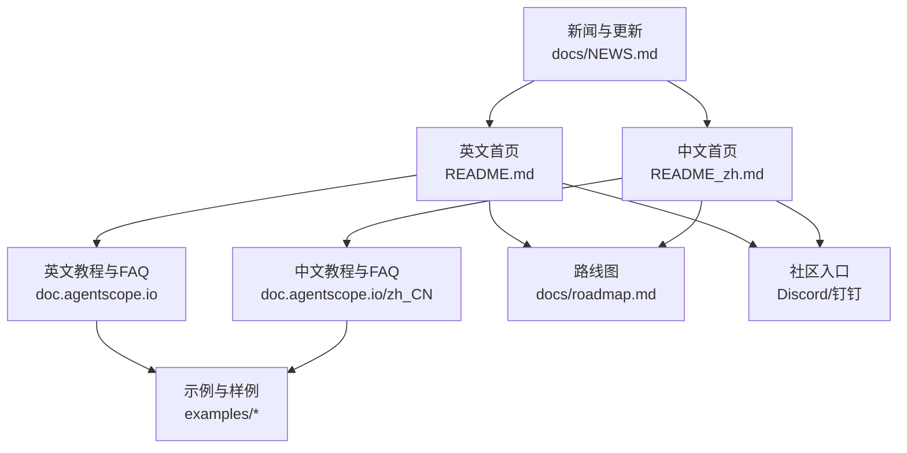
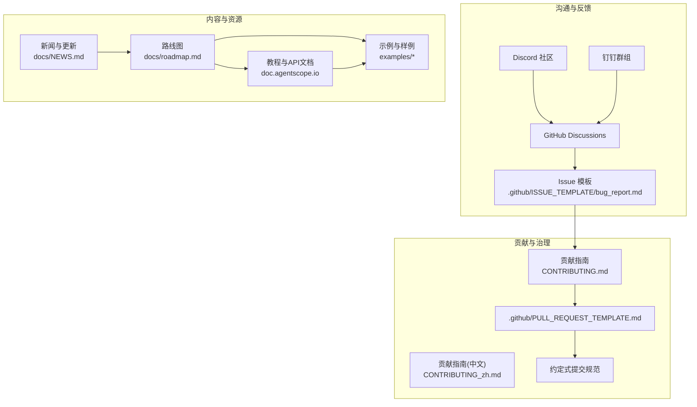
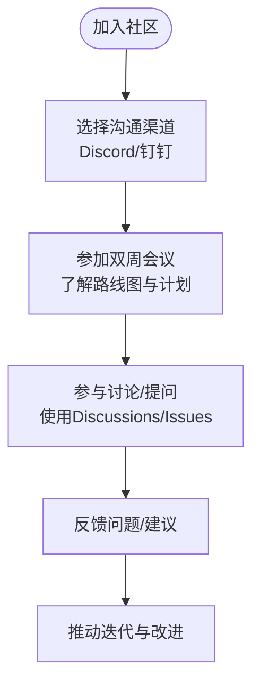
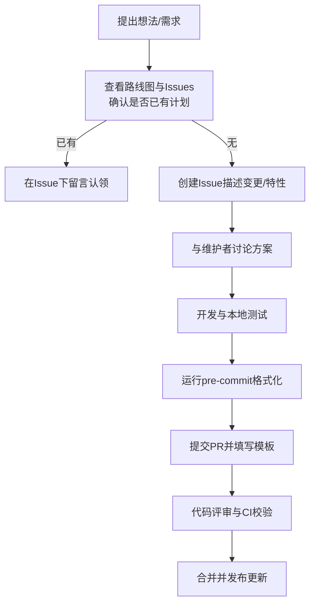
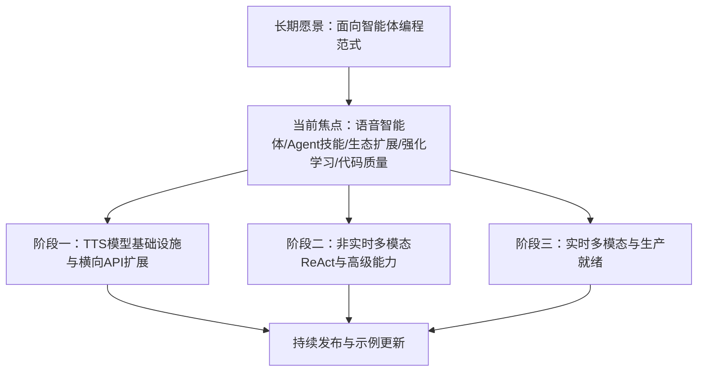
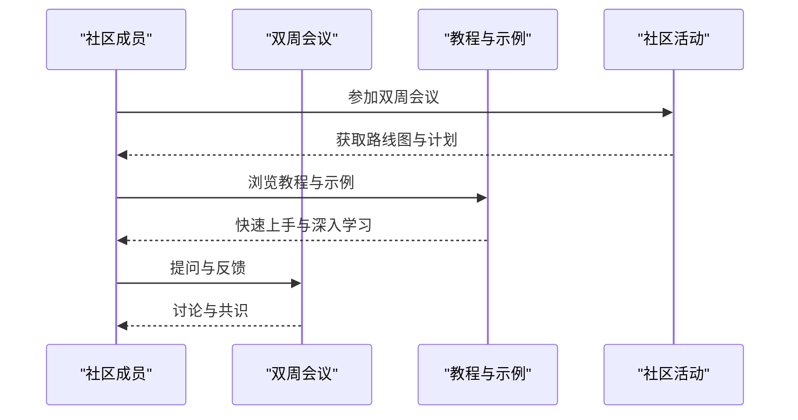
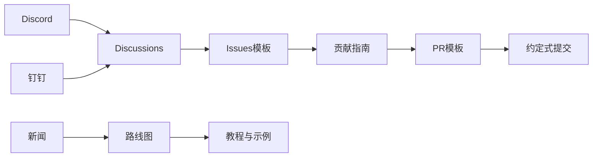

# 社区发展

<cite>
**本文引用的文件**
- [README.md](file://README.md)
- [README_zh.md](file://README_zh.md)
- [CONTRIBUTING.md](file://CONTRIBUTING.md)
- [CONTRIBUTING_zh.md](file://CONTRIBUTING_zh.md)
- [.github/PULL_REQUEST_TEMPLATE.md](file://.github/PULL_REQUEST_TEMPLATE.md)
- [docs/roadmap.md](file://docs/roadmap.md)
- [docs/NEWS.md](file://docs/NEWS.md)
- [.github/ISSUE_TEMPLATE/bug_report.md](file://.github/ISSUE_TEMPLATE/bug_report.md)
- [AGENTS.md](file://AGENTS.md)
</cite>

## 目录
1. [引言](#引言)
2. [项目结构](#项目结构)
3. [核心组件](#核心组件)
4. [架构总览](#架构总览)
5. [详细组件分析](#详细组件分析)
6. [依赖分析](#依赖分析)
7. [性能考量](#性能考量)
8. [故障排查指南](#故障排查指南)
9. [结论](#结论)
10. [附录](#附录)

## 引言
本章节面向AgentScope社区建设与发展的目标，系统梳理社区生态、沟通渠道、参与方式、治理结构、路线图、贡献流程、社区活动、资源支持与里程碑成果，帮助新老成员高效融入并推动生态繁荣。

## 项目结构
- 社区入口与导航
  - 英文首页提供英文版教程、路线图与FAQ链接，便于国际用户快速定位资源。
  - 中文首页提供中文教程、路线图与FAQ链接，便于国内用户获取中文资料。
- 社区沟通渠道
  - Discord：官方社区聊天频道，便于实时交流与协作。
  - 钉钉：国内用户的专属沟通群组，二维码与入群链接在首页与教程配置中可见。
- 资源与示例
  - 教程与示例：覆盖功能、智能体、工作流、评估、微调等多个维度，便于学习与复用。
  - 新闻与路线图：集中展示版本动态、功能更新与未来规划，保持社区透明度与共识。

**图表来源**
- [README.md:11](file://README.md#L11)
- [README_zh.md:11](file://README_zh.md#L11)
- [docs/roadmap.md:1](file://docs/roadmap.md#L1)
- [docs/NEWS.md:1](file://docs/NEWS.md#L1)

**章节来源**
- [README.md:96-131](file://README.md#L96-L131)
- [README_zh.md:94-130](file://README_zh.md#L94-L130)

## 核心组件
- 社区沟通渠道
  - Discord：提供实时讨论、问题反馈与技术交流。
  - 钉钉：提供中文社区支持与本地化沟通。
- 贡献与治理
  - 贡献指南：明确贡献类型、提交规范、PR模板与测试要求。
  - 问题模板：标准化Bug报告，提升问题定位效率。
- 路线图与新闻
  - 路线图：聚焦语音智能体、Agent技能、A2A/A2UI生态、强化学习等方向。
  - 新闻：集中展示版本发布、功能更新与社区活动，保持信息同步。

**章节来源**
- [README.md:96-131](file://README.md#L96-L131)
- [README_zh.md:94-130](file://README_zh.md#L94-L130)
- [CONTRIBUTING.md:9-27](file://CONTRIBUTING.md#L9-L27)
- [.github/ISSUE_TEMPLATE/bug_report.md:10-36](file://.github/ISSUE_TEMPLATE/bug_report.md#L10-L36)
- [docs/roadmap.md:7-78](file://docs/roadmap.md#L7-L78)
- [docs/NEWS.md:1-25](file://docs/NEWS.md#L1-L25)

## 架构总览
社区发展围绕“沟通—贡献—反馈—迭代”闭环展开，形成以路线图为指引、以新闻为纽带、以教程与示例为载体、以贡献流程为保障的生态体系。

**图表来源**
- [README.md:96-131](file://README.md#L96-L131)
- [README_zh.md:94-130](file://README_zh.md#L94-L130)
- [CONTRIBUTING.md:28-91](file://CONTRIBUTING.md#L28-L91)
- [.github/PULL_REQUEST_TEMPLATE.md:1-25](file://.github/PULL_REQUEST_TEMPLATE.md#L1-L25)
- [.github/ISSUE_TEMPLATE/bug_report.md:10-36](file://.github/ISSUE_TEMPLATE/bug_report.md#L10-L36)
- [docs/roadmap.md:1](file://docs/roadmap.md#L1)
- [docs/NEWS.md:1](file://docs/NEWS.md#L1)

## 详细组件分析

### 组件A：社区沟通与活动
- Discord与钉钉
  - 提供实时交流、问题求助与技术讨论的主渠道。
  - 首页与教程配置中均提供二维码与入群链接，便于新成员快速加入。
- 双周会议
  - 社区定期举行双周会议，分享生态更新与开发计划，欢迎社区成员参与与讨论。

**章节来源**
- [README.md:96-103](file://README.md#L96-L103)
- [README_zh.md:94-101](file://README_zh.md#L94-L101)
- [docs/NEWS.md:5-8](file://docs/NEWS.md#L5-L8)

### 组件B：贡献流程与治理
- 贡献类型与路径
  - 新ChatModel：需配套formatter、token计数器与Tools API集成，建议先在examples中验证可行性。
  - 新Agent：建议以examples/agent形式贡献，成熟后再抽象进核心库。
  - 新示例：聚焦AgentScope功能展示，复杂应用可沉淀至agentscope-samples仓库。
  - 新内存数据库：关系型数据库优先使用SQLAlchemy抽象层；NoSQL数据库需补充测试与文档。
- 提交与PR规范
  - 约定式提交：feat/fix/docs/refactor/perf/ci/style等类型，保证变更可追溯与自动生成变更日志。
  - PR模板：要求遵循Conventional Commits格式、完成pre-commit格式化、测试通过、更新文档与示例。
  - 问题模板：标准化Bug报告，包含环境信息、复现步骤与期望行为，提升定位效率。

**图表来源**
- [CONTRIBUTING.md:13-27](file://CONTRIBUTING.md#L13-L27)
- [CONTRIBUTING.md:28-91](file://CONTRIBUTING.md#L28-L91)
- [.github/PULL_REQUEST_TEMPLATE.md:1-25](file://.github/PULL_REQUEST_TEMPLATE.md#L1-L25)
- [.github/ISSUE_TEMPLATE/bug_report.md:10-36](file://.github/ISSUE_TEMPLATE/bug_report.md#L10-L36)

**章节来源**
- [CONTRIBUTING.md:141-220](file://CONTRIBUTING.md#L141-L220)
- [CONTRIBUTING.md:221-262](file://CONTRIBUTING.md#L221-L262)
- [CONTRIBUTING.md:263-287](file://CONTRIBUTING.md#L263-L287)
- [.github/PULL_REQUEST_TEMPLATE.md:1-25](file://.github/PULL_REQUEST_TEMPLATE.md#L1-L25)
- [.github/ISSUE_TEMPLATE/bug_report.md:10-36](file://.github/ISSUE_TEMPLATE/bug_report.md#L10-L36)

### 组件C：路线图与未来规划（2026）
- 当前焦点（2026年1月起）
  - 语音智能体：分三阶段推进TTS→多模态→实时多模态，强调生产级部署、工具调用与多智能体交互。
  - Agent技能：提供生产级Agent技能集成方案。
  - 生态扩展：A2UI（Agent-to-UI）、A2A（Agent-to-Agent）能力增强。
  - 强化学习：支持Tinker后端、基于运行历史的调优、与Runtime集成。
  - 代码质量：持续改进可维护性与稳定性。
- 已完成里程碑（AgentScope v1.0.0）
  - 工具/MCP：同步/异步工具函数、流式工具、并行执行、MCP服务器灵活支持。
  - 内存：短期记忆增强与长期记忆支持。
  - 智能体：ReAct基础智能体能力。
  - 开发：Studio可视化组件、内置Copilot。
  - 评估：内置基准与可视化。
  - 部署：异步执行、会话/状态管理、工具执行沙盒。

**图表来源**
- [docs/roadmap.md:3-78](file://docs/roadmap.md#L3-L78)
- [docs/roadmap.md:81-121](file://docs/roadmap.md#L81-L121)

**章节来源**
- [docs/roadmap.md:7-78](file://docs/roadmap.md#L7-L78)
- [docs/roadmap.md:81-121](file://docs/roadmap.md#L81-L121)

### 组件D：社区活动与资源
- 社区活动
  - 双周会议：分享生态更新与开发计划，欢迎参与与提问。
  - 开发者日：计划中的活动，旨在促进深度交流与协作。
- 学习资源
  - 教程与API文档：英文与中文双语教程，覆盖安装、快速开始、核心概念与任务实践。
  - 示例与样例：按功能、智能体、工作流、评估、微调分类，便于学习与复用。
  - Writerside文档：中文文档记录规范，确保内容质量与一致性。

**章节来源**
- [README.md:120-131](file://README.md#L120-L131)
- [README_zh.md:118-129](file://README_zh.md#L118-L129)
- [AGENTS.md:1-21](file://AGENTS.md#L1-L21)

## 依赖分析
- 沟通渠道依赖
  - Discord与钉钉作为主要入口，依赖GitHub Discussions与Issues模板形成问题闭环。
- 贡献流程依赖
  - Conventional Commits与PR模板确保变更可追踪与可评审。
  - 问题模板提升Bug定位效率，减少沟通成本。
- 内容与资源依赖
  - 路线图驱动教程与示例的更新节奏，新闻汇总社区动态，形成信息同步闭环。

**图表来源**
- [README.md:96-131](file://README.md#L96-L131)
- [README_zh.md:94-130](file://README_zh.md#L94-L130)
- [CONTRIBUTING.md:28-91](file://CONTRIBUTING.md#L28-L91)
- [.github/PULL_REQUEST_TEMPLATE.md:1-25](file://.github/PULL_REQUEST_TEMPLATE.md#L1-L25)
- [.github/ISSUE_TEMPLATE/bug_report.md:10-36](file://.github/ISSUE_TEMPLATE/bug_report.md#L10-L36)
- [docs/roadmap.md:1](file://docs/roadmap.md#L1)
- [docs/NEWS.md:1](file://docs/NEWS.md#L1)

**章节来源**
- [README.md:96-131](file://README.md#L96-L131)
- [README_zh.md:94-130](file://README_zh.md#L94-L130)
- [CONTRIBUTING.md:28-91](file://CONTRIBUTING.md#L28-L91)
- [.github/PULL_REQUEST_TEMPLATE.md:1-25](file://.github/PULL_REQUEST_TEMPLATE.md#L1-L25)
- [.github/ISSUE_TEMPLATE/bug_report.md:10-36](file://.github/ISSUE_TEMPLATE/bug_report.md#L10-L36)
- [docs/roadmap.md:1](file://docs/roadmap.md#L1)
- [docs/NEWS.md:1](file://docs/NEWS.md#L1)

## 性能考量
- 信息传播效率
  - 通过新闻与路线图集中发布，减少分散沟通带来的信息损耗。
- 贡献效率
  - 约定式提交与PR模板降低评审成本，提升合并频率与质量。
- 社区活跃度
  - 双周会议与开发者日有助于保持高频互动与知识沉淀。

## 故障排查指南
- 问题反馈
  - 使用Bug报告模板，提供环境信息、复现步骤与期望行为，便于快速定位。
- 沟通渠道选择
  - 日常技术问题优先在Discord或钉钉群组讨论；复杂议题移至GitHub Discussions或Issues。
- 贡献流程卡点
  - 若PR被阻塞，检查PR标题是否符合约定式提交规范，确保pre-commit通过与测试全部通过。

**章节来源**
- [.github/ISSUE_TEMPLATE/bug_report.md:10-36](file://.github/ISSUE_TEMPLATE/bug_report.md#L10-L36)
- [CONTRIBUTING.md:88-91](file://CONTRIBUTING.md#L88-L91)
- [.github/PULL_REQUEST_TEMPLATE.md:17-25](file://.github/PULL_REQUEST_TEMPLATE.md#L17-L25)

## 结论
AgentScope社区以“沟通—贡献—反馈—迭代”为核心闭环，依托路线图与新闻保持方向一致与信息同步，通过贡献指南与模板规范流程，借助教程与示例降低学习门槛，鼓励新老成员共同参与生态建设，推动AgentScope在语音智能体、Agent技能、A2A/A2UI生态与强化学习等方向持续演进。

## 附录
- 社区入口与资源
  - 英文首页与教程：[README.md](file://README.md)、[README_zh.md](file://README_zh.md)
  - 路线图与新闻：[docs/roadmap.md](file://docs/roadmap.md)、[docs/NEWS.md](file://docs/NEWS.md)
- 贡献与治理
  - 贡献指南（英文）：[CONTRIBUTING.md](file://CONTRIBUTING.md)
  - 贡献指南（中文）：[CONTRIBUTING_zh.md](file://CONTRIBUTING_zh.md)
  - PR模板：[.github/PULL_REQUEST_TEMPLATE.md](file://.github/PULL_REQUEST_TEMPLATE.md)
  - Bug报告模板：[.github/ISSUE_TEMPLATE/bug_report.md](file://.github/ISSUE_TEMPLATE/bug_report.md)
- 文档记录规范
  - Writerside文档规范：[AGENTS.md](file://AGENTS.md)