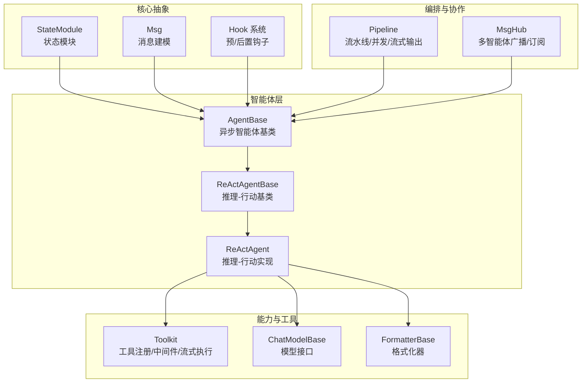
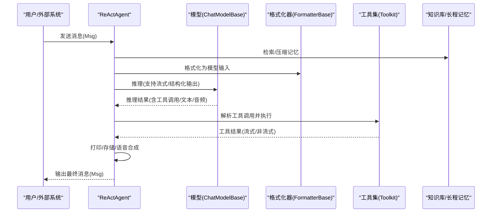
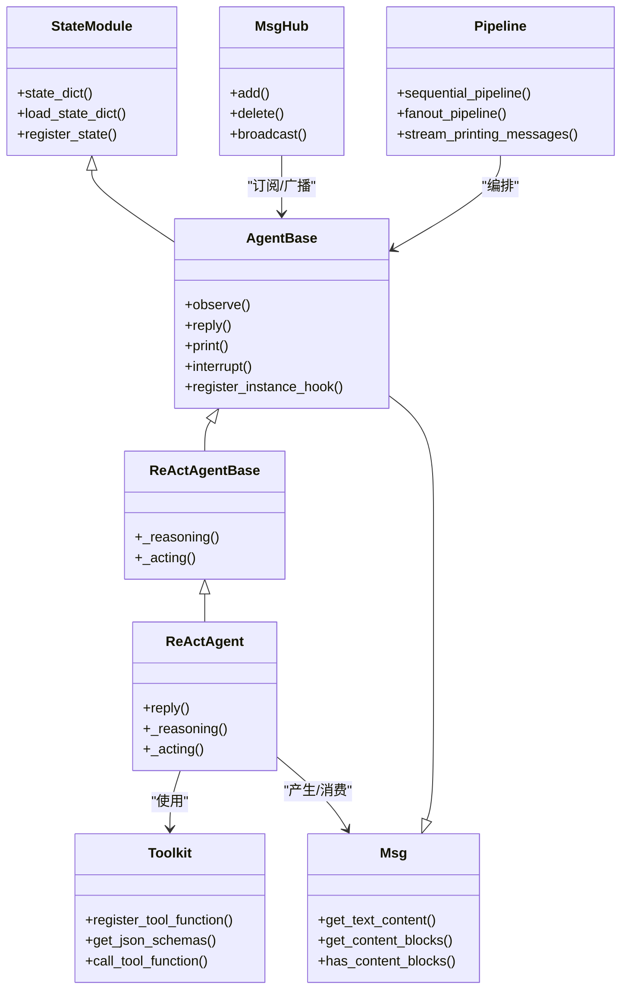
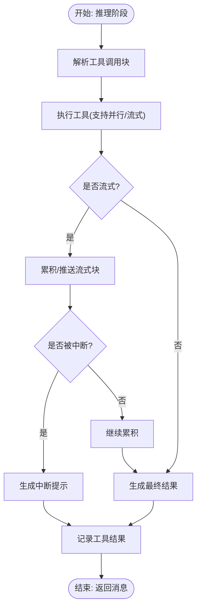
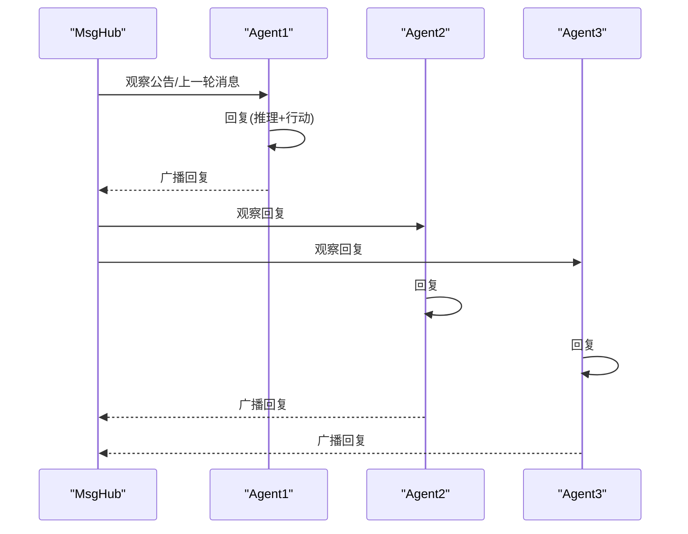
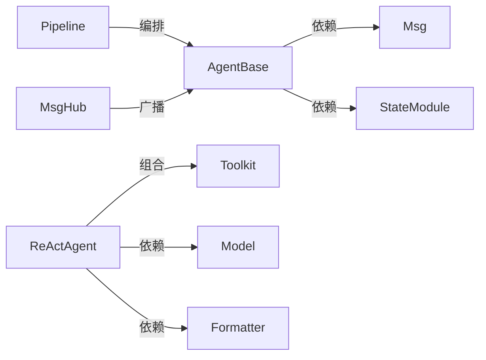

# 设计理念

<cite>
**本文引用的文件**
- [README.md](file://README.md)
- [src/agentscope/__init__.py](file://src/agentscope/__init__.py)
- [src/agentscope/agent/_agent_base.py](file://src/agentscope/agent/_agent_base.py)
- [src/agentscope/agent/_react_agent_base.py](file://src/agentscope/agent/_react_agent_base.py)
- [src/agentscope/agent/_react_agent.py](file://src/agentscope/agent/_react_agent.py)
- [src/agentscope/message/_message_base.py](file://src/agentscope/message/_message_base.py)
- [src/agentscope/module/_state_module.py](file://src/agentscope/module/_state_module.py)
- [src/agentscope/pipeline/_functional.py](file://src/agentscope/pipeline/_functional.py)
- [src/agentscope/pipeline/_msghub.py](file://src/agentscope/pipeline/_msghub.py)
- [src/agentscope/tool/_toolkit.py](file://src/agentscope/tool/_toolkit.py)
- [examples/agent/react_agent/main.py](file://examples/agent/react_agent/main.py)
- [examples/workflows/multiagent_conversation/main.py](file://examples/workflows/multiagent_conversation/main.py)
</cite>

## 目录
1. [引言](#引言)
2. [项目结构](#项目结构)
3. [核心组件](#核心组件)
4. [架构总览](#架构总览)
5. [详细组件分析](#详细组件分析)
6. [依赖分析](#依赖分析)
7. [性能考虑](#性能考虑)
8. [故障排查指南](#故障排查指南)
9. [结论](#结论)
10. [附录](#附录)

## 引言
本节围绕 AgentScope 的设计理念展开，重点阐释以下核心思想：
- 利用模型的推理与工具使用能力，而非通过严格提示与主观编排去限制模型行为；
- 面向日益“代理化”的 LLM，提供更自然、更灵活的智能体开发范式；
- 在保持简单性的同时，通过抽象层降低复杂多智能体系统的开发门槛；
- 展示设计决策的技术考量、权衡与约束，并给出可落地的设计模式与架构原则。

上述理念在框架中以“状态模块化”“消息驱动”“工具即能力”“钩子扩展”“流水线与 Hub 协作”等机制具体体现，并通过示例代码路径加以印证。

## 项目结构
AgentScope 采用模块化分层组织，围绕“状态管理”“消息建模”“工具与格式化”“智能体基类与实现”“流水线与多智能体编排”等维度构建。下图给出与设计理念直接相关的高层结构视图：

图表来源
- [src/agentscope/module/_state_module.py:20-152](file://src/agentscope/module/_state_module.py#L20-L152)
- [src/agentscope/message/_message_base.py:21-242](file://src/agentscope/message/_message_base.py#L21-L242)
- [src/agentscope/agent/_agent_base.py:30-775](file://src/agentscope/agent/_agent_base.py#L30-L775)
- [src/agentscope/agent/_react_agent_base.py:12-117](file://src/agentscope/agent/_react_agent_base.py#L12-L117)
- [src/agentscope/agent/_react_agent.py:98-800](file://src/agentscope/agent/_react_agent.py#L98-L800)
- [src/agentscope/tool/_toolkit.py:117-800](file://src/agentscope/tool/_toolkit.py#L117-L800)
- [src/agentscope/pipeline/_functional.py:10-193](file://src/agentscope/pipeline/_functional.py#L10-L193)
- [src/agentscope/pipeline/_msghub.py:14-157](file://src/agentscope/pipeline/_msghub.py#L14-L157)

章节来源
- [README.md:58-77](file://README.md#L58-L77)
- [src/agentscope/__init__.py:1-183](file://src/agentscope/__init__.py#L1-L183)

## 核心组件
本节聚焦支撑设计理念的关键构件及其职责边界，强调“以模型推理与工具使用为中心”的设计取向。

- 状态模块（StateModule）
  - 提供嵌套状态序列化/反序列化能力，使智能体、记忆、工具集等均可持久化与恢复，支持渐进式开发与实验复现。
  - 设计要点：将初始化与状态管理解耦，避免在对象内部隐藏复杂状态逻辑；通过注册属性与自定义序列化函数，保证可扩展性与一致性。

- 消息建模（Msg）
  - 统一的消息结构，承载文本、工具调用、工具结果、图像/音频/视频等多模态块，作为智能体间、智能体与外部系统间的通用介质。
  - 设计要点：内容块类型化、角色标准化、元数据承载结构化输出、时间戳与调用 ID 可追踪。

- 钩子系统（Hooks）
  - 在“回复前/后”“打印前/后”“观察前/后”“推理/行动前/后”等位置注入可插拔逻辑，既不固化在智能体内部，又可按实例或类级别动态启用/禁用。
  - 设计要点：有序字典维护钩子链，支持同步/异步钩子组合，便于审计、可观测与功能增强。

- 工具集（Toolkit）
  - 将本地函数、MCP 工具、技能目录统一为可被模型消费的 JSON Schema，并提供中间件链、异步任务跟踪、流式执行与后处理能力。
  - 设计要点：工具函数自动解析签名生成 Schema；支持组激活/停用；支持后处理函数对结果进行二次加工；流式工具自动聚合为最终响应。

- 智能体基类（AgentBase/ReActAgentBase/ReActAgent）
  - AgentBase 定义异步回复、观察、打印、中断与钩子注册等通用能力；
  - ReActAgentBase 在其基础上抽象“推理-行动”两阶段，并提供相应钩子；
  - ReActAgent 实现完整的 ReAct 循环：检索/压缩记忆、格式化提示、模型推理、工具调用、结构化输出、总结与语音合成等。

- 编排与协作（Pipeline/MsgHub）
  - Pipeline 提供顺序/并行/流式收集等流水线能力，简化多智能体串并联编排；
  - MsgHub 提供订阅-广播机制，自动在参与者之间转发消息，降低心智负担。

章节来源
- [src/agentscope/module/_state_module.py:20-152](file://src/agentscope/module/_state_module.py#L20-L152)
- [src/agentscope/message/_message_base.py:21-242](file://src/agentscope/message/_message_base.py#L21-L242)
- [src/agentscope/agent/_agent_base.py:30-775](file://src/agentscope/agent/_agent_base.py#L30-L775)
- [src/agentscope/agent/_react_agent_base.py:12-117](file://src/agentscope/agent/_react_agent_base.py#L12-L117)
- [src/agentscope/agent/_react_agent.py:98-800](file://src/agentscope/agent/_react_agent.py#L98-L800)
- [src/agentscope/tool/_toolkit.py:117-800](file://src/agentscope/tool/_toolkit.py#L117-L800)
- [src/agentscope/pipeline/_functional.py:10-193](file://src/agentscope/pipeline/_functional.py#L10-L193)
- [src/agentscope/pipeline/_msghub.py:14-157](file://src/agentscope/pipeline/_msghub.py#L14-L157)

## 架构总览
下图展示“理念到实现”的端到端映射：以模型推理与工具使用为核心，通过消息与状态抽象连接智能体、工具与编排层，借助钩子与中间件实现可插拔扩展。

图表来源
- [src/agentscope/agent/_react_agent.py:376-796](file://src/agentscope/agent/_react_agent.py#L376-L796)
- [src/agentscope/tool/_toolkit.py:117-800](file://src/agentscope/tool/_toolkit.py#L117-L800)
- [src/agentscope/message/_message_base.py:21-242](file://src/agentscope/message/_message_base.py#L21-L242)

## 详细组件分析

### 设计理念与 ReActAgent 的映射
- “以模型推理与工具使用为中心”体现在：
  - 推理阶段由模型生成工具调用与文本，行动阶段由工具集执行并回传结果；
  - 结构化输出通过工具集动态注册的“完成函数”与模型联合生成；
  - 语音合成与流式打印贯穿推理-行动全过程，提升交互体验。
- “避免严格提示与主观编排”体现在：
  - 通过钩子与中间件扩展能力，而非在智能体内部硬编码流程；
  - 工具集的组激活/停用与后处理函数，允许在不修改智能体代码的前提下调整行为。

图表来源
- [src/agentscope/module/_state_module.py:20-152](file://src/agentscope/module/_state_module.py#L20-L152)
- [src/agentscope/message/_message_base.py:21-242](file://src/agentscope/message/_message_base.py#L21-L242)
- [src/agentscope/agent/_agent_base.py:30-775](file://src/agentscope/agent/_agent_base.py#L30-L775)
- [src/agentscope/agent/_react_agent_base.py:12-117](file://src/agentscope/agent/_react_agent_base.py#L12-L117)
- [src/agentscope/agent/_react_agent.py:98-800](file://src/agentscope/agent/_react_agent.py#L98-L800)
- [src/agentscope/tool/_toolkit.py:117-800](file://src/agentscope/tool/_toolkit.py#L117-L800)
- [src/agentscope/pipeline/_msghub.py:14-157](file://src/agentscope/pipeline/_msghub.py#L14-L157)
- [src/agentscope/pipeline/_functional.py:10-193](file://src/agentscope/pipeline/_functional.py#L10-L193)

章节来源
- [src/agentscope/agent/_react_agent.py:98-800](file://src/agentscope/agent/_react_agent.py#L98-L800)
- [src/agentscope/tool/_toolkit.py:117-800](file://src/agentscope/tool/_toolkit.py#L117-L800)
- [src/agentscope/pipeline/_functional.py:10-193](file://src/agentscope/pipeline/_functional.py#L10-L193)
- [src/agentscope/pipeline/_msghub.py:14-157](file://src/agentscope/pipeline/_msghub.py#L14-L157)

### 设计模式与架构原则
- 策略模式（工具与格式化器）
  - 通过接口抽象（如 ChatModelBase、FormatterBase），在不改变智能体核心逻辑的前提下切换实现，适配不同供应商与模型形态。
- 中介者模式（MsgHub）
  - 将多智能体之间的消息传播集中到 Hub，避免交叉耦合，降低心智负担。
- 流水线模式（Pipeline）
  - 将顺序/并行/流式收集等编排逻辑封装为通用组件，开发者只需关注业务智能体。
- 中间件模式（Toolkit 中间件链）
  - 对工具调用过程进行统一拦截与增强（如鉴权、限流、日志、重试），不侵入工具函数本身。
- 钩子模式（Agent Hooks）
  - 在关键节点插入可插拔逻辑，支持审计、观测、A/B 实验与功能开关。

章节来源
- [src/agentscope/pipeline/_functional.py:10-193](file://src/agentscope/pipeline/_functional.py#L10-L193)
- [src/agentscope/pipeline/_msghub.py:14-157](file://src/agentscope/pipeline/_msghub.py#L14-L157)
- [src/agentscope/tool/_toolkit.py:57-114](file://src/agentscope/tool/_toolkit.py#L57-L114)
- [src/agentscope/agent/_agent_base.py:46-138](file://src/agentscope/agent/_agent_base.py#L46-L138)

### 关键流程：工具调用与流式输出
该流程体现了“让模型决定做什么，工具决定怎么做”的理念，同时保留可观测与可控性。

图表来源
- [src/agentscope/agent/_react_agent.py:657-715](file://src/agentscope/agent/_react_agent.py#L657-L715)
- [src/agentscope/tool/_toolkit.py:685-800](file://src/agentscope/tool/_toolkit.py#L685-L800)

章节来源
- [src/agentscope/agent/_react_agent.py:657-715](file://src/agentscope/agent/_react_agent.py#L657-L715)
- [src/agentscope/tool/_toolkit.py:685-800](file://src/agentscope/tool/_toolkit.py#L685-L800)

### 多智能体编排：MsgHub 与流水线
- MsgHub 自动订阅/广播消息，支持动态增删成员；
- 流水线提供顺序/并行/流式输出收集，简化多智能体协作。

图表来源
- [src/agentscope/pipeline/_msghub.py:130-157](file://src/agentscope/pipeline/_msghub.py#L130-L157)
- [examples/workflows/multiagent_conversation/main.py:38-81](file://examples/workflows/multiagent_conversation/main.py#L38-L81)

章节来源
- [src/agentscope/pipeline/_msghub.py:14-157](file://src/agentscope/pipeline/_msghub.py#L14-L157)
- [examples/workflows/multiagent_conversation/main.py:38-81](file://examples/workflows/multiagent_conversation/main.py#L38-L81)

## 依赖分析
- 松耦合与高内聚
  - 智能体仅依赖抽象接口（模型、格式化器、工具集、消息），不绑定具体实现；
  - 工具集通过中间件链与后处理函数实现横切关注点，避免污染工具函数。
- 可观测与可调试
  - 钩子系统覆盖关键节点；消息携带时间戳与调用 ID，便于追踪；
  - 流式输出与队列机制支持实时监控与中断。
- 可扩展与可演进
  - 状态模块支持嵌套序列化，便于版本迁移与增量升级；
  - MsgHub 与 Pipeline 提供编排扩展点，满足复杂场景。

图表来源
- [src/agentscope/agent/_agent_base.py:30-775](file://src/agentscope/agent/_agent_base.py#L30-L775)
- [src/agentscope/agent/_react_agent.py:98-800](file://src/agentscope/agent/_react_agent.py#L98-L800)
- [src/agentscope/tool/_toolkit.py:117-800](file://src/agentscope/tool/_toolkit.py#L117-L800)
- [src/agentscope/pipeline/_functional.py:10-193](file://src/agentscope/pipeline/_functional.py#L10-L193)
- [src/agentscope/pipeline/_msghub.py:14-157](file://src/agentscope/pipeline/_msghub.py#L14-L157)

章节来源
- [src/agentscope/agent/_agent_base.py:30-775](file://src/agentscope/agent/_agent_base.py#L30-L775)
- [src/agentscope/agent/_react_agent.py:98-800](file://src/agentscope/agent/_react_agent.py#L98-L800)
- [src/agentscope/tool/_toolkit.py:117-800](file://src/agentscope/tool/_toolkit.py#L117-L800)
- [src/agentscope/pipeline/_functional.py:10-193](file://src/agentscope/pipeline/_functional.py#L10-L193)
- [src/agentscope/pipeline/_msghub.py:14-157](file://src/agentscope/pipeline/_msghub.py#L14-L157)

## 性能考虑
- 推理-行动循环的迭代上限与记忆压缩
  - 通过压缩配置与最近上下文保留策略，控制上下文长度，避免超出上下文窗口导致的性能退化。
- 工具调用的并行化
  - 支持并行执行多个工具调用，缩短端到端时延；同时注意资源竞争与限流。
- 流式输出与事件驱动
  - 使用队列与事件循环，避免阻塞主线程；合理设置队列大小与背压策略。
- 记忆与检索
  - 长程记忆与知识库检索应结合缓存与增量更新，减少重复开销。

章节来源
- [src/agentscope/agent/_react_agent.py:107-176](file://src/agentscope/agent/_react_agent.py#L107-L176)
- [src/agentscope/pipeline/_functional.py:47-104](file://src/agentscope/pipeline/_functional.py#L47-L104)

## 故障排查指南
- 中断与恢复
  - 当用户中断当前回复时，智能体会生成“被中断”提示并记录工具结果，确保后续恢复与一致性。
- 工具执行异常
  - 工具执行异常会被捕获并转换为错误消息；流式工具会累积最终结果；必要时可取消后台任务并清理资源。
- 钩子与中间件
  - 若钩子或中间件导致行为异常，可通过移除/禁用定位问题；确认钩子链顺序与返回值。

章节来源
- [src/agentscope/agent/_agent_base.py:516-532](file://src/agentscope/agent/_agent_base.py#L516-L532)
- [src/agentscope/agent/_react_agent.py:625-655](file://src/agentscope/agent/_react_agent.py#L625-L655)
- [src/agentscope/tool/_toolkit.py:737-755](file://src/agentscope/tool/_toolkit.py#L737-L755)

## 结论
AgentScope 的设计理念以“模型推理与工具使用”为核心，通过状态模块、消息建模、钩子系统、工具集与编排组件形成清晰的抽象层次。该设计在保持简单性的同时，提供了强大的扩展能力与工程化保障，适用于从单智能体到复杂多智能体系统的多样化场景。开发者可基于此理念快速搭建可演进、可观测、可维护的智能体应用。

## 附录
- 快速上手与示例参考
  - ReAct Agent 示例展示了“消息-模型-工具-打印”的最小闭环；
  - 多智能体对话示例展示了 MsgHub 与流水线的协作方式。

章节来源
- [examples/agent/react_agent/main.py:18-51](file://examples/agent/react_agent/main.py#L18-L51)
- [examples/workflows/multiagent_conversation/main.py:38-81](file://examples/workflows/multiagent_conversation/main.py#L38-L81)