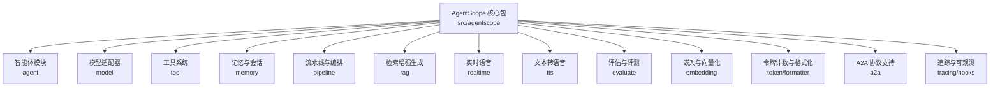
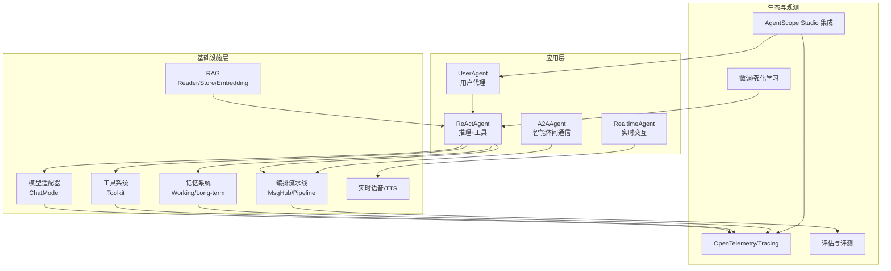
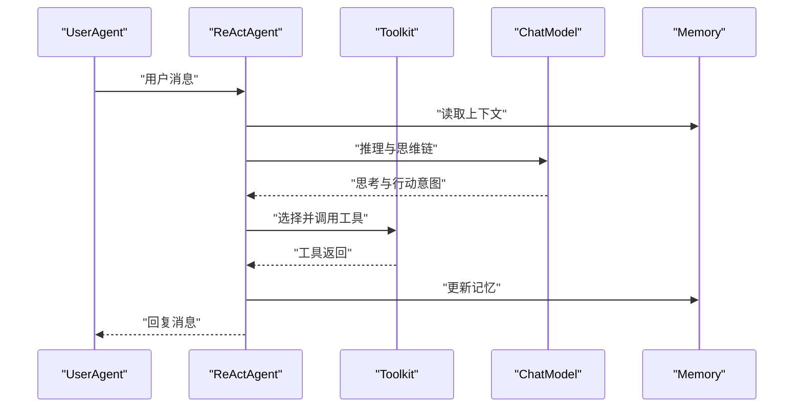
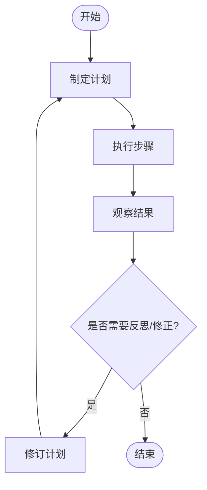
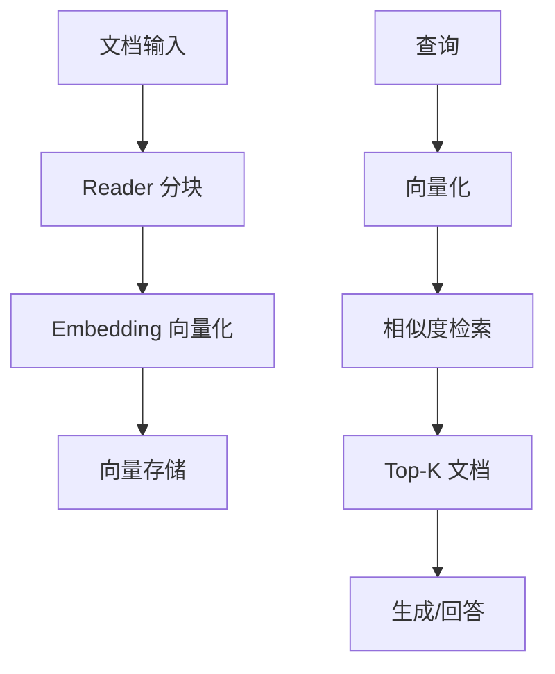
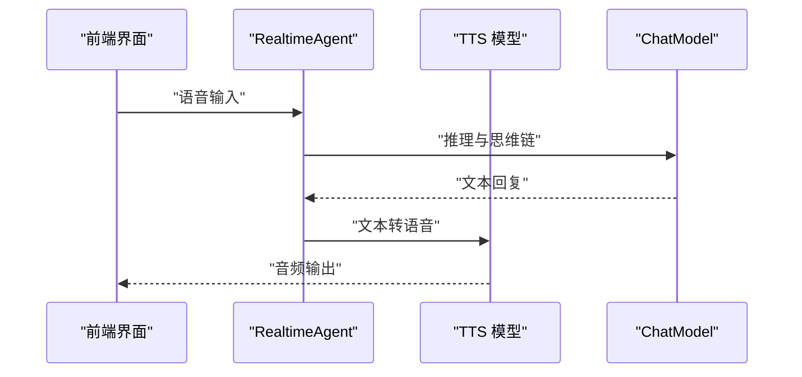
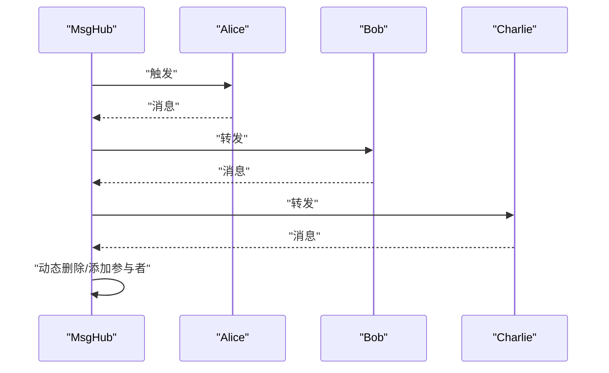
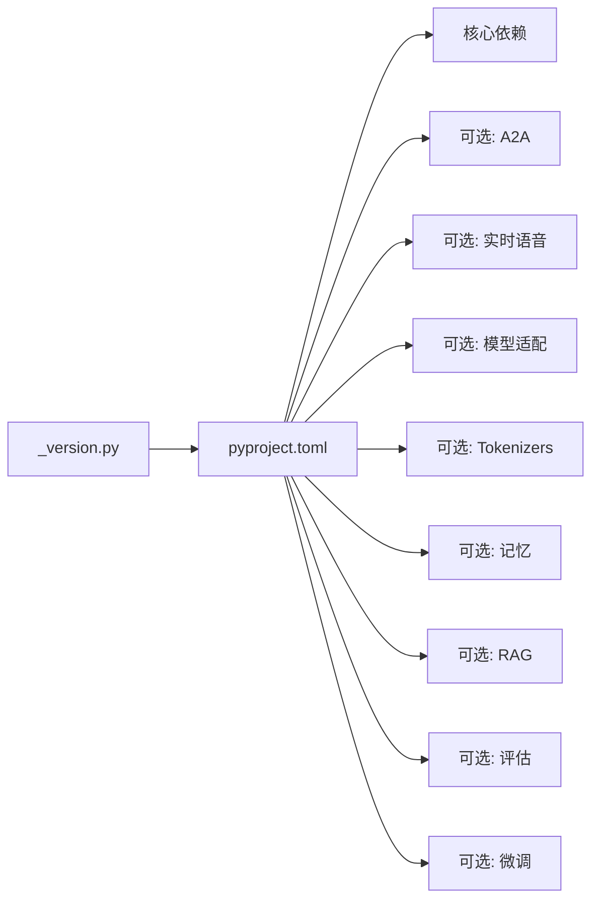

# 项目概述

<cite>
**本文引用的文件**   
- [README.md](file://README.md)
- [README_zh.md](file://README_zh.md)
- [src/agentscope/__init__.py](file://src/agentscope/__init__.py)
- [src/agentscope/_version.py](file://src/agentscope/_version.py)
- [pyproject.toml](file://pyproject.toml)
- [src/agentscope/agent/__init__.py](file://src/agentscope/agent/__init__.py)
- [src/agentscope/tool/__init__.py](file://src/agentscope/tool/__init__.py)
- [src/agentscope/memory/__init__.py](file://src/agentscope/memory/__init__.py)
- [src/agentscope/pipeline/__init__.py](file://src/agentscope/pipeline/__init__.py)
- [src/agentscope/model/__init__.py](file://src/agentscope/model/__init__.py)
- [examples/agent/react_agent/main.py](file://examples/agent/react_agent/main.py)
- [examples/functionality/plan/main_agent_managed_plan.py](file://examples/functionality/plan/main_agent_managed_plan.py)
- [examples/functionality/rag/basic_usage.py](file://examples/functionality/rag/basic_usage.py)
- [examples/functionality/tts/main.py](file://examples/functionality/tts/main.py)
- [examples/workflows/multiagent_conversation/main.py](file://examples/workflows/multiagent_conversation/main.py)
</cite>

## 目录
1. [引言](#引言)
2. [项目结构](#项目结构)
3. [核心组件](#核心组件)
4. [架构总览](#架构总览)
5. [详细组件分析](#详细组件分析)
6. [依赖分析](#依赖分析)
7. [性能考虑](#性能考虑)
8. [故障排查指南](#故障排查指南)
9. [结论](#结论)
10. [附录](#附录)

## 引言
AgentScope 是面向多智能体应用开发的“生产就绪、易于使用”的智能体框架。其核心价值在于：以“模型推理与工具使用”为中心的设计理念，而非通过严格的提示工程与预设编排来限制模型能力；提供从入门到生产的全栈能力，覆盖内置 ReAct 智能体、工具系统、技能、人机协作、记忆、规划、实时语音、评估与模型微调；并通过统一的抽象与模块化架构，适配不断进化的大模型能力。

AgentScope 的定位是“开发者友好、生态开放、可观测可运维”的多智能体平台，既适合快速原型与教学演示，也能支撑复杂的企业级部署与规模化工作流。

## 项目结构
AgentScope 采用按领域分层的模块化组织方式，核心目录与职责概览如下：
- src/agentscope：框架核心代码，按功能域划分为 agent、model、tool、memory、pipeline、rag、realtime、tts、evaluate、embedding、token 等子模块
- examples：覆盖智能体、功能特性、工作流、评估与微调等示例
- tests：单元测试与集成测试
- docs：教程与路线图等文档
- pyproject.toml：项目元数据、依赖与可选生态集

图表来源
- [src/agentscope/__init__.py:1-183](file://src/agentscope/__init__.py#L1-L183)
- [src/agentscope/agent/__init__.py:1-29](file://src/agentscope/agent/__init__.py#L1-L29)
- [src/agentscope/model/__init__.py:1-23](file://src/agentscope/model/__init__.py#L1-L23)
- [src/agentscope/tool/__init__.py:1-45](file://src/agentscope/tool/__init__.py#L1-L45)
- [src/agentscope/memory/__init__.py:1-34](file://src/agentscope/memory/__init__.py#L1-L34)
- [src/agentscope/pipeline/__init__.py:1-23](file://src/agentscope/pipeline/__init__.py#L1-L23)

章节来源
- [README.md:58-77](file://README.md#L58-L77)
- [README_zh.md:58-75](file://README_zh.md#L58-L75)
- [src/agentscope/__init__.py:43-66](file://src/agentscope/__init__.py#L43-L66)

## 核心组件
- 智能体体系：提供 ReActAgent、UserAgent、A2AAgent、RealtimeAgent 等基础类型，支持思维链、工具调用、人机协作与实时交互
- 模型适配：统一 ChatModel 接口，内置 DashScope、OpenAI、Anthropic、Ollama、Gemini、Trinity 等适配器
- 工具系统：Toolkit 抽象与常用工具（代码执行、文件读写、多模态等），支持 MCP 工具的本地化封装
- 记忆与会话：短期记忆（内存/Redis/SQL/Tablestore）、长期记忆（Mem0/ReMe）与会话持久化
- 编排与流水线：MsgHub、Sequential/Fanout Pipeline、ChatRoom 等，支撑多智能体对话与工作流
- 检索增强（RAG）：Reader、Store、Embedding 组合，支持多格式文档与向量库
- 实时语音与 TTS：实时语音模型与 TTS 合成，配合前端界面实现语音交互
- 评估与微调：内置评测器、ACEBench、模型微调（含强化学习）与提示词微调
- 观测与追踪：OpenTelemetry 集成、Studio 钩子、日志与运行标识

章节来源
- [src/agentscope/agent/__init__.py:17-28](file://src/agentscope/agent/__init__.py#L17-L28)
- [src/agentscope/model/__init__.py:13-22](file://src/agentscope/model/__init__.py#L13-L22)
- [src/agentscope/tool/__init__.py:27-44](file://src/agentscope/tool/__init__.py#L27-L44)
- [src/agentscope/memory/__init__.py:20-33](file://src/agentscope/memory/__init__.py#L20-L33)
- [src/agentscope/pipeline/__init__.py:14-22](file://src/agentscope/pipeline/__init__.py#L14-L22)
- [src/agentscope/__init__.py:159-182](file://src/agentscope/__init__.py#L159-L182)

## 架构总览
AgentScope 的整体架构围绕“智能体-工具-记忆-模型-编排-生态”的闭环展开，强调“让模型自由思考与行动”，通过统一抽象屏蔽底层差异，同时提供可插拔的生态集成点。

图表来源
- [src/agentscope/agent/__init__.py:17-28](file://src/agentscope/agent/__init__.py#L17-L28)
- [src/agentscope/model/__init__.py:13-22](file://src/agentscope/model/__init__.py#L13-L22)
- [src/agentscope/tool/__init__.py:27-44](file://src/agentscope/tool/__init__.py#L27-L44)
- [src/agentscope/memory/__init__.py:20-33](file://src/agentscope/memory/__init__.py#L20-L33)
- [src/agentscope/pipeline/__init__.py:14-22](file://src/agentscope/pipeline/__init__.py#L14-L22)
- [src/agentscope/__init__.py:104-156](file://src/agentscope/__init__.py#L104-L156)

## 详细组件分析

### ReAct 智能体与工具系统
- 设计理念：以“思维链 + 工具调用”为核心，通过 Toolkit 将外部能力（如代码执行、文件读写、多模态）注入智能体，避免硬编码流程
- 关键能力：支持思维链开关、工具注册、响应封装、与模型/格式化器/记忆的组合使用
- 典型用法：示例中展示了 Shell/Python 执行与文件读取工具的注册与调用

图表来源
- [examples/agent/react_agent/main.py:18-50](file://examples/agent/react_agent/main.py#L18-L50)
- [src/agentscope/tool/__init__.py:27-44](file://src/agentscope/tool/__init__.py#L27-L44)
- [src/agentscope/memory/__init__.py:20-33](file://src/agentscope/memory/__init__.py#L20-L33)
- [src/agentscope/model/__init__.py:13-22](file://src/agentscope/model/__init__.py#L13-L22)

章节来源
- [examples/agent/react_agent/main.py:18-50](file://examples/agent/react_agent/main.py#L18-L50)
- [src/agentscope/tool/__init__.py:27-44](file://src/agentscope/tool/__init__.py#L27-L44)

### 计划与笔记（Plan Notebook）
- 设计理念：将“计划制定—执行—反思—迭代”的过程内建到智能体中，支持智能体自管理计划
- 关键能力：PlanNotebook 存储与回溯计划步骤，结合工具完成任务分解与执行
- 典型用法：示例中通过 SysPrompt 明确目标，并启用元工具与计划笔记本

图表来源
- [examples/functionality/plan/main_agent_managed_plan.py:21-65](file://examples/functionality/plan/main_agent_managed_plan.py#L21-L65)

章节来源
- [examples/functionality/plan/main_agent_managed_plan.py:21-65](file://examples/functionality/plan/main_agent_managed_plan.py#L21-L65)

### 检索增强（RAG）
- 设计理念：将“阅读—嵌入—检索—生成”流程模块化，支持多种 Reader 与 Store
- 关键能力：文本/PDF 等多格式 Reader、DashScope Embedding、Qdrant/Milvus 等向量库
- 典型用法：示例中展示从文本与 PDF 构建知识库并进行检索

图表来源
- [examples/functionality/rag/basic_usage.py:15-79](file://examples/functionality/rag/basic_usage.py#L15-L79)

章节来源
- [examples/functionality/rag/basic_usage.py:15-79](file://examples/functionality/rag/basic_usage.py#L15-L79)

### 实时语音与 TTS
- 设计理念：将语音输入/输出与智能体推理无缝衔接，支持实时事件驱动与多模态交互
- 关键能力：实时语音模型、TTS 合成、Web 界面与多智能体协作
- 典型用法：示例中为 ReActAgent 注入实时 TTS 模型，实现语音对话

图表来源
- [examples/functionality/tts/main.py:19-56](file://examples/functionality/tts/main.py#L19-L56)

章节来源
- [examples/functionality/tts/main.py:19-56](file://examples/functionality/tts/main.py#L19-L56)

### 多智能体编排与工作流
- 设计理念：通过 MsgHub 与 Pipeline 提供灵活的消息路由与对话控制，支持动态参与者管理
- 关键能力：MsgHub 参与者增删、广播消息；Sequential/Fanout Pipeline 控制轮次与并发
- 典型用法：示例中创建多角色智能体，通过 MsgHub 管理自我介绍与后续对话

图表来源
- [examples/workflows/multiagent_conversation/main.py:38-80](file://examples/workflows/multiagent_conversation/main.py#L38-L80)
- [src/agentscope/pipeline/__init__.py:14-22](file://src/agentscope/pipeline/__init__.py#L14-L22)

章节来源
- [examples/workflows/multiagent_conversation/main.py:38-80](file://examples/workflows/multiagent_conversation/main.py#L38-L80)

## 依赖分析
- 核心依赖：aioitertools、dashscope、openai、anthropic、numpy、shortuuid、tiktoken、opentelemetry-* 等
- 可选生态：A2A（a2a-sdk、nacos）、实时语音（websockets、scipy）、模型适配（google-genai、ollama）、Tokenizers（transformers、jinja2）、记忆（redis/tablestore/mem0ai/reme）、RAG（pypdf、pymongo、qdrant-client、milvus）、评估（ray）、微调（dspy、litellm、trinity-rft）
- 版本与打包：动态版本由 _version.py 提供，包名与作者信息在 pyproject.toml 中定义

图表来源
- [pyproject.toml:22-45](file://pyproject.toml#L22-L45)
- [pyproject.toml:47-170](file://pyproject.toml#L47-L170)
- [src/agentscope/_version.py:4](file://src/agentscope/_version.py#L4)

章节来源
- [pyproject.toml:22-45](file://pyproject.toml#L22-L45)
- [pyproject.toml:47-170](file://pyproject.toml#L47-L170)
- [src/agentscope/_version.py:4](file://src/agentscope/_version.py#L4)

## 性能考虑
- 异步与并发：大量异步 I/O（模型调用、文件读写、网络请求）通过 asyncio 与 aiofiles 提升吞吐
- 流式输出：模型与 TTS 支持流式传输，降低端到端延迟
- 内存与缓存：嵌入缓存、向量库与数据库连接池优化检索与存储性能
- 观测与追踪：OpenTelemetry 集成便于性能监控与问题定位
- 可扩展性：模块化设计与可插拔适配器允许按需裁剪依赖，减少运行时开销

## 故障排查指南
- 初始化与可观测：通过 init 设置项目名、运行标识、日志路径与 Studio/Tracing 地址，确保追踪与日志正常
- 日志与运行标识：确认 run_id、project、name 与 created_at 的生成与传递
- Studio 集成：若连接 Studio，检查注册接口与用户输入覆盖逻辑
- 常见问题定位：优先检查模型 API Key、网络连通性、向量库配置与工具函数签名

章节来源
- [src/agentscope/__init__.py:72-156](file://src/agentscope/__init__.py#L72-L156)

## 结论
AgentScope 以“模型推理与工具使用”为核心，提供从智能体、工具、记忆到编排与生态的完整能力矩阵。其模块化架构与可观测性设计，使其既能满足快速入门，又能支撑复杂生产场景。随着实时语音、A2A 协议、强化学习微调与 ReMe 长期记忆等能力的持续演进，AgentScope 正逐步成为多智能体应用开发的首选平台。

## 附录
- 版本信息：当前版本由 _version.py 提供，包元数据与依赖在 pyproject.toml 中定义
- 社区与生态：Discord、文档站、教程与示例仓库提供了丰富的学习与交流资源
- 发展路线：路线图与新闻展示了持续的功能迭代与生态扩展

章节来源
- [src/agentscope/_version.py:4](file://src/agentscope/_version.py#L4)
- [pyproject.toml:196-214](file://pyproject.toml#L196-L214)
- [README.md:80-94](file://README.md#L80-L94)
- [README_zh.md:78-92](file://README_zh.md#L78-L92)